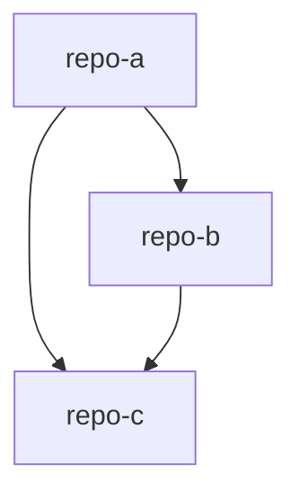
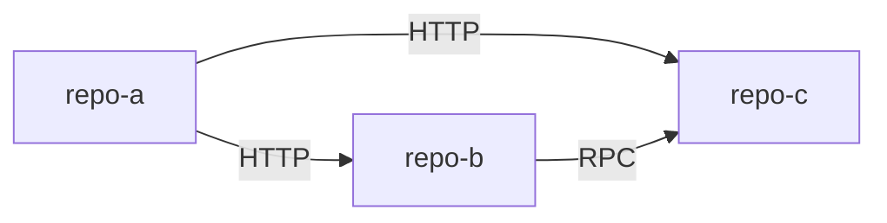
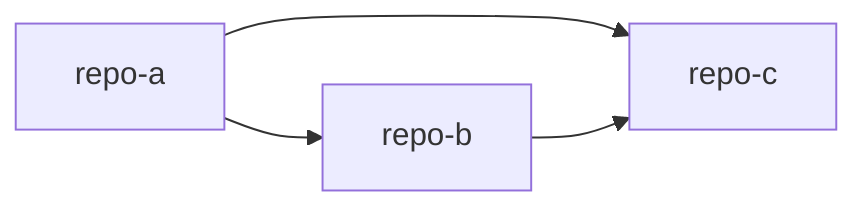
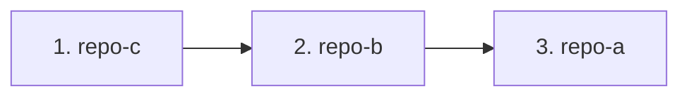

# 多仓库项目群 AI README 生成器

## 使用说明

本命令用于在**父目录**下，基于各子仓库已有的 ai-readme 文档，自动生成项目群关系图和跨仓库协作文档。

> ⚠️ **模型要求**：本命令涉及跨仓库分析和文档生成，**强烈推荐使用 Claude Opus 4.5 或更高版本模型**执行。
> - ✅ 推荐：Claude Opus 4.5、Claude Opus 4.5+
> - ⚠️ 可用但效果可能下降：Claude Sonnet 4.5
> - ❌ 不推荐：其他较低版本模型（可能导致分析不完整或文档质量下降）

### 前置条件

**必须先在各子仓库中执行 `ai-readme` 命令**，生成单仓库的 ai-readme 文档。本命令会读取这些文档，整合生成项目群级别的关系图。

### 核心价值

基于各子仓库已分析的模块信息，整理出：
- **仓库间的依赖关系图**
- **API 调用链路**
- **数据流转路径**
- **变更影响范围**

让 AI 能理解 **"这些仓库之间是什么关系？改了 A 会影响 B 吗？"**

### 目录结构

在**父目录**（包含多个子仓库的目录）下执行命令，生成：

```
parent-dir/                           # 父目录（执行命令的位置）
├── .cursor/
│   └── rules/
│       └── ai-readme/
│           ├── RULE.mdc               # 总览入口 + 生成进度
│           ├── 项目群总览.mdc          # 项目群包含什么、各仓库职责
│           ├── 系统拓扑.mdc            # 调用关系、数据流向
│           ├── 接口契约.mdc            # 跨仓库接口定义、共享类型
│           ├── 变更影响.mdc            # 改了这里还要改哪里（核心！）
│           └── 联调指南.mdc            # 本地联调开发方法
├── repo-a/                           # 子仓库（必须已有 ai-readme）
│   └── .cursor/rules/ai-readme/
├── repo-b/                           # 子仓库
│   └── .cursor/rules/ai-readme/
└── repo-c/                           # 子仓库
```

### 执行流程

命令分为 **4 个阶段** 顺序执行：

1. **阶段 1**：扫描父目录，识别子仓库，**读取各子仓库的 ai-readme**
2. **阶段 2**：基于读取的信息，生成项目群关系文档（5 个）
3. **阶段 3**：汇总统计，校验质量
4. **阶段 4**：更新子仓库 ai-readme，添加项目群链接

---

## 阶段 1：扫描父目录与子仓库

**目的**：识别父目录下的所有子仓库，**读取各子仓库已有的 ai-readme 文档**，提取关键信息

### 1.1 识别子仓库

扫描父目录下的所有子目录，通过以下特征识别代码仓库：

| 特征文件 | 说明 |
|---------|------|
| `.git/` | Git 仓库 |
| `package.json` | Node.js 项目 |
| `pom.xml` / `build.gradle` | Java 项目 |
| `go.mod` | Go 项目 |
| `composer.json` | PHP 项目 |
| `requirements.txt` / `pyproject.toml` | Python 项目 |

**排除规则**：
- 以 `.` 开头的目录（隐藏目录）
- `node_modules`、`dist`、`build` 等构建产物目录
- 没有任何特征文件的目录

### 1.2 读取子仓库 ai-readme（核心步骤）

对于每个识别到的子仓库，**读取** `.cursor/rules/ai-readme/` 目录下的文档：

| 信息类型 | 来源文件 | 提取内容 |
|---------|---------|---------|
| 项目职责 | `RULE.mdc` | 项目定位、核心功能 |
| 技术栈 | `技术架构.mdc` | 框架、数据库、中间件 |
| API 接口 | `API接口.mdc` | 路由清单、请求/响应类型 |
| 核心流程 | `核心流程.mdc` | 入口、调用链、状态流转 |
| 数据结构 | `数据层.mdc` | Entity、表结构 |
| 开发配置 | `开发指南.mdc` | 端口、启动命令 |

**处理策略**：
```
对于每个子仓库：
├─ 存在 .cursor/rules/ai-readme/ 目录？
│   ├─ 是 → ✅ 读取已有文档，提取关键信息
│   └─ 否 → ⚠️ 警告：建议先在该仓库执行 ai-readme 命令
```

### 1.3 提取跨仓库关系

基于读取的信息，分析子仓库之间的关系：

| 分析维度 | 数据来源 | 产出 |
|---------|---------|------|
| 调用关系 | API接口.mdc + 核心流程.mdc | 调用关系图 |
| 数据流向 | 核心流程.mdc + 数据层.mdc | 数据流图 |
| 共享依赖 | 技术架构.mdc | 共享模块清单 |
| 技术栈对比 | 技术架构.mdc | 技术栈矩阵 |

### 1.4 输出

整理为"项目群上下文"概要：

```markdown
## 项目群上下文

### 识别到的子仓库（3 个）

| 仓库 | 路径 | 职责 | 技术栈 | ai-readme 状态 |
|-----|------|------|--------|---------------|
| shop-web | ./shop-web | C端前端 | Vue 3, TypeScript | ✅ 已读取 |
| shop-api | ./shop-api | 后端服务 | NestJS, PostgreSQL | ✅ 已读取 |
| shop-admin | ./shop-admin | 管理后台 | Vue 3, Element Plus | ⚠️ 缺失 |

### 调用关系预览

shop-web → shop-api（HTTP）
shop-admin → shop-api（HTTP）
```

---

## 阶段 2：文档生成

**策略**：基于读取的子仓库信息，生成项目群级别的关系文档

<file_write_strategy>
### 文件写入规范

**工具选择优先级**：

1. **优先使用 Write 工具** - 直接写入，无长度限制
2. **备用 Shell 命令** - Write 失败时使用

**目录写入优先级**：

1. **优先写入 `.cursor/rules/ai-readme/` 目录** - 默认首选
2. **如遇权限问题，降级写入 `.ai-readme/rules` 目录** - 完成所有文件写入任务后提示用户手动拷贝至 `.cursor/rules/ai-readme/` 目录
3. **如写入 `.ai-readme/rules` 仍失败，才使用 Shell 命令写入 `.ai-readme/rules` 目录**

**Shell 写入注意事项**（仅在 Write 工具失败时使用）：

| 问题 | Mac/Linux | Windows |
|-----|-----------|---------|
| 写入方式 | `cat << 'EOF' > file.mdc` | PowerShell `Set-Content` |
| 追加模式 | `>>` | `-Append` |
| 编码 | 默认 UTF-8 | 指定 `-Encoding UTF8` |
| 符号转义 | 用 `'EOF'` 避免变量展开 | 注意 `$`、`` ` `` 需转义 |
| 超长文本 | 按章节分块追加写入 | 按章节分块追加写入 |
</file_write_strategy>

### ⚠️ 核心原则：边生成边更新

**每生成一个文档，必须立即更新 `RULE.mdc` 中的进度状态！**

```
✅ 正确流程：
写入 项目群总览.mdc → 更新 RULE.mdc [x] → 写入 系统拓扑.mdc → 更新 RULE.mdc [x] → ...

❌ 错误流程：
写入所有文档 → 最后统一更新 RULE.mdc
```

### 断点续写机制

在 `RULE.mdc` 中维护进度清单：

```markdown
## 生成进度

- [x] [项目群总览](./项目群总览.mdc) - 2025-12-09 10:00:00
- [x] [系统拓扑](./系统拓扑.mdc) - 2025-12-09 10:05:00
- [ ] [接口契约](./接口契约.mdc)
- [ ] [变更影响](./变更影响.mdc)
- [ ] [联调指南](./联调指南.mdc)
```

**状态规则**：
- `[ ]` 未完成 → 需要生成
- `[x]` 已完成 → 生成完成
- `[?]` 待确认 → 正在更新

### 文档格式要求

每个文档必须满足：

1. **Frontmatter**：description + alwaysApply: false
2. **至少 1 个图示**：Mermaid 关系图
3. **AI生成标记**：`<!-- AI生成，可根据团队规范更新 -->`

### description 格式规范

```
（简单概括规则内容）-（描述规则的作用）；当 xxxx 时使用
```

### 📝 禁止使用 Emoji 表情符号

**所有生成的文档中严禁使用 Emoji 表情符号（如 ✅ ❌ 🔴 📁 等）。**

- ❌ 禁止：`## ✅ 确认事项`
- ✅ 正确：`## 确认事项`
- ❌ 禁止：`🔴 重要提示`
- ✅ 正确：`[重要] 提示` 或 `⚠️ 提示`（仅警告符号除外）

**例外**：文档中仅允许使用 `⚠️` 警告符号和 `-` `+` 等纯文本符号。

### 🔧 Mermaid 语法规则（必须遵守）

生成 Mermaid 图表时，必须遵守以下规则避免语法错误：

1. **图表声明**：方向标识符必须全大写（`graph TB` / `graph LR`，禁止 `graph tb`）
2. **节点标识符**：
   - 只使用字母、数字、下划线（禁止使用 `-` 连字符）
   - 不能以数字开头
   - 示例：`repoA`、`repo_a`（正确），`repo-a`、`1repo`（错误）
3. **箭头格式**：箭头前后必须有空格（`A --> B`，禁止 `A-->B`）
4. **标签语法**：
   - 使用 `|标签|` 或 `-- 标签 -->`
   - 包含特殊字符时用引号：`A -->|"HTTP(S)"| B`
5. **节点文本**：
   - 包含特殊字符（`:` `/` `()` 等）时用引号：`A["用户:登录"]`
   - 长文本用 `<br>` 换行：`A["第一行<br>第二行"]`
   - **严禁使用**：`@` `【】` `#` `$` `%` `&` `*` 等特殊符号
   - 如需表达请改用文字：用"at"替代`@`，用方括号替代`【】`
6. **括号匹配**：方括号、圆括号必须成对：`A[文本]`、`B(文本)`、`C[[文本]]`
7. **子图语法**：
   ```mermaid
   subgraph id["标题"]
       A --> B
   end
   ```
8. **缩进一致**：使用 4 空格缩进，保持统一

**快速自检**：
- [ ] 图表类型大写
- [ ] 节点 ID 无连字符
- [ ] 箭头有空格
- [ ] 特殊字符加引号
- [ ] 括号成对匹配
- [ ] 无 @ 【】 # $ % & * 等特殊符号

---

### 步骤 2.1：生成入口文件（RULE.mdc）

| 要素 | 说明 |
|-----|------|
| **输出文件** | `.cursor/rules/ai-readme/RULE.mdc` |
| **Frontmatter** | `alwaysApply: true`，description 必须包含"必读入口"字样 |
| **核心内容** | 项目群总览、子仓库清单、快速导航、生成进度 |

**description 格式要求（强制）**：

RULE.mdc 的 description 必须明确标注为"必读入口"，引导模型优先读取此文件：

```yaml
---
description: "多仓库项目群必读入口 - 项目群总览和导航；开始任何任务前必须先读取本文件，了解项目群上下文和仓库关系"
alwaysApply: true
---
```

**XML 标签结构化要求（强制）**：

RULE.mdc 文件内容必须使用 XML 标签进行结构化，便于模型精准解析各部分内容：

**RULE.mdc 模板**：

```markdown
---
description: "多仓库项目群必读入口 - 项目群总览和导航；开始任何任务前必须先读取本文件，了解项目群上下文和仓库关系"
alwaysApply: true
---

# {项目群名称} - 项目群上下文

<!-- AI生成，可根据团队规范更新 -->

<project_overview>
## 项目群简介

{一句话描述项目群}
</project_overview>

<generation_info>
## 生成信息

- **生成时间**: {YYYY-MM-DD HH:mm:ss}
- **子仓库快照**:
  - {repo-name}: {commit-short} ({branch})
</generation_info>

<repo_list>
## 子仓库清单

| 仓库 | 职责 | 与其他仓库的关系 | 路径 |
|-----|------|-----------------|------|
| {repo-name} | {职责} | {关系说明} | {相对路径} |

## 仓库关系图


</repo_list>

<quick_navigation>
## 快速导航

| 文档 | 说明 |
|-----|------|
| [项目群总览](./项目群总览.mdc) | 项目群包含什么、各仓库职责 |
| [系统拓扑](./系统拓扑.mdc) | 调用关系、数据流向 |
| [接口契约](./接口契约.mdc) | 跨仓库接口定义、共享类型 |
| [变更影响](./变更影响.mdc) | 改了这里还要改哪里 |
| [联调指南](./联调指南.mdc) | 本地联调开发方法 |
</quick_navigation>

<generation_progress>
## 生成进度

- [ ] [项目群总览](./项目群总览.mdc)
- [ ] [系统拓扑](./系统拓扑.mdc)
- [ ] [接口契约](./接口契约.mdc)
- [ ] [变更影响](./变更影响.mdc)
- [ ] [联调指南](./联调指南.mdc)
</generation_progress>
```

**XML 标签说明**：

| 标签 | 用途 | 模型行为 |
|-----|------|---------|
| `<project_overview>` | 项目群简介 | 快速理解项目群定位 |
| `<generation_info>` | 生成快照 | 追溯文档版本 |
| `<repo_list>` | 仓库清单和关系图 | 了解仓库间关系 |
| `<quick_navigation>` | 文件导航 | 按需跳转到具体文档 |
| `<generation_progress>` | 生成进度 | 支持断点续写 |

---

### 步骤 2.2：生成项目群总览.mdc

| 要素 | 说明 |
|-----|------|
| **输出文件** | `.cursor/rules/ai-readme/项目群总览.mdc` |
| **数据来源** | 各子仓库的 `RULE.mdc` |
| **完成后** | 立即更新 `RULE.mdc`：`[x] [项目群总览](./项目群总览.mdc) - 时间戳` |

**章节结构**：

1. **项目群定位**（名称、定位、为什么放在一起管理）
2. **子仓库概览**（表格：仓库、职责、技术栈、关系）
3. **仓库关系说明**（一段话描述协作方式）
4. **项目群架构图**（Mermaid）

```markdown
---
description: "项目群总览 - 项目群包含什么、各仓库职责；当需要了解各仓库定位和协作关系时使用"
alwaysApply: false
---

# 项目群总览

<!-- AI生成，可根据团队规范更新 -->

## 项目群定位

**名称**：{项目群名称}

**定位**：{一句话描述}

**为什么这些仓库要一起管理**：{说明仓库间的关联性}

## 子仓库概览

| 仓库 | 核心职责 | 技术栈 | 与其他仓库的关系 |
|-----|---------|--------|-----------------|
| repo-a | {职责} | {技术栈} | 调用 repo-b |
| repo-b | {职责} | {技术栈} | 被 repo-a 调用，依赖 repo-c |
| repo-c | {职责} | {技术栈} | 被 repo-a、repo-b 依赖 |

## 仓库关系说明

{描述这些仓库是如何协作的，数据/请求如何在仓库间流转}

## 项目群架构图


```

---

### 步骤 2.3：生成系统拓扑.mdc

| 要素 | 说明 |
|-----|------|
| **输出文件** | `.cursor/rules/ai-readme/系统拓扑.mdc` |
| **数据来源** | 各子仓库的 `API接口.mdc` + `核心流程.mdc` |
| **完成后** | 立即更新 `RULE.mdc`：`[x] [系统拓扑](./系统拓扑.mdc) - 时间戳` |

**章节结构**：

1. **调用关系总览**（Mermaid）
2. **调用关系详情**（表格：调用方、被调用方、调用方式）
3. **关键数据流路径**（列出 3-5 条核心链路）
4. **共享基础设施**（数据库、缓存、消息队列）

```markdown
---
description: "系统拓扑 - 项目间调用关系、数据流向；当需要了解仓库间调用链路或数据流转时使用"
alwaysApply: false
---

# 系统拓扑

<!-- AI生成，可根据团队规范更新 -->

## 调用关系总览



## 调用关系详情

| 调用方 | 被调用方 | 调用方式 | 说明 |
|-------|---------|---------|------|
| repo-a | repo-b | HTTP | {具体说明} |
| repo-a | repo-c | HTTP | {具体说明} |
| repo-b | repo-c | RPC | {具体说明} |

## 关键数据流路径

### 路径 1: {场景名称}
```
用户请求 → repo-a → repo-b → 数据库 → 返回
```

### 路径 2: {场景名称}
```
{描述数据如何在仓库间流转}
```

## 共享基础设施

| 基础设施 | 类型 | 使用的仓库 | 用途 |
|---------|------|-----------|------|
| {名称} | {数据库/缓存/MQ} | {仓库列表} | {用途} |
```

---

### 步骤 2.4：生成接口契约.mdc

| 要素 | 说明 |
|-----|------|
| **输出文件** | `.cursor/rules/ai-readme/接口契约.mdc` |
| **数据来源** | 各子仓库的 `API接口.mdc` |
| **完成后** | 立即更新 `RULE.mdc`：`[x] [接口契约](./接口契约.mdc) - 时间戳` |

**章节结构**：

1. **共享数据结构**（跨仓库共享的类型定义）
2. **跨仓库接口契约**（关键接口的请求/响应格式）
3. **共享约定**（各仓库需遵守的约定）

```markdown
---
description: "接口契约 - 跨仓库的接口定义、共享数据结构；当需要了解仓库间接口格式时使用"
alwaysApply: false
---

# 接口契约

<!-- AI生成，可根据团队规范更新 -->

## 共享数据结构

> 列出在多个仓库间共享的数据结构/类型定义

### {数据结构名称}

```typescript
// 定义位置：{仓库/文件路径}
// 使用的仓库：{仓库列表}

interface {Name} {
  // 字段定义
}
```

## 跨仓库接口契约

> 列出仓库间调用的关键接口

### {接口名称}

| 属性 | 值 |
|-----|-----|
| 提供方 | {仓库名} |
| 调用方 | {仓库名} |
| 调用方式 | {HTTP/RPC/...} |
| 接口标识 | {端点/方法名} |

**输入**：
```json
{输入格式}
```

**输出**：
```json
{输出格式}
```

## 共享约定

| 约定项 | 规则 | 适用仓库 |
|-------|------|---------|
| {约定名} | {规则说明} | {仓库列表} |
```

---

### 步骤 2.5：生成变更影响.mdc

| 要素 | 说明 |
|-----|------|
| **输出文件** | `.cursor/rules/ai-readme/变更影响.mdc` |
| **数据来源** | 依赖分析 + 接口引用关系 |
| **完成后** | 立即更新 `RULE.mdc`：`[x] [变更影响](./变更影响.mdc) - 时间戳` |

**核心价值**：帮助 AI 理解 **"改了 A 仓库，B 仓库需要跟着改什么"**

**章节结构**：

1. **仓库间依赖关系**（依赖图 + 表格）
2. **接口变更影响**（表格：变更位置、影响范围、需同步修改）
3. **变更检查清单**

```markdown
---
description: "变更影响 - 改了这里还要改哪里；当修改某仓库代码需要评估对其他仓库的影响时使用"
alwaysApply: false
---

# 变更影响

<!-- AI生成，可根据团队规范更新 -->

## 变更影响速查

> 当你修改某个仓库的代码时，参考此表确认是否需要同步修改其他仓库。

## 仓库间依赖关系



| 仓库 | 依赖的仓库 | 被依赖的仓库 |
|-----|-----------|-------------|
| repo-a | repo-b, repo-c | - |
| repo-b | repo-c | repo-a |
| repo-c | - | repo-a, repo-b |

**依赖方向说明**：当 repo-c 变更时，repo-a 和 repo-b 可能都需要适配。

## 接口变更影响

| 变更位置 | 影响的仓库 | 需同步修改的内容 |
|---------|-----------|-----------------|
| repo-b: 某接口签名变更 | repo-a | 调用处、类型定义 |
| repo-c: 导出函数变更 | repo-a, repo-b | import 语句、调用方式 |

## 变更检查清单

### 修改被依赖仓库时

- [ ] 所有依赖方是否已确认影响？
- [ ] 接口签名变更是否向后兼容？
- [ ] 是否需要协调发布顺序？

### 修改共享内容时

- [ ] 所有使用方是否已测试？
- [ ] 版本号是否已更新？
```

---

### 步骤 2.6：生成联调指南.mdc

| 要素 | 说明 |
|-----|------|
| **输出文件** | `.cursor/rules/ai-readme/联调指南.mdc` |
| **数据来源** | 各子仓库的 `开发指南.mdc` |
| **完成后** | 立即更新 `RULE.mdc`：`[x] [联调指南](./联调指南.mdc) - 时间戳` |

**章节结构**：

1. **推荐的目录结构**
2. **依赖安装顺序**
3. **服务启动顺序和端口**
4. **常见联调场景**

```markdown
---
description: "联调指南 - 多仓库本地开发、联调方法；当需要本地启动多个仓库进行联调时使用"
alwaysApply: false
---

# 联调指南

<!-- AI生成，可根据团队规范更新 -->

## 推荐目录结构

```
workspace/                    # 工作区根目录
├── repo-a/                   # 仓库 A
├── repo-b/                   # 仓库 B
├── repo-c/                   # 仓库 C
└── .cursor/rules/ai-readme/  # 项目群上下文
```

## 启动顺序

### 依赖关系



### 各仓库启动命令

| 仓库 | 启动命令 | 端口 |
|-----|---------|------|
| repo-c | `{命令}` | {端口} |
| repo-b | `{命令}` | {端口} |
| repo-a | `{命令}` | {端口} |

## 常见开发场景

### 场景 1：{场景描述}

1. {步骤 1}
2. {步骤 2}
3. {步骤 3}
```

---

## 阶段 3：汇总与校验

**输出内容**：

1. **统计信息**：
   - ✅ 成功：N 个文档
   - ⚠️ 警告：K 个子仓库缺少 ai-readme

2. **快速自检**：
   - 所有文档包含 frontmatter
   - 所有文档包含至少 1 个关系图
   - 进度清单状态正确

---

## 阶段 4：更新子仓库 ai-readme

建议在每个子仓库的 `RULE.mdc` 开头添加项目群链接：

```markdown
## 项目群上下文

本项目属于「{项目群名称}」，查看全局信息：

- [项目群总览](../../项目群总览.mdc) - 项目群包含什么、各仓库职责
- [系统拓扑](../../系统拓扑.mdc) - 调用关系、数据流向
- [接口契约](../../接口契约.mdc) - 跨仓库接口定义
- [变更影响](../../变更影响.mdc) - 改了这里还要改哪里
- [联调指南](../../联调指南.mdc) - 本地联调开发方法
```

---

## 文档清单汇总（5 个）

| 文档 | 帮助 AI 理解 | 数据来源 |
|-----|-------------|---------|
| 项目群总览.mdc | "这些仓库是什么关系？各自负责什么？" | 各仓库 RULE.mdc |
| 系统拓扑.mdc | "仓库之间怎么调用？数据怎么流转？" | API接口.mdc + 核心流程.mdc |
| 接口契约.mdc | "仓库之间共享什么？接口怎么定义？" | API接口.mdc |
| 变更影响.mdc | "改了 A 仓库，B 仓库要跟着改什么？" | 依赖分析 + 接口引用 |
| 联调指南.mdc | "怎么同时开发多个仓库？" | 开发指南.mdc |

---

## 验收标准

1. **子仓库识别**：正确识别父目录下的所有代码仓库
2. **ai-readme 读取**：优先从子仓库已有的 ai-readme 提取信息
3. **关系图清晰**：AI 能从文档中理解"这些仓库之间是什么关系"
4. **变更影响明确**：AI 能从 变更影响.mdc 知道"改了 A 要改什么"
5. **每个文档**：包含 frontmatter + 至少 1 个 Mermaid 关系图
6. **RULE.mdc**：
   - **description 必须包含"必读入口"字样**，引导模型优先读取
   - **必须使用 XML 标签结构化**：`<project_overview>`、`<generation_info>`、`<repo_list>`、`<quick_navigation>`、`<generation_progress>`
   - 进度清单状态正确，包含所有文档的快速导航
7. **进度更新**：每生成一个文档必须立即更新 `RULE.mdc` 进度状态
