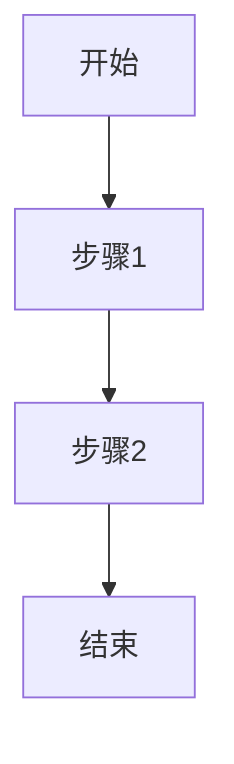
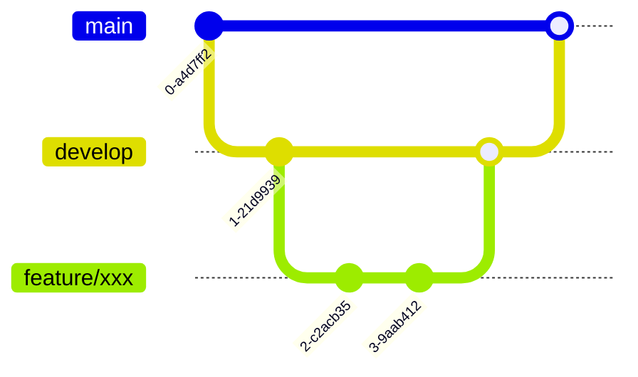

# AI README 生成器

## 使用说明

本命令用于自动化生成帮助 AI 理解项目的规则文档，采用 **generated/ + manual/** 双目录结构。

> ⚠️ **模型要求**：本命令涉及大量代码分析和文档生成，**强烈推荐使用 Claude Opus 4.5 或更高版本模型**执行。
> - ✅ 推荐：Claude Opus 4.5、Claude Opus 4.5+
> - ⚠️ 可用但效果可能下降：Claude Sonnet 4.5
> - ❌ 不推荐：其他较低版本模型（可能导致分析不完整或文档质量下降）

### 运行模式

| 模式 | 触发条件 | 行为 |
|-----|---------|------|
| **全量生成** | 首次运行 / 无"生成信息" | 扫描全仓库，生成所有 generated/ 文档 |
| **增量更新** | 已有"生成信息"且有新提交 | 仅更新受 Git 差异影响的文档 |

命令会**自动检测**应走哪种模式，无需手动指定。

### 核心原则：AI 能力边界

| 目录 | 定位 | 原则 |
|-----|------|------|
| generated/ | 技术事实 | AI 能从代码"看到"的客观信息 |
| manual/ | 业务知识 | 需要人"告诉"AI 的主观决策和上下文 |

**详细划分依据**：

| 能力 | AI 能做（→ generated/） | AI 做不了（→ manual/） |
|-----|------------------------|----------------------|
| 术语 | 提取代码中的变量名、类名 | 解释业务含义、中文翻译 |
| 流程 | 分析代码调用链 | 理解业务意图、边界条件 |
| 结构 | 扫描目录树、依赖关系 | 解释为什么这样划分 |
| 规范 | 从现有代码推断风格（现状） | 定义团队应该遵守什么（规范） |
| 接口 | 提取签名、参数类型 | 说明业务语义、使用场景 |

### 目录结构

```
.cursor/rules/ai-readme/
├── 备忘.mdc                            # 用户偏好备忘（固定；每次执行前必读；不存在则创建，不覆盖）
├── RULE.mdc                             # 入口（固定）
│
├── generated/                          # AI 生成（技术事实）
│   ├── 项目结构.mdc                      # 所有项目
│   ├── 技术架构.mdc                      # 所有项目
│   ├── 开发指南.mdc                      # 所有项目
│   ├── 核心流程.mdc                      # 所有项目（核心业务流程深度分析）
│   ├── 数据层.mdc                        # 服务端
│   ├── 状态管理.mdc                      # 前端/客户端
│   ├── 编码风格.mdc                      # 所有项目
│   ├── API接口.mdc                       # 服务端/SDK
│   ├── 组件接口.mdc                      # 前端/UI库
│   └── 测试框架.mdc                      # 所有项目
│
└── manual/                             # 人工维护（业务知识）
    ├── 业务知识.mdc                      # 项目背景 + 领域术语 + 业务规则
    ├── 边界定义.mdc                      # 模块职责 + 跨仓库协作
    ├── 团队标准.mdc                      # Git规范 + 质量门禁
    └── 历史经验.mdc                      # 踩坑记录 + 解决方案（AI写代码/做方案前必读）
```

### 执行流程

命令分为 **6 个阶段** 顺序执行：

0. **阶段 0**：读取（或创建）`.cursor/rules/ai-readme/备忘.mdc`，加载用户偏好（**最先执行**）
1. **阶段 1**：扫描代码仓 + **扫描已存在规则** + **检测运行模式**，确定项目类型和更新范围
2. **阶段 2**：在 `.cursor/rules/ai-readme/` 目录生成 generated/ 文档（支持断点续写 + 增量更新）
3. **阶段 3**：在 `.cursor/rules/ai-readme/` 目录生成 manual/ 模板（跳过已存在的文件）
4. **阶段 4**：统计结果，校验质量，**链路一致性检查**
5. **阶段 5**：引导用户提供额外信息，生成补充文档

---

## 阶段 0：读取用户偏好备忘（⚠️ 最先执行）

**目的**：每次执行本命令前，先读取用户之前确认过的偏好与“别跑偏”约束（尤其是 **核心流程** 的确认口径）。

### 0.1 文件位置（固定）

- **目标文件**：`.cursor/rules/ai-readme/备忘.mdc`
- **与入口同级**：必须与 `RULE.mdc` 同级（同目录）。

### 0.2 处理规则（强制）

| 场景 | 行为 |
|------|------|
| `备忘.mdc` 存在 | ✅ **先读一遍**，把其中的偏好/确认点作为本次生成的最高优先级约束 |
| `备忘.mdc` 不存在 | ✅ **先创建**（使用本文档“附录：备忘.mdc”模板骨架），然后再读一遍；后续生成流程继续执行 |
| `备忘.mdc` 已存在但内容为空/未填写 | ✅ 继续执行，但在 `generated/核心流程.mdc` 的“✅ 请确认：这是不是你们的核心流程”段落里必须显式引导用户补充 |

> 🔴 **禁止**：覆盖用户已填写的 `备忘.mdc`（除非用户明确要求重置）。

---

## 阶段 1：扫描代码仓

**目的**：扫描仓库，检测项目类型，**识别已存在的规则文件**，**检测运行模式**，决定生成哪些文档

### 1.1 检测运行模式（⚠️ 阶段1内最先执行）

检查 `.cursor/rules/ai-readme/RULE.mdc` 中是否存在"生成信息"小节：

```markdown
## 生成信息

- **生成分支**: master
- **生成 Commit**: 613e2a776c5bb94dc037f20d31e6c2082d8a6bca
- **生成时间**: 2025-12-09 00:00:00
```

**模式判定**：

| 条件 | 模式 | 后续行为 |
|-----|------|---------|
| 无"生成信息"或字段不完整 | **全量生成** | 扫描全仓库，生成所有适用文档 |
| 有"生成信息"且 `生成 Commit` == 当前 HEAD | **无需更新** | 提示"文档已是最新"，结束 |
| 有"生成信息"且 `生成 Commit` != 当前 HEAD | **增量更新** | 仅更新受 Git 差异影响的文档 |

**增量更新时的差异计算**：

```bash
# 基线 = 生成信息中的 Commit
git diff --name-status <生成Commit>...HEAD
```

### 1.2 扫描已存在规则

在生成任何文档之前，**必须先扫描** `.cursor/rules/` 目录，识别已存在的规则文件。

**扫描范围**：
- `generated/` 目录下的所有 `.md` 和 `.mdc` 文件
- `manual/` 目录下的所有 `.md` 和 `.mdc` 文件
- `.cursor/rules/` 目录下的所有 `.md` 和 `.mdc` 文件（标准规则）
- `.cursor/rules/ai-readme/备忘.mdc`（用户偏好备忘，**与 RULE.mdc 同级**）

**输出清单**：
```markdown
## 已存在规则文件清单

### 标准规则（std-*）- 不生成
- std-common/tdd-enforcement.mdc
- std-nodejs/apihub-sync.mdc

### generated/ 目录 - 需要更新
- generated/项目结构.mdc（已存在，将更新）
- generated/技术架构.mdc（已存在，将更新）

### manual/ 目录 - 跳过
- manual/业务知识.mdc（已存在，跳过）
```

**处理规则**：

| 目录类型 | 文件存在时的处理 |
|---------|----------------|
| `std-*/`（标准规则） | ❌ **永不生成/覆盖**，这些是内置规则 |
| `generated/` | 🔄 **更新（覆盖）** |
| `manual/` | ⏭️ **跳过**，人工维护的文件不覆盖 |
| `ai-readme/备忘.mdc` | ⏭️ **跳过（不覆盖）**，仅在不存在时创建；每次执行前必读 |

### 1.3 识别语言与框架

通过配置文件推断项目语言：

| 语言 | 关键文件 |
|-----|---------|
| Node.js | `package.json`, `tsconfig.json` |
| Python | `requirements.txt`, `pyproject.toml` |
| Java | `pom.xml`, `build.gradle` |
| Go | `go.mod` |
| PHP | `composer.json`, `composer.lock` |

### 1.4 检测项目类型

根据代码特征判断项目类型，决定生成哪些文档：

| 项目类型 | 检测条件 | 生成的 generated/ 文件 |
|---------|---------|----------------------|
| **前端项目** | Vue/React/Angular 组件 | 项目结构、技术架构、开发指南、**核心流程**、状态管理、编码风格、组件接口、测试框架 |
| **服务端项目** | Controller/Route/Entity | 项目结构、技术架构、开发指南、**核心流程**、数据层、编码风格、API接口、测试框架 |
| **客户端项目** | Flutter/RN/Swift | 项目结构、技术架构、开发指南、**核心流程**、状态管理、编码风格、测试框架 |
| **SDK/库项目** | 纯导出模块，无业务代码 | 项目结构、技术架构、开发指南、**核心流程**、编码风格、API接口、测试框架 |
| **全栈项目** | 同时包含前端和服务端 | 所有 10 种 generated/ 文档 |

**检测规则**：

```
检测条件 → 项目类型
├─ 存在 .vue/.tsx/.jsx 文件 + Vuex/Pinia/Redux → 前端项目
├─ 存在 Controller/Route + Entity/Model → 服务端项目
├─ 存在 Flutter/RN 配置 → 客户端项目
├─ 仅有导出模块，无 Controller/View → SDK/库项目
└─ 同时存在前端组件和服务端代码 → 全栈项目
```

### 1.5 扫描内容

| 分析维度 | 具体任务 | 产出数据 |
|---------|---------|---------|
| 模块组织 | 识别模块划分方式 | 按功能/按层级/按领域 |
| 分层结构 | 识别分层架构 | 表现层/业务层/数据层 |
| 依赖关系 | 分析 import/require | 依赖关系图 |
| 关键入口 | 识别主要入口文件 | 入口清单 |

### 1.6 增量更新：差异影响分析

> 仅在**增量更新模式**下执行。

基于 Git 差异，将变更文件映射到需要更新的 `generated/` 文档：

| 变更类型 / 路径特征 | 主要影响文档 | 可能的附加影响 |
|---------------------|-------------|----------------|
| 构建配置 | 技术架构、开发指南 | 编码风格（工具链变化时） |
| 子包依赖 / workspace 变更 | 项目结构、技术架构 | 核心流程（调用链变化时） |
| `src/` 下新增/删除目录或模块 | 项目结构 | 核心流程、状态管理 |
| 状态管理相关 | 状态管理 | 核心流程、组件接口 |
| 组件 | 组件接口 | 核心流程、项目结构 |
| SDK/对外 API 导出模块 | API接口 | 技术架构、核心流程 |
| 测试文件 | 测试框架 | 编码风格（测试模式变化时） |
| 大范围重构/命名调整 | 编码风格 | 按实际影响补充 |
| Entity/Model/数据库 | 数据层 | 核心流程 |

**输出**：在执行更新前，先输出"本次变更 → 需要更新的文档"清单，供确认。

### 1.7 输出

整理为"项目上下文"概要，包含：
1. 项目类型和技术栈
2. **已存在规则文件清单**
3. **运行模式**（全量生成 / 增量更新）
4. 需要生成/更新的文档清单

---

## 阶段 2：文档生成

**策略**：入口优先 + TODO驱动 + 断点续写 + 增量更新

<file_write_strategy>
### 文件写入规范

**工具选择优先级**：

1. **优先使用 Write 工具** - 直接写入，无长度限制
2. **备用 Shell 命令** - Write 失败时使用

**目录写入优先级**：

1. **优先写入 `.cursor/rules/ai-readme/` 目录** - 默认首选
2. **如遇权限问题，降级写入 `.ai-readme/rules` 目录** - 完成所有文件写入任务后提示用户手动拷贝至 `.cursor/rules/ai-readme/` 目录
3. **如写入 `.ai-readme/rules` 仍失败，才使用 Shell 命令写入 `.ai-readme/rules` 目录**

**Shell 写入注意事项**（仅在 Write 工具失败时使用）：

| 问题 | Mac/Linux | Windows |
|-----|-----------|---------|
| 写入方式 | `cat << 'EOF' > file.mdc` | PowerShell `Set-Content` |
| 追加模式 | `>>` | `-Append` |
| 编码 | 默认 UTF-8 | 指定 `-Encoding UTF8` |
| 符号转义 | 用 `'EOF'` 避免变量展开 | 注意 `$`、`` ` `` 需转义 |
| 超长文本 | 按章节分块追加写入 | 按章节分块追加写入 |
</file_write_strategy>

### 增量更新模式说明

> 仅在**增量更新模式**下适用。

**更新顺序**（按依赖关系）：
1. 项目结构 → 2. 技术架构 → 3. 开发指南 → 4. 核心流程 → 5. 状态管理/数据层 → 6. API接口/组件接口 → 7. 测试框架 → 8. 编码风格

**单个文档更新流程**：
1. **读取旧文档**：加载现有 `.mdc` 文件，理解现有结构
2. **结合差异分析**：基于 Git 差异，仅在需要调整的段落做"增量覆盖"
3. **保持格式不变**：保留原有章节结构、frontmatter、AI生成标记
4. **更新进度**：刷新 `RULE.mdc` 中的时间戳

### ⚠️⚠️⚠️ 核心原则：边生成边更新（强制执行）

> **🔴 这是最重要的执行规则！违反此规则会导致进度追踪失效。**

**每生成一个文档，必须立即更新 `ai-readme/RULE.mdc` 中的 TODO 状态！**

#### 强制执行流程

**每完成一个文件，必须按以下顺序操作：**

| 步骤 | 操作 | 说明 |
|:---:|------|------|
| 1 | 写入文件内容 | 生成 `.cursor/rules/ai-readme/xxx.mdc` 文档 |
| 2 | **立即更新进度** | 在 `.cursor/rules/ai-readme/RULE.mdc` 中标记 `[x] xxx.mdc - 时间戳` |
| 3 | 开始下一个文件 | 重复步骤 1-2 |

```
✅ 正确流程：
写入 .cursor/rules/ai-readme/generated/项目结构.mdc → 更新 RULE.mdc [x] → 写入技术架构.mdc → 更新 RULE.mdc [x] → ...

❌ 错误流程：
写入 项目结构.mdc → 写入 技术架构.mdc → 写入 开发指南.mdc → 最后统一更新 RULE.mdc
```

#### ❌ 禁止行为

| 禁止 | 说明 |
|------|------|
| 批量生成后统一更新 | 禁止等所有文档生成完再更新进度 |
| 跳过进度更新 | 禁止忘记更新就继续生成下一个 |
| 延迟更新 | 禁止"稀后再更新"的想法 |

#### 为什么必须这样做？

1. **断点续写**：如果生成中断，可以从未完成的位置继续
2. **进度可见**：用户随时可以查看当前生成到哪里
3. **错误定位**：如果某个文档失败，可以快速定位问题

### 断点续写机制

在 `.cursor/rules/ai-readme/RULE.mdc` 中维护 TODO 清单，支持中断后继续：

```markdown
## 生成进度

### generated/
- [x] [项目结构](./generated/项目结构.mdc) - 2025-12-08 10:00:00
- [ ] [技术架构](./generated/技术架构.mdc)
- [ ] [开发指南](./generated/开发指南.mdc)
- [ ] [核心流程](./generated/核心流程.mdc)
- [S] [数据层](./generated/数据层.mdc)（非服务端项目，跳过）
- [ ] [编码风格](./generated/编码风格.mdc)

### manual/（人工维护）
- [S] [业务知识](./manual/业务知识.mdc)（已存在，跳过）
- [ ] [边界定义](./manual/边界定义.mdc)（将生成模板）
- [ ] [团队标准](./manual/团队标准.mdc)（将生成模板）

### std-common/（内置规则，跳过）
- [S] [tdd-enforcement](./std-common/tdd-enforcement.mdc)（内置）
```

> **注意**：进度清单中的文件名也要使用 Markdown 链接格式，方便点击跳转

**状态规则**：
- `[ ]` 未完成 → 需要生成
- `[x]` 已完成 → 生成完成
- `[?]` 待确认 → 重新触发时的中间状态，表示正在更新
- `[S]` 跳过 → 内置规则、人工维护、或不适用当前项目类型

**时间戳格式**：`YYYY-MM-DD HH:mm:ss`

### 文档格式要求

每个文档只需满足 3 个基本要求：

1. **Frontmatter**：description + alwaysApply: false
2. **至少 1 个图示**：Mermaid 或 ASCII
3. **AI生成标记**（仅 generated/ 目录）：`<!-- AI生成，可根据团队规范更新 -->`

### description 格式规范

**必须**使用以下格式编写 `description` 字段：

```
（简单概括规则内容）-（描述规则的作用）；当 xxxx 时使用
```

**格式要素**：
| 要素 | 说明 | 示例 |
|-----|------|------|
| 概括内容 | 一句话说明文档是什么 | "项目结构" |
| 描述作用 | 文档包含什么信息 | "目录树、模块划分、依赖关系" |
| 使用场景 | 用"当...时使用"说明何时参考 | "当需要了解代码组织时使用" |

### 📝 禁止使用 Emoji 表情符号

**所有生成的文档中严禁使用 Emoji 表情符号（如 ✅ ❌ 🔴 📁 等）。**

- ❌ 禁止：`## ✅ 确认事项`
- ✅ 正确：`## 确认事项`
- ❌ 禁止：`🔴 重要提示`
- ✅ 正确：`[重要] 提示` 或 `⚠️ 提示`（仅警告符号除外）

**例外**：文档中仅允许使用 `⚠️` 警告符号和 `-` `+` 等纯文本符号。

### 🔧 Mermaid 语法规则（必须遵守）

生成 Mermaid 图表时，必须遵守以下规则避免语法错误：

1. **图表声明**：方向标识符必须全大写（`graph TB` / `graph LR`，禁止 `graph tb`）
2. **节点标识符**：
   - 只使用字母、数字、下划线（禁止使用 `-` 连字符）
   - 不能以数字开头
   - 示例：`repoA`、`repo_a`（正确），`repo-a`、`1repo`（错误）
3. **箭头格式**：箭头前后必须有空格（`A --> B`，禁止 `A-->B`）
4. **标签语法**：
   - 使用 `|标签|` 或 `-- 标签 -->`
   - 包含特殊字符时用引号：`A -->|"HTTP(S)"| B`
5. **节点文本**：
   - 包含特殊字符（`:` `/` `()` 等）时用引号：`A["用户:登录"]`
   - 长文本用 `<br>` 换行：`A["第一行<br>第二行"]`
   - **严禁使用**：`@` `【】` `#` `$` `%` `&` `*` 等特殊符号
   - 如需表达请改用文字：用"at"替代`@`，用方括号替代`【】`
6. **括号匹配**：方括号、圆括号必须成对：`A[文本]`、`B(文本)`、`C[[文本]]`
7. **子图语法**：
   ```mermaid
   subgraph id["标题"]
       A --> B
   end
   ```
8. **缩进一致**：使用 4 空格缩进，保持统一

**快速自检**：
- [ ] 图表类型大写
- [ ] 节点 ID 无连字符
- [ ] 箭头有空格
- [ ] 特殊字符加引号
- [ ] 括号成对匹配
- [ ] 无 @ 【】 # $ % & * 等特殊符号

### 目录树格式规范

**所有涉及目录树的文档**必须遵循以下格式：

**每个节点必须带中文注释**，让读者能快速了解用途：

```
src/                              # 源代码目录
├── main.ts                       # 应用入口文件
├── App.vue                       # 根组件
├── router/                       # 路由配置
│   ├── index.ts                  # 路由入口
│   └── modules/                  # 路由模块
│       ├── navigation.ts         # 导航相关路由
│       └── system.ts             # 系统管理路由
├── views/                        # 页面视图
├── components/                   # 公共组件
├── apis/                         # API 接口
└── utils/                        # 工具函数
```

**禁止**：没有注释的目录树

---

### 步骤 2.1：生成入口文件

| 要素 | 说明 |
|-----|------|
| **输出文件** | `.cursor/rules/ai-readme/RULE.mdc` |
| **Frontmatter** | `alwaysApply: true`，description 必须包含"必读入口"字样 |
| **核心内容** | 项目总览、TODO进度清单、**可点击跳转的文件导航**、总览图 |

**description 格式要求（强制）**：

RULE.mdc 的 description 必须明确标注为"必读入口"，引导模型优先读取此文件：

```yaml
---
description: "AI README 必读入口 - 项目规则导航；开始任何任务前必须先读取本文件，了解项目上下文和规则清单"
alwaysApply: true
---
```

**XML 标签结构化要求（强制）**：

RULE.mdc 文件内容必须使用 XML 标签进行结构化，便于模型精准解析各部分内容：

```markdown
---
description: "AI README 必读入口 - 项目规则导航；开始任何任务前必须先读取本文件，了解项目上下文和规则清单"
alwaysApply: true
---

# AI README - 项目规则入口

<project_overview>
## 项目总览
<!-- 项目架构图、一句话描述 -->
</project_overview>

<generation_info>
## 生成信息
- **生成分支**: master
- **生成 Commit**: xxx
- **生成时间**: YYYY-MM-DD HH:mm:ss
</generation_info>

<quick_navigation>
## 快速导航

### 用户偏好备忘（固定）
| 文件 | 说明 |
|-----|------|
| [备忘](./备忘.mdc) | 用户偏好与关键确认点 |

### AI 生成文档（generated/）
| 文档 | 说明 |
|-----|------|
| [项目结构](./generated/项目结构.mdc) | 目录树、模块划分 |
<!-- 其他文档... -->

### 人工维护文档（manual/）
| 文档 | 说明 |
|-----|------|
| [业务知识](./manual/业务知识.mdc) | 项目背景、领域术语 |
<!-- 其他文档... -->

### 标准规则（std-*/）
| 文档 | 说明 |
|-----|------|
| [TDD 强制执行](./std-common/tdd-enforcement.mdc) | 测试驱动开发规则 |
<!-- 其他规则... -->
</quick_navigation>

<generation_progress>
## 生成进度

### generated/
- [x] [项目结构](./generated/项目结构.mdc) - 2025-12-08 10:00:00
- [ ] [技术架构](./generated/技术架构.mdc)
<!-- 其他进度... -->

### manual/（人工维护）
- [S] [业务知识](./manual/业务知识.mdc)（已存在，跳过）
<!-- 其他进度... -->
</generation_progress>
```

**XML 标签说明**：

| 标签 | 用途 | 模型行为 |
|-----|------|---------|
| `<project_overview>` | 项目总览 | 快速理解项目定位 |
| `<generation_info>` | 生成快照 | 追溯文档版本 |
| `<quick_navigation>` | 文件导航 | 按需跳转到具体规则 |
| `<generation_progress>` | 生成进度 | 支持断点续写 |

**关键要求**：
- **快速导航生成逻辑**：扫描并包含`.cursor/rules`目录下，所有 `.mdc` 或 `.mdc` 文件
- **必须包含的内容**：
  1. 已存在的标准规则（`std-*/`）- 标注为"内置规则"
  2. AI 生成的文档（`generated/`）
  3. 人工维护的文档（`manual/`）
- **生成快照信息写入**：
	- 在索引类规则文档（例如 `.cursor/rules/ai-readme/index.mdc` 或仓库自定义入口文件）中，**必须记录本次生成对应的 Git 分支与 Commit ID**，便于后续追溯。
	- 推荐在 `<generation_info>` 标签内记录：

			```markdown
			<generation_info>
			## 生成信息

			- **生成分支**: master
			- **生成 Commit**: 613e2a776c5bb94dc037f20d31e6c2082d8a6bca
			- **生成时间**: 2025-12-09 00:00:00
			</generation_info>
			```

	- 获取方式建议（可由调用侧实现）：
			- 分支名：`git rev-parse --abbrev-ref HEAD`
			- Commit ID：`git rev-parse HEAD`（如需简短可使用 `--short`）

**⚠️ 文件列表必须支持点击跳转**：

使用 Markdown 相对路径链接格式，确保在 Cursor 中可点击跳转：

```markdown
## 快速导航

### 🧷 用户偏好备忘（固定）

| 文件 | 说明 |
|-----|------|
| [备忘](./备忘.mdc) | 用户偏好与关键确认点；每次执行本命令前必读 |

### 📁 AI 生成文档（generated/）

| 文档 | 说明 |
|-----|------|
| [项目结构](./generated/项目结构.mdc) | 目录树、模块划分、依赖关系 |
| [技术架构](./generated/技术架构.mdc) | 分层架构、技术栈清单 |
| [开发指南](./generated/开发指南.mdc) | 环境搭建、启动命令、配置说明 |
| [核心流程](./generated/核心流程.mdc) | 核心业务流程、调用链、状态流转 |
| [数据层](./generated/数据层.mdc) | 数据库 Schema、Entity 关系 |
| [编码风格](./generated/编码风格.mdc) | 命名规范、代码格式 |
| [API接口](./generated/API接口.mdc) | 路由清单、请求/响应类型 |
| [测试框架](./generated/测试框架.mdc) | 测试工具、Mock 方式 |

### 📝 人工维护文档（manual/）

| 文档 | 说明 |
|-----|------|
| [业务知识](./manual/业务知识.mdc) | 项目背景、领域术语、业务流程 |
| [边界定义](./manual/边界定义.mdc) | 模块职责、跨仓库协作 |
| [团队标准](./manual/团队标准.mdc) | Git规范、质量门禁 |
| [历史经验](./manual/历史经验.mdc) | 踩坑记录、解决方案（⚠️ AI写代码/做方案前必读） |

### 📋 标准规则（std-*/）

| 文档 | 说明 |
|-----|------|
| [TDD 强制执行](./std-common/tdd-enforcement.mdc) | 测试驱动开发规则 |
| [APIHub 同步](./std-nodejs/apihub-sync.mdc) | API 文档同步规则 |
```

**链接格式规范**：
- 使用相对路径：`./generated/xxx.mdc`
- 使用 Markdown 链接：`[显示文本](./路径/文件名.mdc)`
- 确保路径与实际文件位置一致

---

### 步骤 2.2：生成 generated/ 目录文档

> 所有文件直接输出到 `.cursor/rules/ai-readme/` 目录

#### 项目结构.mdc

| 要素 | 说明 |
|-----|------|
| **输出文件** | `.cursor/rules/ai-readme/generated/项目结构.mdc` |
| **内容** | 目录树、模块划分、依赖关系图、循环依赖检测 |
| **生成方式** | 纯模型，基于目录扫描 + import/require 分析 |
| **适用项目** | 所有项目 |
| **完成后** | 立即更新 `RULE.mdc`：`[x] 项目结构.mdc - 时间戳` |

**章节结构**：
1. 顶层目录树（ASCII 格式，**每个节点带中文注释**）
2. 模块清单（表格：模块名、路径、职责）
3. 模块依赖图（Mermaid）
4. 文件依赖分析
5. 循环依赖检测

#### 技术架构.mdc

| 要素 | 说明 |
|-----|------|
| **输出文件** | `.cursor/rules/ai-readme/generated/技术架构.mdc` |
| **内容** | 分层架构图、技术栈清单（名称/版本/作用）、开发工具链 |
| **生成方式** | 纯模型，解析 package.json/pom.xml 等 + 分析代码分层 |
| **适用项目** | 所有项目 |
| **完成后** | 立即更新 `RULE.mdc`：`[x] 技术架构.mdc - 时间戳` |

**章节结构**：
1. 架构总览图（Mermaid）
2. 分层架构说明
3. 核心技术栈（表格：名称、版本、作用）
4. 开发工具链

#### 开发指南.mdc

| 要素 | 说明 |
|-----|------|
| **输出文件** | `.cursor/rules/ai-readme/generated/开发指南.mdc` |
| **内容** | 环境准备、启动命令、配置文件清单、环境变量说明 |
| **生成方式** | 模型生成，从 package.json/scripts + 配置文件提取 |
| **适用项目** | 所有项目 |
| **完成后** | 立即更新 `RULE.mdc`：`[x] 开发指南.mdc - 时间戳` |

**章节结构**：
1. 环境准备
2. 启动命令
3. 配置文件清单
4. 环境变量说明
5. 调试方法

#### 核心流程.mdc

| 要素 | 说明 |
|-----|------|
| **输出文件** | `.cursor/rules/ai-readme/generated/核心流程.mdc` |
| **内容** | 核心业务流程分析、调用链追踪、状态流转、依赖关系、性能关键点 |
| **生成方式** | 模型深度分析，从入口扫描 + 调用链追踪 + 数据流分析 |
| **适用项目** | 所有项目（根据项目类型采用不同分析策略） |
| **完成后** | 立即更新 `RULE.mdc`：`[x] 核心流程.mdc - 时间戳` |

**分析维度**（根据项目类型侧重不同）：

| 项目类型 | 核心流程侧重点 | 典型入口 |
|---------|--------------|---------|
| **前端项目** | 页面导航流程、用户交互流程、状态变更流程 | 路由守卫、事件处理器、组件生命周期 |
| **服务端项目** | API 调用链、业务处理流程、数据流转 | Controller/Handler、消息消费者、定时任务 |
| **客户端项目** | 应用生命周期、页面跳转流程、数据同步流程 | App 入口、Navigator、状态管理 |
| **SDK/库项目** | 核心 API 使用流程、初始化流程、扩展机制 | 导出函数、工厂方法、插件接口 |

**通用分析维度**：
1. **入口识别**：根据项目类型扫描对应的入口点
2. **流程优先级**：基于调用频率、业务复杂度、数据影响、集成依赖评分排序
3. **调用链追踪**：从入口函数追踪所有方法调用，标注外部服务和数据库操作
4. **数据流分析**：追踪输入数据的变换过程
5. **状态流转**：识别状态机和状态变更规则
6. **异常处理**：识别异常路径和补偿机制
7. **性能关键点**：标注数据库操作、外部调用、计算密集区域

**通用章节结构**：
0. 用户确认（请用户确认这是否为“核心流程”，并指出遗漏/不准确之处）
1. 流程架构图（Mermaid）
2. 核心流程清单（按优先级：P0/P1/P2）
3. 入口清单（根据项目类型）
4. 调用链/交互流程分析（时序图）
5. 数据流转说明
6. 状态流转图（如有状态机）
7. 异常/错误处理清单
8. 性能关键点

**按项目类型的章节侧重**：

| 项目类型 | 入口清单内容 | 流程分析侧重 | 状态流转关注点 |
|---------|-------------|-------------|---------------|
| **前端** | 路由、事件处理器、生命周期钩子 | 用户操作 → 状态变更 → UI 更新 | 组件状态、全局状态 |
| **服务端** | API、消息消费者、定时任务 | 请求 → 业务处理 → 数据持久化 | 业务对象状态（订单、用户等） |
| **客户端** | App 入口、Navigator、Widget | 页面跳转 → 数据加载 → 渲染 | 页面栈、本地缓存状态 |
| **SDK/库** | 导出函数、工厂方法、插件接口 | 初始化 → 核心方法调用 → 资源释放 | 实例生命周期、配置状态 |

**输出示例**（服务端）：

```markdown
## ✅ 请确认：这是不是你们的“核心流程”
> 目的：避免我把“页面交互”当成“核心流程”，或者漏掉真实的主路径（如路由守卫、全局状态初始化）。

1. 我列出的 P0 流程是否符合你们的核心业务路径？如果不符合，请指出正确的 P0 流程（按优先级列出）。
2. 这些入口是否准确（路由、路由守卫、关键事件处理器、关键生命周期钩子）？是否有遗漏的入口？
3. 是否遗漏关键状态流转（如登录态、权限态、购物车/订单态）或关键副作用（如本地存储、缓存、埋点）？
4. 是否有必须体现的异常/降级路径？

## 📋 核心流程清单

### 🔴 P0 核心流程（必须掌握）
| 流程 | 入口 | 关键点 |
|------|------|--------|
| 订单支付 | POST /orders/:id/pay | 分布式事务、幂等性 |

## 🔄 调用链分析

sequenceDiagram
    Controller->>Service: processPayment()
    Service->>Repository: findOrder()
    Service->>ExternalAPI: callPaymentGateway()
    Service->>Repository: updateOrderStatus()
```

**输出示例**（前端）：

```markdown
## ✅ 请确认：这是不是你们的“核心流程”
> 目的：避免我把“页面交互”当成“核心流程”，或者漏掉真实的主路径（如路由守卫、全局状态初始化）。

1. 我列出的 P0 流程是否符合你们的核心业务路径？如果不符合，请指出正确的 P0 流程（按优先级列出）。
2. 这些入口是否准确（路由、路由守卫、关键事件处理器、关键生命周期钩子）？是否有遗漏的入口？
3. 是否遗漏关键状态流转（如登录态、权限态、购物车/订单态）或关键副作用（如本地存储、缓存、埋点）？
4. 是否有必须体现的异常/降级路径？

## 📋 核心流程清单

### 🔴 P0 核心流程（必须掌握）
| 流程 | 入口 | 关键点 |
|------|------|--------|
| 用户登录 | LoginPage.vue → handleLogin() | 表单验证、Token 存储、路由跳转 |

## 🔄 交互流程分析

sequenceDiagram
    User->>LoginForm: 输入账号密码
    LoginForm->>AuthStore: login(credentials)
    AuthStore->>API: POST /auth/login
    API-->>AuthStore: token
    AuthStore->>Router: push('/dashboard')
```

**输出示例**（SDK/库）：

```markdown
## 📋 核心流程清单

### 🔴 P0 核心流程（必须掌握）
| 流程 | 入口 | 关键点 |
|------|------|--------|
| SDK 初始化 | createClient(config) | 配置校验、连接建立、错误处理 |

## 🔄 使用流程分析

sequenceDiagram
    App->>SDK: createClient(config)
    SDK->>SDK: validateConfig()
    SDK->>Remote: connect()
    Remote-->>SDK: connection
    SDK-->>App: client instance

## ✅ 请确认：这是不是你们的“核心流程”
> 目的：避免我只写“API 调用顺序”，但漏掉真正影响使用者的主链路（如鉴权、重连、资源释放、插件机制）。

1. P0 流程是否准确覆盖“使用者最常用/最关键”的路径？如果不是，请给出正确的 P0 清单（按优先级）。
2. 初始化与资源生命周期（创建/复用/释放）是否准确？是否有必须说明的清理动作（close/destroy/unsubscribe）？
3. 错误处理与重试/退避策略是否符合真实行为？是否有特殊错误码或降级路径？
4. 是否存在我漏掉的扩展点（插件、middleware、hook）或默认行为假设？
```

#### 数据层.mdc

| 要素 | 说明 |
|-----|------|
| **输出文件** | `.cursor/rules/ai-readme/generated/数据层.mdc` |
| **内容** | 数据库表结构、ER 图、Entity 关系、数据流转图 |
| **生成方式** | 模型生成，从 Entity/Model 读取表结构 + 分析数据读写 |
| **适用项目** | 服务端 |
| **完成后** | 立即更新 `RULE.mdc`：`[x] 数据层.mdc - 时间戳` |

**章节结构**：
1. 表结构清单（从 Entity 提取）
2. ER 图（Mermaid）
3. 字段说明
4. 数据流图（Mermaid）
5. 数据来源与去向

#### 状态管理.mdc

| 要素 | 说明 |
|-----|------|
| **输出文件** | `.cursor/rules/ai-readme/generated/状态管理.mdc` |
| **内容** | 状态管理方案、Store 结构、Action/Mutation 清单、状态流转图 |
| **生成方式** | 模型生成，识别 Vuex/Pinia/Redux 使用方式 |
| **适用项目** | 前端、客户端 |
| **完成后** | 立即更新 `RULE.mdc`：`[x] 状态管理.mdc - 时间戳` |

**章节结构**：
1. 状态管理方案
2. Store 结构
3. Action/Mutation 清单
4. 状态流转图（Mermaid）

#### 编码风格.mdc

| 要素 | 说明 |
|-----|------|
| **输出文件** | `.cursor/rules/ai-readme/generated/编码风格.mdc` |
| **内容** | 命名规范（现状）、代码格式、错误码清单、异常处理方式 |
| **生成方式** | 模型生成，从现有代码推断命名风格和错误处理模式 |
| **适用项目** | 所有项目 |
| **完成后** | 立即更新 `RULE.mdc`：`[x] 编码风格.mdc - 时间戳` |

**章节结构**：
1. 命名规范（从现有代码推断）
2. 代码格式（现状描述）
3. 错误码清单
4. 异常处理方式
5. 推荐模式 / 禁止写法

> ⚠️ **注意**：此文件描述的是代码现状，不是规范定义。团队规范应在 `manual/团队标准.mdc` 中定义。

#### API接口.mdc

| 要素 | 说明 |
|-----|------|
| **输出文件** | `.cursor/rules/ai-readme/generated/API接口.mdc` |
| **内容** | 路由清单、请求/响应类型、错误码定义、认证方式 |
| **生成方式** | 模型生成，从 Controller/Route 提取接口签名 |
| **适用项目** | 服务端、SDK |
| **完成后** | 立即更新 `RULE.mdc`：`[x] API接口.mdc - 时间戳` |

**章节结构**：
1. 路由清单（表格）
2. 请求/响应类型
3. 错误码定义
4. 认证方式

#### 组件接口.mdc

| 要素 | 说明 |
|-----|------|
| **输出文件** | `.cursor/rules/ai-readme/generated/组件接口.mdc` |
| **内容** | 组件清单、Props/Events/Slots 定义、使用示例 |
| **生成方式** | 模型生成，提取组件 Props/Events 定义 |
| **适用项目** | 前端、UI库 |
| **完成后** | 立即更新 `RULE.mdc`：`[x] 组件接口.mdc - 时间戳` |

**章节结构**：
1. 组件清单
2. Props/Events/Slots 定义
3. 使用示例

#### 测试框架.mdc

| 要素 | 说明 |
|-----|------|
| **输出文件** | `.cursor/rules/ai-readme/generated/测试框架.mdc` |
| **内容** | 测试工具、测试目录结构、Mock 方式、常见错误及解决方案 |
| **生成方式** | 模型生成，从测试代码提取框架和 Mock 方式 |
| **适用项目** | 所有项目 |
| **完成后** | 立即更新 `RULE.mdc`：`[x] 测试框架.mdc - 时间戳` |

**章节结构**：
1. 测试工具（框架、断言库）
2. 测试目录结构
3. Mock 方式
4. 常见错误及解决方案
5. 调试技巧

---

## 阶段 3：生成 manual/ 目录模板

> AI 无法从代码推断的关键信息，需要人工补充。
> 所有文件直接输出到 `.cursor/rules/ai-readme/` 目录

### 需要创建的模板文件（4个）

| 文件 | 输出路径 | 内容 |
|------|---------|------|
| 业务知识.mdc | `.cursor/rules/ai-readme/manual/业务知识.mdc` | 项目背景、领域术语表、核心业务流程、业务规则与约束 |
| 边界定义.mdc | `.cursor/rules/ai-readme/manual/边界定义.mdc` | 模块职责矩阵、模块协作规则、跨仓库关联与接口约定 |
| 团队标准.mdc | `.cursor/rules/ai-readme/manual/团队标准.mdc` | 分支策略、Commit 规范、质量门禁、Code Review 约定 |
| 历史经验.mdc | `.cursor/rules/ai-readme/manual/历史经验.mdc` | 踩坑记录、问题原因、解决方案、预防措施（**AI写代码/做方案前必读**） |

### 模板格式

每个模板包含：
1. Frontmatter（description + alwaysApply: false）
2. 章节骨架
3. `<!-- TODO: ... -->` 占位符

---

## 阶段 4：汇总与校验

**输出内容**：

1. **统计信息**：
   - ✅ 成功：N 个 AI 生成文档
   - ❌ 失败：K 个（附原因）
   - ⏭️ 跳过：X 个（不适用当前项目类型）

2. **快速自检**：
   - 所有文档包含 frontmatter
   - 所有文档包含至少 1 个图示
   - TODO 清单状态正确
   - `.cursor/rules/ai-readme/` 目录结构完整

3. **链路一致性检查**（增量更新后必须执行）：

| 更新的文档 | 必须检查的关联文档 | 检查内容 |
|-----------|------------------|---------|
| 项目结构 | 核心流程 | 是否引用了已移动/删除的模块 |
| 技术架构 | 开发指南 | 启动命令/构建链路是否仍然正确 |
| 状态管理 | 核心流程 | 状态流转描述是否需要调整 |
| API接口 | 核心流程、组件接口 | 调用链描述、SDK 使用示例是否匹配 |

如发现不一致，追加更新相关文档。

---

## 阶段 5：引导用户补充信息（动态推荐）

根据阶段1扫描结果，**动态识别**项目中可能需要补充的文档。

### 检测规则

| 检测到的特征 | 推荐的补充文档 | 需要用户提供的信息 |
|-------------|---------------|-------------------|
| Redis/缓存相关代码 | 缓存策略说明 | 缓存 key 命名规则、过期策略 |
| MQ/Kafka/RabbitMQ | 消息队列说明 | 队列名称、消息格式、消费逻辑 |
| EventEmitter/事件订阅 | 事件系统说明 | 事件清单、触发时机 |
| Auth/Guard/JWT | 认证授权说明 | 角色权限矩阵、鉴权流程 |
| WebSocket/SSE | 实时通信说明 | 消息类型、推送逻辑 |
| 定时任务/Cron | 定时任务说明 | 任务清单、执行周期 |
| 第三方API调用 | 外部依赖说明 | 依赖服务清单、调用方式 |

### 输出格式（动态生成）

```markdown
## 根据代码分析，推荐生成以下补充文档

检测到项目使用了 Redis 缓存和消息队列，建议补充：

1. [ ] 缓存策略说明
   - 检测到：`src/cache/` 目录、Redis 配置
   - 请提供：缓存 key 命名规则、过期策略

2. [ ] 消息队列说明
   - 检测到：`@nestjs/bull` 依赖、`src/queue/` 目录
   - 请提供：队列名称、消息格式

请选择需要生成的文档，并提供相关信息...
```

---

## 按项目类型的输出清单

### 前端项目（14个）

```
备忘.mdc
RULE.mdc
generated/项目结构.mdc
generated/技术架构.mdc
generated/开发指南.mdc
generated/核心流程.mdc      ← 页面导航、用户交互、状态变更流程
generated/状态管理.mdc      ← 前端特有
generated/编码风格.mdc
generated/组件接口.mdc      ← 前端特有
generated/测试框架.mdc
manual/业务知识.mdc
manual/边界定义.mdc
manual/团队标准.mdc
manual/历史经验.mdc         ← AI写代码/做方案前必读
```

### 服务端项目（14个）

```
备忘.mdc
RULE.mdc
generated/项目结构.mdc
generated/技术架构.mdc
generated/开发指南.mdc
generated/核心流程.mdc      ← API 调用链、业务处理流程
generated/数据层.mdc        ← 服务端特有
generated/编码风格.mdc
generated/API接口.mdc       ← 服务端特有
generated/测试框架.mdc
manual/业务知识.mdc
manual/边界定义.mdc
manual/团队标准.mdc
manual/历史经验.mdc         ← AI写代码/做方案前必读
```

### 全栈项目（16个）

```
备忘.mdc
RULE.mdc
generated/项目结构.mdc
generated/技术架构.mdc
generated/开发指南.mdc
generated/核心流程.mdc      ← 前后端核心业务流程
generated/数据层.mdc        ← 服务端
generated/状态管理.mdc      ← 前端
generated/编码风格.mdc
generated/API接口.mdc       ← 服务端
generated/组件接口.mdc      ← 前端
generated/测试框架.mdc
manual/业务知识.mdc
manual/边界定义.mdc
manual/团队标准.mdc
manual/历史经验.mdc         ← AI写代码/做方案前必读
```

### 客户端项目（13个）

```
备忘.mdc
RULE.mdc
generated/项目结构.mdc
generated/技术架构.mdc
generated/开发指南.mdc
generated/核心流程.mdc      ← 应用生命周期、页面跳转、数据同步流程
generated/状态管理.mdc      ← 客户端特有
generated/编码风格.mdc
generated/测试框架.mdc
manual/业务知识.mdc
manual/边界定义.mdc
manual/团队标准.mdc
manual/历史经验.mdc         ← AI写代码/做方案前必读
```

### SDK/库项目（13个）

```
备忘.mdc
RULE.mdc
generated/项目结构.mdc
generated/技术架构.mdc
generated/开发指南.mdc
generated/核心流程.mdc      ← 核心 API 使用流程、初始化流程、扩展机制
generated/编码风格.mdc
generated/API接口.mdc       ← SDK特有
generated/测试框架.mdc
manual/业务知识.mdc
manual/边界定义.mdc
manual/团队标准.mdc
manual/历史经验.mdc         ← AI写代码/做方案前必读
```

---

## 文档清单汇总

### generated/ 目录文档（10个）

| 文件 | 内容 | 生成方式 | 适用项目 |
|------|------|---------|---------|
| 项目结构.mdc | 目录树 + 模块划分 + 依赖图 | 纯模型，目录扫描 + import 分析 | 所有 |
| 技术架构.mdc | 分层架构 + 技术栈清单 | 纯模型，解析配置文件 + 分析代码分层 | 所有 |
| 开发指南.mdc | 环境搭建 + 启动命令 + 配置说明 | 模型生成，从 scripts + 配置文件提取 | 所有 |
| 核心流程.mdc | 核心业务流程 + 调用链 + 状态流转 + 依赖分析 | 模型深度分析，入口扫描 + 调用链追踪 | 所有 |
| 数据层.mdc | 数据库 Schema + Entity 关系 + 数据流转 | 模型生成，从 Entity/Model 读取 | 服务端 |
| 状态管理.mdc | Store 结构 + Action/Mutation | 模型生成，识别状态管理库使用方式 | 前端/客户端 |
| 编码风格.mdc | 命名规范 + 代码格式（现状描述） | 模型生成，从现有代码推断风格 | 所有 |
| API接口.mdc | 路由清单 + 请求/响应类型 + 错误码 | 模型生成，从 Controller 提取签名 | 服务端/SDK |
| 组件接口.mdc | 组件清单 + Props/Events/Slots | 模型生成，提取组件接口定义 | 前端/UI库 |
| 测试框架.mdc | 测试工具 + Mock 方式 + 目录结构 | 模型生成，从测试代码提取 | 所有 |

### manual/ 目录模板（4个）

| 文件 | 内容 |
|------|------|
| 业务知识.mdc | 项目背景（是什么/解决什么/服务谁）+ 领域术语表 + 业务流程 + 业务规则 |
| 边界定义.mdc | 模块职责矩阵 + 协作规则 + 跨仓库关联 |
| 团队标准.mdc | 分支策略 + Commit 规范 + 质量门禁 + Review 约定 |
| 历史经验.mdc | 踩坑记录 + 问题原因 + 解决方案 + 预防措施（**AI写代码/做方案前必读**） |

---

## 验收标准

0. **偏好备忘**：必须在开始任何扫描/生成前读取 `.cursor/rules/ai-readme/备忘.mdc`；不存在则先创建（且不覆盖已存在内容）
1. **模式检测**：阶段1必须先检测运行模式（全量生成 / 增量更新）
2. **已存在规则检查**：阶段1必须扫描 `.cursor/rules/ai-readme/` 目录，识别已存在的规则文件
3. **内置规则保护**：`std-*/` 目录下的文件不生成、不覆盖，标记为 `[S]`
4. **直接目录生成**：所有文档直接在 `.cursor/rules/ai-readme/` 目录生成
5. **generated/ 目录**：根据项目类型生成/更新对应文档
6. **manual/ 目录**：仅创建不存在的模板文件，已存在的不覆盖
7. **每个文档**：包含 frontmatter + 至少 1 个图示
8. **RULE.mdc**：
   - **description 必须包含"必读入口"字样**，引导模型优先读取
   - **必须使用 XML 标签结构化**：`<project_overview>`、`<generation_info>`、`<quick_navigation>`、`<generation_progress>`
   - TODO 清单状态正确
   - **文件列表必须使用 Markdown 链接，支持点击跳转**
   - **生成信息小节**必须包含分支、Commit、时间
9. **阶段5**：根据代码特征动态推荐补充文档
10. **🔴 进度更新**：每生成一个文档必须立即更新 `RULE.mdc` 进度状态
11. **链路一致性**（增量更新时）：更新后各文档在"结构 → 流程 → 接口"链路上描述一致

---

## 附录：manual/ 目录模板内容

### 备忘.mdc

> 用途：记录用户偏好，让下一次执行本命令时不跑偏（尤其用于 `generated/核心流程.mdc` 的确认口径）。
> 规则：**仅在不存在时创建**；已存在时只读不覆盖（除非用户明确要求重置）。

```markdown
---
description: "备忘 - 用户偏好与关键确认点；当需要在每次执行 ai-readme 前对齐偏好时使用"
alwaysApply: false
---

# 备忘（用户偏好）

> 说明：本文件用于记录“你希望 AI README 怎么写”的偏好。
> 每次执行 `ai-readme` 命令前，必须先读一遍本文件，并把这里的偏好作为最高优先级约束。
> 请尽量写清楚“你要什么 / 你不要什么”，尤其是 **核心流程** 应该如何确认。

## 核心流程（必须确认）

<!-- TODO: 写清楚你们认为的 P0/P1 核心流程是什么，AI 输出时必须先让你确认是否跑偏 -->

- P0 核心流程（必写）：<!-- TODO: 填写 -->
- P1 核心流程（选写）：<!-- TODO: 填写 -->
- 明确不要写成“核心流程”的内容：<!-- TODO: 填写 -->

## 约束与禁忌（不要跑偏）

<!-- TODO: 写清楚哪些内容不要猜、哪些必须问你确认 -->
```

### 业务知识.mdc

```markdown
---
description: "业务知识 - 项目背景、领域术语、业务流程和规则；当需要理解业务上下文时使用"
alwaysApply: false
---

# 业务知识

## 项目背景

### 项目是什么
<!-- TODO: 一句话描述项目 -->

### 解决什么问题
<!-- TODO: 描述项目要解决的核心问题 -->

### 服务谁
<!-- TODO: 描述目标用户群体 -->

## 领域术语

| 术语 | 英文/代码名 | 业务含义 |
|-----|-----------|---------|
<!-- TODO: 填写项目中的专有名词及其业务含义 -->

## 业务流程

### 核心流程
<!-- TODO: 用 Mermaid 流程图描述核心业务流程 -->



### 流程说明
<!-- TODO: 补充业务层面的流程描述、分支条件 -->

## 业务规则

### 状态流转规则
<!-- TODO: 描述业务对象的状态流转 -->

### 计算规则
<!-- TODO: 描述业务计算规则（如金额、积分等） -->

### 业务约束
<!-- TODO: 描述业务限制条件 -->
```

### 边界定义.mdc

```markdown
---
description: "边界定义 - 模块职责边界和跨仓库协作关系；当需要明确模块职责或跨项目协作时使用"
alwaysApply: false
---

# 边界定义

## 模块职责矩阵

| 模块 | 负责 | 不负责 |
|-----|------|-------|
<!-- TODO: 填写每个模块的职责边界 -->

## 模块间协作规则
<!-- TODO: 描述模块间如何协作 -->

## 跨仓库协作

### 关联仓库清单

| 仓库名 | 职责 | 协作方式 |
|-------|------|---------|
<!-- TODO: 填写关联仓库及协作关系 -->

### 接口约定
<!-- TODO: 描述跨仓库的接口约定 -->

## 边界设计原则
<!-- TODO: 描述边界划分的设计原则 -->
```

### 团队标准.mdc

```markdown
---
description: "团队标准 - Git规范、质量门禁和Review约定；当需要了解团队开发规范时使用"
alwaysApply: false
---

# 团队标准

## Git 规范

### 分支策略



<!-- TODO: 确认以下分支策略是否符合团队习惯 -->

| 分支类型 | 命名规则 | 用途 |
|---------|---------|------|
| main | main | 生产环境 |
| develop | develop | 开发环境 |
| feature | feature/xxx | 功能开发 |
| hotfix | hotfix/xxx | 紧急修复 |

### Commit 规范

<!-- TODO: 确认提交格式 -->

```
<type>(<scope>): <subject>

feat: 新功能
fix: 修复 bug
docs: 文档更新
style: 代码格式
refactor: 重构
test: 测试相关
chore: 构建/工具
```

## 质量门禁

<!-- TODO: 描述代码合并前的检查项 -->

| 检查项 | 要求 | 工具 |
|-------|------|------|
| 单元测试 | 覆盖率 > X% | Jest/Vitest |
| Lint | 无错误 | ESLint |
| 类型检查 | 无错误 | TypeScript |

## Code Review 规范

<!-- TODO: 描述 Review 关注点 -->

### Review 清单
- [ ] 代码逻辑正确
- [ ] 边界条件处理
- [ ] 错误处理完善
- [ ] 命名规范
- [ ] 有必要的注释

## 团队约定

<!-- TODO: 描述团队的隐性约定 -->

## 特殊场景处理

<!-- TODO: 描述紧急修复等特殊场景的处理方式 -->
```

### 历史经验.mdc

```markdown
---
description: "历史经验 - 踩坑记录；AI写代码或做方案前必读，避免重复踩坑"
alwaysApply: false
---

# 历史经验

> ⚠️ **AI 必读**：写代码或做方案前先看这里，避免重复踩坑。

## 踩坑记录

<!-- TODO: 记录踩过的坑（问题 → 原因 → 方案） -->
```
