## 环境
centos 

未支持Ubuntu
## 依赖
fuse
## 编译

- 整体编译

方法一：make

方法二：./build/build.sh

- 单独编译deploy

./build/build.sh deploy

**note：**在已经整体编译结束之后，单独编译可用于cfs-deploy的测试环节

## 使用流程

1. 系统环境：centos

2. 安装依赖

`yum install fuse`

3. 导入环境变量

`export CUBEFS=/path/to/cubefs`

4. 进入build/bin，执行./cfs-deploy

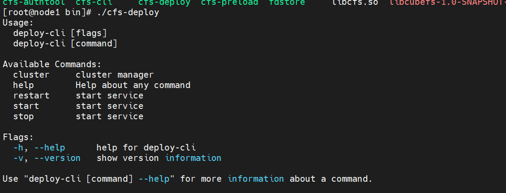

5. 加载配置文件

`./cfs-deploy cluster config -f ../../config.yaml `

deploy/conf目录下生成配置文件

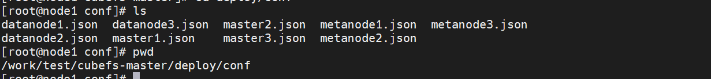

6. 初始化配置文件中的集群

`./cfs-deploy cluster init`


7. 启动服务

`./cfs-deploy start -a`


配置master节点信息

./cfs-cli config set --addr 192.168.128.128:17010

8. 集群信息查看

`./cfs-deploy cluster info`
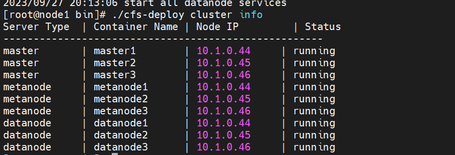

9. 创建卷

`./cfs-cli volume create ltptest ltptest`

10. 查看用户信息

`./cfs-cli user list`

将ACCESS KEY 和 SECRET KEY 填入对应的client.json配置文件中，该配置文件位于docker/conf下面

11. 挂载卷

 `./cfs-client -f -c /work/cubefs-master/docker/conf/client.json &`

`df `查看

note：如果没有安装fuse，会失败

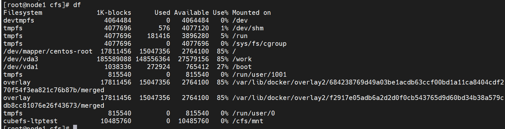

12. 先kill挂载卷的后台进程，再删除卷，然后再停止服务

## 配置文件
### 示例
```yaml
global:
  ssh_port: 22
  container_image: docker.io/cubefs/cbfs-base:1.0-golang-1.17.13
  data_dir: /data
  variable:
    target: 0.0.1


master: 
  config:
    listen: 17010
    prof: 17020
    data_dir: /data

metanode:
  config:
    listen: 17210
    prof: 17220
    data_dir: /data

datanode:
  config:
    listen: 17310
    prof: 17320
    data_dir: /data


deplopy_hosts_list:
  master:
    hosts:
      - 10.1.0.44
      - 10.1.0.45
      - 10.1.0.46
  metanode:
    hosts:
      - 10.1.0.44
      - 10.1.0.45
      - 10.1.0.46
  datanode:
    - hosts: 10.1.0.44
      disk:
        - path: /data/disk0
          size: 10737418240
    - hosts: 10.1.0.45
      disk:
        - path: /data/disk0
          size: 10737418240
    - hosts: 10.1.0.46
      disk:
        - path: /data/disk0
          size: 10737418240


```
### 说明
data_dir 优先读取局部自定义的值。


## 命令
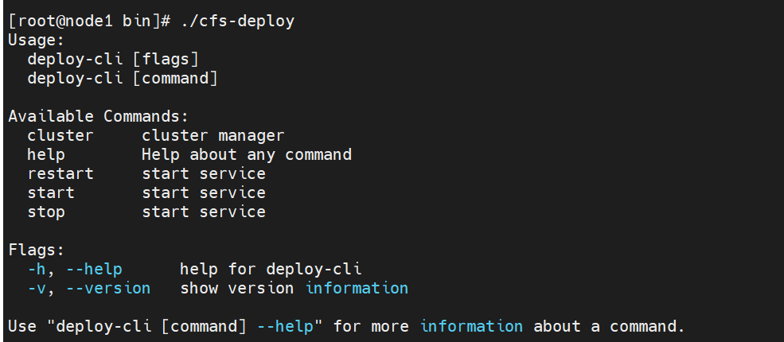
### start
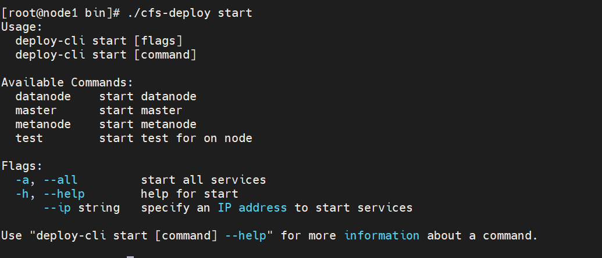
`./cfs-deploy start master`
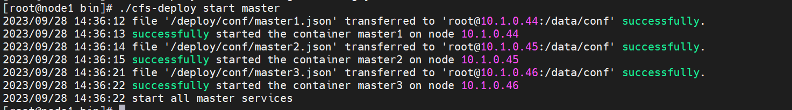
`./cfs-deploy start metanode`
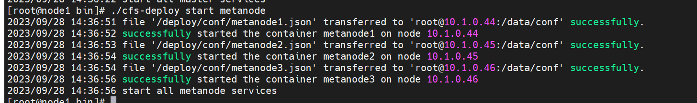
`./cfs-deploy  start metanode  --ip 10.1.0.44`
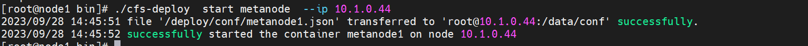
`./cfs-deploy start datanode`
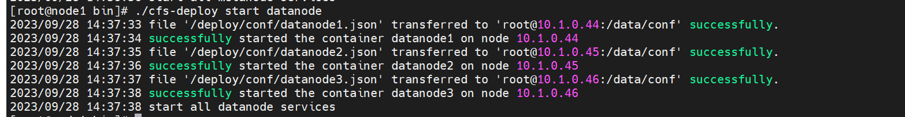
`./cfs-deploy  start datanode  --ip 10.1.0.44`
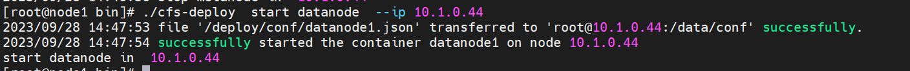
`./cfs-deploy  start -a`
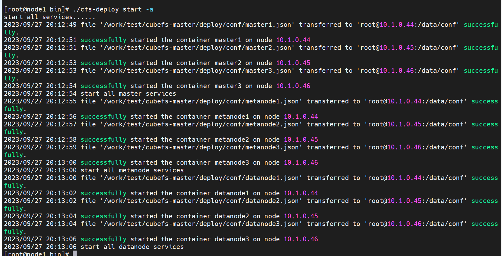

`./cfs-deploy start test --disk /data`

开启单机测试，会启动以docker-compose方式编排的cubefs服务。

### stop
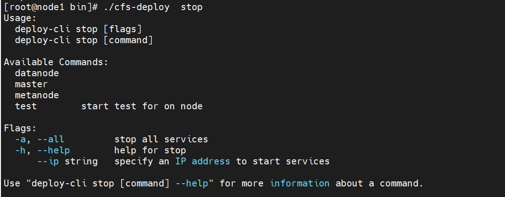
`./cfs-deploy  stop master`
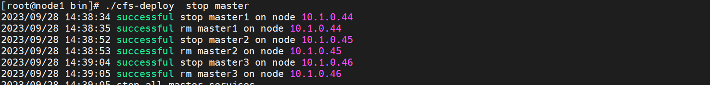
`./cfs-deploy  stop metanode`
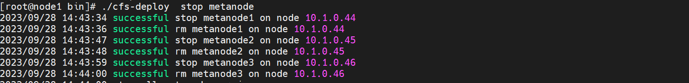
` ./cfs-deploy  stop metanode  --ip 10.1.0.44`
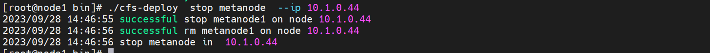
`./cfs-deploy  stop datanode`
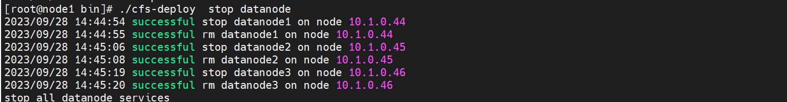
`./cfs-deploy  stop datanode  --ip 10.1.0.44`
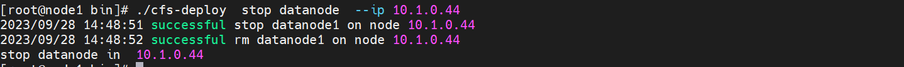
`./cfs-deploy  stop  -a`
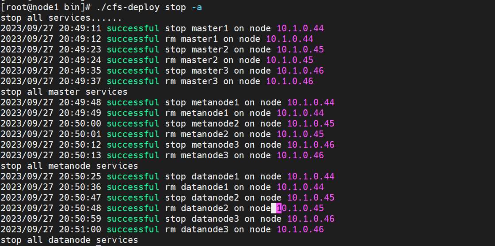

`./cfs-deploy stop test`

停止测试集群
### restart
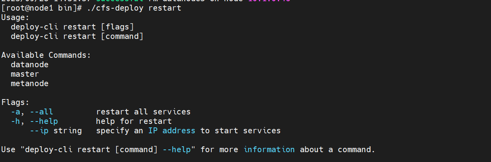
`./cfs-deploy restart -a`
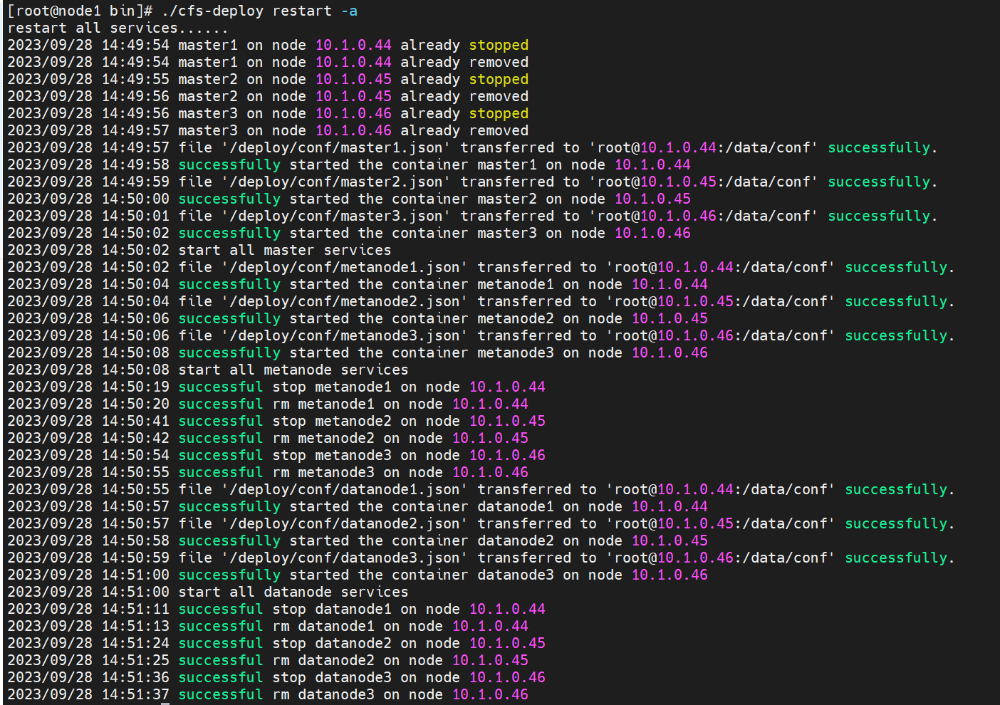
`./cfs-deploy restart master`
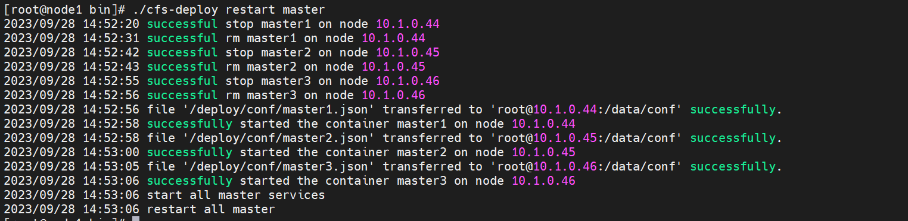
`./cfs-deploy restart metanode`
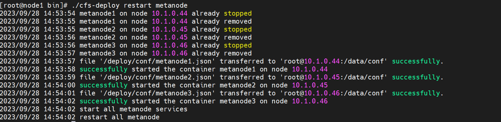

`./cfs-deploy restart metanode --ip 10.1.0.44`
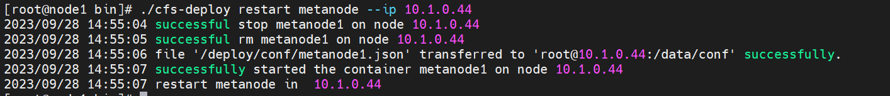
`./cfs-deploy restart datanode`
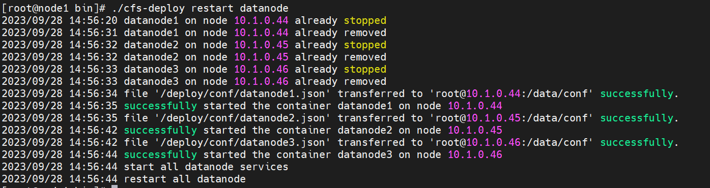
.`/cfs-deploy  restart datanode --ip 10.1.0.44`
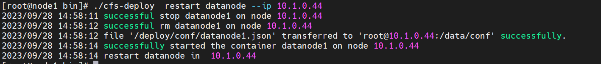
### cluster
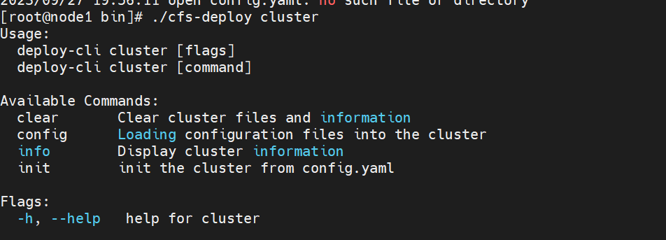
`./cfs-deploy cluster config -f [filename]`
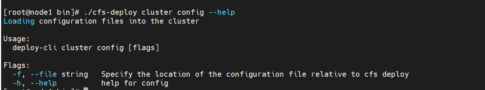

`./cfs-deploy cluster init`
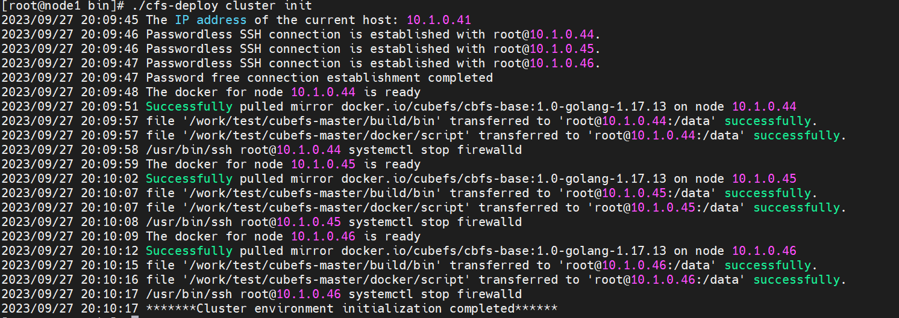

`./cfs-deploy cluster info`
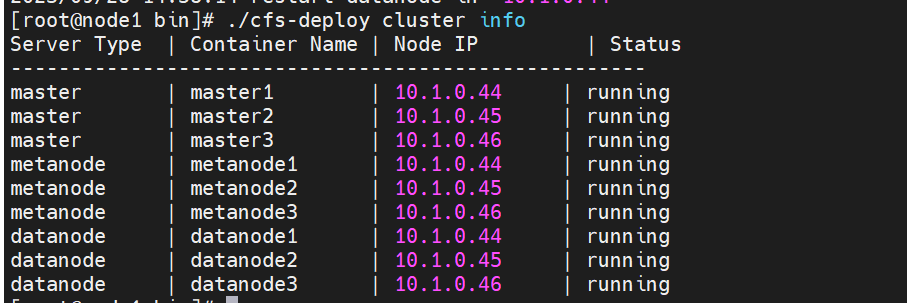
` ./cfs-deploy cluster clear`

容器还在运行的情况下，无法清除集群中的镜像

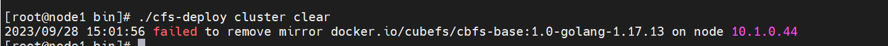
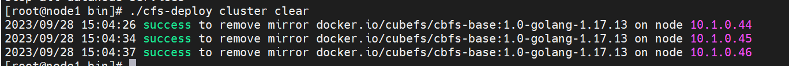


