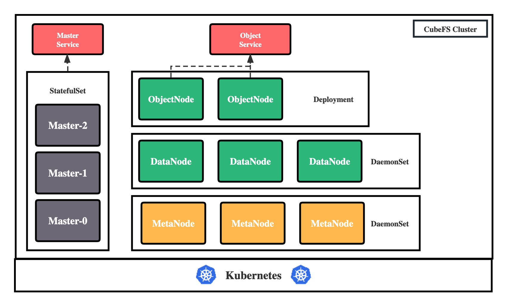

# Kubernetes 部署

CubeFS 可以使用 helm 工具部署在 Kubernetes 集群中，各组件会直接使用宿主机网络，使用 hostPath 将磁盘映射到容器中。

## 部署架构



CubeFS 目前由这四部分组成：

`Master`：资源管理节点，负责维护整个集群的元信息，部署为 StatefulSet 资源。

`DataNode`：数据存储节点，需要挂载大量磁盘负责文件数据的实际存储，部署为 DaemonSet 资源。

`MetaNode`：元数据节点，负责存储所有的文件元信息，部署为 DaemonSet 资源。

`ObjectNode`：负责提供转换 S3 协议提供对象存储的能力，无状态服务，部署为 Deployment 资源。

## 机器准备

在开始部署之前，需要拥有一个至少有 3 个节点（最好 4 个以上，可以容灾）的 Kubernetes 集群，且版本大于等于 1.15。

接着开始规划机器，给机器打上各自的标签，标明这台机器要在 CubeFS 集群中承担的角色：

``` bash
# Master 节点，至少三个，建议为奇数个
kubectl label node <nodename> component.cubefs.io/master=enabled
# MetaNode 元数据节点，至少 3 个，奇偶无所谓
kubectl label node <nodename> component.cubefs.io/metanode=enabled
# Dataode 数据节点，至少 3 个，奇偶无所谓
kubectl label node <nodename> component.cubefs.io/datanode=enabled
# ObjectNode 对象存储节点，可以按需进行标记，不需要对象存储功能的话也可以不部署这个组件
kubectl label node <nodename> component.cubefs.io/objectnode=enabled
```

CubeFS 安装时会根据这些标签通过`nodeSelector`进行匹配，然后在机器创建起对应的`Pod`。

## 挂载数据盘

在标志为 `component.cubefs.io/datanode=enabled` 的节点上进行挂载数据盘操作。

### 看机器磁盘信息

``` bash
fdisk -l
```

### 格式化磁盘

``` bash
mkfs.xfs -f /dev/sdx
```

### 创建挂载目录

``` bash
mkdir /data0
```

### 挂载磁盘

``` bash
mount /dev/sdx /data0
```

如果机器上存在多个需要挂载的数据磁盘，则每个磁盘按以上步骤进行格式化和挂载磁盘，挂载目录按照`data0/data1/../data999`的顺序命名。

## 安装 helm

安装 helm，参考[官方文档](https://helm.sh/docs/intro/install/)

## 拉取 CubeFS Helm 仓库

``` bash
git clone https://github.com/cubefs/cubefs-helm.git
cd cubefs-helm
```

## 编辑配置

部署 CubeFS 的 helm 存在大量的配置，所有的可配置项位于 helm 项目下的`cubefs/values.yaml`中，其中包含有详细的注释。

这里单独创建一个配置文件`cubefs-helm.yaml`，覆盖其中常见的关键配置项。

``` bash
touch cubefs-helm.yaml
```

`cubefs-helm.yaml`文件内容如下：

``` yaml
# 要安装哪些组件，如果只安装服务端的话保持下方配置即可，如果要安装客户端的话，把 csi 设置为 true
component:
  master: true
  datanode: true
  metanode: true
  objectnode: true
  client: false
  csi: false
  monitor: false
  ingress: true

# path.data: Master、MetaNode 的元数据存储路径，会以 hostPath 的方式存储在宿主机上，建议使用性能较高的底层磁盘
# path.log: 所有组件的日志在宿主机上的存储路径
path:
  data: /var/lib/cubefs
  log: /var/log/cubefs

master:
  # Master 组件实例数量
  replicas: 3
  # Master Ingres 配置使用的域名，记得需要将该域名 DNS 解析到 Ingres Controller 的入口，当然也可以不配置，
  # 在客户端处直接将所有 Master 的 IP + 端口配置上
  host: master.cubefs.com

objectnode:
  # ObjectNode 组件实例数量
  replicas: 3
  
metanode:
  # MetaNode 可以使用的总内存，单位字节，建议设置为机器可以内存的 80%，也可以按需减少
  total_mem: "26843545600"

datanode:
  # DataNode 要使用的磁盘，可以挂载多块
  # 格式: 挂载点:保留的空间
  # 保留的空间: 单位字节，当磁盘剩余空间小于该值时将不会再在该磁盘上写入数据
  disks:
    - /data0:21474836480
    - /data1:21474836480

# CSI 客户端配置
provisioner:
  # Kubelet 的主目录
  kubelet_path: /var/lib/kubelet
```

## 部署

使用如下命令进行 CubeFS 部署：

``` bash
helm upgrade --install cubefs ./cubefs -f ./cubefs-helm.yaml -n cubefs --create-namespace
```

接着使用命令 `kubectl get pods -n cubefs` 等待所有组件状态变为`Running`即可：

``` bash
$ kubectl -n cubefs get pods
NAME                         READY   STATUS    RESTARTS   AGE
datanode-2rcmz                      1/1     Running   0          2m40s
datanode-7c9gv                      1/1     Running   0          2m40s
datanode-s2w8z                      1/1     Running   0          2m40s
master-0                            1/1     Running   0          2m40s
master-1                            1/1     Running   0          2m34s
master-2                            1/1     Running   0          2m27s
metanode-bwr8f                      1/1     Running   0          2m40s
metanode-hdn5b                      1/1     Running   0          2m40s
metanode-w9snq                      1/1     Running   0          2m40s
objectnode-6598bd9c87-8kpvv         1/1     Running   0          2m40s
objectnode-6598bd9c87-ckwsh         1/1     Running   0          2m40s
objectnode-6598bd9c87-pj7fc         1/1     Running   0          2m40s
```

各个组件的关键日志会在容器标准输出中输出，运行起来后详细日志会存储在上文提到的`path.log`配置地址，如果启动失败可以配合日志查看，常见的启动失败原因可能有：

- DataNode 数据盘路径配置错误
- 组件端口被占用
- 配置的 MetaNode 可用总内存大于实际物理内存

具体问题需要配合具体场景进行分析，比较棘手的问题可以尝试向社区寻求帮助。
