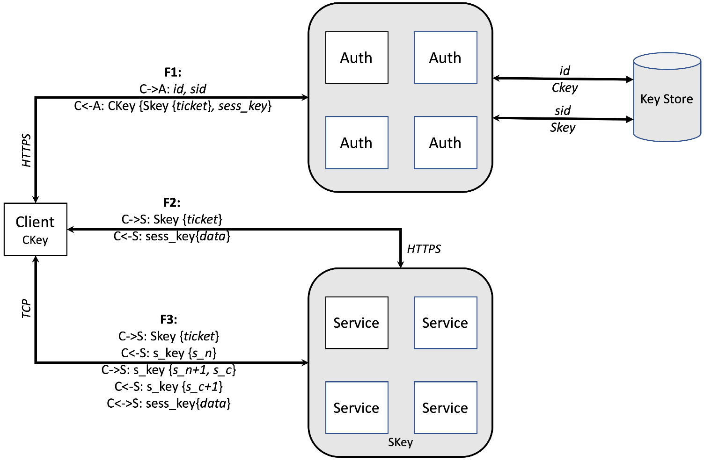

# 鉴权

众所周知，Internet（国际互联网）和intranet（企业内部网）都是不安全的地方，黑客通常可以使用工具在网络上嗅探到很多敏感信息。更糟糕的是，由于无法确认对端是否诚实地表达了自己的身份，客户端与服务端之间没有办法建立可信地连接。因此，如果没有鉴权机制，CubeFS一旦部署在了网络中，便会存在一些常见的安全问题。

## 安全问题

- 未认证的节点可能会访问敏感信息，如`restful API`，`volume`信息等

- 通信信道可能受到 `Man-in-the-middle (MITM)` 攻击

## 系统架构

`Authnode` 是为 CubeFS 提供通用认证和授权框架的安全节点。此外， `Authnode` 还充当对称密钥和非对称密钥的集中密钥存储。`Authnode` 采用并定制了基于票证的 `Kerberos` 认证思想。具体来说，当客户端节点（ `Master 、 Meta 、 Data 或 client `节点）访问服务时，首先需要在 `Authnode` 中展示用于身份验证的共享密钥。如果认证成功， AuthNode 将专门为该服务颁发一个限时票证。出于授权的目的，功能嵌入到票证中，以指示 谁可以在什么资源上做什么 。

在`Authnode` 的上下文中，我们将负责初始化一个服务请求的节点定义为 `Client` ，而响应该请求的节点定义为 `Server` 。这样，任何 CubeFS 节点都可以充当 `Client` 或者 `Server` 。

`Client` 和 `Server` 之间通过 `HTTPS` 或者 `TCP` 进行通信。 `Authnode` 的工作流程如上图所示，简要描述如下：

### 凭据请求 (F1)

在任何服务请求之前，需要持有密钥 *`Ckey`* 的客户端为服务（ `target
service`）从 `Authnode` 获取服务的认证信息。

-   C-\>A:
    客户端发送一个认证请求，请求中包含一个代表客户端的客户端ID（`id`）和一个代表目标服务的服务ID（`sid`）。
-   C\<-A: 服务端从自己的 [key store]{.title-ref}
    中查找客户端秘钥（`CKey`）和服务端秘钥（`SKey`）。如果认证成功，服务端会向客户端回应一条`CKey`加密的消息。消息中会包含会话秘钥（`sess_key`）和目标服务的凭据。

在获取凭据并使用`Ckey`处理一些安全检查后，客户端拥有`sess_key`和`Skey{*ticket*}`以备将来的服务请求。

### HTTPS中的服务请求 (F2)

如果服务请求是通过HTTPS协议发送的，那么它将按如下步骤进行：

-   C-\>S: 客户端发送一个包含SKey {*ticket*}的请求。
-   C\<-S:
    服务端进行以下操作
   - （1）执行消息解密并获取凭据
   - （2）验证功能
   - （3）使用从凭据中获取的`sess_key`，加密`data`返回给客户端。

客户端使用`sess_key`解密从服务器返回的消息并验证其有效性。

### TCP中的服务请求 (F3)

如果服务请求是通过TCP协议发送的，那么它将按如下步骤进行：

-   C-\>S: 客户端发送一个包含SKey {*ticket*}的请求。
-   C\<-S: 服务端
   - （1）解密凭据并验证其功能
   - （2）提取`sess_key`
   - （3）生成一个随机数`s_n`
   - （4）用`sess_key`加密的这个数后响应给客户端。
-   C-\>S:
    客户端解密回复的消息，并向服务端发送另一条消息，其中包括随机生成的数字`s_c`和`s_n+1`，这两个数字都用`sess_key`加密。
-   C\<-S:
    服务器将验证`s_n`是否增加了1。如果验证成功,服务端将发送一条包含`s_c+1`的消息，该消息由`sess_key`加密。
-   C\<-\>S:
    客户机在消息解密后验证`s_c`是否增加了一个。如果成功，则已在客户端和服务器之间建立经过身份验证的通信通道。基于此通道，客户端和服务器可以执行进一步的通信。

## 未来工作

`Authnode`支持CubeFS急需的一般的身份验证和授权。未来`CubeFS`的安全增强有两个方向:

### 特性丰富

当前的 `Authnode`实现不支持某些高级功能:

-   密钥轮换：共享密钥在客户端和服务器中硬编码，不会更改。它增加了安全风险，攻击会破坏加密并找到密钥。定期轮换秘钥有助于降低此类风险。
-   凭据撤销：出于性能考虑，凭据将有效一段时间（如几个小时）。如果客户端不幸地泄漏了它的票证，恶意方可以在有效期内将票证用于服务请求。凭据撤销机制可以通过在发生泄漏时撤销凭据来预防此类问题。
-   HSM支持:`Authnode`是CubeFS中的安全瓶颈。破坏`Authnode`意味着破坏整个系统，因为它管理密钥存储。硬件安全模块（HSM）为密钥管理提供物理保护。让HSM（例如`SGX`）保护`Authnode`，可以降低 `Authnode`被破坏的风险。

### 端到端数据加密

当前的 `Authnode`实现并不系统地支持对传输中和静止数据的加密，即使我们可以在通信期间使用会话密钥加密数据。保护数据的一种更安全的方法是使用`端到端数据加密`。特别是，加密密钥由 `Authnode`管理和分发，数据在客户端节点加密，通过网络发送并存储在服务端中。与基于现有工具（`fscrypt` 、 `ecryptfs` 和`dm-crypt`）的服务端加密相比， `端到端数据加密` 至少具有以下优点：

- 由于数据解码密钥存储在 `Authnode` 中，一旦数据服务器（例如
  `data Node`）被攻击者入侵，它就可以减少数据泄漏。
- 它提供对加密密钥的集中管理（轮换、撤销和生成）。