# 纠删码子系统

CubeFS 3.0.0以前版本只提供多副本存储，随着数据规模持续增长，业务面临着更大的成本挑战，用户对更低成本的纠删码(ErasureCode, 下文简称EC)的需求愈加强烈。

CubeFS近期重磅发布3.0.0版本，其关键特性之一是增加了对EC的支持（下图中Erasure Code 部分），EC将大幅降低数据冗余度，优化存储成本，有力支撑更大规模存储需求。

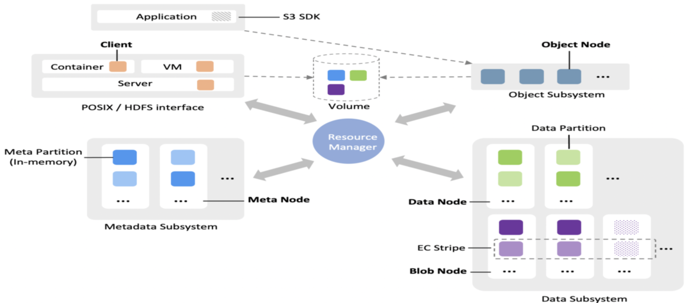

## 系统特性

CubeFS的纠删码存储子系统(BlobStore)，是一个高可靠、高可用、低成本、支持EB规模的独立键值存储系统。主要特点：

1. 采用 Reed-Solomon编码，简洁的在线EC架构
2. 动态可配的EC模式：支持如“6+3”、“12+3”、“10+4”等多种规格 
3. 灵活的多AZ部署：支持1、2、3不同AZ数目的部署
4. 采用Raft协议保证元数据的强一致性和高可用
5. 高性能的存储引擎：小文件专项优化、高效的垃圾回收机制

## 整体架构

**模块简介**

* Access：请求接入网关，提供数据读、写、删等基本操作接口；
* BlobNode：单机存储引擎，管理整机的磁盘数据，负责数据的持久化存储，执行卷修补、迁移和回收任务；
* ClusterManager：元数据管理模块, 负责集群资源(如磁盘、节点、存储空间单元)的管理；
* Proxy：ClusterManager与异步消息代理模块，提供数据写入空间的分配、删除与修补消息转发等；
* Scheduler：异步任务调度中心，负责磁盘修复、磁盘下线、数据均衡、数据巡检、数据修补以及数据删除等任务的生成和调度。

## 名词解析

**Volume**

一个逻辑的存储空间单元，有固定容量上限 (如32G，写满32G变Immutable），Volume 由 Volume ID 标识，Volume的创建、销毁、分配在 ClusterManager 统一管理。**不同的 Volume支持不同的EC模式**。

集群的可分配空间由一个个Volume组成。Access写数据前需先申请一个可用的Volume，读数据则先查询到数据对应的Volume。
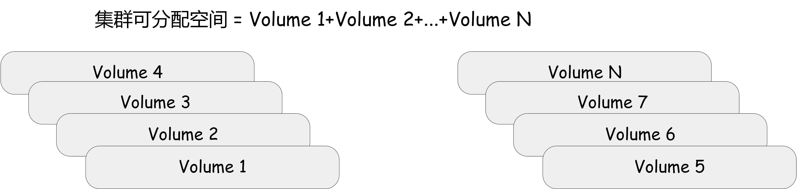

**Chunk**

**Chunk**是Volume的基本组成单元，是存储数据的容器，由 Chunk ID 唯一标识，对应磁盘的一段实际的物理存储空间；Chunk的创建、销毁由BlobNode管理；多个 Chunk按照纠删码编码模式组成一个Volume，Chunk和Volume的绑定关系持久化在ClusterManager中。

以纠删码模式为“4+4”(即数据块数目为n=4，校验块数目m=4)的Volume举例，该Volume由 8 个  Chunk组成。 这 8 个 Chunk分散在不同机器的磁盘上。

**Blob**

**Blob** 是用户数据的一次EC计算的数据大小。由`Access`负责切分，Blob用`BlobID`唯一标识，`BlobID`则由ClusterManager统一管理分配，保证全局唯一。

假设系统预设的Blob大小为8 M。当前有用户数据 200 M，则会被切分成有序的 25 个 Blob，优先写入某个 Volume 中，当前 Volume 空间不足时，余下Blob 可写入其他 Volume。

**Shard**

**Shard** 是EC条带数据的组成单元。上面提到 Volume 由多个 Chunk 组成，Blob 写入Volume 时，对应切成多个块分别写到各个Chunk。**每个小块数据叫做 Shard ，一个 Shard 对应写一个 Chunk**。

假设一份用户Blob 数据大小为8M， Volume纠删码模式为“ 4+4 ”，Access会把blob切成4份大小为2M的原始数据块，再计算出4个大小为2M的冗余校验块。该8个2M块都被称为 Shard ，这些 Shard会被分别写到Volume绑定的各个Chunk中，至此完成EC编码及存储流程。

## 数据读写流程

**写流程**

1. Access 申请一个或多个足够空间且可用的 volume；
2. Access 顺序接收用户数据，切分成Blob，按照EC编码模式，切成N个数据块，再计算出M个校验块，每一个数据块和校验块表示一个shard；
3. 把这些 shard 并发写入卷映射的 chunk中；
4. Blob写采用quorum模型，大多数的 (>n个)shard写成功即可，写失败的shard投递修补消息到Proxy中，作异步修补，最终达到数据完整。如下图，2+1 的纠删码模式，用户数据生成3个shard(两个数据块，一个校验块)。并发写入到 BlobNode。正常情况，3 份都会成功，假设出现异常情况，写入超过两份也算成功。
   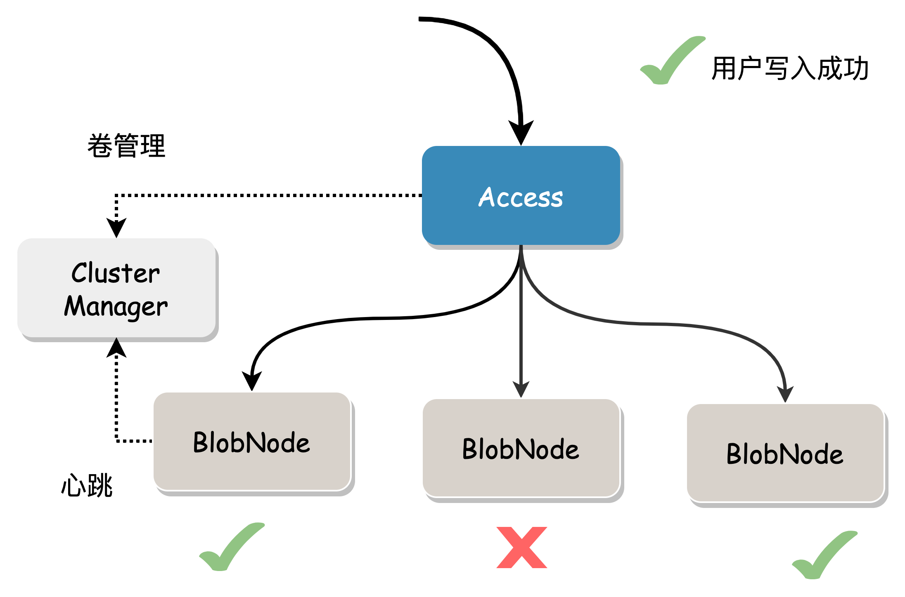
5. Access 把对应的数据位置信息（Location）返回给用户，用户需要保存该位置信息，用来作读取数据。
   **读流程**

在没有数据损坏的情况下，根据数据位置信息读取指定长度(Range)的数据直接返回。

当需要读取的数据块有损坏或者数据所在节点故障，需要读取其他节点上的数据来修复数据。

这里可能导致一定程度的读放大，因为它必须读到足够的数据块才能计算出所需数据。

成本考量：我们总是希望读取本地数据即可返回给用户。则多AZ模式下优先选择修复读，通过本AZ存储的部分数据块和部分校验块计算出完整数据；减少IO时间，及AZ间的网络带宽；以计算时间换取带宽成本。

尾延时通过backup request来优化：要得到完整的blob，正常读n个shard数据即可，实际可发n+x（1< x <= m）个Shard的读请求，任意前n个请求响应后即可得到原始blob，优雅应对网络超时、节点负载重、磁盘IO慢或故障导致的尾延时。
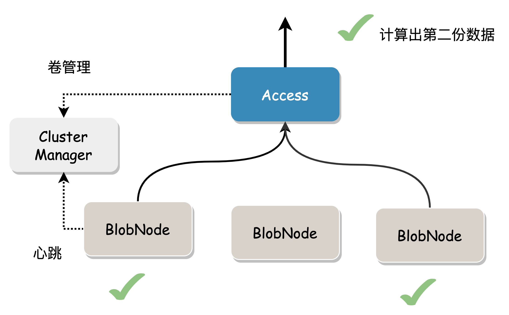

## 元数据中心

元数据中心(ClusterManager)负责 Volume 的创建和分配，并管理集群存储节点的状态信息，也为无状态组件提供服务注册功能。

ClusterManager多节点部署，采用Raft协议保障一致性，以RocksDB作为底层存储，得益于RocksDB其批量聚合特性，ClusterManager可提供很高的吞吐能力。

## Access 模块

Access是接入层模块，负责数据收发、切片、EC编解码及流控等。

### Blob分片

用户数据按照一定大小被切分成多个连续的 Blob，打散分布在集群的多个物理节点。在并发场景下，读写请求能充分利用全部集群资源数据。

### 并发优化

写数据流程中对应的每个 Blob 被切分成多个Shard，Shard 之间并发写入。读取流程中的多 Shard 数据构建和用户端数据发送是 Pipeline 并行的，节省了网络IO时间。

### Quorum 机制

EC 模式要写入的数据分块数比副本模式要多，往往一份数据需要写多个位置。比如 3 副本只需写 3 次，3+2 的 EC 模式则需要写 5 次。在单次写入失败率一定的情况下，EC 模式整体失败率更高。 为了提高可用性，Access 采用 Quorum 机制，允许一定份数的写入失败，只需要满足 EC 的可恢复条件即可。Quorum 写成功返回后，通过异步流程对失败数据块进行修补，达到最终数据完整性。

### EC 编解码

我们采用 RS（Reed-Solomon） 编解码，存储冗余度低但数据耐久性高。在多AZ部署时，可配置使用LRC编码，在每个AZ内添加1份局部校验块，可大幅降低数据修复时需跨AZ读的概率，从而降低跨机房带宽传输，加速数据修复。

### 小文件优化

小文件做在线EC会有较严重的IO放大。比如 128K 大小的文件，切分后的shard存储在 4+4 个位置，修复读至少需要4次网络请求才能构建出完整数据。我们提出的优化方案为：对于越小文件数据，尽可能写入到越少的数据块中，以减少读取时的网络请求；写入性能并没有明显降低，但读取性能大大提高。

举个例子，假设 Blob 阈值为 4 M，纠删码模式为"4+4"，单个Shard阈值为1M。当前有 128K 的用户数据。如果按照常规的切分方式，128K 切成 4 份，每一份 32K ：

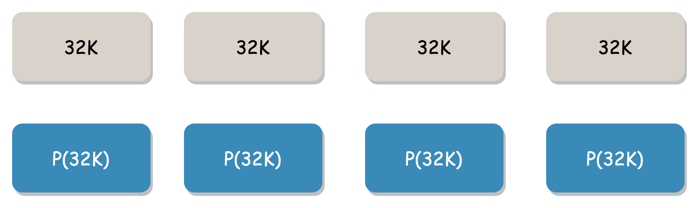

这种切片方式当用户读 128K 数据的时候，需要至少发送 4 次网络请求进行多次 IO，异常发生的概率更高。

我们的方案采用空间换时间的方式，只需要 1 次网络请求就可能得到完整的数据。把128K用户数据全部写入第一个数据块，后三个数据块以空白数据代替；下载时只要能正确得到有用数据块或任一校验快即可修复全部用户数据。

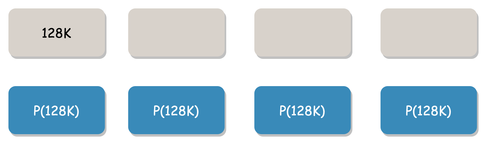

## 存储引擎

BlobNode作为单机存储引擎，管理本机所有磁盘存储空间，负责用户数据在磁盘和内存上的组织，对外提供数据读、写、删、修复等接口。

### Key/Value 分离存储

Key 和 Value 分离存储，适合大中型的 Value 存储。kay / value 分离的思想自 2016 年《WiscKey: Separating Keys from Values in SSD-Conscious Storage》，[https://www.usenix.org/system/files/conference/fast16/fast16-papers-lu.pdf](https://www.usenix.org/system/files/conference/fast16/fast16-papers-lu.pdf)，论文提出以后，有了很多实践的项目，在 BlobStore 系统的存储引擎中也借鉴了该思想。

每个磁盘分为元数据和数据两部分，如下：

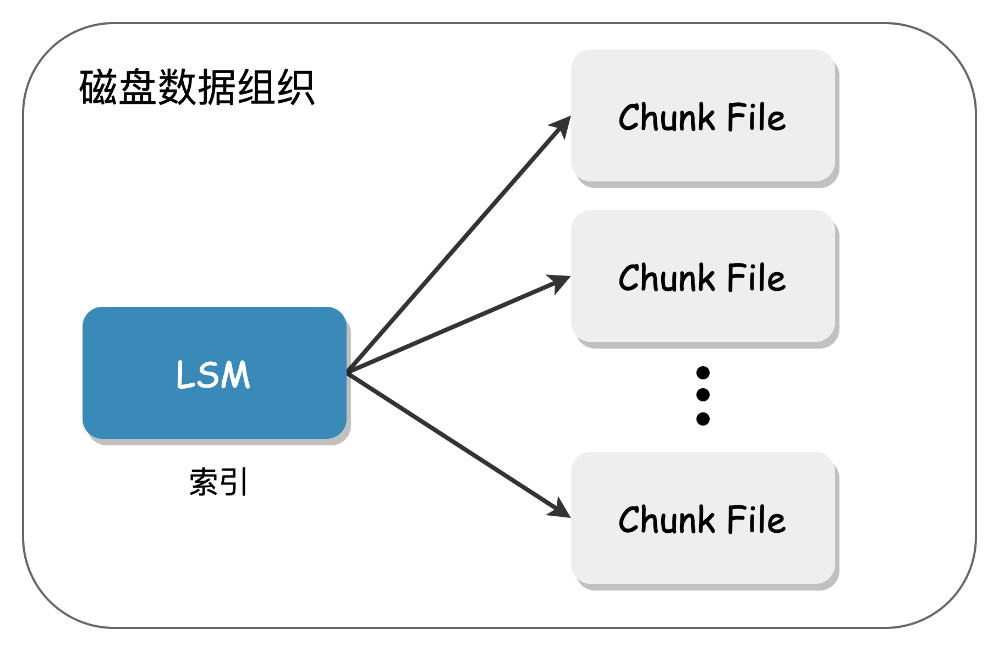

Shard的元数据存储 LSM Tree 里，实际数据部分存储在一个顺序大文件（ Chunk File）中。由于 LSM Tree 里面的数据量少，compact 带来的影响就很小，实际运行几乎不会出现 compact 。也可以把元数据集中放在高性能的 SSD 介质上，SATA 盘来承接用户数据。

Chunk 形式上是一个个大文件，大小有上限，Chunk只支持Append写，对HDD友好。

### 高可靠设计

### 数据保护设计

磁盘硬件故障是常态（如坏道、静默错误)，数据损坏后系统要能校验出来，保证返回给上层业务的一定是正常数据。

**Key 元数据**

LSM Tree 有自己的 crc 校验保护。sst 文件由 block 组成：

每个 block 都有 crc 保护：

当磁盘出现静默错误的时候，能及时校验出来，避免读到错误的数据。上层感知到这个节点的错误，只需通过其他节点重构出数据即可获得正确的数据。

**Value 数据格式**

用户数据存在于 Chunk File ，这是一个大的聚合文件。它有自己的保护设计。Chunk 由 header 头部和 Shard 组成：

每个 shard 都单独保护起来，它有自己的 magic 定界符，并且内部按照 block 分块保护（而不是一个 shard 只有一个 crc ，这样能做到更细粒度的保护）：
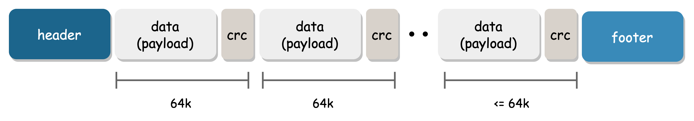

**兜底设计**

考虑到 LSM 里存放的元数据是集中存放，如果出现丢失可能影响很大。所以 Chunk File 在写入 Shard 数据的时候，在 header ，footer 里会备份一份元数据。在极端情况，LSM 的元数据就算全部丢失，能够通过解析 Chunk 文件重构出元数据，从而恢复索引数据，而在读写删的时候，也能通过双重校验来保护数据。

### 高效的垃圾回收

传统的垃圾回收一般采用先标记删除，后异步做compact的方式 ，compact过程则涉及到大量磁盘读写，有明显缺点：

1. 磁盘IO开销大：compact过程是读旧的文件，写新的文件，然后删旧的文件；易导致长时间的随机 IO，速度慢，效率低，也会影响业务的正常IO
2. 空间利用率低：因compact过程磁盘IO开销大，为减少 compact 次数，一般会等垃圾数据累积到一定阈值再做compact，易导致空间回收不及时，磁盘存储利用率降低。
   BlobNode的垃圾回收流程如下：

1. 先删数据在LSM中的索引条目；
2. 再对Chunk File用系统调用`fallocate`在指定位置打一个相应大小的"洞"；
   BlobNode垃圾回收机制充分利用文件系统的“打洞”(punch hole)功能：删除数据打洞时，系统会把文件洞中空间释放，剩余部分的文件偏移不变，而文件大小相应减小，无需整理文件即可快速释放垃圾空间。
   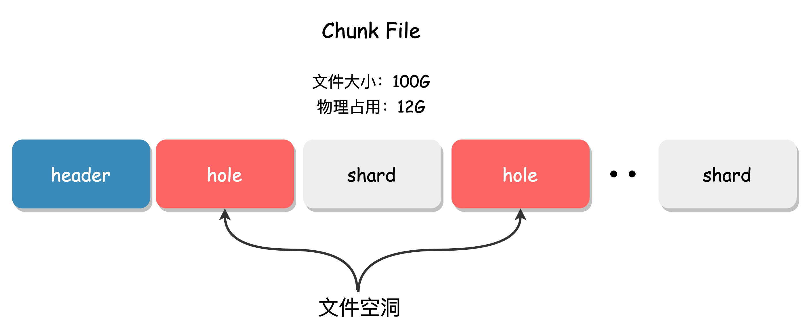

BlobNode高效的垃圾回收方法，可解决传统垃圾回收compact过程带来的大量IO开销，提高存储空间利用率，对删除量大的业务场景非常适用。

### Append写

覆盖更新是数据损坏最常见的场景之一，Chunk File 的设计是：数据的写入永远都是 Append 写入，不存在覆盖更新的情况。写过的位置只能读，尽量发挥机械磁盘顺序访问性能。
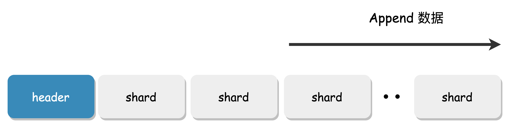

## 最佳实践

### 多 AZ 部署

BlobStore 支持多 AZ 的部署方式，1AZ，2AZ，3AZ 都是完美支持，只需要配置对应的 EC 编码模式即可。假设3AZ使用"15+9"编码模式，任意一个AZ故障导致其中数据完全损毁（8份), 利用剩余两个AZ数据(16份)即可将故障AZ的全部数据修复，从而实现AZ级故障容灾。

### 服务器选型

不同的组件对组件有不同的偏重，下面就 Access 接入模块，BlobNode 单机引擎，ClusterManager 元数据管理做个简单的介绍。

**Access 机器**：计算和内存需求多，因EC编解码属计算密集型任务，需要 CPU 消耗，并且 Access 需要在内存中编解码，也需要消耗内存。当然这个内存消耗和请求并发数有关，可以配置。

**BlobNode 机器**：BlobNode 是管理磁盘的单机存储引擎，是集群成本的主要组成部分，所以它的部署机型一般是高密磁盘的机型。比如 4U60 盘的就比较好，这种机型也将会是系统最多的类型。

**ClusterManager 的机器**：元数据中心，它的吞吐能力要求很高，这个必须要部署在高性能的 SSD 盘上，CPU 内存都要好点。

## 设计总结

1、 **数据冗余策略**

我们知道，保障数据耐久性的关键手段就是数据冗余，冗余策略又分为**多副本**（Replica）和**纠删码**（Erasure Code，简称 EC ）两种：

- **多副本策略**（ Replica ）：把数据复制多份，按照策略放到分布式不同的存储位置，当某份数据损坏时，可从其他副本读取或修复；
- **纠删码策略** （ Erasure Code，简称 EC ）：将原始数据编码得到冗余数据，并将原始和冗余数据一并存储，以达到容错目的。其基本思想是将n块原始的数据元素通过一定的计算，得到m块冗余元素（校验块）；对于这n+m块的元素，当其中任意的m块元素出错（包括原始数据和冗余数据）时，均可以通过对应的重构算法恢复出原来的n块数据
  多副本与纠删码两者在系统复杂度、数据耐久性、存储成本、读写放大比等方面表现不同：

多副本实现简单，数据耐久性一般，资源利用率较低、存储成本较高；纠删码实现较复杂，数据耐久性更高，资源利用率更高，存储成本低。

数据冗余策略如何选型，需从业务的数据规模、访问模型、耐久性及成本需求等多维度综合评估；以OPPO手机云相册业务为例，支撑数亿用户访问，数据体量大，成本诉求强烈，目前已全面使用低成本的纠删码引擎。

2、**离线/在线EC策略**

**离线EC**

多副本策略实现简单，而纠删码数据耐久性高且存储成本低。为兼顾性能和成本，有些产品会同时提供两套系统，数据先写入作为缓存的多副本，再异步迁移到最终的纠删码，即所谓的离线 EC 。这种方式优点在于可提供较低地写入时延（无在线EC的计算开销），又能利用低数据冗余度的纠删码降低成本；

离线EC缺点也较明显：

* 架构复杂：包含多副本和纠错码两套存储子系统，系统间涉及数据搬迁，两者相互依赖
* 运维不友好：需管理两套存储集群，模块也更多，运维难度及风险较大
* IO开销高：数据先写多副本再转存EC，1个业务IO对应后台多份IO，磁盘读写放大多，IOPS及带宽额外开销大
  **在线EC**

得益于CPU算力提升和指令集加速，EC编解码计算不再是性能瓶颈，在线 EC 逐步流行。

所谓**在线EC**是指系统在收到业务原始数据块时，实时同步计算出冗余块，与数据块一并下发存储，无需再做数据的搬迁；相比离线EC，在线EC在架构简洁性、运维成本方面更具优势；两者对比示意如下：

在线EC也存在一些技术挑战：

* 相比离线EC，数据写入需实时计算得到冗余块，有一定的时间开销
* 相比多副本，业务一次读写涉及更多存储节点，扇出大，易出现尾时延
* 适合于大文件，小文件有一定读写放大
  CubeFS对这些问题做了大量针对性优化，使得在线EC在实际生产可落地。

**3、块EC/条带EC策略**

计算 EC时数据需切片，如果是 N+M 模式，那么用户数据切成 N 块，再生成 M 块校验块就是一个完整的 EC 条带数据。按照凑一个条带的数据方式我们可以分为“条带EC”"和“块EC”两种方式。

**块 EC：**

* 定长条带，要凑满一个条带的数据才能去按照 N+M 切块做 EC ，每个条带长度固定，每个条带块长度固定；
* 凑条带的场景有点复杂，会导致一个完整的用户数据可能跨条带，元数据结构复杂，一般使用于离线EC场景；
  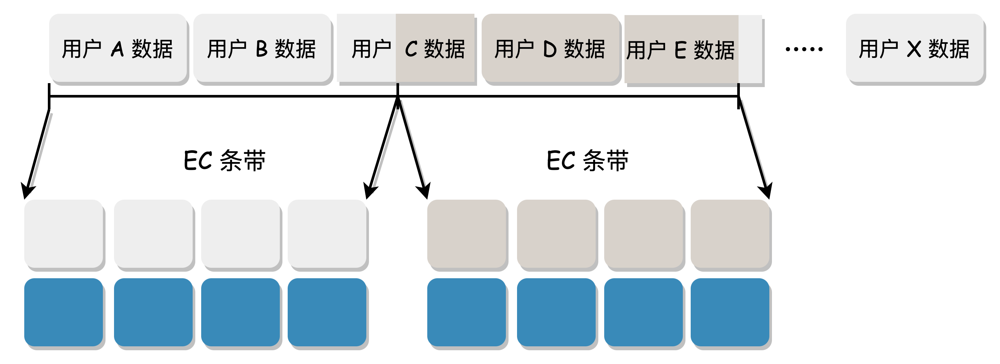

**条带 EC：**

* 直接把用户数据按照 N+M 切块做 EC ；
* 不需要再凑条带数据，一个用户数据就是完整条带，元数据结构简单；
  

CubeFS 使用的是更简单、更通用的条带 EC 的方式。