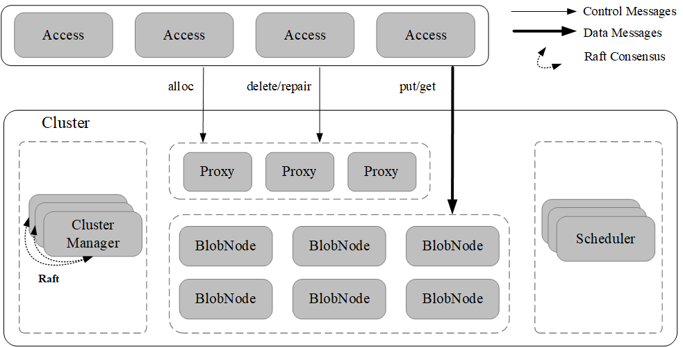
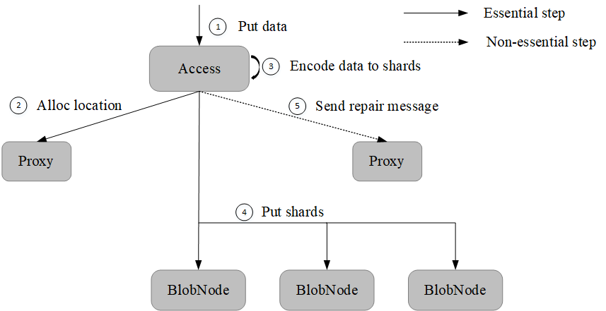

纠删码子系统
=======================

纠删码子系统(BlobStore)是一个高可靠、高可用、低成本、支持超大规模(EB)的分布式存储系统。采用纠删码中的Reed-Solomon编码，对比三副本，以更低的存储成本提供更高的数据耐久性保障，支持多种纠删码模式和多可用区部署，同时针对小文件做了专门优化，可满足不同业务场景的存储需求。

.. csv-table::
   :header: "模块",  "描述"

   "Access",  "接入模块，对外提供数据读、写和删除接口"
   "ClusterManager",  "元数据管理模块,负责集群管理和卷的生成"
   "Proxy",  "ClusterManager与异步消息代理模块，提供数据写入空间的分配、删除与修补消息转发等"
   "BlobNode",  "数据存储模块，管理整机的磁盘数据，负责数据的持久化存储、执行卷修补、迁移和回收等任务"
   "Scheduler",  "异步任务调度中心，负责磁盘修复、磁盘下线、数据均衡、数据巡检、数据修补以及数据删除等任务的生成与调度"

系统特性
--------------------------

- 超大规模

BlobStore可由多个cluster集群组成，单个cluster内可以存储数百PB以上的数据，cluster内部和cluster之间都支持水平弹性扩展，整个纠删码子系统可提供EB级别以上的超大规模存储需求解决方案。

- 高可靠性

BlobStore选择纠删码技术作为数据冗余备份策略，利用Reed-Solomon编码特性将原始数据分成N份数据块和M份校验块存储到集群，最大可以支持M份数据损坏的前提下保证数据可靠。BlobStore支持分区容错和容灾，支持数据自动巡检和修复，提供高达99.9999999999%的数据耐久性保障。

- 低成本

纠删码与三副本冗余备份技术在保障相同数据高可靠性的前提下，纠删码技术的存储冗余度远低于三副本技术。纠删码子系统在满足数据高可靠性的前提下更加节约存储成本，在大规模存储存储场景下收益明显。

- 灵活部署

BlobStore支持多种纠删码模式，可以自由配置纠删码中数据块和校验块份数以满足不同业务场景需求。支持单可用区到多个可用区的灵活部署。

.. image:: pic/multi-AZ.png
   :align: center
   :alt: Blobstore Multi-AZ Deployment

写入数据
---------------------

读取数据
---------------------

.. image:: pic/get-data.png
   :align: center
   :alt: Put Data Step

对外接口
---------------------

.. csv-table::
   :header: "方法", "参数", "描述"

   "Put", "size,body,MD5【可选】", "返回数据存储的位置信息location"
   "Get", "location,offset,readsize", "根据位置信息location、偏移量以及读取大小获取数据"
   "Delete", "location", "根据location删除数据"
