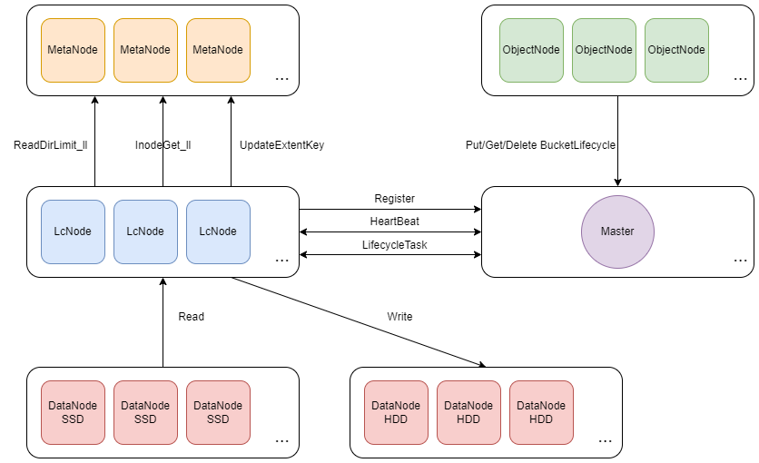

# 生命周期子系统

生命周期子系统的设计是为了满足用户对数据生命周期管理的需求。CubeFS 实现了兼容 AWS S3 的生命周期管理（BucketLifecycle）功能，它允许用户根据数据的年龄、存储类型或其他属性来自动管理数据的生命周期，包括数据的存储类型转换或删除。

## 系统架构



**LcNode**

LcNode 为无状态节点，与 Master 保持心跳并执行 Master 分配的生命周期任务，可以根据集群规模和生命周期配置情况进行扩容、缩容，扩容直接启动新的 LcNode 节点，缩容直接停掉对应的 LcNode 节点即可。

下面为 LcNode 进程启动所需的配置文件示例：
```text
{
    "role": "lcnode",
    "listen": "17510",
    "logDir": "./logs",
    "logLevel": "info",
    "masterAddr": [
        "xxx",
        "xxx",
        "xxx"
    ]
}
```

**Master**

Master 持久化保存整个集群所有的生命周期配置信息，接受 LcNode 注册和心跳，确定每个 LcNode 节点的存活状态，定期生成生命周期任务，分配给空闲的 LcNode 执行。

## 生命周期规则介绍

Master 提供 HTTP 接口可设置生命周期规则：

```
http://127.0.0.1:17010/s3/setLifecycle
```

```
{
"VolName": "lcvol",
"Rules": [
    {
        "ID": "a1",
        "Status": "Enabled",
        "Filter": {
            "Prefix": "dir1/"
        },
        "Transition": [
            {
                "Days": 180,
                "StorageClass": "HDD"
            }
        ]
    },
    {
        "ID": "a2",
        "Status": "Enabled",
        "Filter": {
            "Prefix": "dir2/"
        },
        "Transition": [
            {
                "Days": 30,
                "StorageClass": "HDD"
            }
        ]
    }
]
}
```

在上述示例中对卷 **lcvol** 设置了2条生命周期规则：

1. 针对目录 **dir1** 中的文件，在无访问 180 天后将数据迁移到HDD存储。
2. 针对目录 **dir2** 中的文件，在无访问 30 天后将数据迁移到HDD存储。

## 生命周期任务解释

默认情况下，Master 在每天凌晨 1:00 开启生命周期任务，Master 提供 HTTP 接口手动开启生命周期任务：

```
http://127.0.0.1:17010/admin/lcnode?op=start
```

Master 提供 HTTP 接口查询生命周期任务状态：

```
http://127.0.0.1:17010/admin/lcnode?op=info
```

```
{
    "data": {
        "LcConfigurations": {
            "lcvol": {
                "Rules": [
                    {
                        "ID": "a1",
                        "Status": "Enabled",
                        "Filter": {
                            "Prefix": "dir1/"
                        },
                        "Transition": [
                            {
                                "Days": 180,
                                "StorageClass": "HDD"
                            }
                        ]
                    }
                ]
                "VolName": "lcvol"
            }
        },
        "LcNodeStatus": {
            "WorkingCount": {
                "xx.xxx.xxx.xxx:17510": 0
            }
        },
        "LcRuleTaskStatus": {
            "EndTime": "2025-02-13T09:28:38.784025868+08:00", //每一轮生命周期所有任务完成时间
            "Results": {
                "lcvol:a1": {
                    "Done": true, //任务完成
                    "EndTime": "2025-02-13T09:22:48.76168554+08:00", //任务结束时间
                    "ErrorDeleteNum": 0, //删除失败的文件数
                    "ErrorMToBlobstoreNum": 0, //迁移Blobstore失败的文件数
                    "ErrorMToHddNum": 0, //迁移HDD失败的文件数
                    "ErrorReadDirNum": 0, //扫描失败的目录数
                    "ExpiredDeleteNum": 0, //删除成功的文件数
                    "ExpiredMToBlobstoreBytes": 0, //迁移Blobstore成功的字节数
                    "ExpiredMToBlobstoreNum": 0, //迁移Blobstore成功的文件数
                    "ExpiredMToHddBytes": 0, //迁移HDD成功的字节数
                    "ExpiredMToHddNum": 0, //迁移HDD成功的文件数
                    "ExpiredSkipNum": 0, //迁移跳过的文件数
                    "ID": "lcvol:a1", //任务ID
                    "LcNode": "xx.xxx.xxx.xxx:17510", //执行任务的节点
                    "RcvStop": false, //收到任务停止信号
                    "Rule": {
                        "ID": "a1",
                        "Status": "Enabled",
                        "Filter": {
                            "Prefix": "dir1/"
                        },
                        "Transition": [
                            {
                                "Days": 180,
                                "StorageClass": "HDD"
                            }
                        ]
                    },
                    "StartErr": "", //任务启动错误信息
                    "StartTime": "2025-02-13T09:21:48.744979072+08:00", //任务启动时间
                    "Status": 1, //1表示任务成功 2表示任务失败
                    "TotalDirScannedNum": 1, //扫描的总目录数
                    "TotalFileExpiredNum": 0, //过期的总文件数
                    "TotalFileScannedNum": 999, //扫描的总文件数
                    "UpdateTime": null, //上一次心跳时间
                    "Volume": "lcvol" //卷名
                }
            },
            "StartTime": "2025-02-13T09:21:43.744079892+08:00", //每一轮生命周期所有任务开始时间
            "ToBeScanned": {} //等待执行的任务
        }
    }
}
```