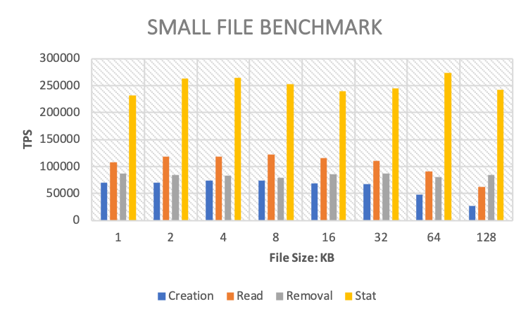

性能评估
----------------

环境准备
^^^^^^^^^^^

**集群信息**

.. csv-table::
   :file: csv/performance-environment.csv

**卷设置**

.. csv-table::
   :file: csv/performance-volume.csv

设置方法:

.. code-block:: bash

    $ cfs-cli volume create test-vol {owner} --capacity=300000000 --mp-count=10
    Create a new volume:
      Name                : test-vol
      Owner               : ltptest
      Dara partition size : 120 GB
      Meta partition count: 10
      Capacity            : 300000000 GB
      Replicas            : 3
      Allow follower read : Enabled

    Confirm (yes/no)[yes]: yes
    Create volume success.

    $ cfs-cli volume add-dp test-vol 1490

**client配置**

.. csv-table::
   :file: csv/performance-client.csv

.. code-block:: bash

   #查看当前iops：
   $ http://[ClientIP]:[ProfPort]/rate/get
   #设置iops，默认值-1代表不限制iops
   $ http://[ClientIP]:[ProfPort]/rate/set?write=800&read=800

小文件性能评估
^^^^^^^^^^^^^^^^^^^^^^^^^^^^^^^^^^^^^^^

通过 mdtest_ 进行小文件性能测试的结果如下：

.. _mdtest: https://github.com/LLNL/mdtest

**配置**

.. code-block:: bash

    #!/bin/bash
    set -e
    TARGET_PATH="/mnt/test/mdtest" # mount point of CubeFS volume
    for FILE_SIZE in 1024 2048 4096 8192 16384 32768 65536 131072 # file size
    do
    mpirun --allow-run-as-root -np 512 --hostfile hfile64 mdtest -n 1000 -w $i -e $FILE_SIZE -y -u -i 3 -N 1 -F -R -d $TARGET_PATH;
    done

**测试结果**

.. csv-table::
   :file: csv/cfs-small-file-benchmark.csv

IO性能评估
^^^^^^^^^^^^^^^^^^^^^^^^^^^^^^

通过 fio_ 进行IO性能测试的结果如下： *（注：其中多个客户端挂载同一个卷，进程指 fio 进程）*

.. _fio: https://github.com/axboe/fio

1. 顺序读
===================

**工具设置**

.. code-block:: bash

    #!/bin/bash
    fio -directory={} \
        -ioengine=psync \
        -rw=read \  # sequential read
        -bs=128k \  # block size
        -direct=1 \ # enable direct IO
        -group_reporting=1 \
        -fallocate=none \
        -time_based=1 \
        -runtime=120 \
        -name=test_file_c{} \
        -numjobs={} \
        -nrfiles=1 \
        -size=10G

**带宽(MB/s)**

.. image:: pic/cfs-fio-sequential-read-bandwidth.png
   :align: left
   :scale: 50 %
   :alt: Sequential Read Bandwidth (MB/s)

.. csv-table::
   :file: csv/cfs-fio-sequential-read-bandwidth.csv

**IOPS**

.. image:: pic/cfs-fio-sequential-read-iops.png
   :align: left
   :scale: 50 %
   :alt: Sequential Read IOPS

.. csv-table::
   :file: csv/cfs-fio-sequential-read-iops.csv

**延迟(微秒)**

.. image:: pic/cfs-fio-sequential-read-latency.png
   :align: left
   :scale: 50 %
   :alt: Sequential Read Latency (Microsecond)

.. csv-table::
   :file: csv/cfs-fio-sequential-read-latency.csv

2. 顺序写
===================

**工具设置**

.. code-block:: bash

    #!/bin/bash
    fio -directory={} \
        -ioengine=psync \
        -rw=write \ # sequential write
        -bs=128k \  # block size
        -direct=1 \ # enable direct IO
        -group_reporting=1 \
        -fallocate=none \
        -name=test_file_c{} \
        -numjobs={} \
        -nrfiles=1 \
        -size=10G

**带宽(MB/s)**

.. image:: pic/cfs-fio-sequential-write-bandwidth.png
   :align: left
   :scale: 50 %
   :alt: Sequential Write Bandwidth (MB/s)

.. csv-table::
   :file: csv/cfs-fio-sequential-write-bandwidth.csv

**IOPS**

.. image:: pic/cfs-fio-sequential-write-iops.png
   :align: left
   :scale: 50 %
   :alt: Sequential Write IOPS

.. csv-table::
   :file: csv/cfs-fio-sequential-write-iops.csv

**延迟(微秒)**

.. image:: pic/cfs-fio-sequential-write-latency.png
   :align: left
   :scale: 50 %
   :alt: Sequential Write Latency (Microsecond)

.. csv-table::
   :file: csv/cfs-fio-sequential-write-latency.csv

3. 随机读
===================

**工具设置**

.. code-block:: bash

    #!/bin/bash
    fio -directory={} \
        -ioengine=psync \
        -rw=randread \ # random read
        -bs=4k \       # block size
        -direct=1 \    # enable direct IO
        -group_reporting=1 \
        -fallocate=none \
        -time_based=1 \
        -runtime=120 \
        -name=test_file_c{} \
        -numjobs={} \
        -nrfiles=1 \
        -size=10G

**带宽(MB/s)**

.. image:: pic/cfs-fio-random-read-bandwidth.png
   :align: left
   :scale: 50 %
   :alt:  Random Read Bandwidth (MB/s)

.. csv-table::
   :file: csv/cfs-fio-random-read-bandwidth.csv

**IOPS**

.. image:: pic/cfs-fio-random-read-iops.png
   :align: left
   :scale: 50 %
   :alt:  Random Read IOPS

.. csv-table::
   :file: csv/cfs-fio-random-read-iops.csv

**延迟(微秒)**

.. image:: pic/cfs-fio-random-read-latency.png
   :align: left
   :scale: 50 %
   :alt:  Random Read Latency (Microsecond)

.. csv-table::
   :file: csv/cfs-fio-random-read-latency.csv

4. 随机写
===================

**工具设置**

.. code-block:: bash

    #!/bin/bash
    fio -directory={} \
        -ioengine=psync \
        -rw=randwrite \ # random write
        -bs=4k \        # block size
        -direct=1 \     # enable direct IO
        -group_reporting=1 \
        -fallocate=none \
        -time_based=1 \
        -runtime=120 \
        -name=test_file_c{} \
        -numjobs={} \
        -nrfiles=1 \
        -size=10G

**带宽(MB/s)**

.. image:: pic/cfs-fio-random-write-bandwidth.png
   :align: left
   :scale: 50 %
   :alt:  Random Write Bandwidth (MB/s)

.. csv-table::
   :file: csv/cfs-fio-random-write-bandwidth.csv

**IOPS**

.. image:: pic/cfs-fio-random-write-iops.png
   :align: left
   :scale: 50 %
   :alt:  Random Write IOPS

.. csv-table::
   :file: csv/cfs-fio-random-write-iops.csv

**延迟(微秒)**

.. image:: pic/cfs-fio-random-write-latency.png
   :align: left
   :scale: 50 %
   :alt:  Random Write Latency

.. csv-table::
   :file: csv/cfs-fio-random-write-latency.csv

元数据性能评估
^^^^^^^^^^^^^^^^^^^^^^^^^^^^^^^^^^^^

通过 mdtest_ 进行元数据性能测试的结果如下：

.. _mdtest: https://github.com/LLNL/mdtest

**工具设置**

.. code-block:: bash

    #!/bin/bash
    TEST_PATH=/mnt/cfs/mdtest # mount point of CubeFS volume
    for CLIENTS in 1 2 4 8 # number of clients
    do
    mpirun --allow-run-as-root -np $CLIENTS --hostfile hfile01 mdtest -n 5000 -u -z 2 -i 3 -d $TEST_PATH;
    done

**目录创建**

.. image:: pic/cfs-mdtest-dir-creation.png
   :align: left
   :scale: 50 %
   :alt: Dir Creation

.. csv-table:: 目录创建评估结果
   :file: csv/cfs-mdtest-dir-creation.csv

**目录删除**

.. image:: pic/cfs-mdtest-dir-removal.png
   :align: left
   :scale: 50 %
   :alt: Dir Removal

.. csv-table:: 目录删除评估结果
   :file: csv/cfs-mdtest-dir-removal.csv

**目录状态查看**

.. image:: pic/cfs-mdtest-dir-stat.png
   :align: left
   :scale: 50 %
   :alt: Dir Stat

.. csv-table:: 目录状态查看评估结果
   :file: csv/cfs-mdtest-dir-stat.csv

**文件创建**

.. image:: pic/cfs-mdtest-file-creation.png
   :align: left
   :scale: 50 %
   :alt: File Creation

.. csv-table::
   :file: csv/cfs-mdtest-file-creation.csv

**文件删除**

.. image:: pic/cfs-mdtest-file-removal.png
   :align: left
   :scale: 50 %
   :alt: File Removal

.. csv-table::
   :file: csv/cfs-mdtest-file-removal.csv

**Tree创建**

.. image:: pic/cfs-mdtest-tree-creation.png
   :align: left
   :scale: 50 %
   :alt: Tree Creation

.. csv-table::
   :file: csv/cfs-mdtest-tree-creation.csv

**Tree删除**

.. image:: pic/cfs-mdtest-tree-removal.png
   :align: left
   :scale: 50 %
   :alt: Tree Removal

.. csv-table::
   :file: csv/cfs-mdtest-tree-removal.csv

功能完整性评估
-----------------

- Linux Test Project / fs

多种负载评估
--------------

- Database backup

- Java application logs

- Code git repo

- Database systems
  
  MyRocks,
  MySQL Innodb,
  HBase,

可扩展性评估
----------------

- 卷扩展性: 单集群可以支持百万级别的cfs卷

- 元数据扩展性: 单卷可以支持十亿级别文件或者目录

