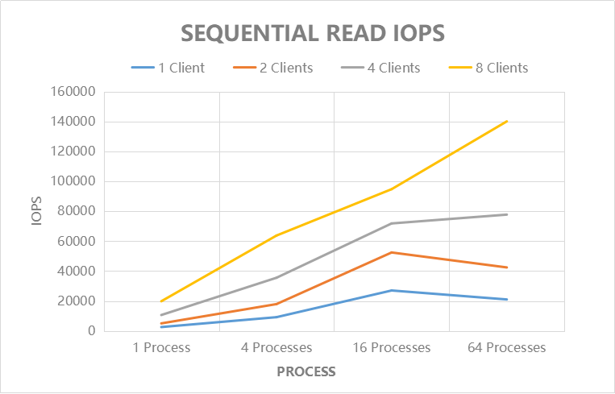
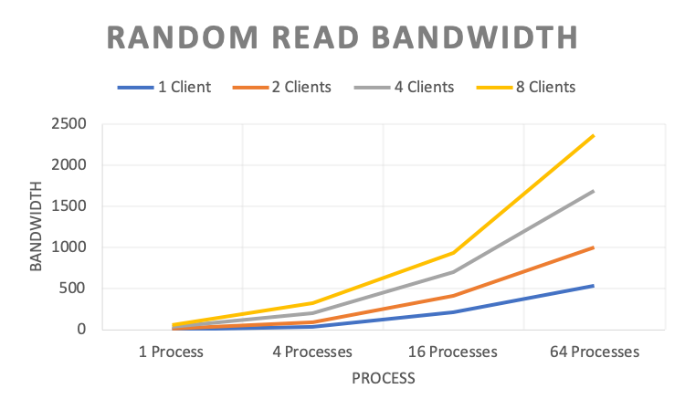
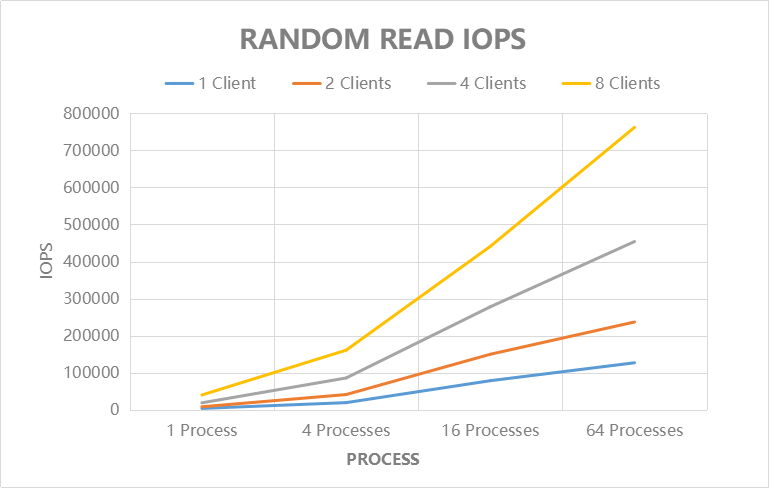
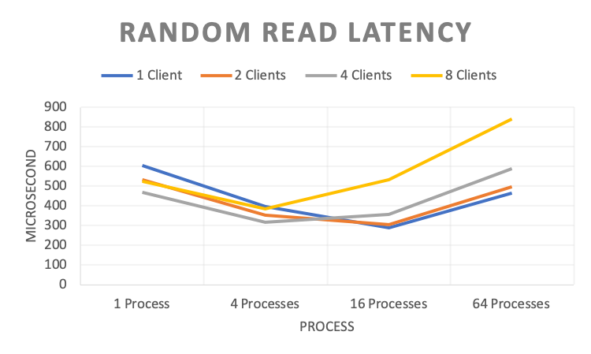

IO性能评估
----------------

通过 fio_ 进行IO性能测试的结果如下： *（注：其中多个客户端挂载同一个卷，进程指 fio 进程）*

.. _fio: https://github.com/axboe/fio

1. 顺序读
===================

**工具设置**

.. code-block:: bash

    #!/bin/bash
    fio -directory={} \
        -ioengine=psync \
        -rw=read \  # sequential read
        -bs=128k \  # block size
        -direct=1 \ # enable direct IO
        -group_reporting=1 \
        -fallocate=none \
        -time_based=1 \
        -runtime=120 \
        -name=test_file_c{} \
        -numjobs={} \
        -nrfiles=1 \
        -size=10G

**带宽(MB/s)**

.. csv-table::
   :file: ../csv/cfs-fio-sequential-read-bandwidth.csv

**IOPS**

.. csv-table::
   :file: ../csv/cfs-fio-sequential-read-iops.csv

**延迟(微秒)**

.. image:: ../pic/cfs-fio-sequential-read-latency.png
   :scale: 75 %
   :alt: Sequential Read Latency (Microsecond)

.. csv-table::
   :file: ../csv/cfs-fio-sequential-read-latency.csv

2. 顺序写
===================

**工具设置**

.. code-block:: bash

    #!/bin/bash
    fio -directory={} \
        -ioengine=psync \
        -rw=write \ # sequential write
        -bs=128k \  # block size
        -direct=1 \ # enable direct IO
        -group_reporting=1 \
        -fallocate=none \
        -name=test_file_c{} \
        -numjobs={} \
        -nrfiles=1 \
        -size=10G

**带宽(MB/s)**

.. image:: ../pic/cfs-fio-sequential-write-bandwidth.png
   :scale: 75 %
   :alt: Sequential Write Bandwidth (MB/s)

.. csv-table::
   :file: ../csv/cfs-fio-sequential-write-bandwidth.csv

**IOPS**

.. image:: ../pic/cfs-fio-sequential-write-iops.png
   :scale: 75 %
   :alt: Sequential Write IOPS

.. csv-table::
   :file: ../csv/cfs-fio-sequential-write-iops.csv

**延迟(微秒)**

.. image:: ../pic/cfs-fio-sequential-write-latency.png
   :scale: 75 %
   :alt: Sequential Write Latency (Microsecond)

.. csv-table::
   :file: ../csv/cfs-fio-sequential-write-latency.csv

3. 随机读
===================

**工具设置**

.. code-block:: bash

    #!/bin/bash
    fio -directory={} \
        -ioengine=psync \
        -rw=randread \ # random read
        -bs=4k \       # block size
        -direct=1 \    # enable direct IO
        -group_reporting=1 \
        -fallocate=none \
        -time_based=1 \
        -runtime=120 \
        -name=test_file_c{} \
        -numjobs={} \
        -nrfiles=1 \
        -size=10G

**带宽(MB/s)**

.. csv-table::
   :file: ../csv/cfs-fio-random-read-bandwidth.csv

**IOPS**

.. csv-table::
   :file: csv/cfs-fio-random-read-iops.csv

**延迟(微秒)**

.. csv-table::
   :file: ../csv/cfs-fio-random-read-latency.csv

4. 随机写
===================

**工具设置**

.. code-block:: bash

    #!/bin/bash
    fio -directory={} \
        -ioengine=psync \
        -rw=randwrite \ # random write
        -bs=4k \        # block size
        -direct=1 \     # enable direct IO
        -group_reporting=1 \
        -fallocate=none \
        -time_based=1 \
        -runtime=120 \
        -name=test_file_c{} \
        -numjobs={} \
        -nrfiles=1 \
        -size=10G

**带宽(MB/s)**

.. csv-table::
   :file: ../csv/cfs-fio-random-write-bandwidth.csv

**IOPS**

.. image:: ../pic/cfs-fio-random-write-iops.png
   :scale: 75 %
   :alt:  Random Write IOPS

.. csv-table::
   :file: ../csv/cfs-fio-random-write-iops.csv

**延迟(微秒)**

.. image:: ../pic/cfs-fio-random-write-latency.png
   :scale: 75 %
   :alt:  Random Write Latency

.. csv-table::
   :file: ../csv/cfs-fio-random-write-latency.csv