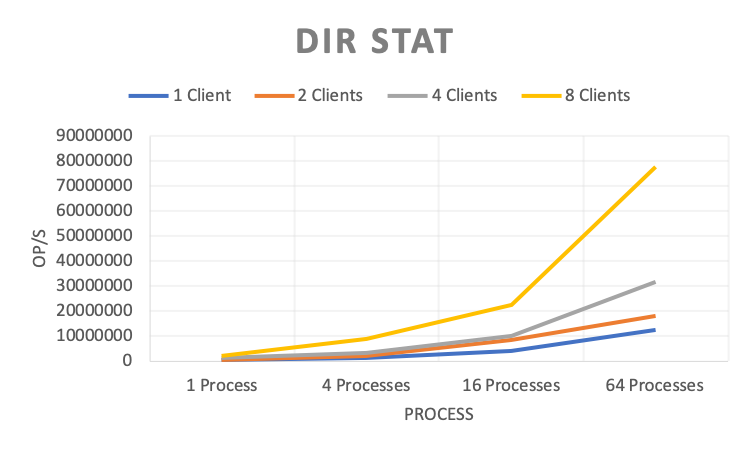

元数据性能评估
----------------

通过 mdtest_ 进行元数据性能测试的结果如下：

.. _mdtest: https://github.com/LLNL/mdtest

**工具设置**

.. code-block:: bash

    #!/bin/bash
    TEST_PATH=/mnt/cfs/mdtest # mount point of CubeFS volume
    for CLIENTS in 1 2 4 8 # number of clients
    do
    mpirun --allow-run-as-root -np $CLIENTS --hostfile hfile01 mdtest -n 5000 -u -z 2 -i 3 -d $TEST_PATH;
    done

目录创建
===================

.. image:: ../pic/cfs-mdtest-dir-creation.png
   :scale: 75 %
   :alt: Dir Creation

.. csv-table:: 
   :file: ../csv/cfs-mdtest-dir-creation.csv

目录删除
===================

.. image:: ../pic/cfs-mdtest-dir-removal.png
   :scale: 75 %
   :alt: Dir Removal

.. csv-table:: 
   :file: ../csv/cfs-mdtest-dir-removal.csv

目录状态查看
===================

.. csv-table:: 
   :file: ../csv/cfs-mdtest-dir-stat.csv

文件创建
===================

.. image:: ../pic/cfs-mdtest-file-creation.png
   :scale: 75 %
   :alt: File Creation

.. csv-table::
   :file: ../csv/cfs-mdtest-file-creation.csv

文件删除
===================

.. image:: ../pic/cfs-mdtest-file-removal.png
   :scale: 75 %
   :alt: File Removal

.. csv-table::
   :file: ../csv/cfs-mdtest-file-removal.csv

Tree创建
===================

.. image:: ../pic/cfs-mdtest-tree-creation.png
   :scale: 75 %
   :alt: Tree Creation

.. csv-table::
   :file: ../csv/cfs-mdtest-tree-creation.csv

Tree删除
===================

.. image:: ../pic/cfs-mdtest-tree-removal.png
   :scale: 75 %
   :alt: Tree Removal

.. csv-table::
   :file: ../csv/cfs-mdtest-tree-removal.csv

