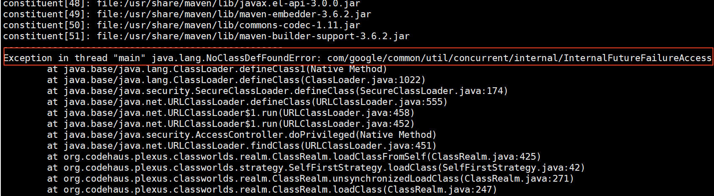
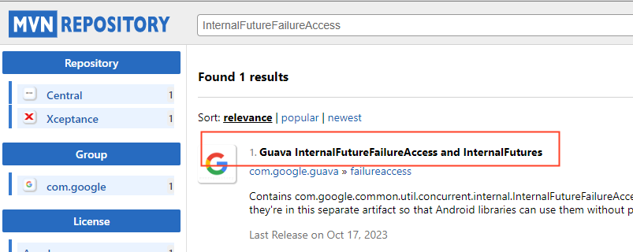
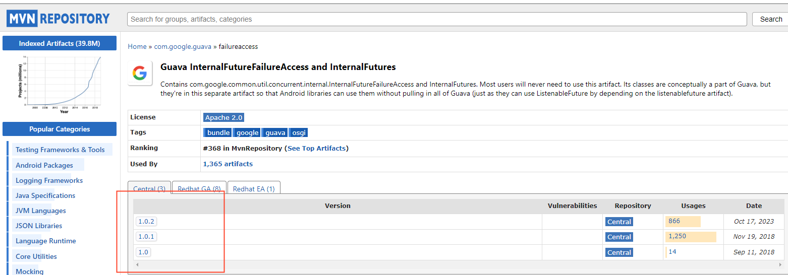

# 编译问题

## 本机编译，其他机器无法启动

- 首先请确认使用 PORTABLE=1 make static_lib 命令编译 rocksdb
- 然后使用 ldd 命令查看依赖的库，在机器上是否安装，安装缺少的库后，执行 ldconfig 命令

## ZSTD_versionNumber 未定义

可以使用下面两种方式解决
- CGO_LDFLAGS 添加指定库即可编译，例如：`CGO_LDFLAGS="-L/usr/local/lib -lrocksdb -lzstd"` 这种方式，要求其他部署机器上也要安装 zstd 库
- 删除自动探测是否安装 zstd 库的脚本，文件位置示例: `rockdb-5.9.2/build_tools/build_detect_platform`
   删除如下内容
   ```bash
   # Test whether zstd library is installed
       $CXX $CFLAGS $COMMON_FLAGS -x c++ - -o /dev/null 2>/dev/null  <<EOF
         #include <zstd.h>
         int main() {}
   EOF
       if [ "$?" = 0 ]; then
           COMMON_FLAGS="$COMMON_FLAGS -DZSTD"
           PLATFORM_LDFLAGS="$PLATFORM_LDFLAGS -lzstd"
           JAVA_LDFLAGS="$JAVA_LDFLAGS -lzstd"
       fi
   ```


## rocksdb 编译问题

编译纠删码子系统显示报错 `fatal error: rocksdb/c.h: no such file or directory...`
- 首先确认 `.deps/include/rocksdb` 目录下是否存在报错所指向的文件，
- 如果存在 可 `source env.sh` 后再次尝试，如果没有该文件或者仍然报错，可将 `.deps` 目录下 rocksdb 相关的文件全部清理，然后重新编译。

## cannot find -lbz2

编译时候如果报错 `/usr/bin/ld: cannot find -lbz2`，确认是否安装`bzip2-devel`（版本1.0.6及以上）

## cannot find -lz

编译时候如果报错 `/usr/bin/ld: cannot find -lz`，确认是否安装 `zlib-devel`（版本1.2.7及以上）

## `cc1plus: all warnings being treated as errors` 构建 `rocksdb` 时报错

- 对于 `blobstore` 模块来说，进入目录 `blobstore` 后，在 `blobstore/env.sh` 文件中添加以下新的环境变量后执行 `source env.sh` 后继续编译:

```bash
export DISABLE_WARNING_AS_ERROR=true
```

- 对于 `cubefs` 根目录而言，请在根目录下的 `env.sh` 中添加导出环境变量：

> **注意**： 选项开关可能因 gcc 版本不同存在差异，以下选项在 `gcc (Ubuntu 11.3.0-1ubuntu1~22.04) 11.3.0` 版本上测试通过

```bash
export CXXFLAGS=-Wno-error=xxx # 此选项可选，开发者可根据实际情况调整选项值，或者干脆注释掉或删除此行
```
## arm版本编译
编译arm版本前，首先修改环境变量
```bash
export CPUTYPE=arm64_gcc4
```
确认环境变量正确后，后编译对应模块或者全编译。

以编译libsdk为例，在cubefs目录下执行`make libsdk`命令。遇到报错缺少一些库就安装，比如yum install cmake，yum install g++，yum install go，yum install maven。

根据编译环境实际情况将缺少的依赖安装完，再次编译，应该就可以编译成功了。

### 可能遇到的错误
如果遇到java找不到类定义的报错，比如下面的错误

这种情况是maven安装目录下lib子目录(/usr/share/maven/lib/)缺少jar包。maven安装目录下lib子目录中的jar包大部分是java安装目录下的jar包的软连接。
此时，可以通过两种方法解决：
#### 方法一
到java安装目录下，根据报错的名字找类似的jar包，然后软连接到maven的lib目录下。
比如，这里的报错是FailureAccess，在/usr/share/java/guava/目录下有failureaccess.jar，将
/usr/share/java/guava/failureaccess.jar软连接到 /usr/share/maven/lib/下


#### 方法二
在mvn仓库https://mvnrepository.com/ 搜索关键错误

参考：https://www.cnblogs.com/shanfeng1000/p/14346112.html

可以找到包含这个报错类的jar包。下载jar包，放到maven库目录/usr/share/maven/lib/下就可以了。
