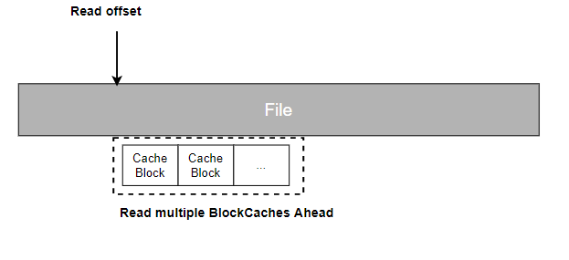

# 预读（支持副本模式，不支持EC）

修改内核预读参数(适用于内核未做优化情况)
``` bash
vi /etc/udev/rules.d/99-bdi.rules
ACTION=="add", SUBSYSTEM=="bdi", RUN+="/usr/local/bin/bdi_add_script %k"

sudo udevadm control --reload-rules

vi /usr/local/bin/bdi_add_script
#!/bin/bash
device=$1
echo "`date '+%F %T'` FUSE device added: $device" >> /tmp/fuse.log
if [[ "$device" =~ "0:" ]];then
    echo 2048 > /sys/devices/virtual/bdi/$device/read_ahead_kb
fi

chmod +x /usr/local/bin/bdi_add_script
```
配置文件参数含义如下表示：

 参数           | 类型    | 含义                                  | 必需 |
|--------------|-------|-------------------------------------|----|
| aheadReadEnable        | bool  | 是否开启预读                              | 是  |
| aheadReadTotalMemGB      | int64 | 预读占用内存(默认10:GB)，若不够10G则占用当前可用内存的50% | 否  |
| aheadReadBlockTimeOut      | int64 | 缓存块未命中的回收时间(默认3s)                   | 否  |
|    aheadReadWindowCnt                        | int64 | 缓存滑动窗口的大小(默认：8)                     | 否  |


::: tip 提示：
1、开启预读会占用一定的客户端内存，对于客户端内存限制高的场景，可以调节aheadReadTotalMemGB的大小，但是性能会有一定的衰减 
2、预读只对大于4M的文件有效，如果和bcache同时开启，会优先执行预读
:::