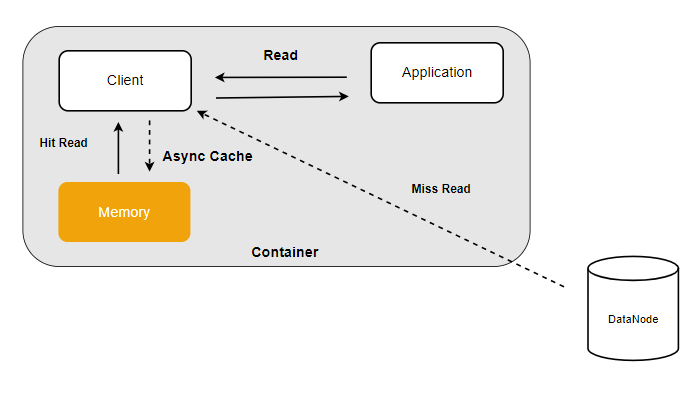

# 本地缓存
本地缓存用于加速本地客户端对常用文件的访问。例如，在AI训练过程中，反复读取的相同的小批量数据或模型配置文件，可通过本地缓存快速提供，避免每次从远程获取，提升任务执行效率。
## 本地缓存-磁盘版
利用计算节点的本地磁盘作为数据块缓存，可以显著提高数据读取的效率。

客户端的读请求会优先访问本地磁盘的数据缓存区，如果缓存命中，则直接从本地磁盘获得所需数据，否则从后端的多副本子系统或者纠删码子系统中读取数据，再异步将缓存数据写入本地磁盘，以提升后续请求的访问性能。


要开启本地磁盘缓存功能，需要先启动本地 cache 服务：

``` bash
./cfs-bcache -c bcache.json
```

配置文件中各参数的含义如下表所示：

| 参数           | 类型           | 含义                                   | 必需  |
|--------------|--------------|--------------------------------------|-----|
| cacheDir         | string       | 缓存数据的本地存储路径:分配空间（单位Byte)| 是   |
| logDir       | string       | 日志路径| 是   |
| logLevel      | string slice | 日志级别| 是   |

然后只需在客户端的配置项中增加 bcacheDir 即可：
``` bash
{
  ...
  "bcacheDir": "path/to/data"  //需要缓存到本地的数据目录
}
```

### 缓存一致性

CubeFS 通过以下几种策略来保证本地缓存的最终一致性：

+ 根据文件名后缀来禁用缓存：例如训练任务生成的 checkpoint 文件在任务执行过程中会被反复更新，因此不适合进行本地缓存。可以在客户端的配置文件中的 `bcacheFilterFiles` 项增加 `"pt"` 对这类文件禁用缓存。
``` bash
{
  ...
  "bcacheFilterFiles": "pt"  //禁止对.pt后缀的文件进行缓存
}
```
+ 定期检查：客户端会定期向后端查询缓存数据的对应的元数据是否有变更，如果有变更则删除本地缓存数据。
+ 主动失效：单个挂载点的场景，用户更新数据后会删除本地缓存数据；而多个挂载点场景中，其他挂载点只能等待缓存数据生命周期到期后失效。

## 本地缓存-内存版
如果数据量少，且希望进一步提高缓存性能，可使用计算节点的内存资源作为本地缓存。



`/dev/shm` 是 Linux 的内存文件系统，支持动态调整其容量大小。这里将 `/dev/shm` 调整至 15G，表示最多可以使用 15G 内存来缓存数据。
``` bash
$ sudo mount -o size=15360M -o remount /dev/shm
```
然后将 `bcache` 服务的配置文件改为 `/dev/shm` 的子目录即可，例如：
``` bash
{
  ...
  "cacheDir":"/dev/shm/cubefs-cache:16106127360" //使用15G内存作为数据缓存
}
```

