# 分布式缓存

在如今AI大模型训练场景下，模型的数据集以及参数规模呈现爆发性增长。仅靠单个GPU计算节点的磁盘已经无法缓存TB或者PB级模型训练所需的数据。因此需要一种容量更大，吞吐能力更强，能被多个GPU计算节点共享的缓存策略来提升训练数据的访问效率。

## 1 系统拓扑

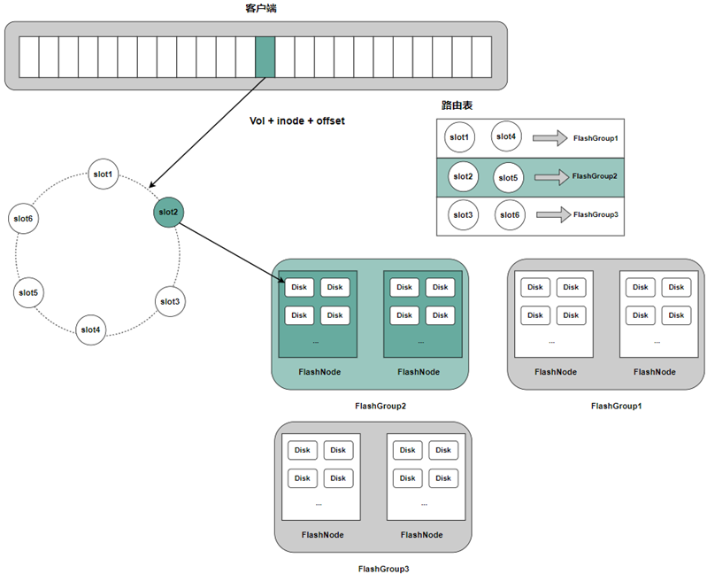

**Master**

Master 负责对整个集群中所有分布式缓存的拓扑信息进行持久化存储与统一管理。它接收 FlashNode 的注册信息和心跳消息，以此判断各个 FlashNode 节点的存活状态。master接受cli命令对FlashGroup的slot分配，客户端在读取数据时，会向 Master 请求获取最新的分布式缓存拓扑结构，用于实现数据读取的正确路由。

**Client**

为支持文件缓存读取，客户端将结合卷级别的缓存开关和集群缓存功能状态，决定是否从分布式缓存中获取数据。

**FlashNode**

下面为 FlashNode 进程启动所需的配置文件示例：

```text
{
    "role": "flashnode",
    "listen": "18510",
    "prof": "18511",
    "logDir": "./logs",
    "masterAddr": [
        "xxx",
        "xxx",
        "xxx"
    ],
    "memTotal": 0,
    "cachePercent": 0.8,
    "readRps": 100000,
    "disableTmpfs": true,
    "diskDataPath": [
      "/path/data1:0",
      "/path/data2:0"
      ],
    "zoneName":"default"
}
```

## 2 数据读取流程

CubeFS的分布式缓存由多个FlashGroup组成，每个FlashGroup负责管理一致性哈希环上的一组slot值。

客户端根据待缓存数据块所属的卷、inode、以及数据块的偏移信息，计算出一个唯一的对应到一致性哈希环上的一个值。分布式缓存的路由算法会在这个哈希环上找到第一个大于等于这个值的slot值，那么这个slot值所属的FlashGroup负责该数据块持久化并提供缓存读取服务。

FlashGroup由缓存节点FlashNode组成，可以分布在不同的zone中。客户端读取缓存数据时，则会通过对FlashNode进行延时分析，选择访问延时最低的FlashNode进行读取。

## 3 分布式缓存实践
### 3.1 分布式缓存配置
#### 3.1.1 创建并启用 flashGroup
通过 cli 工具的 flashGroup create 命令创建缓存组 flashGroup，并分配到唯一识别该 flashGroup 的 ID。
```
// fg 的 slot 数量默认为 32
./cfs-cli flashgroup create
```

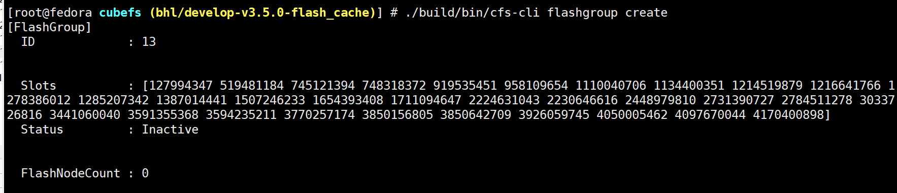

通过 cli 工具的 flashGroup set 命令启用 flashGroup，参数为上一步被分配的 ID。
```
// 创建后的 flashgroup 状态默认是 inactive 状态，需要设置成 active 状态
./cfs-cli flashgroup set 13 true
```

#### 3.1.2 flashGroup 添加 flashNode
通过 cli 工具的 flashGroup nodeAdd 命令往刚创建的 flashGroup 中添加缓存节点 flashNode。
```
// flashGroup 添加 flashNode，指定 flashGroup 的 ID 以及要添加的 flashNode
./cfs-cli flashgroup nodeAdd 13 --zone-name=default --addr="*.*.*.*:18510"
```
通过 cli 工具的 flashNode list 命令，查看刚添加的 flashNode 是否正确。默认新添加的 flashNode 的 active 和 enable 状态都为 true。
```
./cfs-cli flashnode list
```

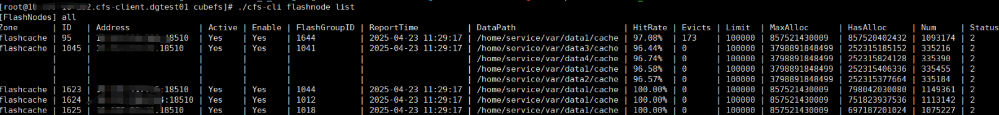

#### 3.1.3 开启卷的分布式缓存能力
通过 cli 工具的 vol update 命令开启目标卷的分布式缓存能力，默认新建卷以及集群升级前已存在的卷都没有开启分布式缓存能力。
```
// 打开目标卷 test（已创建）的 remoteCacheEnable 开关。
./cfs-cli vol update test --remoteCacheEnable true
```
通过 cli 工具的 vol info 命令查看目标卷是否打开分布式缓存能力。
```
./cfs-cli vol info test
```
remoteCacheEnable 为 false 表示未开启分布式缓存能力，true 则表示已开启。

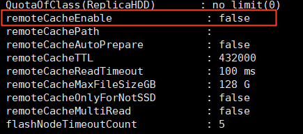

通过以下步骤确认分布式缓存是否已经生效：

1. client 挂载已经开启分布式缓存能力的卷。
2. 对卷根目录下的文件进行读请求测试。默认情况下，分布式缓存会缓存根目录下所有大小小于 128GB 的文件。
3. 通过 client 端的 mem_stat.log 查看是否有 flashNode 的条目，该条目记录了客户端从 flashNode 读取的次数与平均延时。所以如果有对应条目，说明 client 端尝试 flashNode 读取对应的缓存数据。

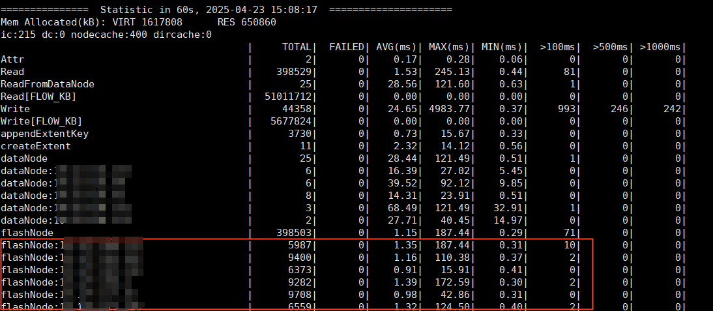

### 3.2 关键参数配置
#### 3.2.1 卷相关参数配置
通过 cli 的 vol update --help 命令可以查看到，目前卷支持以下分布式缓存相关的参数配置
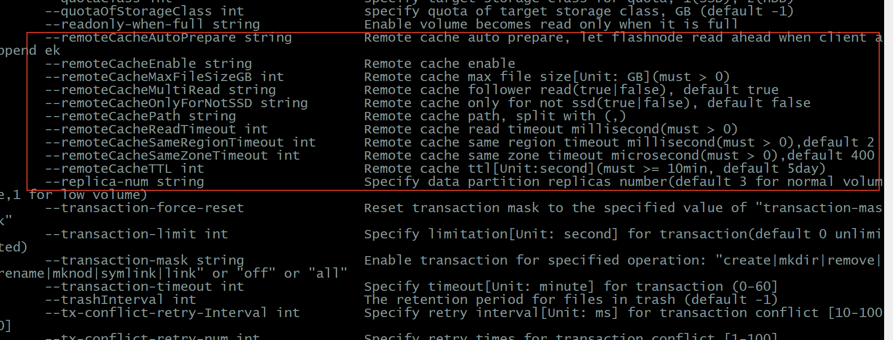

· remoteCachePath: 设置缓存目录的路径（相对根目录），默认不指定，表示全部缓存。只有读取该目录下以及其子文件夹下的文件时，才会触发分布式缓存的缓存流程。

· remoteCacheAutoPrepare: 打开该功能时若 client 写入新数据（追加写），则新写数据会自动被 flashNode 缓存。默认关闭。

· remoteCacheTTL: flashNode 缓存数据的过期时间。单位 s，默认 432000(5 天)。

· remoteCacheReadTimeout: client 从 flashNode 获取缓存数据的最大超时时间。单位 ms，默认 100ms。

· remoteCacheMaxFileSizeGB: 若文件大小超过该值，数据内容不会被缓存。默认 128G。

· remoteCacheOnlyForNotSSD: 如果为 true，仅当文件的 storageClass 不为 SSD 时触发分布式缓存流程；如果为 false，则所有存储类型的文件均会触发缓存流程。默认 false。

· remoteCacheMultiRead:通常 client 会从 flashGroup 中网络延时最小的 flashNode 获取缓存数据。当功能开启并且最小延时 flashNode 读取失败时，客户端会尝试从 flashGroup 中其他 flashNode 读取缓存数据；若关闭，客户端则被击穿，直接尝试从 datanode 读取对应数据。默认 false。

· flashNodeTimeoutCount: flashNode 被降级的最大超时次数，默认 5。每分钟内，如果客户端读取 flashNode 时收到的超时错误达到最大值，则该 flashNode 会从分布式缓存路由中移除，所有路由到该 flashNode 的读取请求将被直接击穿，从 datanode 读。

· remoteCacheSameZoneTimeout 和 remoteCacheSameRegionTimeout: client 将 flashNode 划分为 sameZone 和 sameRegin 的最大 ping 时延，默认分别为 400 微秒和 2 毫秒。客户端对定期对所有 flashNode 进行网络探测，并根据网络时延将 flashNode 划分为不同的优先级，即 sameZone>sameRegin>unknow。当客户端需要从 flashNode 读取数据时，选择优先级高的 flashNode 进行访问。

#### 3.2.2 集群相关参数配置
· flashNodeHandleReadTimeout

表示 flashNode 处理读请求的超时时间, 默认 1s

· flashNodeReadDataNodeTimeout

flashNode 数据回源，读 dataNode 的超时时间， 默认 3s
```
# 查询配置
./cfs-cli cluster info
```
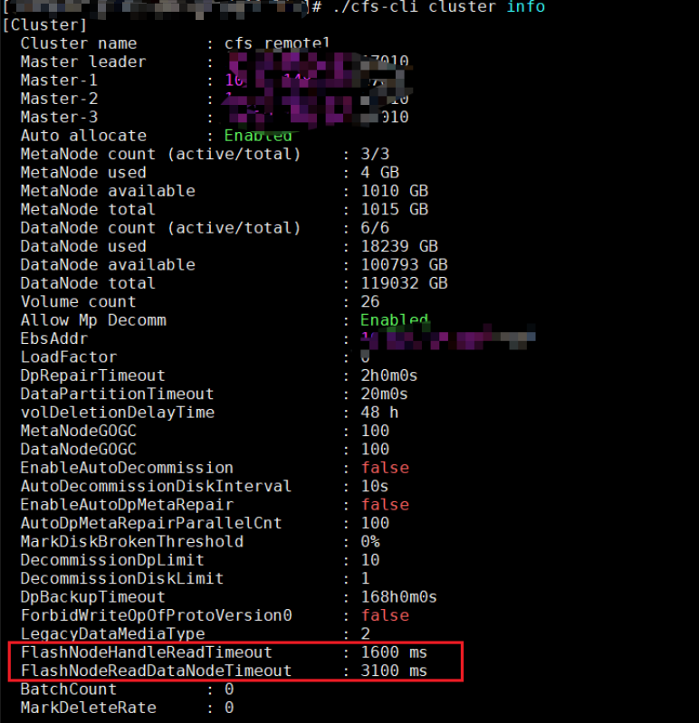

```
# 设置配置
./cfs-cli cluster set --flashNodeHandleReadTimeout=1600
```

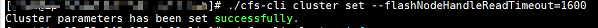

# 4 常见问题
1.部署了缓存节点，读取数据没有命中缓存，依然读取的是 datanode 节点。

· 缓存失效需要检查 cluster 中 flashGroup 是否开启，检查 vol 的 RemoteCacheEnable 是否开启。

· 开启客户端 debug 日志并过滤出以下内容，查看未命中的文件具体没有满足哪个条件。

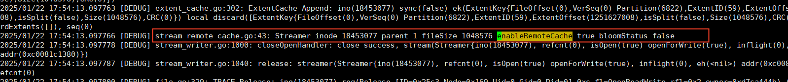

2.客户端的 mem_stat 日志中，flashNode 相关错误代码汇总。

在客户端的性能统计日志 mem_stat 中，为了方便定位客户端的读取请求被击穿（读取 datanode）的原因，在被击穿的 flashNode 中附加了击穿信息，比如下图中，因为限流导致请求被击穿。

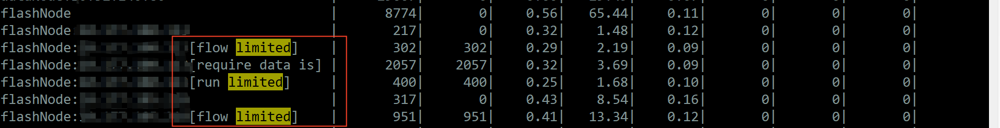

· flow limited,run limited：流量或者读取请求量限流。可以通过如下命令查看 flashNode 的配置或者调整。

```
# curl -v http://localhost:18511/getDiskQos | jq .
 { "code": 0,
  "msg": "OK",
  "data": {
    "WriteStatus": { // flashNode 持久化缓存数据限制
      "Status": {
        "FlowLimit": 268435456, // 当前流量限制
        "IOConcurrency": 128,   // 消费请求队列的协程数
        "IOQueue": 1024,        // 请求队列的长度
        "IORunning": 0,         // 当前有多少个请求在运行
        "IOWaiting": 0,        // 当前有多少个请求在等待
        "Factor": 8            // IOConcurrency * Factor = IOConcurrency
      },
      "DiskNum": 2,        // 缓存数据使用的磁盘数
      "ReadTimeout": 1600  // 请求被限制时，最大等待时间，单位 ms
    },
    "ReadStatus": {       // 读取请求限制，内容同上
      ...
    }
  }
}

配置缓存持久化限流,flow: 限制的流量，iocc: 消费请求队列的协程数，factor: 放大因子
# curl -v http://localhost:18511/setWriteDiskQos?flow=&iocc=&factor=| jq .

配置读缓存限流, flow: 限制的流量，iocc: 消费请求队列的协程数，factor: 放大因子
# curl -v http://localhost:18511/setReadDiskQos?flow=&iocc=&factor=| jq .
```

· require data is caching: 被请求数据正在被缓存。如果 flashNode 没有被请求的缓存数据，则 flashNode 采用的是异步缓存的策略从 datanode 拉取对应数据并持久化。这期间再次有读取请求路由到该 flashNode，由于缓存数据没有准备好，为了提高客户端的读取效率，该请求直接击穿。

· read timeout: 读取 flashNode 超时。因为网络波动或者 flashNode 压力比较大，客户端无法在配置的 remoteCacheReadTimeout 内收到 flashNode 的响应，则会触发这个错误。

· no available host: 没有可用的 flashNode。当客户端读取 flashNode 超时次数在一定周期内达到阈值后，会将该 flashNode 降级为无法访问。因此当读取请求再次路由到该 flashGroup 的时候，如果 group 里面没有可访问的 flashNode，就会报这个错误。可以通过调整卷的 flashNodeTimeoutCount 以及 remoteCacheReadTimeout 进行调整。

如果 mem_stat 中某个 flashNode 长期处于 timeout 状态，可以通过前面介绍的 cfs-cli flashNode list 命令查看 flashNode 处于存活状态。如果 flashNode 的 active 为 false，说明 flashNode 没有及时上报 master 心跳信息，可以登录机器确认原因。

如果是负载太高引起 flashNode 失联，可以通过前面介绍的限流配置命令降低访问压力，或者通过 cli 工具的 flashnode httpSlotStat 查看节点的缓存数据热度信息，如下图所示：

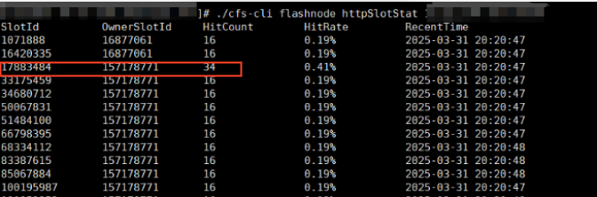

将热度即 HitCount 过高的 SlotId，所对应的 flashNode 管理的 OwnerSlotID，通过新建 flashGroup 以及 flashNode 的方式，将访问压力转移到新的缓存节点。比如图中 17883484 的热度过高，则可以新建一个能够管理介于 17883484 和 157178771 的 slot 值，将原来 17883484 的缓存数据路由到新的缓存节点。

如果是机器故障导致 flashNode 失联，可以通过 cli 工具的 flashGroup nodeRemove 移除掉故障节点，然后 nodeAdd 新缓存节点重新缓存数据。

3.flashNode 的 memstat 日志说明。

为了方便对 flashNode 的缓存性进行分析，在日志目录下的 mem_stat 日志中，增加了如下信息：
· HitCacheRead 缓存命中时的处理读请求的时间。

· HitCacheRead:ReadFromDisk 缓存命中时，缓存数据从磁盘读取的时间。

· MissCacheRead 缓存未命中时的处理读请求的时间。

· ReadFromDN 缓存未命中时，flashNode 从 datanode 回源读取的时间。回源读取的最大超时时间可以通过前面介绍的 flashNodeReadDataNodeTimeout 参数进行调整。

· MissCacheRead:WriteAt  缓存未命中时，缓存数据持久化的时间。

· CacheBlock:Init 缓存未命中时，缓存数据从回源到持久化的整体时间。
>>>>>>> d4aeae389 (fix(docs): supplement docs)
