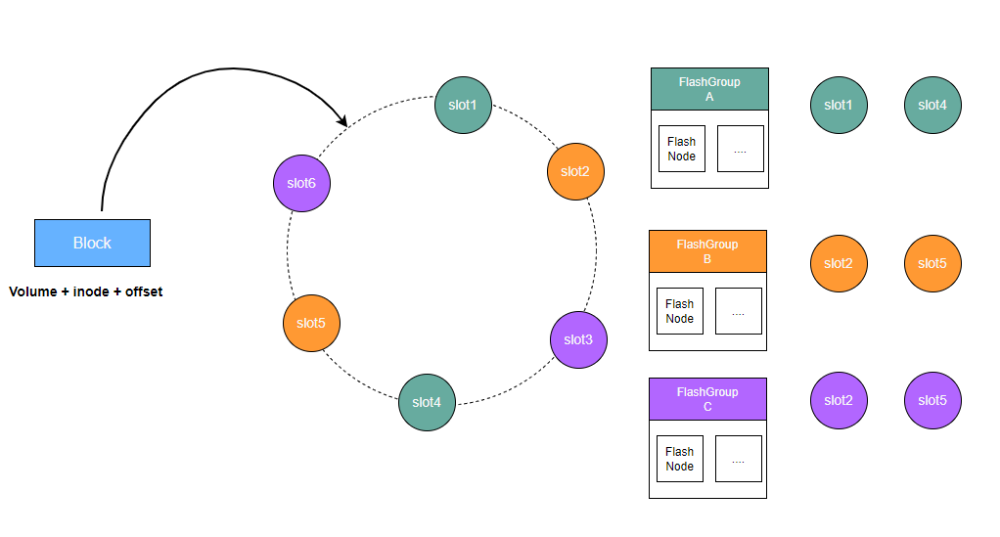

# 分布式缓存

在如今AI大模型训练场景下，模型的数据集以及参数规模呈现爆发性增长。仅靠单个GPU计算节点的磁盘已经无法缓存TB或者PB级模型训练所需的数据。因此需要一种容量更大，吞吐能力更强，能被多个GPU计算节点共享的缓存策略来提升训练数据的访问效率。

## 系统拓扑

## 数据读取流程

CubeFS的分布式缓存由多个FlashGroup组成，每个FlashGroup负责管理一致性哈希环上的一组slot值。

客户端根据待缓存数据块所属的卷、inode、以及数据块的偏移信息，计算出一个唯一的对应到一致性哈希环上的一个值。分布式缓存的路由算法会在这个哈希环上找到第一个大于等于这个值的slot值，那么这个slot值所属的FlashGroup负责该数据块持久化并提供缓存读取服务。

FlashGroup由缓存节点FlashNode组成，可以分布在不同的zone中。客户端读取缓存数据时，则会通过对FlashNode进行延时分析，选择访问延时最低的FlashNode进行读取。

