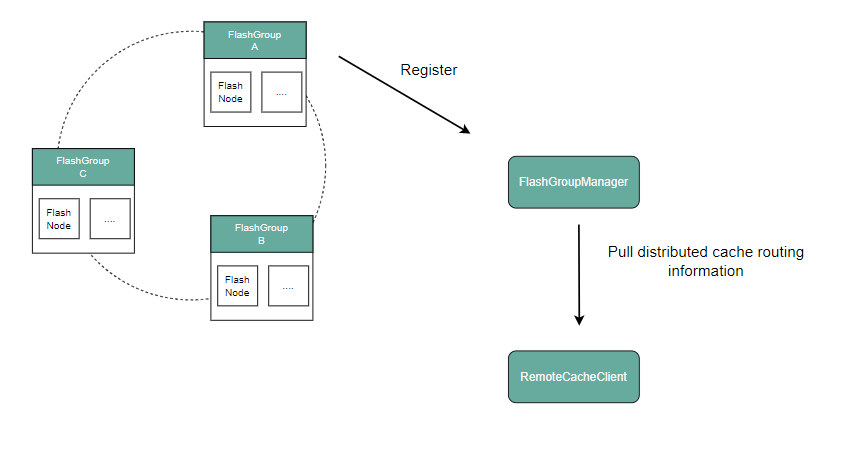

# 分布式缓存

在如今AI大模型训练场景下，模型的数据集以及参数规模呈现爆发性增长。仅靠单个GPU计算节点的磁盘已经无法缓存TB或者PB级模型训练所需的数据。因此需要一种容量更大，吞吐能力更强，能被多个GPU计算节点共享的缓存策略来提升训练数据的访问效率。

## 系统拓扑


## 数据读取流程

CubeFS的分布式缓存由多个FlashGroup组成，每个FlashGroup负责管理一致性哈希环上的一组slot值。

客户端根据待缓存数据块所属的卷、inode、以及数据块的偏移信息，计算出一个唯一的对应到一致性哈希环上的一个值。分布式缓存的路由算法会在这个哈希环上找到第一个大于等于这个值的slot值，那么这个slot值所属的FlashGroup负责该数据块持久化并提供缓存读取服务。

FlashGroup由缓存节点FlashNode组成，可以分布在不同的zone中。客户端读取缓存数据时，则会通过对FlashNode进行延时分析，选择访问延时最低的FlashNode进行读取。

**FlashNode**

下面为 FlashNode 进程启动所需的配置文件示例：

```text
{
    "role": "flashnode",
    "listen": "18510",
    "prof": "18511",
    "logDir": "./logs",
    "masterAddr": [
        "xxx",
        "xxx",
        "xxx"
    ],
    "memTotal": 0,
    "cachePercent": 0.8,
    "readRps": 100000,
    "disableTmpfs": true,
    "diskDataPath": [
      "/path/data1:0",
      "/path/data2:0"
      ],
    "zoneName":"default"
}
```

**Master**

Master 负责对整个集群中所有分布式缓存的拓扑信息进行持久化存储与统一管理。它接收 FlashNode 的注册信息和心跳消息，以此判断各个 FlashNode 节点的存活状态。master接受cli命令对FlashGroup的slot分配，客户端在读取数据时，会向 Master 请求获取最新的分布式缓存拓扑结构，用于实现数据读取的正确路由。

**Client**

为支持文件缓存读取，客户端将结合卷级别的缓存开关和集群缓存功能状态，决定是否从分布式缓存中获取数据。

## 服务化

::: warning 注意
分布式缓存服务化为 v3.5.3 版本新增 feature
:::

将原 Master 的分布式缓存管理能力解耦并独立为 FlashGroupManager。该组件面向对象存储引擎提供对象数据块的上传/下载服务；同时 Master 复用FlashGroupManager 能力，实现 CubeFS 分布式缓存资源的统一编排与治理。

FlashGroupManager: 负责管理分布式缓存资源，比如缓存节点FlashNode的注册，缓存节点副本组FlashGroup的创建，分布式缓存功能的配置等。

RemoteCacheClient: 以SDK的方式为文件存储以及对象存储引擎提供数据的存取服务。



**对象存储数据块的上传和下载**

可以参考代码库中tool/remotecache-benchmark中的代码，通过初始化RemoteCacheClient执行Put和Get操作实现对象数据块的上传和下载。

**热度统计**

RemoteCacheClient的Get方法会根据FlashNode对数据块的热度统计结果，告知用户是否需要通过Put上传数据。

Get方法尝试获取数据，如果数据已经已经缓存，则返回缓存数据。否则进行热度统计更新。


+ 若热度未过期：递增热度计数，并将过期时间刷新为当前时间+2 分钟。
+ 若热度已过期：将热度计数重置为 1，并将过期时间设为当前时间+2 分钟。
+ 若不存在热度信息：新建记录，热度计数=1，过期时间=当前时间+2 分钟。

如在滚动时间窗（默认 2 分钟）内，若热度计数达到可配置阈值，则返回 ErrorNotExistShouldCache（数据不存在但应缓存）。收到该错误后，可以调用 Put 方法上传数据块，以供后续访问命中。
