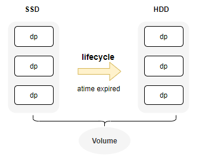

# 智能分层

::: warning Note
从3.5.0版本开始，CubeFS的卷支持多种存储介质，并且能够无缝将数据从SSD降冷到HDD
:::

CubeFS 通过生命周期功能，智能的将不经常访问的数据（基于Atime）从SSD迁移到HDD, 通过组合不同存储介质来降低存储成本

## 部署不同介质data zone
首先，确保集群分别部署了HDD和SSD类型的zone

```bash
{
    "zoneName": "az1-hdd",
    "mediaType": 2
}
```
`mediaType` 是指机器的介质类型(1 for SSD, 2 for HDD)，确保不同介质类型属于不同的zone

```bash
# 查看zones信息
./cfs-cli zone list
ZONE        STATUS    
default     available 
hdd1        available 
hdd3        available
# 查看zone详情
./cfs-cli zone info
Zone Name:        default
Status:           available
DataMediaType:    SSD
```

## 卷配置支持分层



+ 创建卷支持多种存储介质 (SSD and HDD).
  + 1 ssd, 2 hdd
```bash
./cfs-cli vol create test root --allowedStorageClass="1,2" --crossZone=true

./cfs-cli vol info test
...
    VolStorageClass                 : ReplicaSSD
    AllowedStorageClass             : [ReplicaSSD ReplicaHDD]
```
+ 或者更新已有卷支持不同的存储介质.
  + `zone-name`: `default` 默认的zone名, `hdd1` 代表hdd的一个zone.
```bash
# zone name 应当包含 hdd and ssd zones.
./cfs-cli vol update test2 --zone-name="default,hdd1" --cross-zone=true
# add HDD(2) storage class for vol
./cfs-cli vol addAllowedStorageClass test2 2
```
+ 然后可以看到卷支持不同的存储介质: SSD and HDD.
```bash
  VolStorageClass                 : ReplicaSSD
  AllowedStorageClass             : [ReplicaSSD ReplicaHDD]
  QuotaOfClass(ReplicaSSD)       : no limit(0)

Data partitions:
ID          REPLICAS    STATUS        ISRECOVER      MEDIA          LEADER                MEMBERS           
61          3           ReadWrite     false          SSD            192.168.0.32:17310    192.168.0.32:17310,192.168.0.31:17310,192.168.0.33:17310
62          3           ReadWrite     false          HDD            192.168.0.35:17310    192.168.0.36:17310,192.168.0.34:17310,192.168.0.35:17310
63          3           ReadWrite     false          HDD            192.168.0.34:17310    192.168.0.36:17310,192.168.0.34:17310,192.168.0.35:17310
```

## 配置迁移规则

CubeFS 使用`lifecycle`组件基于访问时间`atime`来实现智能的将数据从`SSD` 降冷到`HDD`. 使用这个功能，首先需要设置卷支持inode `atime` 持久化。 然后在`lifecycle`上配置规则实现每天的自动降冷任务。

### 配置Atime持久化

为了性能考虑，一般情况下atime是不会通过raft做持久化的。由于这里需要基于`atime` 判断是否需要降冷，因此需要设置`atime`支持持久化操作。

```bash
# enable persist atime
./cfs-cli vol update test --enablePersistAccessTime=true
```

### 配置生命周期规则

+ 示例:

```json
{
    "VolName": "test",
    "Rules": [
        {
            "ID": "a1",
            "Status": "Enabled",
            "Filter": {
                "Prefix": "dir1",
                "MinSize": 1048576
            },
            "Transition": [
                {
                    "Date": "2024-08-31T00:00:00Z",
                    "StorageClass": "HDD"
                }
            ]
        },
        {
            "ID": "a2",
            "Status": "Disabled",
            "Filter": {
                "Prefix": "dir2",
                "MinSize": 2097152
            },
            "Transition": [
                {
                    "Days": 60,
                    "StorageClass": "HDD"
                }
            ]
        }
    ]
}
```
+ 配置规则描述

| Key                     | Type   | Description                                 |
| :---------------------- | :----- | :------------------------------------------ |
| VolName                 | string | 规则对应卷名                                |
| Rules                   | array  | 单卷可以配置多个规则                        |
| Rules.ID                | string | 每个规则的唯一id                            |
| Rules.Status            | string | `Enabled\|Disabled`, 是否开启规则           |
| Rules.Filter.Prefix     | string | 规则对应路径前缀                            |
| Rules.Filter.MinSize    | int    | 文件大小阈值，单位byte                      |
| Rules.Transition        | object | 迁移具体规则                                |
| Transition.Date         | time   | 如果atime是小于指定date, 则迁移             |
| Transition.Days         | int    | 当前时间与atime之间差距超过days，则触发迁移 |
| Transition.StorageClass | string | 迁移目标层级，当前仅支持 `HDD`              |

+ 添加规则
  + `f1.json` 文件包含上面配置的规则详情信息. 
```bash
curl http://192.168.0.11:17010/s3/setLifecycle -d@f1.json
```
+ 查询规则详情
  + 可以看到 lc 规则，lcnode节点信息，以及lc任务执行情况
```bash
curl http://192.168.0.11:17010/admin/lcnode?op=info
```
```json
{
    "code": 0,
    "data": {
        "LcConfigurations": {
            "ltptest": {
                "Rules": [
                    {
                        "Filter": {

                        },
                        "ID": "a2",
                        "Status": "Enabled",
                        "Transition": [
                            {
                                "Date": "2024-08-31T00:00:00Z",
                                "StorageClass": "HDD"
                            }
                        ]
                    }
                ],
                "VolName": "ltptest"
            }
        },
        "LcNodeStatus": {
            "WorkingCount": {
                "192.168.0.61:17410": 0,
                "192.168.0.62:17410": 0,
                "192.168.0.63:17410": 0
            }
        },
        "LcRuleTaskStatus": {
            "EndTime": "2025-01-23T14:50:48.453526677+08:00",
            "Results": {

            },
            "StartTime": "2025-01-23T14:49:48.453084153+08:00",
            "ToBeScanned": {

            }
        }
    },
    "msg": "success"
}
```
### Lifecycle操作命令
```bash
# start rule tasks in the cluster at once.
# execute once at 1 AM every day by default.
curl "http://192.168.0.11:17010/admin/lcnode?op=start"
# start rule tasks for the vol
curl "http://192.168.0.11:17010/admin/lcnode?op=start&vol=$VolName"
# stop 
curl "http://192.168.0.11:17010/admin/lcnode?op=stop&vol=$VolName&ruleid=$ruleId"
```
可以通过以下命令，确认是否已经在不同层级之间迁移

```bash
/cfs/bin/cfs-cli vol info ltptest -s
# ...
Usage by storage class:
STORAGE CLASS    INODE COUNT     USED SIZE       QUOTA       
ReplicaSSD      6               84.156MB        no limit(0) 

# verify inode storage class by 
/cfs/bin/cfs-cli volume getInodeById ltptest 8388610
```

## 监控指标
```bash
cfs_master_vol_stats{media="ReplicaSSD",type="total",volName="xxx"}
```
代表卷上面不同介质的使用信息
+ `media`: ReplicaSSD, ReplicaHDD, BlobStore
+ `type`: total, used

```bash
cfs_master_dataNodes_stats{media="HDD",type="allocCnt"}
```
+ `media`: HDD, SSD
+ `type`: 
  + `total`: 不同介质的总容量
  + `used`: 不同介质的已使用容量
  + `totalCnt`: 不同介质的data总数量
  + `notWritable`: 不同介质不可写的的data数量
  + `allocCnt`: 不同介质可分配dp的data数量

