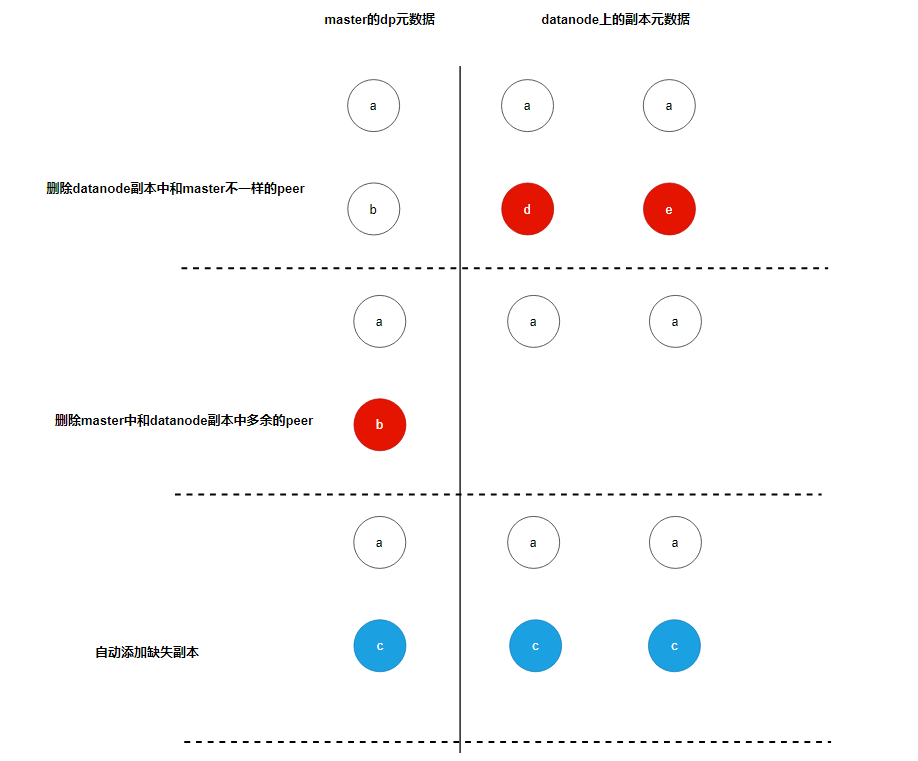
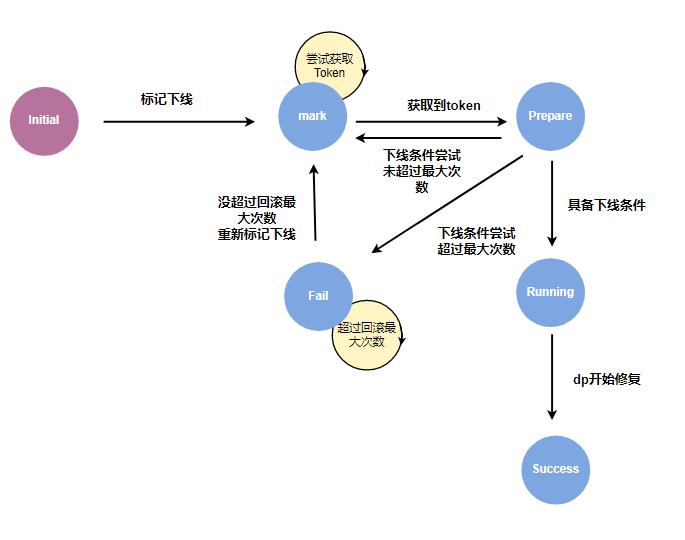
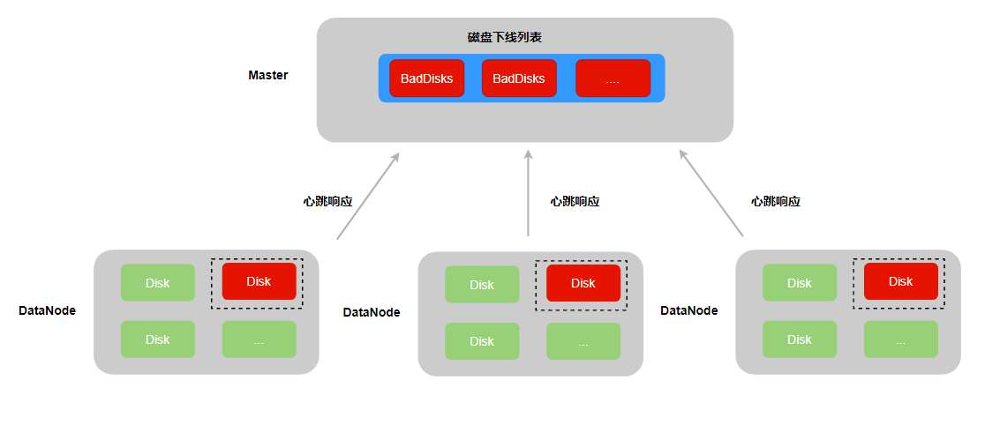

# 自动化运维

CubeFS 在 3.3.1 版本中加入了数据分区（下文简称dp）下线限速功能，即以 nodeSet 为单位，对其同时下线的最大 dp 数目进行控制。但是由于下线过程没有原子性保证，副本组就可能因为网络中断，数据节点可用空间不足等原子，导致副本组最终可能出现缺少 leader，副本数不足等异常场景，这部分异常 dp 也会需要耗费一定的运维精力去人工处理。

除此之外，对于集群中的坏盘，也需要运维人员及时的将坏盘上的 dp 迁移走，保证用户数据的可靠性。因此在 3.4.0 版本中，我们提供了异常dp自愈以及下线原子性，坏盘自动迁移的功能，来降低集群日常运维的人力成本。

## 1.异常 dp 自愈

异常 dp 自愈的功能会在两个地方进行执行：
- 在 master 上的 dp 元数据定期检测任务 scheduleToCheckDataReplicaMeta。主要用于对集群存量的异常 dp 进行修复。
- 在 master 标记 dp 为 markDecommission（可下线）之前。如果 dp 副本存在异常并且在执行下线操作前能够进行修复，那么可以提高 dp 下线的成功率。



上图是 dp 执行异常修复的流程：
1. 通过副本上报的 peers 和 master 上 dp 的 peers 进行比较，删除副本上存在，但是 master 不存在的 peer。
2. 通过副本上报的 peers 和 master 上 dp 的 peers 进行比较，删除 master 上存在，但是副本不存在的 peer。
3. 如果 dp 的 replica 数组的长度小于 dp 的副本数 ReplicaNum，则自动添加缺失副本。

由于 dp 的下线过程中会涉及 peers 以及 hosts 的修改，因此需要将 dp 的下线流程与自愈流程进行互斥。


自愈修复的状态机的初始状态为 Stop。

当执行下线操作时，dp 尝试将状态机状态切换为 Forbidden，如果切换失败，则返回错误，表示 dp 正在进行自愈，无法下线；如果切换成功，表明 dp 正在下线，无法执行自愈操作，并在下线结束时切换回 Stop 状态。

当执行元数据自愈时，dp 尝试将状态机状态切换为 Running，如果切换失败，则返回错误，表示 dp 正在执行下线，无法进行自愈；如果切换成功，表明 dp 正在进行自愈流程，无法执行下线操作，并在自愈结束时切换回 Stop 状态。

## 2.下线原子性

在 dp 下线过程中，如果遇到 master 切主、新建 dp 副本所在磁盘写满等异常情况，可能会导致下线过程阻塞，或者下线过程结束后副本组丢失副本等错误。

为了保证 dp 下线的正确性，我们会将下线状态进行持久化，从而保证下线过程的原子性，以 dp 为例，增加了以下与下线相关的需要进行持久化属性。

```golang
type DataPartition struct {
   ...
   DecommissionRetry              int       //下线重试次数
   DecommissionStatus             uint32    //下线状态
   DecommissionSrcAddr            string    //下线源地址
   DecommissionDstAddr            string    //下线目标地址
   DecommissionRaftForce          bool      //下线操作是否使用raftForce
   DecommissionSrcDiskPath        string    //下线的源磁盘
   DecommissionTerm               uint64    //下线的起始时间
   DecommissionDstAddrSpecify     bool      //是否为定点迁移
   DecommissionNeedRollback       bool      //是否需要回滚
   DecommissionNeedRollbackTimes  uint32    //下线的回滚次数
   DecommissionErrorMessage       string    //下线失败的错误信息
   RecoverStartTime               time.Time //开始修复的时间
   DecommissionType               uint32    //下线类型
   RestoreReplica                 uint32    //自愈修复的状态机
}
```
dp 的下线状态机包含以下状态：



- initial: 初始状态。
- mark: 待下线状态。当执行节点/磁盘下线时，其包含的 dp 会被标记为待下线状态，等待下线资源。
- prepare: 准备下线状态。待下线的 dp 由 master 进行限速控制，当获取到 token 后，则转为准备下线状态。这个阶段主要做一些下线条件的检测操作，比如副本的存活数是否满足下线条件等。
- running: 开始下线状态。该阶段是等待新建副本的修复过程。
- success: 下线成功状态。表明新建副本已经完成修复。
- fail: 下线失败状态。表明下线过程中遇到了错误。

为了提高下线操作的成功率，减少人工干预的次数，下线过程引入了错误重试与回滚的机制。在 prepare 以及 running 状态中，可能会遇到网络抖动引起的副本组存活数不足，缺少 leader 等场景，那么通过重试等待网络恢复或者副本组重新选举，可以恢复到满足下线条件的状态再重新自动执行下线操作。

而另外的一些特殊情况，比如新建副本的所在节点没空间了，或者出现 diskError 等，无法通过重试，只能重新选择新的节点来新建副本的场景时，则通过回滚的机制来重新执行下线操作。

无论是错误重试还是回滚机制，都有最大的次数限制，当尝试次数达到最大值仍无法下线成功时，dp 的下线状态会被设置为失败状态。

当状态机的状态发生变化时，会立即进行持久化。当 master 重启或者切主的时候，master 从 rocksdb 加载 dp 的元数据时，会恢复之前的下线状态，从而保证下线过程的原子性。

## 3.坏盘自动迁移



dp 副本在读写磁盘时，如果遇到 IO 错误，则会登记到所属磁盘的 IO 错误 dp 列表中，并将磁盘的读写状态设置为 unavaliable，从而保证该磁盘无法继续创建新的 dp 以及数据的读写操作。

磁盘巡检本身也可能会触发 IO 错误，但是由于巡检操作不涉及任何 dp，因此将特殊值 0 登记到磁盘的 IO 错误 dp 列表中。

考虑到 datanode 可能在坏盘处理完毕之前遇到重启等情况，在 dp 遇到 IO 错误时，会将错误次数持久化到本地的 dp 元数据中。从而保证 datanode 重启加载磁盘上的 dp 时，能够正确将磁盘重新标记为 unavaliable 状态。

当 datanode 构建心跳响应消息时，会将状态为 unavaliable 的磁盘信息，上报给 master。由 master 的定时任务，自动将坏盘放置到下线列表中并执行磁盘下线操作，即坏盘上的副本删除并在集群中其他节点的正常磁盘上新建副本，从而保证dp副本组的可靠性。

## 4.自动化运维最佳实践

在 3.4.0 版本中，新增了大量的 api 命令以及 cli 操作来管理集群的下线操作。在这个章节中，将对一些常用的管理命令进行介绍。

### 4.1 查询集群的下线配置

通过 cfs-cli cluster info 可以查看集群当前的配置信息，其中和下线相关的有如下配置：

```
[root]# ./cfs-cli cluster info        
[Cluster]
  ...
  DpRepairTimeout                  : 2h0m0s
  EnableAutoDecommission           : true
  AutoDecommissionDiskInterval     : 10s
  EnableAutoDpMetaRepair           : true
  AutoDpMetaRepairParallelCnt      : 100
  DecommissionDpLimit            : 50
  DecommissionDiskLimit            : 10
  DpBackupTimeout            : 168h0m0s
```

- DpRepairTimeout：dp 副本修复的超时时间。如果在这个时间间隔内，副本的进度没有任何变化，则会触发 dp 下线的回滚机制，重新执行下线操作。建议 SSD 盘设置在 20min，HDD 盘可以设置在 40min。
- EnableAutoDecommission： 集群是否开启了坏盘自动下线。建议开启，节省运维成本。
- AutoDecommissionDiskInterval：在开启坏盘自动下线的情况下，master 检测到 dataNode 上报的坏盘信息后，多久才开始执行下线。如果期望有足够的时间进行人工故障恢复坏盘，减少不变要的迁移，则可以将间隔设置久些，比如 20min。
- EnableAutoDpMetaRepair： 集群是否开启异常dp自愈。自愈过程会涉及副本元数据的修改以及副本添加操作，用户可以根据自身需求决定是否开启。建议开启，节省运维成本。
- AutoDpMetaRepairParallelCnt: 异常 dp 自愈的并发数。建议设置为 100。
- DecommissionDpLimit：每个 nodeset 同时下线dp的并发数。建议设置为 100。
- DecommissionDiskLimit: 每个 nodeset 同时下线磁盘的并发数。建议设置为 10。
- DpBackupTimeout：通过 raftForce 删除的副本，会暂时保留。待 DpBackupTimeout 到期后，再删除。

以上参数均可通过 cfs-cli cluster set 命令进行配置，详细信息可以通过 cfs-cli cluster set --help 命令进行查看。

### 4.2 下线并发限制

cfs 3.5.2升级之后支持配置下线过程中的并发限制，包括磁盘维度和节点维度的host0 token并发限制。

#### 磁盘维度并发限制

默认的磁盘维度host0 token并发限制为10，即一个磁盘最多同时允许10个dp以该磁盘上的副本作为修复的源副本。

**设置命令**

通过如下命令可重新设置该值，设置之后**全局生效**，即全部的磁盘都会以该新值作为阈值：

```bash
curl "http://masterLeaderAddr:17010/admin/updateDecommissionFirstHostDiskParallelLimit?decommissionFirstHostDiskParallelLimit=2"
```

**查询命令**

通过如下命令可查询该值：

```bash
curl "http://masterLeaderAddr:17010/admin/queryDecommissionFirstHostDiskParallelLimit"
```

#### 节点维度并发限制

默认的节点维度host0 token并发限制为0（意为不限制），即一个节点不限制以该节点上的副本作为修复源副本的dp并发数量。

**设置命令**

通过如下命令可重新设置该值，设置之后**局部生效**，即只有请求参数中的数据节点会以该新值作为阈值：

```bash
curl "http://masterLeaderAddr:17010/admin/updateDecommissionFirstHostParallelLimit?addr=10.52.132.57:17310&&decommissionFirstHostParallelLimit=3"
```

**查询命令**

通过如下命令可查询该值：

```bash
curl "http://masterLeaderAddr:17010/admin/queryDecommissionFirstHostParallelLimit?addr=10.52.132.57:17310"
```

### 4.3 查询副本修复进度

通过 cfs-cli datapartition check 命令，可以观察到集群中的dp状态：

```
[root]# ./cfs-cli datapartition check 
[Inactive Data nodes]:
ID        ZONE      ADDRESS                                                              USED      TOTAL     STATUS    REPORT TIME

[Corrupt data partitions](no leader):
ID          VOLUME      REPLICAS       STATUS          MEMBERS           

[Partition lack replicas]:
ID          VOLUME      REPLICAS       STATUS          MEMBERS           


[Bad data partitions(decommission not completed)]:
PATH        PARTITION ID    REPAIR PROGRESS
192.168.66.47:17310:/home/service/var/data1    568           20.22%  
      
[Partition has unavailable replica]:

[Number of Partition with replica file count differ significantly]: 0

[Number of Partition with replica used size differ significantly]: 0

[Partition with excessive replicas]:
ID          VOLUME      REPLICAS       STATUS          MEMBERS           

[Partition with disk error replicas]:
DP_ID       VOLUME      REPLICAS    DP_STATUS    MEMBERS  
```

- Corrupt data partitions： 副本组缺少 leader 的 dp。这种类型的dp需要人工去查看每个副本的META文件中，
- Partition lack replicas： 副本组缺少副本的 dp。可以通过 cfs-cli datapartition add-replica 手动补齐缺失副本。
- Bad data partitions： 正在修复的 dp。可以观察到新建副本的修复进度。
- Partition has unavailable replica： 副本组存在不可用的副本。需要查看不可用副本所在节点的 datanode 日志，查看副本不可用的原因。
- Number of Partition with replica file count differ significantly：副本组之间文件数不一致的 dp。可以等待副本的修复流程自己修复，如果长时间没恢复，可以下线存在差异的副本。
- Number of Partition with replica used size differ significantly：副本组之间 dp 大小不一致的 dp。可以等待副本的修复流程自己修复，如果长时间没恢复，可以下线存在差异的副本。
- Partition with excessive replicas：有冗余副本的副本组。可以通过 cfs-cli datapartition del-replica 删除多余副本。
- Partition with disk error replica： 副本组存在坏盘的dp。可以通过 cfs-cli 删除坏盘上的副本并重新新增一个副本。

除了副本组织间文件数和 dp 大小不一直的问题，其他问题都可以通过开启自动下线以及 dp 自愈进行自动修复。

### 4.4 查询磁盘/节点下线进度

可以通过 curl 命令 "/disk/queryDecommissionProgress" 或者 "/dataNode/queryDecommissionProgress" 查询磁盘/节点的下线进度。以查询磁盘的下线进度为例。

```
[root]# curl "http://master/disk/queryDecommissionProgress?addr=192.188.66.77:17310&disk=/home/service/var/data1" | jq .
  % Total    % Received % Xferd  Average Speed   Time    Time     Time  Current
                                 Dload  Upload   Total   Spent    Left  Speed
100   238  100   238    0     0   155k      0 --:--:-- --:--:-- --:--:--  232k
{
  "code": 0,
  "msg": "success",
  "data": {
    "StatusMessage": "Success",
    "Progress": "100.00%",
    "FailedDps": null,
    "IgnoreDps": [],
    "ResidualDps": [],
    "StartTime": "2024-09-19 19:59:08 +0800 CST"
  }
}
```

- StatusMessage:  下线的状态信息。与前面介绍的dp状态机的状态一样，包含 mark,running 等。
- Progress： 下线的进度信息。
- FailedDps：失败的 dp 以及对应的错误信息。在 StatusMessage 为 running 时，可以根据错误信息怕判断是否需要提前人工介入，保证后续的重试操作以及没有下线 dp 能够成功执行下线操作。由于 dp 下线存在重试机制，也可以等 StatusMessage 变为 fail 后再统一处理错误信息。
- IgnoreDps：没参与下线的 dp 信息。由于在同一时刻只能对副本组的单个副本进行下线操作，所以当同时下线副本组的多个副本时，靠后执行下线操作的副本是无法参与 dp 的下线操作的。可以重新执行磁盘/节点的操作。
- ResidualDps：残留的 dp 信息。由于 dp 的副本在 master 侧共享一套元数据。如果先下线 a 副本失败，之后下线 b 副本成功，那么 a 的失败信息就会被覆盖。因此这个数组保存的是被覆盖的副本下线错误信息。根据错误信息进行人工处理后，可以重新执行磁盘/节点的操作。
- StartTime：下线操作的开始时间。

### 4.5 取消下线

说明：cfs 3.5.2升级之后支持取消下线，该操作取消本次磁盘或节点（下线状态为mark或者running的磁盘或者节点）下线，即running的dp会删除掉新副本（后续依靠元数据自愈补齐），排队中的dp直接移除出下线队列，重置这些dp的下线状态。

#### 取消磁盘下线命令

```bash
curl -v "http://masterLeaderAddr:17010/disk/cancelDecommission?addr=dataNodeAddr:17310&disk=/home/service/var/data1"
```

- addr：取消下线的磁盘所在的数据节点地址
- disk：取消下线的磁盘路径

#### 取消节点下线命令

```bash
curl -v "http://masterLeaderAddr:17010/dataNode/cancelDecommission?addr=dataNodeAddr:17310"
```

- addr：取消下线的数据节点地址

### 4.6 集群下线状态

通过 admin/queryDecommissionToken 可以查看当前集群的下线状态：

```
{
    "code": 0,
    "msg": "success",
    "data": [
        {
            "NodesetID": 1,
            "CurTokenNum": 0,
            "MaxTokenNum": 100,
            "RunningDp": [],
            "TotalDP": 0,
            "ManualDecommissionDisk": [],
            "ManualDecommissionDiskTotal": 0,
            "AutoDecommissionDisk": [],
            "AutoDecommissionDiskTotal": 0,
            "MaxDiskTokenNum": 5,
            "RunningDisk": []
        }
    ]
}
```

每个 nodeset 都会维护一个 dp 以及磁盘的下线队列，因此这里返回的是一个以 nodeset 下线状态为单位的数组：

- NodesetID： nodeset 的编号。
- CurTokenNum： 当前处于 running 状态的 dp 总数。
- MaxTokenNum： dp 下线的最大并发数。也就是前面通过 cfs-cli cluster 配置的 DecommissionDpLimit 参数。
- RunningDp：当前处于 running 状态的 dp 列表。其长度与 CurTokenNum 相等。
- TotalDP：下线队列中 dp 的总数。
- ManualDecommissionDisk/AutoDecommissionDisk： 当前处于 running 状态的手动/自动下线磁盘列表。
- ManualDecommissionDiskTotal/AutoDecommissionDiskTotal：下线队列中手动/自动下线磁盘总数
- MaxDiskTokenNum： 磁盘下线的最大并发数。也就是前面通过 cfs-cli cluster 配置的 DecommissionDiskLimit 参数。
- RunningDisk：下线队列中磁盘的总数。

值得注意的是，当前是以磁盘为单位去进一步控制 dp 下线的速度的。如果当前磁盘的下线没结束并且磁盘的 token 已经耗尽，即使有空闲的 dp token，也不会触发其他为下线磁盘上的 dp 执行下线操作。

### 4.7 查看节点的磁盘状态

通过 cfs-cli datanode info 可以查看节点的状态：

```
[root]# ./cfs-cli datanode info 192.168.66.77:17310  
[Data node info]
...
AllDisks            : []
Bad disks           : []
Lost disks          : []
Decommissioned disks: []
DecommissionSuccess disks: []
Persist partitions  : []
Backup partitions   : []
```

- AllDisks: 当前节点上所有已加载的磁盘列表。
- Bad disks: 当前节点上的坏盘列表。
- Lost disks: 当前节点上的掉盘列表。
- Decommissioned disks: 当前节点上已经被执行下线的磁盘列表，这部分磁盘无法再创建新的dp。
- DecommissionSuccess disks: 当前节点上已经下线成功的磁盘列表，这部分磁盘在运维中用于告警指标，来提示运维人员换盘。
- Persist partitions :当前节点上的dp列表。
- Backup partitions：当前节点上，通过raftForce删除的dp的备份目录。这部分目录会定期删除，也可以提前人工删除释放空间。


### 4.8 查看dp下线状态

通过如下命令可以查看dp的下线状态：

```
[root~]# curl -v "http://192.168.66.77:17310/dataPartition/queryDecommissionStatus?id=91580" | jq .                                   
{
  "code": 0,
  "msg": "success",
  "data": {
    "PartitionId": 91580,                           //分区id
    "ReplicaNum": 2,                               //副本数
    "Status": "Initial",                           //下线状态
    "SpecialStep": "SpecialDecommissionInitial",   //单/双副本下线状态。
    "Retry": 0,                                    //下线重试次数
    "RaftForce": false,                            //是否使用raftForce
    "Recover": false,                              //是否在修复中
    "SrcAddress": "",                              //下线源节点
    "SrcDiskPath": "",                             //下线源磁盘
    "DstAddress": "",                              //下线的目标节点
    "Term": 0,                                     //下线的起始时间
    "Replicas": [                                  //dp的副本组成员
      "",
      ""
    ],
    "ErrorMessage": "",                             //下线失败的错误信息
    "NeedRollbackTimes": 0,                         //是否需要回滚
    "DecommissionType": "InitialDecommission",      //下线的类型
    "RestoreReplicaType": "RestoreReplicaMetaStop", //自愈状态
    "RecoverStartTime": "0001-01-01 00:00:00"      //上一次修复进度的更新时间
 }
```

对于单/双副本的下线操作，其下线过程中添加/删除副本的顺序与三副本稍有不同，因此通过一个下线子状态 SpecialStep 进行控制，但是总体上还是和三副本一样，由下线状态控制其状态机的流转。

可以通过 /dataPartition/resetDecommissionStatus 接口将上述变量都重置为初始值，在某些情况下可以解决 dp 多次下线失败的问题。

### 4.9 故障盘恢复和换盘后操作

- 坏盘经过人工修复 (非迁移或下线操作) 后，如果需要继续使用该磁盘，可以通过recoverBadDisk接口进行重置，作用是消除磁盘错误计数，重新加载磁盘上的 dp, 并消除 Bad disks 中的记录：
```
curl -v "http://192.168.66.77:17010/disk/recoverBadDisk?addr=datanodeAddr:17310&disk=/home/service/var/data1" | jq .  
```

- 坏盘经过迁移流程下线，在运维人员更换新盘后，假设新盘也挂载至原磁盘路径，新盘会报Lost,可以重启data节点或是执行reloadDisk命令重新加载磁盘: `curl "http://172.16.1.101:17010/disk/reloadDisk?addr=172.16.1.101:17310&disk=/home/data/data1/disk"`.reloadDisk接口可避免重启节点导致影响到其他磁盘，同时也会将磁盘路径从DecommissionSuccess和Decommissioned列表中删除,。而如果用重启来加载磁盘，需要手动执行recommmission命令手动将磁盘从DecommissionSuccess和Decommissioned列表中删除，代表重新上线磁盘: `curl "http://172.16.1.101:17010/disk/recommission?addr=172.16.1.101:17310&disk=/home/data/data1/disk"`。


### 4.10 副本修复过程卡住

当一个 dp 的副本长时间多次修复超时，可以先通过以下命令查看副本组 host[0] 的日志：

```
[root@ ~]# cat dataNode_info.log| grep ActionNotifyFollowerRepair | grep 分区id| tail -n 100
```

日志中，假如出现的日志都是诸如以下内容：

```
[INFO ] data_partition_repair.go:452: ActionNotifyFollowerRepair to host(follower地址1) Partition(分区id) type(0) ToBeCreated(0) ToBeRepaired(0) done
[INFO ] data_partition_repair.go:452: ActionNotifyFollowerRepair to host(follower地址2) Partition(分区id) type(1) ToBeCreated(0) ToBeRepaired(0) done
```

说明目前没有 extent 需要修复。那么此时可以调用 host[0] 的 /reloadDataPartition?id=分区id接口，重新加载 host[0] 分区来恢复副本修复。


### 4.10 副本的leader的raft卡住

在开启异常dp自愈功能时，如果副本组有leader，但是添加/删除副本超时，可以查询副本组leader的添加/删除raft成员的日志，判断是否是由于raft没有返回添加/删除raft成员结果而导致的失败。

对于这种情况可以对副本组的leader所在节点执行重载操作进行复原：

```
curl localhost:17320/reloadDataPartition?id=分区id
```

### 4.11 磁盘掉盘

- 在集群运行过程中或是DataNode节点启动过程中发生掉盘，磁盘会被标记为Lost disk, 仍会加载到缓存中。用cli查看DataNode info可以看到Lost disks的记录。重新mount disk即可恢复正常。
- 特殊情况为下线完成后换新盘，新盘报Lost的情况下，需要执行reloadDisk接口或重启DataNode节点来重新加载磁盘。

