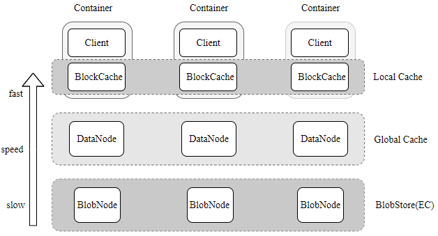

什么是CubeFS
========

CubeFS是新一代云原生存储产品，目前是云原生计算基金会（CNCF）托管的孵化阶段开源项目，
兼容S3、POSIX、HDFS等数据访问协议，支持多副本与纠删码两种存储引擎，为用户提供多租户、
多AZ部署以及跨区域复制等多种特性，广泛应用于大数据、AI、容器平台、数据库、中间件存算分离、
数据共享以及数据保护等场景。

整体架构
-----------------------

.. image:: pic/cfs-arch-ec.png
   :align: center
   :scale: 100 %
   :alt: Architecture

CubeFS由 *元数据子系统* ，*数据子系统* 和 *资源管理节点* 组成，可以通过 *客户端* 访问不同文件系统实例， *卷* 。

元数据子系统由元数据节点组成，每个节点可以管理一组 *元数据分片* 。

数据子系统分为副本子系统和纠删码子系统，两种子系统可同时存在，也都可单独存在

+ 副本子系统由数据节点组成，每个节点管理一组 *数据分片*，多个节点的 *数据分片* 构成副本组
+ 纠删码子系统由多个blobNode节点组成，每个节点管理一组 *数据块*，多个节点的 *数据块* 构成一组纠删码条带

在CubeFS中，卷是一个逻辑概念，由多个元数据和数据分片组成。
从客户端的角度看，卷可以被看作是可被容器访问的文件系统实例。
一个卷可以在多个容器中挂载，使得文件可以被不同客户端同时访问。
根据底层存储方式不同，卷分为副本卷和纠删码卷，如无特殊强调，卷就是副本卷的类型。
一个CubeFS集群可以有上百个卷，大小从几GB至几TB不等。

概括来说，资源管理节点定期获取元数据和数据子系统信息，客户端则定期从资源管理器拉取元数据和数据分片信息，并且进行缓存。通常来讲，文件操作由客户端发起，直接与数据和元数据节点通信，无需资源管理节点介入。

系统特性
-------------

多协议
^^^^^^^^^^^^^^^^^^^^^^^^

双引擎
^^^^^^^^^^^^^^^^^^^^

可扩展
^^^^^^^^^^^^^^^^^^

高性能
^^^^^^^^^^^^^^^^

多租户
^^^^^^^^^^^^^^^^

多级缓存加速
^^^^^^^^^^^^^^^^^

纠删码卷支持多级缓存加速能力，针对热点数据，提供更高数据访问性能

-  本地缓存：可以在Client机器上同机部署BlockCache组件，管理本地磁盘作为本地缓存. 可以不经过网络读取本地Cache当中的数据, 容量受本地磁盘限制
-  全局缓存：使用副本组件DataNode搭建的分布式全局Cache, 比如可以通过部署客户端同机房的SSD磁盘的DataNode作为全局cache, 相对于本地cache, 需要经过网络, 但是容量更大, 可动态扩缩容, 副本数可调

名词解释
-------------
