# GUI使用<br>
# 一、 安装<br>
## 1.1 编译<br>
下载CubeFS源码后，用make命令编译代码。编译成功后，在bin目录里面可生成可执行文件cfs-gui，配置文件模板config.yml，前端静态文件目录dist。<br>
```
## clone code
git clone https://github.com/cubefs/cubefs-dashboard.git

## build
make

## product
ll bin/
total 26256
-rwxr-xr-x 1 root root 26876984 Jul 27 17:26 cfs-gui
-rw-r--r-- 1 root root     1009 Jul 27 17:26 config.yml
drwxr-xr-x 6 root root     4096 Jul 27 17:27 dist
```

## 1.2 配置<br>
配置文件里面数据库的密码不能是明文，需要加密。加密方式：<br>
```
./cfs-gui  -e  password
```
#示例
```
./cfs-gui  -e  111111
v6NEbIgCdJAYDqLiDE9UMA==
```

配置文件config.yml说明：<br>
```
server:
  port: 6007  //服务监听端口
  mode: dev   //运行模式 test dev prod
  static_resource:
    enable: true  //是否开启静态资源
    relative_path: /portal  //静态资源前缀
    root_path: ./dist  //静态资源目录  默认在运行的目录下
prefix:
  api: /api/cubefs //后端接口前缀
mysql:
  host: xxxxxx   //mysql 读写域名
  port: xxxxxx   //mysql 读写域名的端口
  slaveHost: xxxxxx   //mysql 只读域名，没有的话可以填读写域名
  slavePort: xxxxxx   //mysql 只读域名的端口，没有的话可以填读写域名的端口
  user: xxxxxx   //mysql  用户名
  password: xxxxxx   //mysql  密码（此处不能是明文密码，需要先加密）
  database: xxxxxx   //mysql  数据库名
  maxIdleConn: 20
  MaxOpenConn: 300
```

## 1.3 运行<br>
在bin目录下，执行./cfs-gui -c config.yml<br>
<br>

# 二、 使用方法<br>
## 2.1 注册、修改密码、登录<br>
## 2.1.1 url拼接<br>
```
http://{{ ip }}:{{ server.port }}/{{ server.static_resource.relative_path }}
```
示例：<br>
如果部署的机器为192.168.10.10且server.port和server.static_resource.relative_path用默认配置<br>
```
http://192.168.10.10:6007/portal
```
### 2.1.2 注册账号<br>
账号：只能包含数字、大写字母、小写字母、下划线<br>
密码：密码长度大于等于8小于等于16<br>
密码只能包含数字、大写字母、小写字母、特殊字符（~!@#$%^&*_.?），且至少两种类型以上<br>
此处仅是注册账号，账号的权限需要有root角色的账号授予<br>
<br>
<br>
<br>

### 2.1.3 修改密码<br>
<br>
<br>

### 2.1.4 登录<br>
<br>

## 2.2 上架集群、修改集群<br>
### 2.2.1 上架集群<br>
<br>
只有三副本卷、无纠删码（EC）冷卷<br>
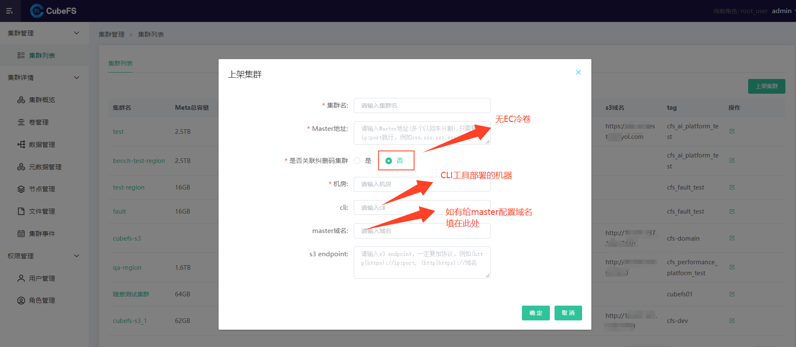<br>
有EC冷卷<br>
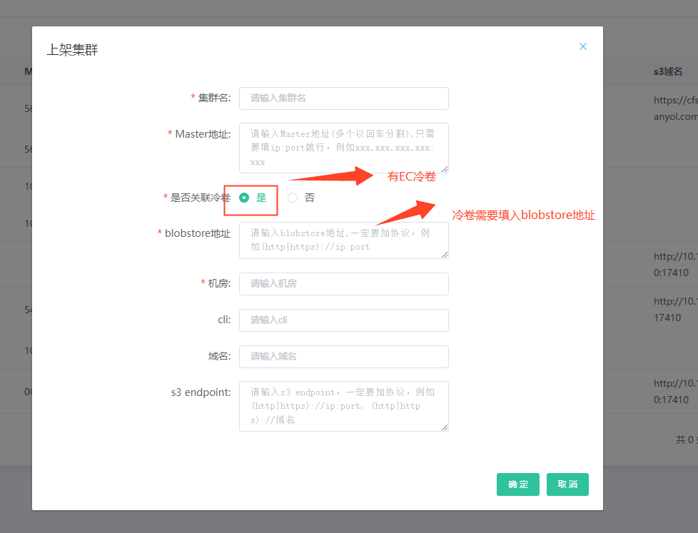<br>

### 2.2.2  修改集群<br>
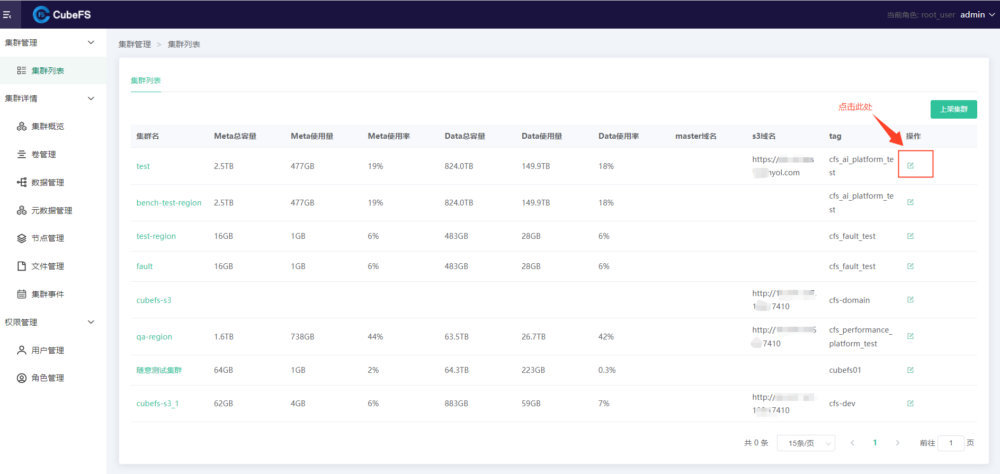<br>
<br>

## 2.3 进入集群<br>
点击集群名进入集群<br>
<br>
## 2.4 集群详情<br>
### 2.4.1 集群详情主页<br>
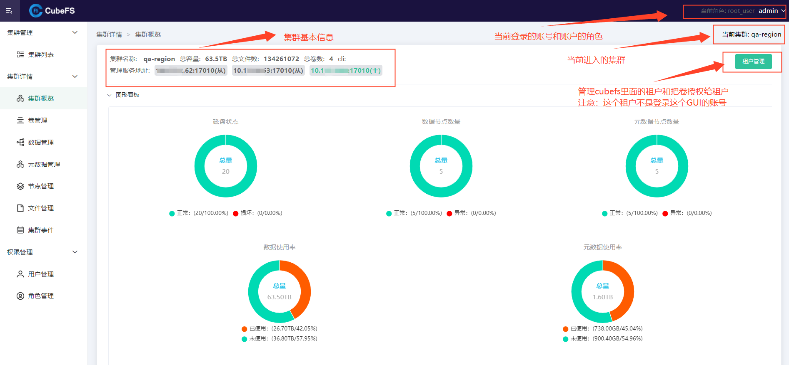<br>
### 2.4.2 租户管理<br>
进入“租户管理”<br>
给租户授权卷的权限在卷的页面操作，不在此处<br>
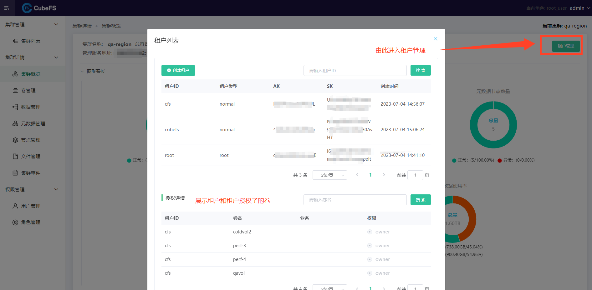<br>
创建租户：必须以字母开头,可有下划线,数字,字母<br>
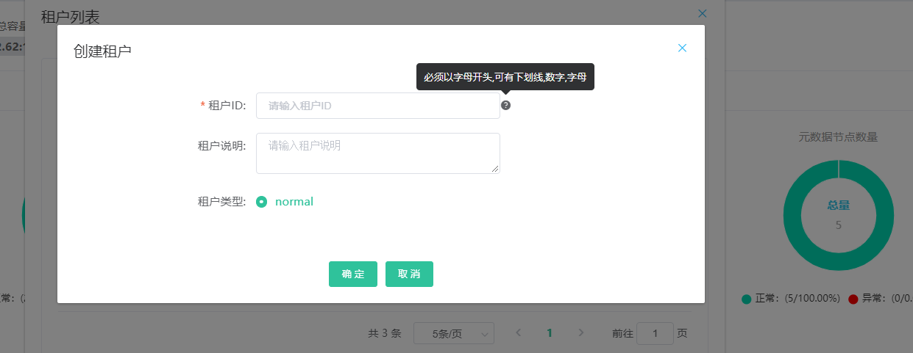<br>
# 2.5 卷管理<br>
### 2.5.1 首页<br>
<br>
### 2.5.2 创建卷<br>
创建卷的时候，会给卷选择一个owner租户，此owner租户有卷的读写权限<br>
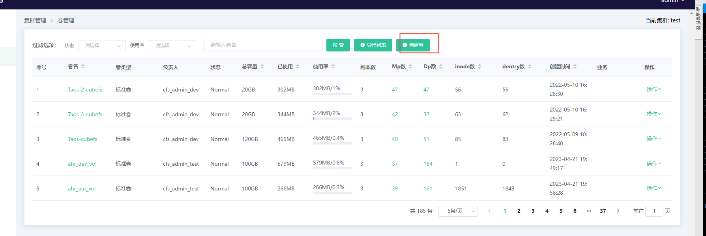<br>
<br>
### 2.5.3 查看卷详情<br>
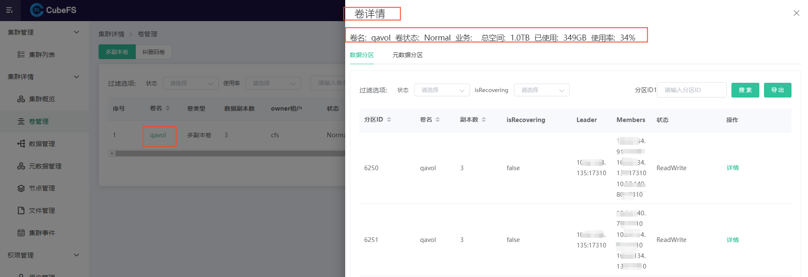<br>
### 2.5.4 多副本数据分区（DP）详情<br>
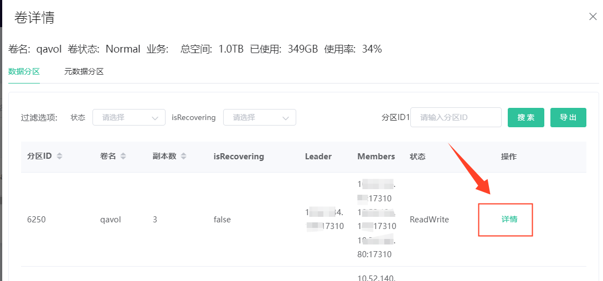<br>
<br>
### 2.5.5 元数据分区（MP）详情<br>
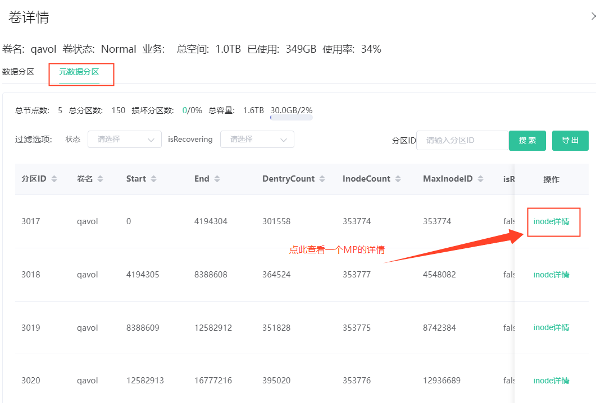<br>
<br>
### 2.5.6 卷扩容<br>
<br>
<br>
### 2.5.7 卷缩容<br>
<br>
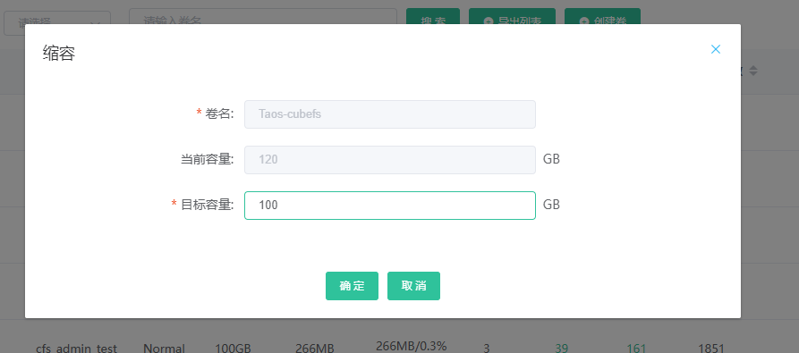<br>
### 2.5.8 卷授权<br>
卷授权能把卷授权给owner租户外的其他用户<br>
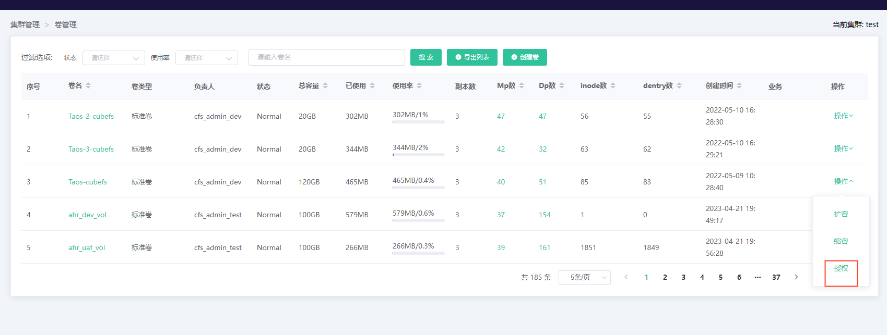<br>
<br>
## 2.6 数据管理<br>
### 2.6.1 多副本数据管理<br>
<br>
#### 2.6.1.1 DP详情<br>
<br>
<br>
### 2.6.2 纠删码数据管理<br>
#### 2.6.2.1 没冷卷时页面置灰<br>
当创建集群时没有关联冷卷的话，“纠删码”页面是置灰的，不能点击<br>
<br>
#### 2.6.2.2 条带组状态<br>
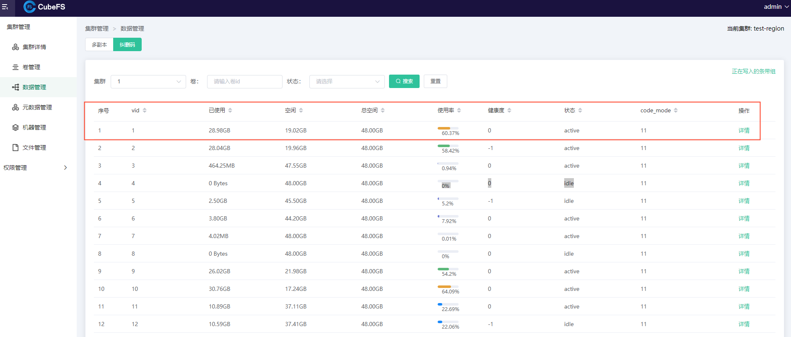<br>
#### 2.6.2.3 正在写入的条带组<br>
<br>
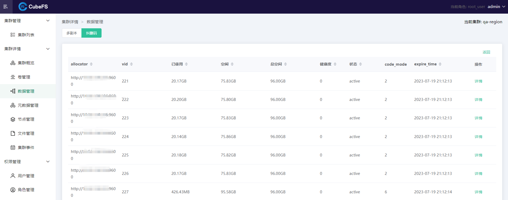<br>
#### 2.6.2.4 条带组详情<br>
点击条带组的“详情”进入条带组详情<br>
条带组详情展示组成条带的数据块信息和相关的磁盘和机器<br>
<br>
组成条带的数据块信息<br>
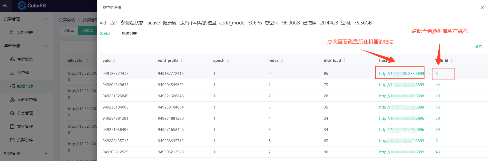<br>
数据块所在的磁盘信息<br>
<br>
## 2.7 元数据管理<br>
### 2.7.1 首页<br>
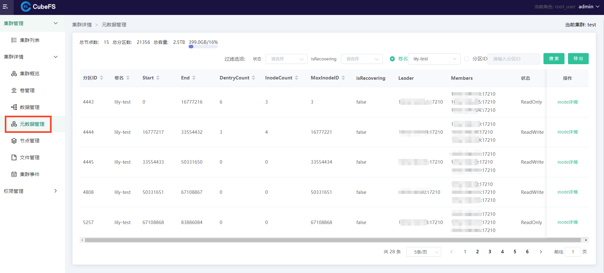<br>
### 2.7.2 元数据分区（MP）详情<br>
<br>
<br>
## 2.8 节点管理<br>
### 2.8.1 三副本节点<br>
#### 2.8.1.1 首页<br>
<br>
#### 2.8.1.2 节点下线（自动迁移）<br>
节点下线即将节点里面的所有DP自动迁移（目的节点由CubeFS自动选择）到其他节点<br>
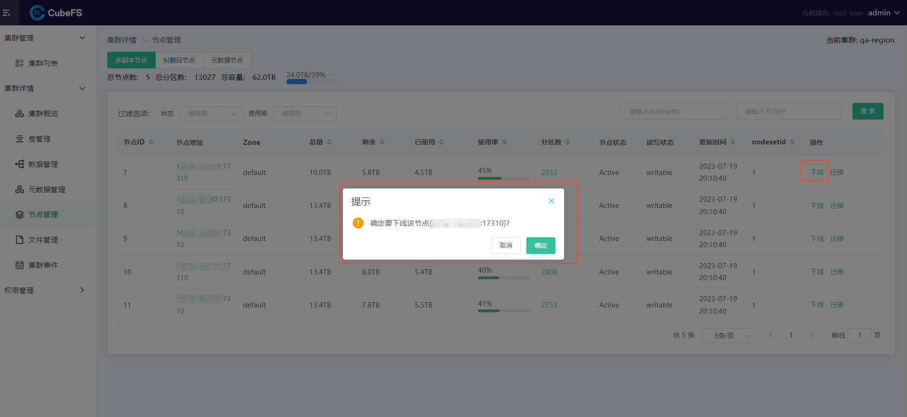<br>
#### 2.8.1.3 节点迁移<br>
节点迁移即将节点里面的所有DP迁移到其他节点（由用户指定）<br>
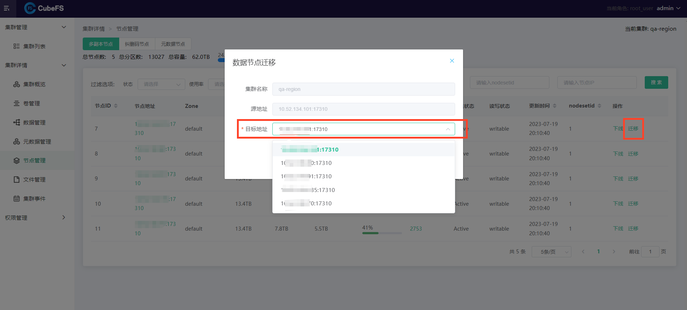<br>
#### 2.8.1.4 磁盘下线<br>
点击“节点地址”进入节点详情<br>
磁盘下线即将磁盘里面的所有DP自动迁移到其他的磁盘<br>
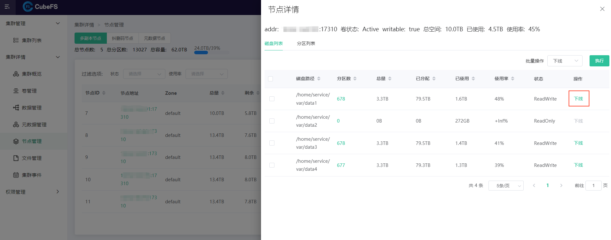<br>
#### 2.8.1.5 分区下线<br>
点击“分区数”进入节点详情<br>
分区下线即将数据分区（DP）从当前磁盘自动迁移到其他磁盘<br>
<br>
### 2.8.2 纠删码节点<br>
#### 2.8.2.1 首页<br>
<br>
#### 2.8.2.2 机器切读写/只读<br>
操作按钮在“更多操作”的下面<br>
<br>
#### 2.8.2.3 机器详情<br>
<br>
<br>
### 2.8.3 元数据节点<br>
#### 2.8.3.1 首页<br>
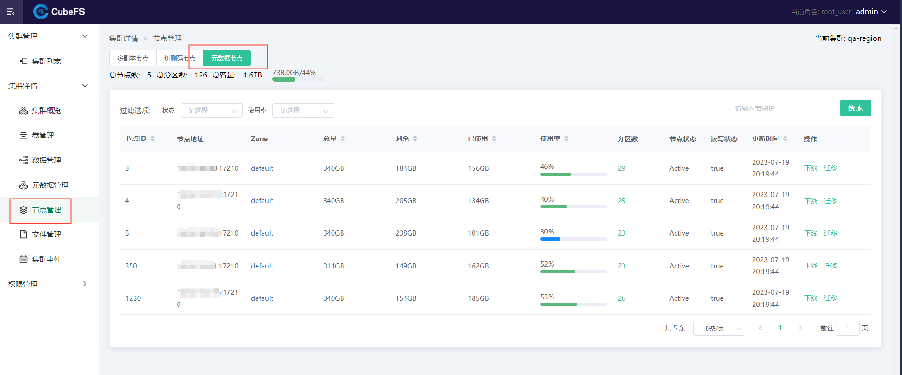<br>
#### 2.8.3.2 节点下线<br>
节点下线即将节点里面的所有MP自动迁移（目的节点由CubeFS自动选择）到其他节点<br>
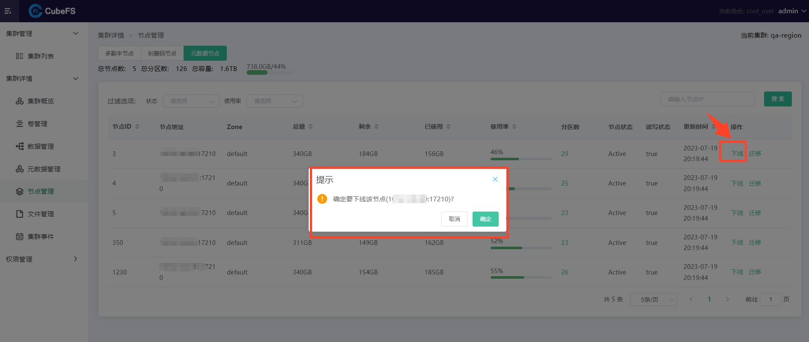<br>
#### 2.8.3.3 节点迁移<br>
节点迁移即将节点里面的所有MP迁移到其他节点（由用户指定）<br>
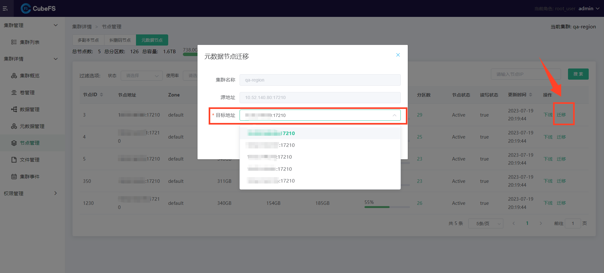<br>
#### 2.8.3.4 分区下线<br>
点击“分区数”进入分区详情<br>
分区下线即将元数据分区（MP）从当前机器自动迁移到其他机器<br>
<br>
## 2.9 文件管理<br>
文件管理是为了方便在管控台查看、上传、下载文件<br>
### 2.9.1 文件管理使用前提<br>
文件管理是通过S3模块实现的，所以需要配一些S3相关的配置<br>
#### 2.9.1.1 集群配置S3模块的域名或者IP<br>
上架或者修改集群里面，要配置“s3 endpoint”<br>
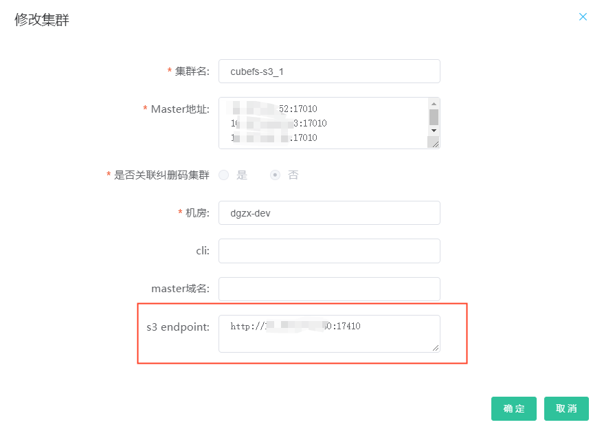<br>
当没有配置“s3 endpoint”时，点击卷名会报错，不能进去卷的文件管理<br>
<br>
#### 2.9.1.2 给卷配置跨域<br>
配置“s3 endpoint”后，点击卷名进入卷的文件管理<br>
点击“跨域设置”里面的“新增规则”<br>
如果只是为了页面上传下载，可以参照“提示”里面配置<br>
当没有正确配置GUI用的跨域时，“文件管理”置灰，不能操作<br>
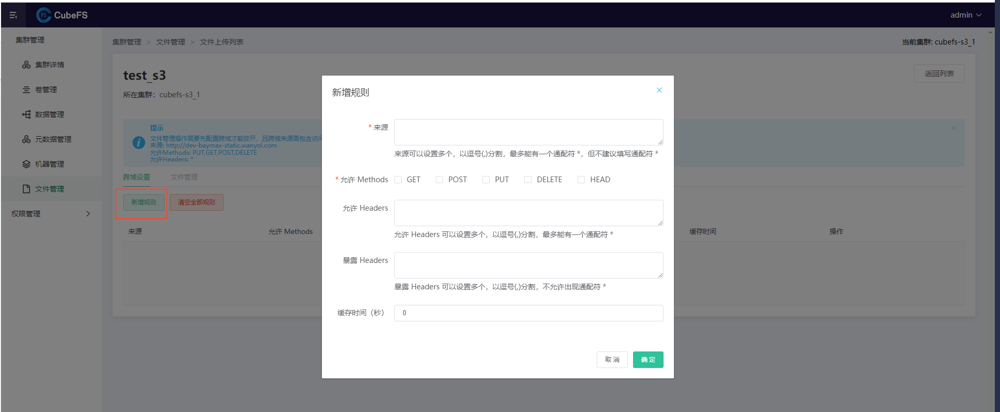<br>
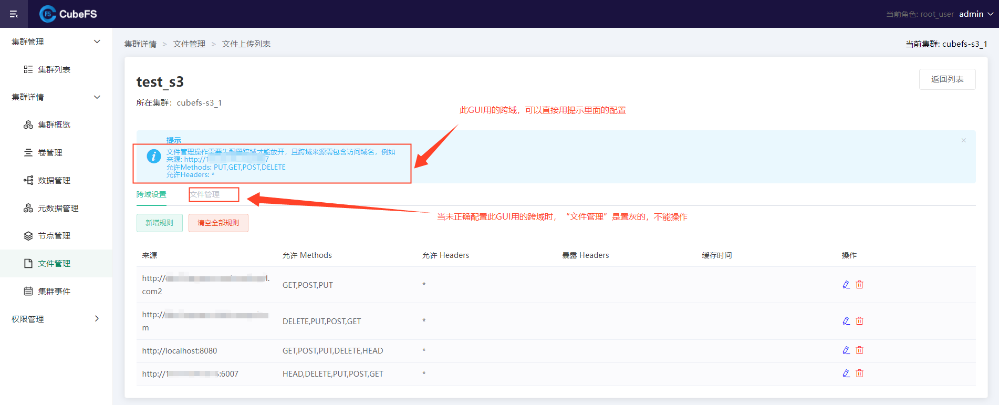<br>
### 2.9.2 上传文件、下载文件、新建文件夹<br>
正确配置“s3 endpoint”和跨域后，点击“文件管理”就能执行上传文件、下载文件、新建文件夹操作<br>
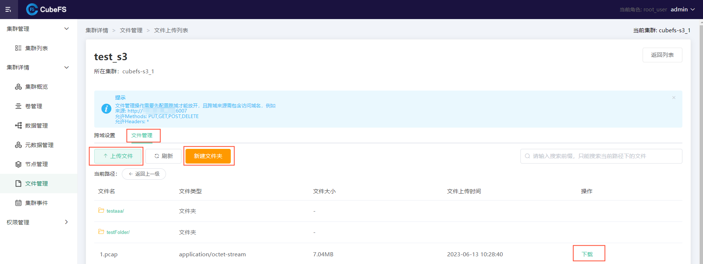<br>

## 2.10 权限管理<br>
### 2.10.1 权限管理说明<br>
#### 2.10.1.1 GUI账号与CubeFS集群租户区分<br>
此处的账号仅仅是登录GUI平台使用，跟CubeFS集群里通过ak、sk访问卷里面文件的租户无关<br>
#### 2.10.1.2 初始账户<br>
GUI后端部署好之后，会生成一个初始有最高权限的账号<br>
admin/Admin@1234<br>
第一次登录时，需要修改密码<br>
#### 2.10.1.2 角色<br>
每个角色对应一组权限，初始有三个默认角色，用户可以新增自定义角色<br>
三个默认角：<br>
admin_role：拥有所有权限<br>
operator_role：定位为运维角色，相比admin_role削减了权限管理相关权限<br>
viewer_role：定位为查看角色，相比operator_role削减了运维操作相关权限<br>
#### 2.10.1.3 用户<br>
一个用户可以关联多个角色，用户拥有对应角色的权限<br>
#### 2.10.1.4 用户申请方式<br>
a. 在登录界面申请<br>
b. 有“创建用户”权限的账户在“用户管理”->“添加用户”里面创建<br>
### 2.10.2 用户管理<br>
#### 2.10.2.1 添加用户<br>
点击“用户管理”->“添加用户”<br>
也可以顺带给用户关联角色，需要权限：用户授权<br>
<br>
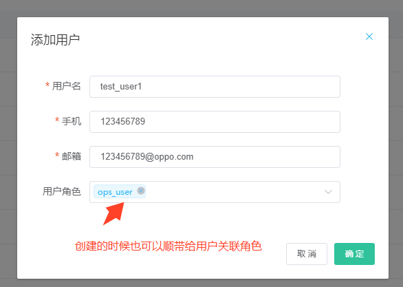<br>
#### 2.10.2.2 编辑用户、修改密码、删除用户<br>
需要权限：更新用户、修改用户密码、删除用户<br>
<br>
### 2.10.3 角色管理<br>
#### 2.10.3.1 添加角色<br>
点击“角色管理”-->“添加角色”，输入“角色code”、“角色名称”并在“角色权限”里面选中需要的权限<br>
需要权限：添加角色<br>
<br>
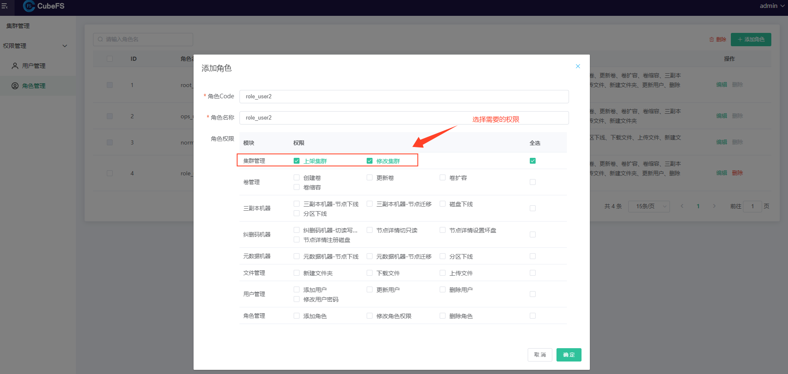<br>
#### 2.10.3.2 修改角色<br>
需要权限：修改角色权限<br>
<br>
## 2.11 集群事件<br>
### 2.11.1 纠删码后台任务<br>
<br>


