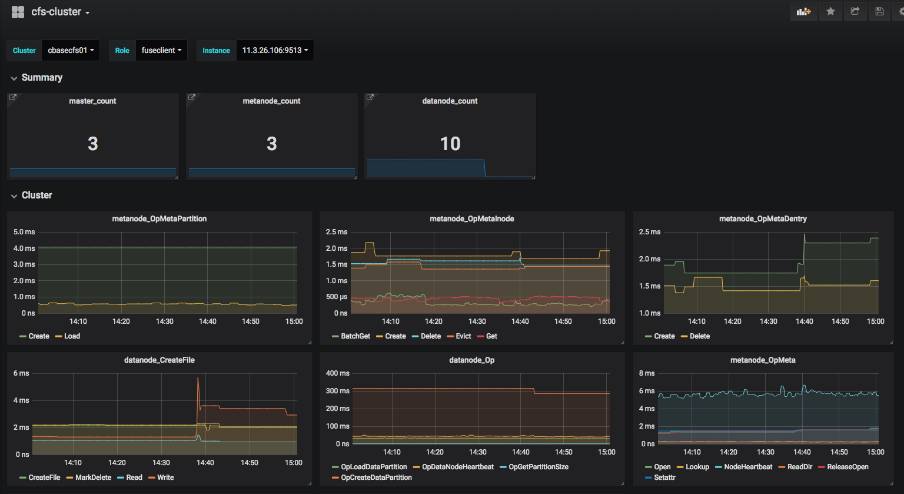

性能监控
-----------------------

CubeFS 集成了prometheus作为性能监控指标采集模块。在各模块配置文件中增加如下配置参数来启用该模块：

.. code-block:: json

   {
       "exporterPort": 9505,
       "consulAddr": "http://consul.prometheus-cfs.local",
       "consulMeta": "k1=v1;k2=v2",
       "ipFilter": "10.17.*",
       "enablePid": "false"
   }

* exporterPort: prometheus获取监控数据端口。设置后，可通过URL(http://$hostip:$exproterPort/metrics) 暴露prometheus监控指标。若不设置，prometheus指标监控模块将不会工作。
* consulAddr: consul注册服务器地址。设置后, 可配合prometheus的自动发现机制实现CubeFS节点exporter的自动发现服务。若不设置，将不会启用consul自动注册服务。
* consulMeta: conusl 元数据配置。 非必填项, 在注册到conusl时设置元数据信息。
* ipFilter: 基于正则表达式的过滤器。 非必填项，默认为空。暴露给consul,  当机器存在多个ip时使用. 支持正向和反向过滤, 比如:
    * ipFilter="10.17.*", 保留满足该正则表达式的ip。
    * ipFilter="!10.17.*" 保留不满足该正则表达式的ip。
* enablePid: 是否上报partition id, 默认为false; 如果想在集群展示dp或者mp的信息, 可以配置为 true。
Using grafana as prometheus metrics web front:

可使用grafana作为prometheus 监控指标的展示前端，如下图所示：

可以通过prometheus alertmanager组件进行配置，来实现CubeFS系统的监控指标报警通知服务，详细可参考 `alertmanager文档 <https://prometheus.io/docs/alerting/alertmanager>`_。

相关链接：

1. `prometheus 安装配置 <https://prometheus.io/docs/prometheus/latest/getting_started>`_
2. `consul 安装配置 <https://www.consul.io/docs/install/index.html>`_
3. `grafana 安装配置 <http://docs.grafana.org/guides/getting_started>`_

监控指标
>>>>>>>>>>

- 集群（Cluster）

    + 各节点数量： ``MasterCount`` , ``MetaNodeCount`` , ``DataNodeCount`` , ``ObjectNodeCount``
    + 客户端数量： ``ClientCount``
    + 卷数量： ``VolumeCount``
    + 节点使用情况： ``DataNodeSize`` , ``MetaNodeSize``
    + 节点使用率： ``DataNodeUsedRatio`` , ``MetaNodeUsedRatio``
    + 非活动节点数量： ``DataNodeInactive`` , ``MetaNodesInactive``
    + 卷总容量统计列表： ``VolumeTotalSize``
    + 卷使用率统计列表： ``VolumeUsedRatio``
    + 坏盘数量： ``DiskError``

- 卷（Volume）

    + 卷使用量： ``VolumeUsedSize``
    + 卷使用率： ``VolumeUsedRatio``
    + 卷总容量变化率： ``VolumeSizeRate``

- 资源管理节点（Master）

    + 无效master节点数量： ``master_nodes_invalid``
    + 非活动元数据节点数量： ``metanode_inactive``
    + 非活动数据节点数量： ``datanode_inactive``
    + 非活动客户端数量： ``fuseclient_inactive``

- 元数据节点（MetaNode）

    + 元数据节点上各操作的时长（Time）与每秒操作次数（Ops），可从 ``MetaNodeOp`` 下拉列表中选取监控指标。

- 数据节点（DataNode）

    + 数据节点上各操作的时长（Time）与每秒操作次数（Ops），可从 ``DataNodeOp`` 下拉列表中选取监控指标。

- 对象存储节点（ObjectNode）

    + 对象存储节点上各操作的时长（Time）与每秒操作次数（Ops），可从 ``objectNodeOp`` 下拉列表中选取监控指标。

- 客户端（FuseClient）

    + 客户端上各操作的时长（Time）与每秒操作次数（Ops），可从 ``fuseOp`` 下拉列表中选取监控指标。

*推荐关注指标：集群状态相关、节点及磁盘故障相关、数据量、增长量等。*

Grafana 监控面板配置模板
>>>>>>>>>>>>>>>>>>>>>>>>

.. literalinclude:: cfs-grafana-dashboard.json
   :language: json

