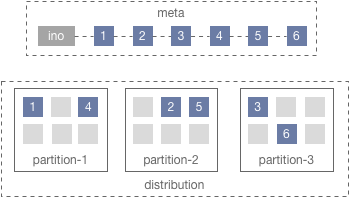
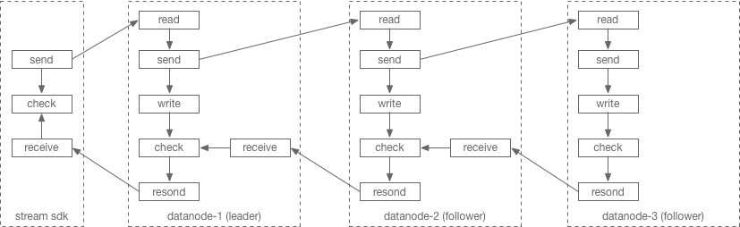

# DataNode

DataNode is used to store and ensure the consistency of stored file data for each replica in BaudFS.

## Features

- Streaming replication for high performance data write and read operation and keep your data safety.
- Unified storage engine with both blob and large data support.

## Requirement

BaudFS use [dep](https://github.com/golang/dep) for dependency management. 

All necessary third part dependencies have been defined in `Gopkg.toml` under the project root.

To install dependencies make sure [dep](https://github.com/golang/dep) have been installed and execute `dep` with `ensure` command at the `$GOPATH/github.com/tiglibs/baudfs`.

```shell
$ dep ensure
```

**Notes:**
>Cause of RocksDB is required and the BaudFS is using cgo api to operate RocksDB, so that the cross platform compiling is not support. Make sure the c library files of RocksDB have been installed in your building machine and can be found by compiler before you build BaudFS binrary.

## How to start

Start a DataNode process by execute the server binary of BaudFS you built with `-c` argument and specify configuration file.

```shell
$ PATH_OF_SERVER_BINARY -c PATH_OF_CONFIGURATION
```  

## Configuration

BaudFS using **JSON** as for configuration file format. 

**Properties:**

| Key        | Type     | Description                                      | Required |
| :--------- | :------- | :----------------------------------------------- | :------: |
| role       | string   | Role of process and must be set to "datanode".   | Yes      |
| port       | string   | Port of TCP network to be listen.                | Yes      |
| prof       | string   | Port of HTTP based prof and api service.         | No       |
| clusterID  | string   | Identity of cluster which this node belong to.   | Yes      |
| logDir     | string   | Path for log file storage.                       | Yes      |
| logLevel   | string   | Level operation for logging. Default is "error". | No       |
| masterAddr | []string | Addresses of master server.                      | Yes      |
| rack       | string   | Identity of rack.                                | No       |
| disks      | []string | Format: "PATH:MAX_ERRS:REST_SIZE".               | Yes      |

**Example:**

```json
{
    "role": "datanode",
    "port": "6000",
    "prof": "6001",
    "clusterID": "data",
    "logDir": "/var/logs",
    "logLevel": "debug",
    "masterAddr": [
        "10.196.30.200:80",
        "10.196.31.141:80",
        "10.196.31.173:80"
    ],
    "rack": "main",
    "disks": [
        "/data0:1:20000",
        "/data1:1:20000",
        "/data2:1:20000",
        "/data3:1:20000",
        "/data4:1:20000"
    ]
}
```

## Storage engine

A fusion storage engine designed for both blob file and large file storage and management.
There are two store in each data partition, **blobfile store** and **extent store**.

**BlobFile store**

BlobFile store for blob or one-off-write file data storage. File bytes append into blobfile block file and record the offset index and data length into an index file which pair with the blobfile block. A blobfile block file can be append until no space left in partition. Each partition has a fixed number of blobfile block files for parallel write support.

**Extent store**

Extent store for large file storage and append write operation support. Client requests to create an extent block for it's session and append data to this extent block with stream. The extent block file have a size limit and default is 256MB. After an extent block file reachs it's size limit, client will requests an new extent block for data appending.



## Streaming replication
BaudFS using streaming replication based replication protocol to replica data with all replication members. It makes the write operation high performance.




## HTTP APIs

| API         | Method | Params           | Desc                                |
| :---------- | :----- | :--------------- | :---------------------------------- |
| /disks      | GET    | None             | Get disk list and informations.     |
| /partitions | GET    | None             | Get parttion list and infomartions. |
| /partition  | GET    | partitionId[int] | Get detail of specified partition.  |

**Notes:**
>Cause of major components of BaudFS developed by Golang, the pprof APIs will be  enabled automatically when the prof port have been config (specified by `prof` properties in configuratio file). So that you can use pprof tool or send pprof http request to check status of server runtime.