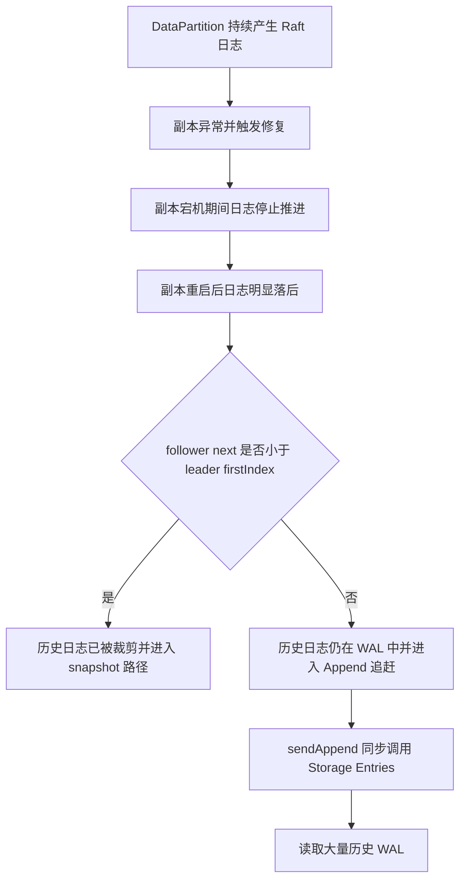
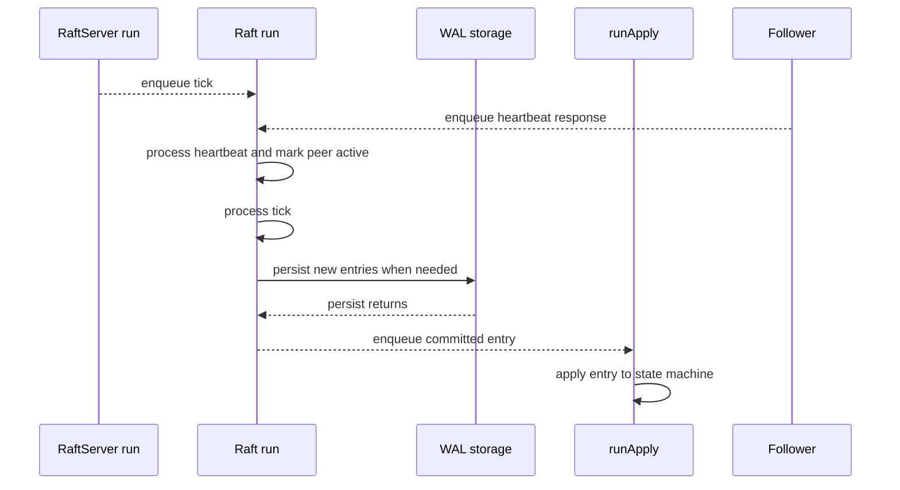
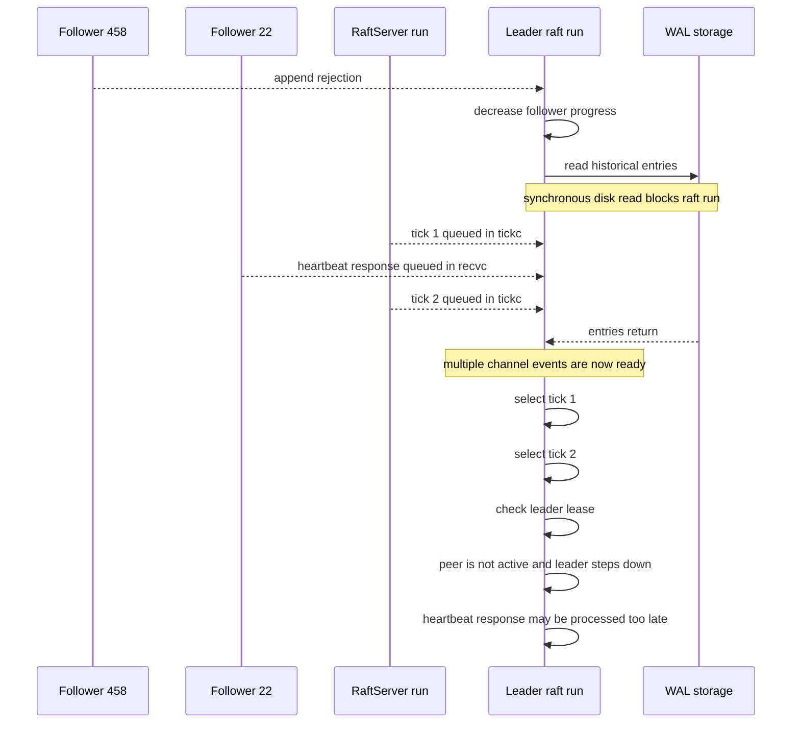
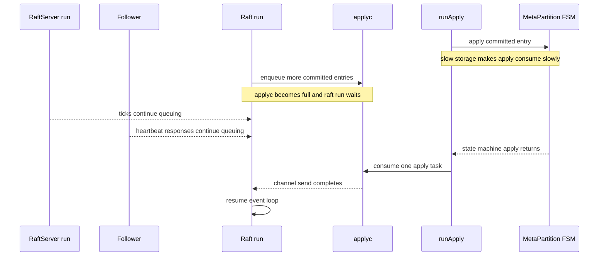
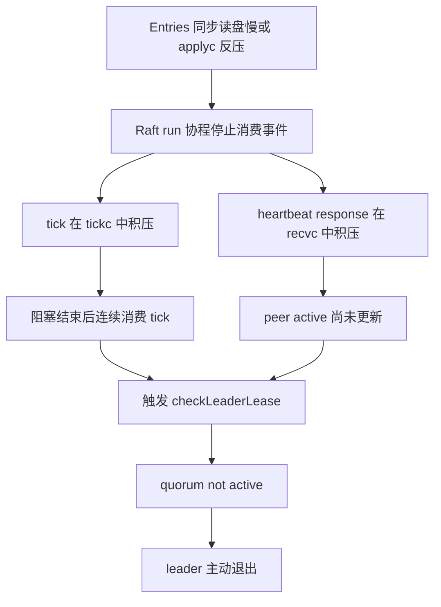
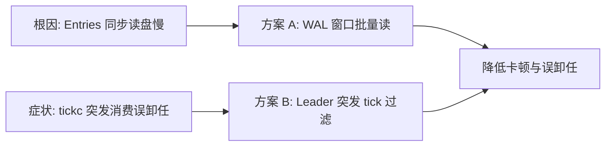
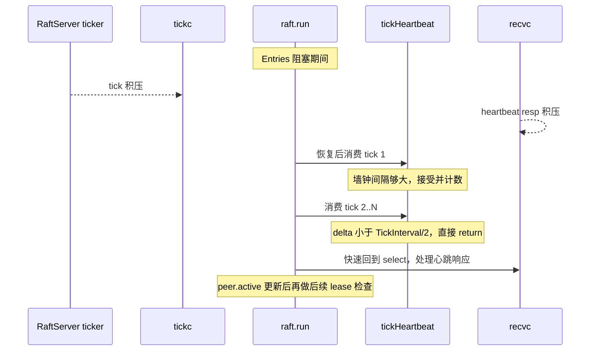

# Raft 落后副本追赶卡顿与误卸任优化分析

> 本文覆盖两条互补改动：
>
> 1. **WAL 窗口式批量读取**：缩短 `sendAppend -> Storage.Entries` 同步阻塞；
> 2. **Leader heartbeat 突发 tick 过滤**：避免 `tickc` 积压被瞬间消费后误触发 lease 卸任。

## 1. 背景

MetaPartition `5808` 在磁盘 IO 较高、某个 follower 严重落后的情况下，出现 leader 反复退出并重新选举：

```text
raft[5808] received msgApp rejection ... from 458
raft[5808] decreased progress of [458] ...
raft[5808] stepped down to follower since quorum is not active
```

当时的关键状态：

- leader 最新日志约为 `55185`；
- follower `458` 仅同步到约 `44502`，落后一万余条；
- `ElectionTick=3`，`TickInterval=2s`；
- Raft 开启了 `LeaseCheck`；
- follower `22` 可以正常参与 PreVote/Vote，说明节点间并非完全网络中断。

本次副本落后的典型形成过程如下：

1. DataPartition 在运行期间持续产生了较多 Raft 日志，leader 的日志 index 持续向前推进；
2. 集群检测到副本异常并触发副本修复；
3. 修复期间某个副本发生宕机，无法继续接收和应用新的 Raft 日志；
4. 副本重启后重新加入复制流程，但本地日志 index 已明显落后于 leader；
5. 该副本虽然落后较多，但其 `next` 仍未小于 leader 当前的 `firstIndex`，所需日志尚未被 WAL truncate；
6. 因此 leader 不会发送 snapshot，而是继续通过 Append 日志逐步追赶；
7. leader 为该副本组装 Append 消息时，需要从历史 WAL 中读取大量日志，从而进入本次问题涉及的 `sendAppend -> Storage.Entries` 路径。

对应的判断关系是：



本次属于图中的第二条路径：副本已经落后，但尚未落后到必须发送 snapshot。这个阶段容易被忽视，因为系统仍具备通过日志追赶恢复副本的能力，但同步读取大量历史 WAL 会给 leader 的 Raft 主循环带来明显延迟。

问题的直接表现是：节点可以完成选举，但 leader 在追赶落后副本期间无法及时处理 tick 和心跳响应，随后因多数派活跃检查失败而主动退出。

## 2. 故障链路

### 2.1 落后副本触发历史日志读取

leader 收到 follower 的 Append 拒绝后，会回退该副本的 `next`，并立即调用 `sendAppend`：

```text
stepLeader
  -> maybeDecrTo
  -> sendAppend
  -> raftLog.entries
  -> raftLog.slice
  -> Storage.Entries
  -> logEntryStorage.Entries
```

`sendAppend` 在 Raft `run` 协程内同步执行。只要 `Storage.Entries` 阻塞，当前 Raft group 就无法继续处理：

- tick；
- heartbeat response；
- Append response；
- proposal；
- Ready/persist/apply。

### 2.2 原读取方式按日志逐条访问磁盘

优化前，`logEntryStorage.Entries` 对范围内的每条日志调用一次 `logEntryFile.Get`：

```text
for each entry:
  index.Get(index)
  recordReader.ReadAt(offset)
    -> ReadAt(9-byte header)
    -> ReadAt(data + crc)
  Entry.Decode
```

每条日志至少产生两次 `ReadAt`。当一次 `sendAppend` 需要读取约 1MiB、日志条目又较小时，会产生数千次 `pread` 系统调用。

即使数据命中 page cache，大量系统调用和逐条分配也会带来明显开销；当磁盘 IO 已饱和或 page cache 未命中时，延迟会进一步放大。

### 2.3 Raft 主循环被阻塞

`Storage.Entries` 是同步接口，读取发生在 Raft `run` 协程中：

```text
Step
  -> sendAppend
  -> Storage.Entries  // 同步磁盘读
  -> 返回 run 循环
  -> persist/apply/send
  -> 下一次 select 才能处理 tick/heartbeat
```

本次场景中，`persist` 默认只 Flush 到文件/page cache，不一定执行 fsync；`apply` 也由独立协程执行。因此，在没有 apply 队列反压的前提下，主要可疑阻塞点是历史 WAL 的逐条读取。

#### 2.3.1 先理解三个执行单元

这里容易产生一个误解：心跳协程和 apply 协程并不会直接互相调用或互相加锁。真正把它们关联起来的是每个 Raft group 唯一的 `run` 协程。

- `RaftServer.run`
  - 节点级协程；
  - 定时产生 tick；
  - 聚合发送心跳；
  - 接收并拆分心跳响应；
  - 最终把 tick 和心跳消息投递给具体 Raft group。
- `raft.run`
  - 每个 Raft group 的核心事件循环；
  - 串行处理 `tickc`、`recvc`、proposal、Ready、truncate 等事件；
  - `Step -> sendAppend -> Storage.Entries` 在这个协程中同步执行；
  - 将已提交日志投递到 `applyc`。
- `raft.runApply`
  - 每个 Raft group 的状态机应用协程；
  - 从 `applyc` 取出日志；
  - 调用 MetaPartition 状态机更新 inode、dentry 等业务状态。

正常情况下的协作过程如下：



该正常路径有两个关键前提：

1. `raft.run` 能持续从 `tickc` 和 `recvc` 取事件；
2. `applyc` 有空间，`raft.run` 投递 apply 任务时不会等待。

#### 2.3.2 Entries 卡顿如何影响心跳

当 follower `458` 拒绝 Append 时，leader 会同步读取历史 WAL，准备下一批 Append。此时 `raft.run` 正在执行 `Storage.Entries`，无法同时处理其他 channel：



这张图说明：

- follower `22` 可能已经正常回了心跳；
- 心跳响应也可能已经进入 `recvc`，并未发生网络丢包；
- 但 `raft.run` 被同步读盘占用，尚未执行 `Step(RespMsgHeartBeat)`；
- 在执行 `Step` 之前，`peer.active` 不会被设置为 `true`；
- 磁盘读取结束后，`tickc` 和 `recvc` 同时存在待处理事件；
- Go `select` 不保证优先处理心跳，如果连续选中积压的 tick，就会先执行 lease 检查；
- 此时 lease 检查看到的是旧的 `peer.active=false`，从而错误地把“消息尚未处理”当成“peer 不活跃”。

因此，`Entries` 卡顿影响心跳的准确含义是：**它不一定阻止心跳在网络上传输，而是阻止 leader 的 Raft 状态机及时消费心跳响应并更新活跃状态。**

#### 2.3.3 apply 协程如何影响心跳

`apply` 通常是异步的。`raft.run` 只负责把 committed entry 写入 `applyc`，`runApply` 再异步执行状态机逻辑。

当 `applyc` 未满时，这一步很快，不会明显影响心跳：

```text
raft.run -> applyc -> runApply -> MetaPartition FSM
```

但 `applyc` 是有界 channel。如果磁盘 IO 高导致 MetaPartition 状态机应用变慢，`runApply` 消费速度可能低于 Raft 提交速度，最终使 `applyc` 填满。`raft.run` 向满 channel 写入时会同步等待：



所以 apply 对心跳的影响也是间接的：

```text
状态机 apply 慢
  -> runApply 消费 applyc 慢
  -> applyc 填满
  -> raft.run 投递 apply 时阻塞
  -> tick 和心跳响应积压
  -> 恢复后可能先消费多个 tick
  -> lease 检查失败
```

需要区分两种情况：

- `applyc` 未满：apply 真正异步执行，对 `raft.run` 影响很小；
- `applyc` 已满：异步队列产生反压，`raft.run` 会被阻塞，影响方式与 `Entries` 同步读盘类似。

在本次问题中，如果没有观察到 apply 队列持续堆积，首要怀疑点仍是 `sendAppend -> Storage.Entries` 的历史日志读取，而不是 apply。

### 2.4 tick 积压导致 lease 瞬间超时

RaftServer 每隔 `TickInterval` 向各 Raft group 的 `tickc` 投递一个 tick。`tickc` 是有缓冲 channel，因此 Raft `run` 协程阻塞期间 tick 不一定丢失，而是会积压。

当磁盘读取结束、`run` 协程恢复后，可能连续消费多个已经积压的 tick。这样会出现：

```text
真实时间内没有经过完整的 lease 窗口
  -> electionElapsed 却快速累计到阈值
  -> checkLeaderLease
  -> heartbeat response 仍在 recvc 中尚未处理
  -> peer.active 仍为 false
  -> quorum is not active
  -> leader 主动退出
```

因此，这个问题不要求心跳消息真正丢失。即使 follower `22` 网络正常、能够立即投票，也可能因为 leader 未及时处理其心跳响应而被判定为不活跃。

可以把最终触发条件概括为：



针对该链路，当前采用“降根因 + 防误判”双轨方案：

| 改动 | 作用点 | 效果 |
|------|--------|------|
| WAL 批量读取 | 缩短 `Storage.Entries` 同步占用 | 降低 tick/心跳积压概率 |
| Leader 突发 tick 过滤 | `tickHeartbeat` 入口按墙钟丢弃假 tick | 即使积压发生，也不让 `electionElapsed` 暴涨误卸任 |

### 2.5 落后副本与频繁换主形成正反馈

leader 变化时，各 follower 的复制进度会重新初始化。严重落后的副本需要重新 probe：

```text
leader 追赶落后副本
  -> 大量历史 WAL 读取
  -> run 协程阻塞
  -> tick 积压并触发 lease 失败
  -> leader 退出并重新选举
  -> follower progress 重置
  -> 再次 probe 和读取历史 WAL
```

该正反馈会使落后副本长期无法追上，并持续增加 leader 抖动概率。

## 3. 解决方案

整体方案分两层，彼此互补，互不替代：



### 3.1 目标

#### 方案 A：WAL 批量读取

不改变 Raft 协议和日志语义，重点降低追赶阶段读取历史 WAL 的开销：

- 保持 `Storage.Entries(lo, hi, maxSize)` 接口不变；
- 保持 `[lo, hi)` 范围语义不变；
- 保持 `maxSize` 历史语义不变；
- 将“每条日志两次 `ReadAt`”改为“窗口级批量 `ReadAt`”；
- 不使用 `Seek`，避免影响正在 append 的最后一个 WAL 文件的共享 offset；
- 保留 record type、CRC 和 entry index 校验。

#### 方案 B：Leader 突发 tick 过滤

不改变选举/复制协议，只修正 Leader 在 `tickc` 积压后被瞬间打爆 lease 的误判：

- 仅作用于 `tickHeartbeat`（Leader）；
- 不以“跳过 lease 判断但仍累加 elapsed”的方式实现，而是整次 tick 早退；
- Follower / Candidate 的 `tickElection`、以及 `tickElectionAck` 保持原语义；
- 单测通过 `disableBurstTickFilter` 关闭过滤，避免人工连打 tick 失效。

### 3.2 窗口式批量读取（方案 A）

在 `logEntryFile` 中新增批量读取能力：

```text
根据 lo 从内存 index 获取起始 offset
  -> 分配 1MiB~4MiB 读取窗口
  -> 一次 ReadAt 读取一批连续 WAL 字节
  -> 在内存中连续解析多个 record
  -> 窗口末尾只有半条 record 时保留剩余字节并续读
  -> 单条 record 超过窗口时扩大 buffer
```

窗口大小策略：

- `maxSize == 0` 或无限制读取：初始窗口 1MiB；
- 小于 1MiB：至少使用 1MiB；
- 常规读取：`maxSize + 64KiB`，为 record header、CRC 和超限条目预留空间；
- 普通初始窗口最大 4MiB；
- 单条 record 超过当前窗口时继续扩容，保证兼容大 entry。

### 3.3 内存 record 解码

新增 `decodeRecordFrom`，从内存 buffer 中解析：

```text
record type: 1 byte
data length: 8 bytes
payload:     dataLen bytes
crc:         4 bytes
```

处理规则：

- header 不完整：返回 `io.ErrUnexpectedEOF`，通知调用方续读；
- payload/CRC 不完整：返回 `io.ErrUnexpectedEOF`；
- record type 非法：返回 WAL corrupt 错误；
- data length 非法：返回 WAL corrupt 错误；
- CRC 不匹配：返回 WAL corrupt 错误；
- 解析成功后复制 payload，避免后续复用读取 buffer 时覆盖 `Entry.Data`。

### 3.4 滑窗处理

窗口末尾可能切在某条 record 中间，分为三种情况：

1. `rel > 0`
   - buffer 前部已有已消费 record；
   - 将末尾半条 record 移到 buffer 开头；
   - 从文件后续 offset 补齐。

2. `rel == 0 && left >= chunkSize`
   - 单条 record 大于当前窗口；
   - 扩大 buffer 后继续读取。

3. `rel == 0 && left < chunkSize`
   - 不完整 record 已经位于 buffer 开头；
   - 无需 copy，直接写入 `buf[left:]` 续读。

如果续读时已经到达文件末尾，说明 WAL 中确实存在截断 record，此时返回 corrupt 错误，而不是继续忽略。

### 3.5 跨 WAL 文件读取

`logEntryStorage.Entries` 仍负责跨文件：

```text
定位 lo 所在 logfile
  -> 计算当前文件的 fileHi
  -> 调用 logEntryFile.Entries 批量读取
  -> 累加 Entry.Size()
  -> 更新剩余 maxSize
  -> 必要时进入下一个 logfile
```

### 3.6 保持 maxSize 历史语义

原实现的限制规则是：

```text
先加入当前 entry
再累计 size
当 size > maxSize 时停止
```

因此，第一次使总大小超过 `maxSize` 的 entry 仍然需要返回。新实现保留该行为：

- `size == maxSize` 时继续读取下一条；
- 加入下一条后 `size > maxSize` 才停止。

这与 `raftLog.limitSize` 的现有行为一致，避免改变 Append 消息的日志选择逻辑。

### 3.7 Leader 突发 tick 过滤（方案 B）

#### 3.7.1 实现位置

| 文件 | 改动 |
|------|------|
| `depends/tiglabs/raft/raft_fsm.go` | 新增 `lastTickWall`、`disableBurstTickFilter`、`acceptLeaderHeartbeatTick()` |
| `depends/tiglabs/raft/raft_fsm_leader.go` | `tickHeartbeat` 入口调用 `acceptLeaderHeartbeatTick()`，不通过则直接 return |
| `depends/tiglabs/raft/raft_paper_test.go` | `newTestRaftFsm*` 默认 `disableBurstTickFilter=true` |
| `depends/tiglabs/raft/raft_fsm_leader_test.go` | 新增 `TestTickHeartbeatSkipBurstTicks` |

未改动：`tickElection`、`tickElectionAck`、`RaftServer.sendHeartbeat()`、`maybeChange` 调用点。

#### 3.7.2 判定逻辑

```text
tickHeartbeat:
  if !acceptLeaderHeartbeatTick():
      return          // 不累加 elapsed，不做 lease / resume / bcastReadOnly
  heartbeatElapsed++
  electionElapsed++
  ... 原逻辑
```

`acceptLeaderHeartbeatTick()`：

```text
若 disableBurstTickFilter == true:
  放行（单测）
若 lastTickWall 非零 且 now - lastTickWall < TickInterval/2:
  丢弃本次 tick（突发）
否则:
  更新 lastTickWall = now，放行
```

默认 `TickInterval=2s` 时阈值约为 1s。正常 ticker 间隔约 2s，不会误伤；`tickc` 积压后毫秒级连吃的 tick 会被丢掉。

#### 3.7.3 为什么要整次 return，而不是只跳过 lease

若只跳过 `checkLeaderLease` 但仍执行 `electionElapsed++`：

- 突发 tick 仍会把 `electionElapsed` 打满；
- 下一次“合法”tick 一到就会立刻触发检查；
- 突发 tick 仍占用 `raft.run`，心跳响应更晚处理。

整次 early return 的额外收益：`raft.run` 更快回到 `select`，有机会先消费 `recvc` 中的心跳响应，再更新 `peer.active`。

#### 3.7.4 与 run 循环的关系

```text
case <-s.tickc:
    s.raftFsm.tick()      // 内部可能因突发过滤直接 return
    s.maybeChange(true)   // 仍然调用；无 term/leader 变化时为空转
```

`maybeChange` 只关心 term/leader soft state，不依赖本次 tick 是否计数成功。突发跳过时它等价于 no-op；因过滤避免了误卸任，反而减少了 `lost leader` / `HandleLeaderChange` 的误触发。

网络心跳发送在 `RaftServer` ticker 的 `sendHeartbeat()` 路径，与 FSM `tickHeartbeat` 分离，**不会**因突发过滤而停止发包。

#### 3.7.5 恢复后时序（期望行为）



## 4. 为什么不直接使用 bufio

原始读取依赖日志 index 提供的随机 offset，并通过 `ReadAt` 读取。直接给每次 `Get` 包一层 `bufio.Reader` 存在两个问题：

- `bufio.Reader` 适合顺序流读取，频繁 Seek 会使缓冲失效；
- 最后一个 WAL 文件可能同时 append，修改共享 file offset 会引入并发干扰。

窗口式 `ReadAt` 同时具备：

- 不修改共享 file offset；
- 一次读取多个连续 record；
- 降低系统调用数量；
- 支持最后一个 WAL 文件边写边读。

## 5. 单元测试

新增测试覆盖以下内容：

### 5.1 窗口策略

- 默认窗口为 1MiB；
- 小 `maxSize` 不低于 1MiB；
- 中等 `maxSize` 加 64KiB 余量；
- 普通初始窗口不超过 4MiB。

### 5.2 record 解码

- 完整 record 正常解析；
- header 不完整；
- payload/CRC 不完整；
- 非法 record type；
- 非法 data length；
- CRC 错误；
- payload 深拷贝，确认不与读取 buffer 共享底层内存。

### 5.3 批量读取正确性

- 批量 `Entries` 与逐条 `Get` 结果一致；
- 中间范围 `[lo, hi)` 读取；
- 空范围；
- index 越界；
- `maxSize` 超限条目仍被包含；
- `size == maxSize` 时继续读取下一条。

### 5.4 窗口边界

- 多条约 300KiB 日志跨越 1MiB 窗口，覆盖滑窗路径；
- 单条日志超过 1MiB，覆盖 buffer 扩容；
- 单条日志超过 4MiB，覆盖多次扩容；
- WAL record 被截断，返回 corrupt；
- payload 被修改导致 CRC 错误。

### 5.5 跨文件

- 使用小 `FileSize` 强制 WAL rotate；
- 验证跨多个 logfile 的全量读取；
- 验证跨文件时 `maxSize` 的累计和剩余值传递。

### 5.6 Leader 突发 tick 过滤

- `TestTickHeartbeatSkipBurstTicks`：
  - 开启过滤（`disableBurstTickFilter=false`）；
  - 第一次 tick 正常计数；
  - 阈值内连续 tick 不推进 `electionElapsed`；
  - 等待 `TickInterval/2` 后下一次 tick 正常计数；
  - Leader 状态在突发过程中保持不变。

相关命令：

```bash
go test ./depends/tiglabs/raft/ \
  -run '^TestTickHeartbeatSkipBurstTicks$' -count=1
```

## 6. 性能验证

性能测试模拟 `sendAppend` 一次读取约 1MiB 历史日志：

- 每条 payload 为 256B；
- 约读取 3841 条日志；
- `Get` 路径每条产生两次 `ReadAt`；
- `Entries` 路径按窗口批量读取；
- 测试前预热 page cache，降低两条路径缓存状态差异。

普通性能测试的一次结果：

```text
Get     (2*ReadAt/entry): avg=95.34ms
Entries (batch ReadAt):   avg=25.50ms
批量读取约为逐条 Get 的 3.74 倍
```

Go benchmark 的一次结果：

```text
BenchmarkGet1MB-6       21.85ms/op   48.00 MB/s
BenchmarkEntries1MB-6   17.18ms/op   61.03 MB/s
```

两组结果存在差异是正常的：

- benchmark 的迭代和 GC 行为不同；
- 数据处于 page cache 时，磁盘等待时间被弱化；
- 批量路径当前会分配读取窗口并复制 payload，内存分配高于逐条路径；
- 真实磁盘 IO 高或 page cache 未命中时，减少 `pread` 次数的收益通常更明显。

性能测试不设置严格的“必须快 N 倍”断言，避免 CI 机器负载、文件系统和 page cache 状态造成不稳定失败。测试只强校验两条路径读取的日志条数和总大小一致，性能结果通过日志和 benchmark 输出观察。

运行方式：

```bash
go test ./depends/tiglabs/raft/storage/wal/ \
  -run '^TestEntriesBatchVsGet1MBPerf$' -v -count=1

go test ./depends/tiglabs/raft/storage/wal/ \
  -run '^$' \
  -bench 'Benchmark(Get|Entries)1MB$' \
  -benchmem -count=1
```

## 7. 验证结果

### 7.1 WAL 批量读取

```bash
go test ./depends/tiglabs/raft/storage/wal/ -count=1 -timeout 180s
```

全量执行时曾出现仓库已有 WAL recovery 测试失败；单独重跑 recovery 测试通过：

```bash
go test ./depends/tiglabs/raft/storage/wal/ \
  -run '^TestAutoFixLastIndexLogEntryFile_' \
  -count=1 -timeout 180s
```

该现象需要与本次批量读取改动分开看待：失败用例测试的是 WAL 启动恢复和尾部自动修复，单独重跑通过，表现更像测试间临时目录或执行环境干扰。当前新增批量读取测试和性能测试均已通过。

### 7.2 Leader 突发 tick 过滤

```bash
go test ./depends/tiglabs/raft/ \
  -run '^TestTickHeartbeatSkipBurstTicks$' -count=1
```

该用例已通过。既有依赖人工连打 tick 的 FSM 测试通过 `disableBurstTickFilter=true` 保持原行为。

## 8. 影响范围评估

### 8.1 代码与模块影响

| 模块 | 改动 | 影响面 |
|------|------|--------|
| `storage/wal/log_file.go` | 窗口批量 `Entries` | 仅 WAL 读路径 |
| `storage/wal/log_storage.go` | 跨文件批量 + remain | 仅 `Storage.Entries` |
| `storage/wal/record_reader.go` | `decodeRecordFrom` | 批量解码辅助 |
| `storage/wal/storage.go` | Entries 耗时 debug 日志 | 可观测性 |
| `raft_fsm.go` | `acceptLeaderHeartbeatTick` | Leader tick 计数 |
| `raft_fsm_leader.go` | `tickHeartbeat` 入口过滤 | 仅 Leader FSM tick |
| 测试 / 文档 | 批量读测试 + 突发 tick 测试 + 本文 | 无生产语义 |

**明确不在改动范围内：**

- Follower / Candidate 选举超时（`tickElection`）；
- `tickElectionAck`；
- `RaftServer.sendHeartbeat` 网络心跳发送；
- Raft 日志格式、HardState、snapshot 协议；
- `maybeChange` / persist / apply 主逻辑（调用关系不变）。

### 8.2 对关键 Raft 流程的影响

| 流程 | 方案 A（批量读） | 方案 B（突发 tick 过滤） |
|------|------------------|--------------------------|
| Leader lease | 间接：减少卡顿，降低误判概率 | 直接：丢弃假 tick，避免 `electionElapsed` 暴涨 |
| 网络心跳发送 | 无 | 无（Server 层独立发送） |
| 心跳响应处理 | 间接：`run` 更早恢复 | 间接：跳过假 tick 后更快回到 `select` |
| 复制 `resume()` | 无直接改动 | 突发 tick 不连打 resume；最多偏慢约 1 个真实 tick |
| ReadOnly / ReadIndex | 无直接改动 | `bcastReadOnly` 同挂 heartbeat 周期，突发时不连发 |
| 日志复制 / commit / apply | 读加速，语义不变 | 无直接语义影响 |
| Follower 选举 | 无 | 无（未加过滤） |
| `maybeChange(true)` | 无 | 仍每次调用；跳过时多为空转；减少误 `lost leader` |
| 角色切换后首 tick | 无 | `lastTickWall` 可能残留，最坏多等约 `TickInterval/2` |

### 8.3 方案 B 的语义取舍

过滤**不会补偿**卡顿期间真实流失的时间：

```text
旧：卡顿后连吃 N 个积压 tick → elapsed 暴涨 → 易误卸任
新：卡顿后只接受墙钟合格的 tick → elapsed 贴近真实经历，偏保守维持 Leader
```

对当前故障（误卸任导致反复选举）这是正确方向。真正长时间 quorum 不活跃时，后续合法 tick 仍会触发 `checkLeaderLease`。

### 8.4 风险与边界

| 风险点 | 严重度 | 说明 |
|--------|--------|------|
| Timer jitter 误杀合法 tick | 低 | 阈值 `TickInterval/2`，正常抖动远小于此 |
| 时钟回拨 / 异常短间隔 | 低～中 | 可能连续跳过；可后续对 `delta<=0` 加强处理 |
| 批量读仍同步阻塞 | 中 | 大块读盘仍可能卡住 `run`，需与方案 B 配合 |
| `ElectionTick` 过小 | 中 | lease 窗口仍紧，运维侧需评估 |
| `tickc` full 丢 tick | 不变 | 原有告警路径未改 |
| 单测关闭过滤 | — | 仅测试夹具，生产默认开启 |

## 9. 收益与限制

### 9.1 预期收益

**方案 A：**

- 将约 1MiB 日志的数千次逐条 `ReadAt` 降为少量窗口级 `ReadAt`；
- 缩短 `sendAppend` 同步占用 Raft `run` 协程的时间；
- 减少 tick 和 heartbeat response 在 channel 中积压；
- 加快严重落后 follower 的日志追赶。

**方案 B：**

- 抑制 `tickc` 突发导致的假 lease 超时卸任；
- 积压 tick 早退后，更利于及时处理 `recvc` 心跳响应；
- 降低“追赶 → 误卸任 → progress 重置 → 再追赶”正反馈。

### 9.2 不能解决的问题

- 磁盘单次大块读取仍可能长时间阻塞（方案 A 仍是同步读）；
- WAL fsync、apply 队列反压也可能阻塞 Raft `run`；
- 落后副本超过日志保留范围后仍需要 snapshot；
- `ElectionTick` 过小仍会放大短暂卡顿；
- 严重落后副本会降低 quorum 冗余；
- 方案 B 不消除卡顿本身，只降低卡顿后的误判危害。

## 10. 后续建议

1. 处理或重建严重落后的副本，恢复多数派冗余。
2. 评估将 `ElectionTick` 从当前较小值调大，降低短暂 IO 抖动导致的 leader 退出。
3. 检查 `raftRetainLogs`，避免 follower 过早掉出日志窗口。
4. 将 Raft WAL 与业务 RocksDB/数据盘隔离，降低 IO 竞争。
5. 为 `Storage.Entries` 延迟增加可采集指标，重点观察 P95/P99，而不是仅依赖 debug 日志。
6. 观察 `skip burst leader heartbeat tick` 日志频率：过高说明 `run` 仍经常卡顿。
7. 后续可考虑复用读取 buffer 或减少 payload 二次拷贝，以降低批量路径的分配量。
8. 若仍存在秒级阻塞，可评估异步预读、把历史日志读取移出 Raft `run`，或在重 IO 返回后 `resetTick()` 清空积压；改动和并发风险更大，需单独设计。

## 11. 结论

本次问题的核心不是 follower 无法投票，也不一定是网络丢失，而是：

```text
严重落后 follower
  -> leader 在 sendAppend 中同步逐条读取历史 WAL
  -> 高磁盘 IO 放大读取延迟
  -> Raft run 协程无法及时处理 tick 和 heartbeat response
  -> tick 积压后被快速消费
  -> checkLeaderLease 在心跳响应尚未处理时判断 quorum 不活跃
  -> leader 主动退出并重新选举
```

当前落地的完整对策：

```text
方案 A: 窗口式批量 ReadAt
  -> 降低 Entries 同步阻塞与系统调用

方案 B: Leader tickHeartbeat 墙钟突发过滤
  -> 即使仍有积压，也不让假 tick 打爆 lease
```

二者在不改变 Raft 协议与 WAL 格式的前提下低侵入落地：A 降根因概率，B 降误卸任危害。仍需配合副本修复、合理选举超时和磁盘隔离，才能完整改善稳定性。
