## Environment

centos 

Unsupported for Ubuntu

## Dependence

fuse


## Compile

- Overall compilation

method1：make

method2：./build/build.sh

- Compile separately deploy

./build/build.sh deploy

**note：**After the overall compilation is completed, separate compilation can be used for the testing phase of cfs deploy

## Use Flow

1. System environment：centos

2. Installation dependencies

`yum install fuse`

3. Import environment variables

`export CUBEFS=/path/to/cubefs`

4. Enter build/bin，execute ./cfs-deploy

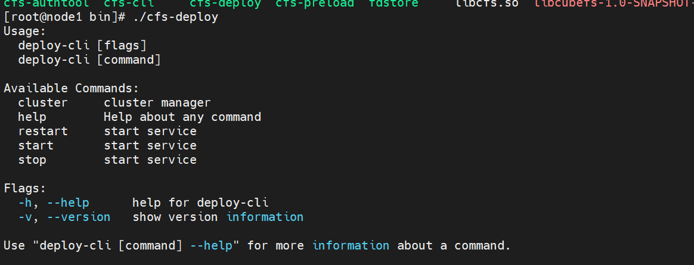

5. load profile

`./cfs-deploy cluster config -f ../../config.yaml `

Generate configuration files in the 'deploy/conf' directory

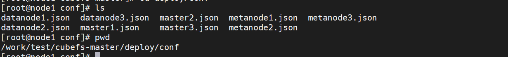

6. Initialize the cluster in the configuration file

`./cfs-deploy cluster init`


7. 启动服务

`./cfs-deploy start -a`


Configure master node information

./cfs-cli config set --addr 192.168.128.128:17010

8. Cluster information viewing

`./cfs-deploy cluster info`
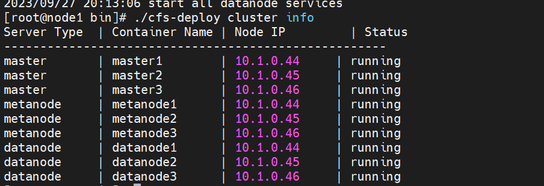

9. Create volume

`./cfs-cli volume create ltptest ltptest`

10. Viewing User Information

`./cfs-cli user list`

Fill the ACCESS KEY and SECRET KEY into the corresponding client.json configuration file, which is located under 'docker/conf'

11. Mount volume

 `./cfs-client -f -c /work/cubefs-master/docker/conf/client.json &`

`df `view 

note：If fuse is not installed, it will fail

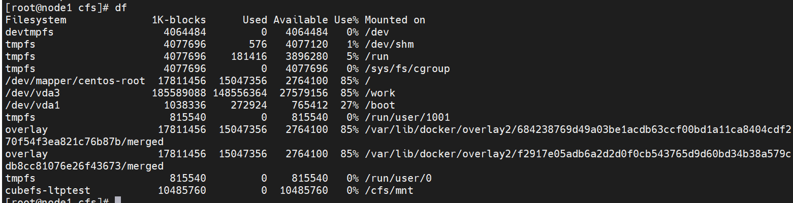

12. Kill the backend process for mounting the volume first, then delete the volume, and then stop the service

## profile
### example
```yaml
global:
  ssh_port: 22
  container_image: docker.io/cubefs/cbfs-base:1.0-golang-1.17.13
  data_dir: /data
  variable:
    target: 0.0.1


master: 
  config:
    listen: 17010
    prof: 17020
    data_dir: /data

metanode:
  config:
    listen: 17210
    prof: 17220
    data_dir: /data

datanode:
  config:
    listen: 17310
    prof: 17320
    data_dir: /data


deplopy_hosts_list:
  master:
    hosts:
      - 10.1.0.44
      - 10.1.0.45
      - 10.1.0.46
  metanode:
    hosts:
      - 10.1.0.44
      - 10.1.0.45
      - 10.1.0.46
  datanode:
    - hosts: 10.1.0.44
      disk:
        - path: /data/disk0
          size: 10737418240
    - hosts: 10.1.0.45
      disk:
        - path: /data/disk0
          size: 10737418240
    - hosts: 10.1.0.46
      disk:
        - path: /data/disk0
          size: 10737418240


```
### illustrate

data_dir:Prioritize reading locally customized values.


## Command
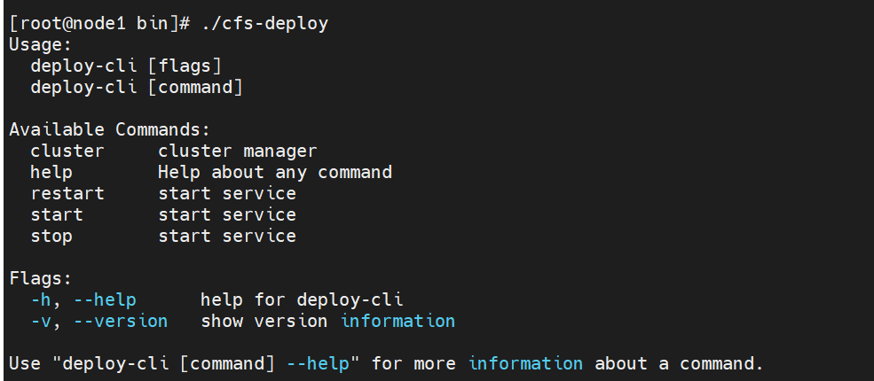
### start
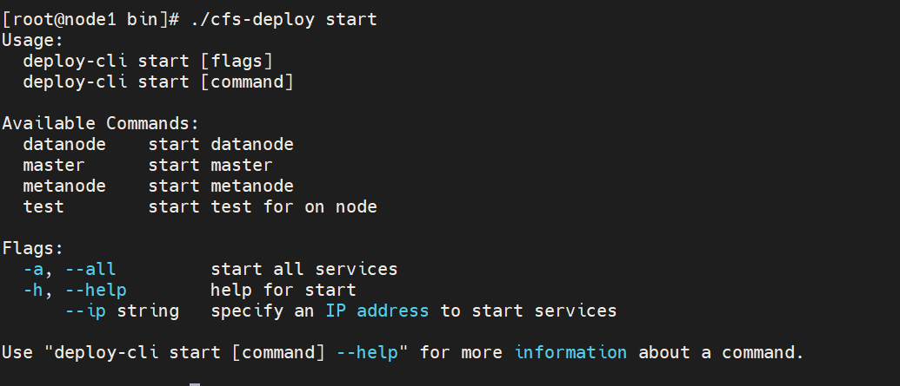
`./cfs-deploy start master`
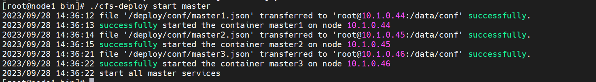
`./cfs-deploy start metanode`
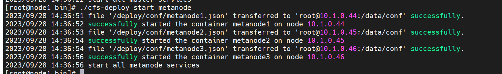
`./cfs-deploy  start metanode  --ip 10.1.0.44`
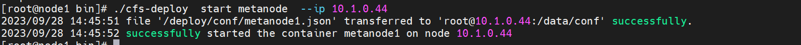
`./cfs-deploy start datanode`
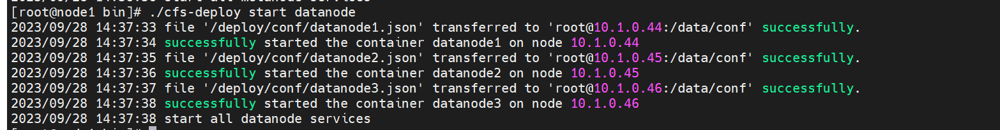
`./cfs-deploy  start datanode  --ip 10.1.0.44`
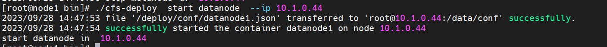
`./cfs-deploy  start -a`
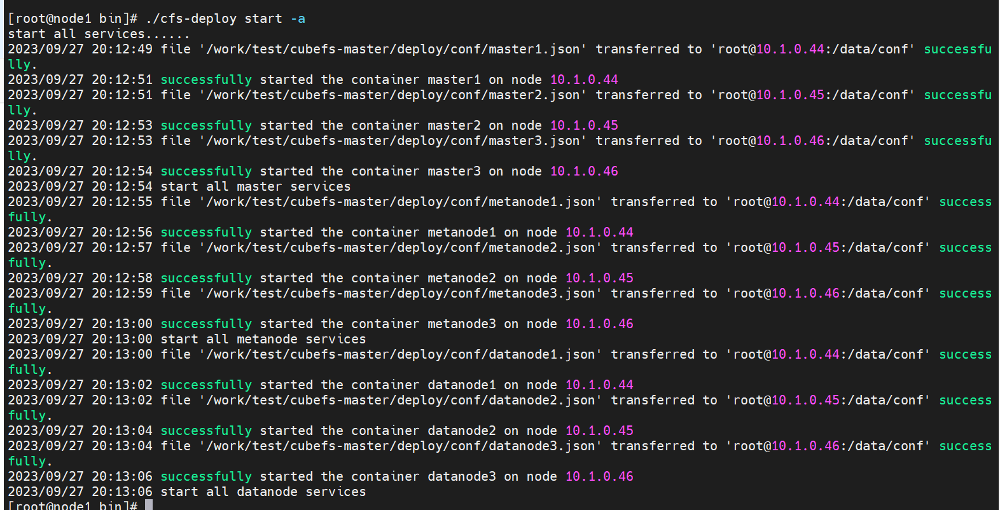

`./cfs-deploy start test --disk /data`

Starting a standalone test will start the cubefs service orchestrated in Docker Compose mode.

### stop
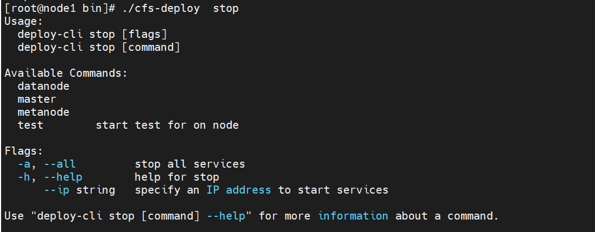
`./cfs-deploy  stop master`
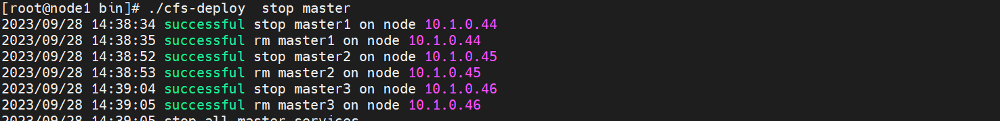
`./cfs-deploy  stop metanode`
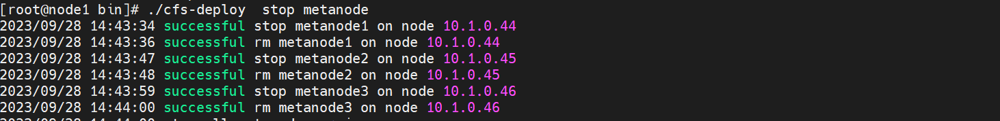
` ./cfs-deploy  stop metanode  --ip 10.1.0.44`
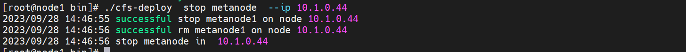
`./cfs-deploy  stop datanode`
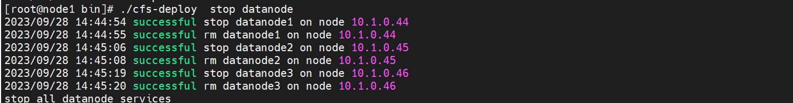
`./cfs-deploy  stop datanode  --ip 10.1.0.44`
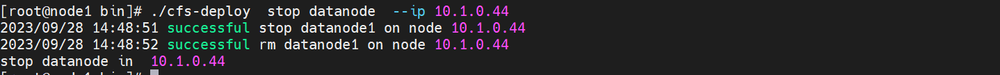
`./cfs-deploy  stop  -a`
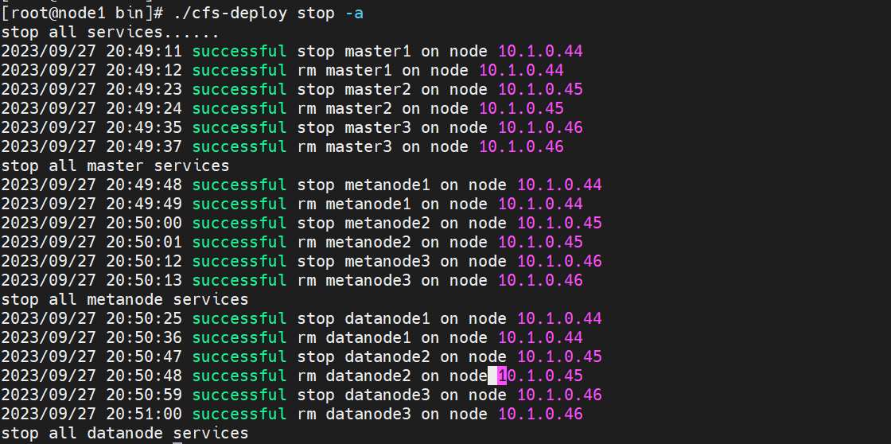

`./cfs-deploy stop test`

Stop testing cluster

### restart
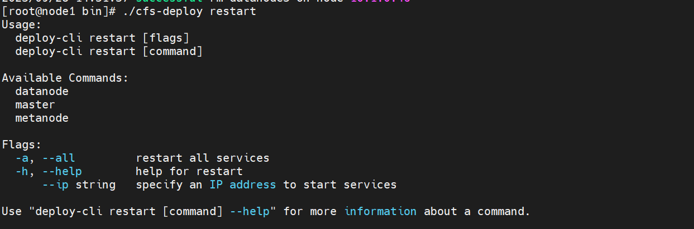
`./cfs-deploy restart -a`
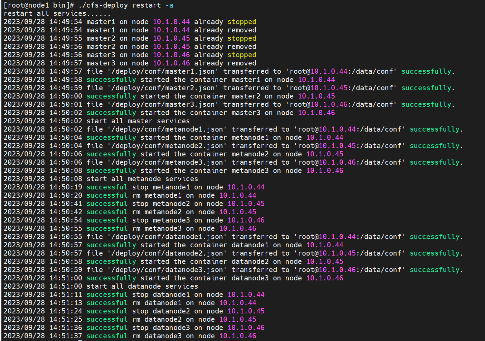
`./cfs-deploy restart master`
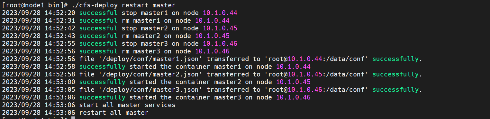
`./cfs-deploy restart metanode`
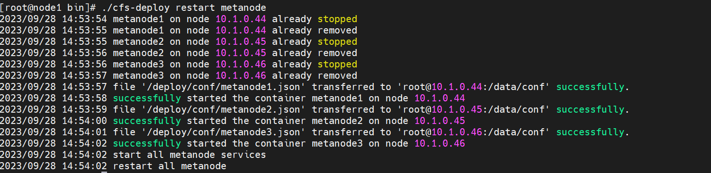

`./cfs-deploy restart metanode --ip 10.1.0.44`
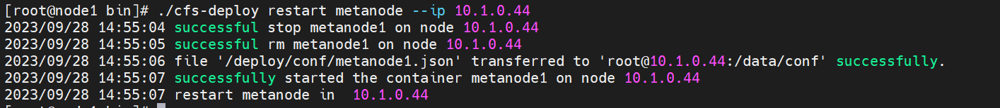
`./cfs-deploy restart datanode`
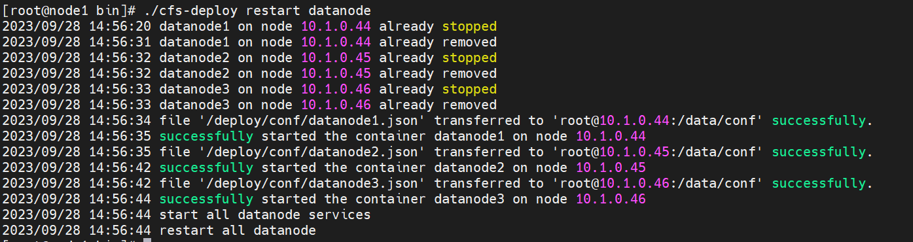
.`/cfs-deploy  restart datanode --ip 10.1.0.44`
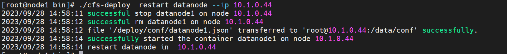
### cluster
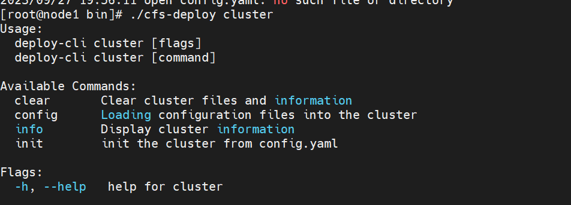
`./cfs-deploy cluster config -f [filename]`
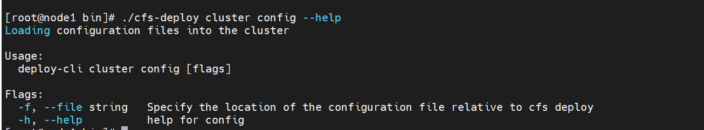

`./cfs-deploy cluster init`
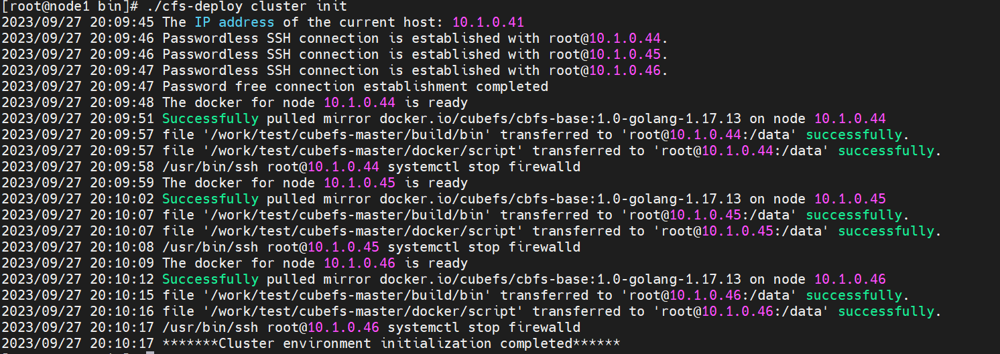

`./cfs-deploy cluster info`
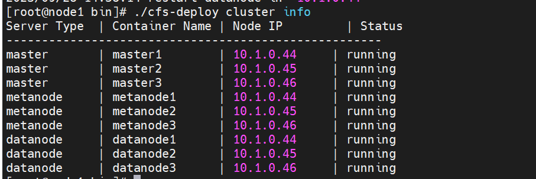
` ./cfs-deploy cluster clear`

Unable to clear mirrors in the cluster while the container is still running

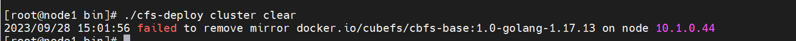
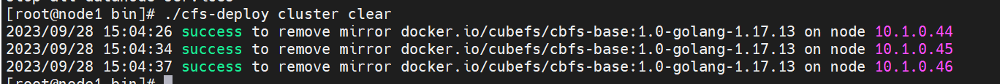


