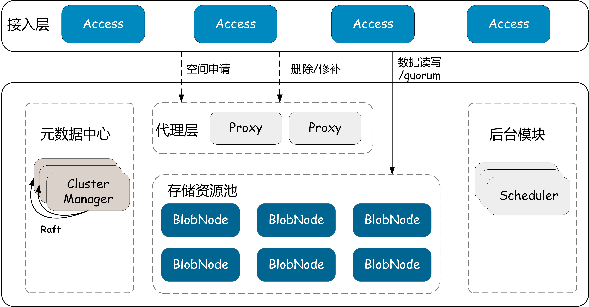
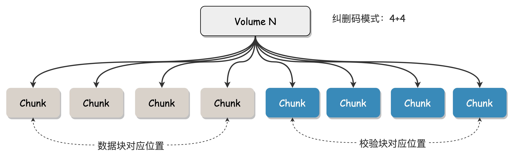
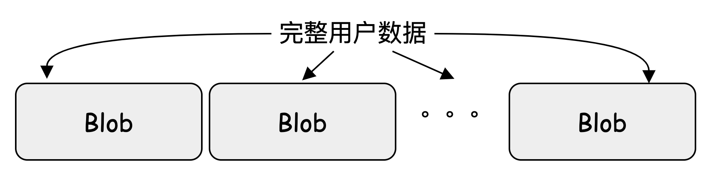
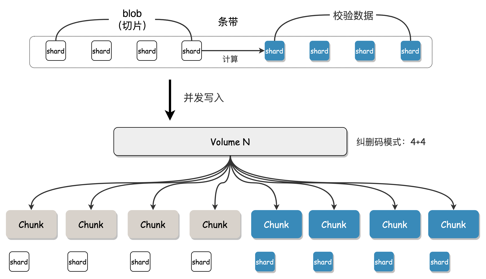
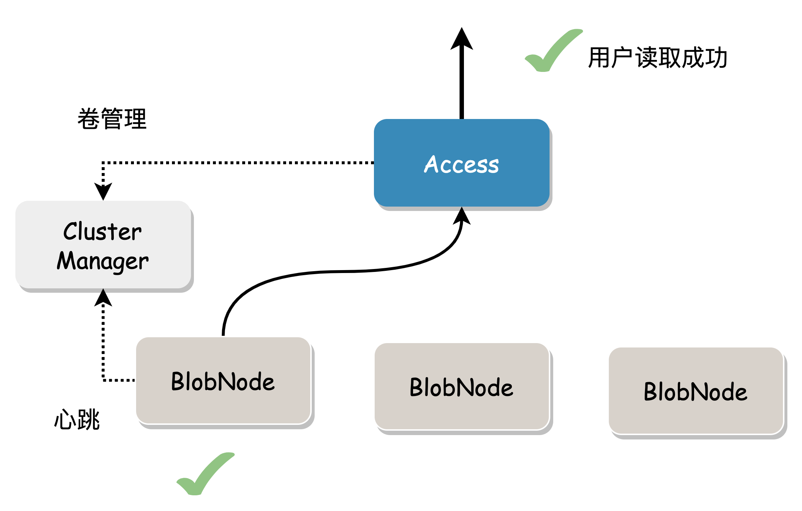
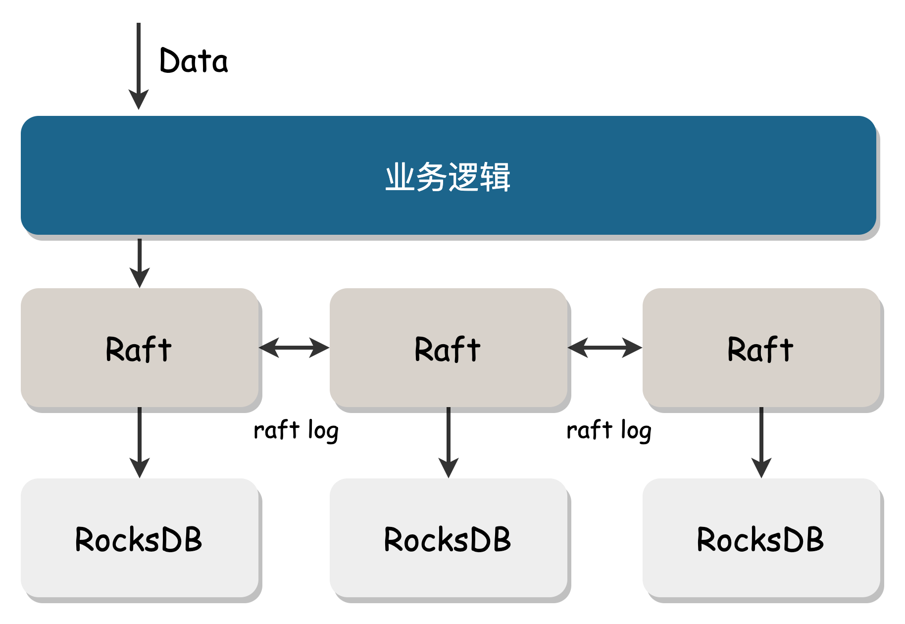
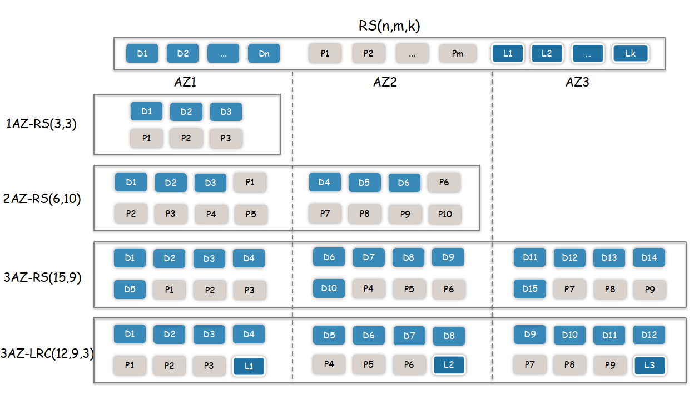
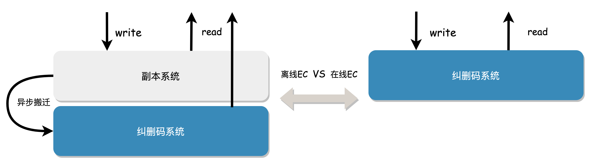
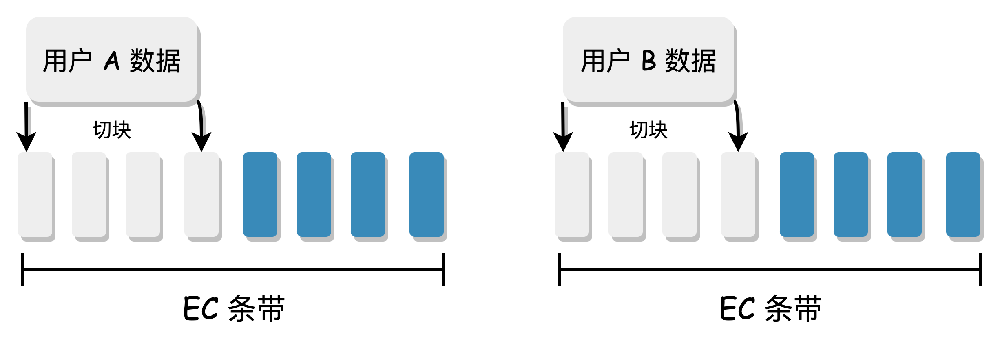

# Erasure Code Subsystem

Before CubeFS 3.0.0, only multi-replica storage was provided. As data scales continue to grow, businesses face greater cost challenges, and the demand for lower-cost erasure codes (EC) becomes increasingly strong.

CubeFS recently released version 3.0.0, one of its key features being the addition of support for EC (the Erasure Code section in the figure below). EC will significantly reduce data redundancy and optimize storage costs, providing strong support for larger-scale storage needs.

## System Features

CubeFS's erasure code storage subsystem (BlobStore) is a highly reliable, highly available, low-cost, independent key-value storage system that supports EB-scale storage. Its main features are:

1. Uses Reed-Solomon encoding, a concise online EC architecture
2. Dynamically configurable EC modes: supports various specifications such as "6+3", "12+3", "10+4", etc.
3. Flexible multi-AZ deployment: supports deployment with 1, 2, or 3 different AZs
4. Uses Raft protocol to ensure strong consistency and high availability of metadata
5. High-performance storage engine: optimized for small files, efficient garbage collection mechanism

## Architecture

*Module Introduction*

* Access: Request access gateway, providing basic operations such as data read, write, and delete.
* BlobNode: Single-machine storage engine, managing the disk data of the entire machine, responsible for persistent storage of data, executing volume repair, migration, and recycling tasks.
* ClusterManager: Metadata management module, responsible for managing cluster resources (such as disks, nodes, storage space units).
* Proxy: ClusterManager and asynchronous message proxy module, providing data write space allocation, delete and repair message forwarding, etc.
* Scheduler: Asynchronous task scheduling center, responsible for generating and scheduling tasks such as disk repair, disk offline, data balancing, data inspection, data repair, and data deletion.

## Glossary

**Volume**

A logical storage space unit with a fixed upper capacity limit (such as 32G, becoming immutable when written to 32G). The Volume is identified by the Volume ID, and its creation, destruction, and allocation are managed by ClusterManager. **Different Volumes support different EC modes**.

The cluster's allocatable space is composed of Volumes. Access requests an available Volume before writing data and queries the Volume corresponding to the data before reading it.

**Chunk**

A Chunk is the basic unit of a Volume, a container for storing data, uniquely identified by the Chunk ID, corresponding to a segment of actual physical storage space on the disk. The creation and destruction of Chunks are managed by BlobNode. Multiple Chunks are combined into a Volume according to the erasure code encoding mode, and the binding relationship between Chunks and Volumes is persisted in ClusterManager.

Taking the "4+4" erasure code mode (i.e., n=4 data blocks and m=4 parity blocks) as an example, this Volume consists of 8 Chunks. These 8 Chunks are scattered across the disks of different machines.

**Blob**

A Blob is the data size calculated by one EC calculation of user data. It is split by `Access`, uniquely identified by `BlobID`, and `BlobID` is uniformly managed and allocated by ClusterManager to ensure global uniqueness.

Assuming the system's preset Blob size is 8M, and there is currently 200M of user data, it will be split into 25 ordered Blobs, which are written to a Volume first. When the current Volume space is insufficient, the remaining Blobs can be written to other Volumes.

**Shard**

A Shard is the unit of data in an EC stripe. As mentioned earlier, a Volume consists of multiple Chunks, and when a Blob is written to a Volume, it is split into multiple blocks and written to different Chunks. **Each small block of data is called a Shard, and one Shard corresponds to writing one Chunk**.

Assuming a user Blob data size of 8M and a Volume erasure code mode of "4+4", Access will split the Blob into 4 original data blocks of 2M each, and then calculate 4 redundant check blocks of 2M each. These 8 2M blocks are all called Shards, and these Shards will be written to the various Chunks bound to the Volume, completing the EC encoding and storage process.

## Data Read/Write Process

**Write Process**

1. Access requests one or more available volumes with sufficient space.
2. Access sequentially receives user data, splits it into Blobs, splits it into N data blocks according to the EC encoding mode, and then calculates M check blocks. Each data block and check block represents a Shard.
3. Concurrently write these Shards to the chunks mapped to the volume.
4. Blob writing uses a quorum model, where success is achieved when a majority (>n) of Shards are written successfully. If a Shard write fails, a repair message is sent to Proxy for asynchronous repair, ultimately achieving data integrity. In the figure below, the erasure code mode is 2+1, and the user data generates 3 Shards (two data blocks and one check block), which are concurrently written to BlobNode. Under normal circumstances, all 3 will succeed. In case of exceptional circumstances, writing more than two copies is also considered successful.
   
5. Access returns the corresponding data location information (Location) to the user, who needs to save this information for reading the data.

**Read Process**

In the absence of data damage, read the specified length (Range) of data based on the data location information and return it directly.

When the data block to be read is damaged or the node where the data is located fails, data from other nodes needs to be read to repair the data.

This may cause some degree of read amplification because it must read enough data blocks to calculate the required data.

Cost considerations: We always hope to read local data and return it to the user. In multi-AZ mode, repair reads are preferred, and complete data is calculated using the data blocks and check blocks stored in this AZ. This reduces IO time and network bandwidth between AZs, and trades calculation time for bandwidth costs.

Tail latency is optimized through backup requests: to obtain the complete Blob, read n Shard data normally. In practice, n+x (1< x <= m) Shard read requests can be sent, and any of the first n responses can be used to obtain the original Blob, gracefully handling tail latency caused by network timeouts, node load, slow or failed disk IO.

## Metadata Center

The metadata center (ClusterManager) is responsible for creating and allocating volumes and managing the status information of cluster storage nodes. It also provides service registration for stateless components.

ClusterManager is deployed on multiple nodes and uses the Raft protocol to ensure consistency. It uses RocksDB as the underlying storage, and benefits from RocksDB's batch aggregation feature, providing high throughput.

## Access Module

Access is the access layer module, responsible for data transmission, slicing, EC encoding and decoding, and flow control.

### Blob Sharding

User data is split into multiple contiguous Blobs of a certain size and scattered across multiple physical nodes in the cluster. In concurrent scenarios, read and write requests can fully utilize all cluster resources.

### Concurrent Optimization

Each Blob corresponding to the write data process is split into multiple Shards, which are concurrently written. The construction of multiple Shard data in the read process and the sending of data to the user are pipeline parallel, saving network IO time.

### Quorum Mechanism

EC mode requires more data blocks to be written than replica mode, often requiring multiple locations to be written for one piece of data. For example, 3 replicas only need to be written 3 times, while 3+2 EC mode requires 5 writes. In the case of a certain failure rate for a single write, the overall failure rate of EC mode is higher. To improve availability, Access uses a quorum mechanism that allows a certain number of write failures, as long as the recoverable conditions of EC are met. After a Quorum write succeeds, the failed data blocks are repaired through an asynchronous process to achieve final data integrity.

### EC Encoding and Decoding

We use RS (Reed-Solomon) encoding and decoding, which has low redundancy but high data durability. In multi-AZ deployments, LRC encoding can be configured, adding one local check block in each AZ, which can significantly reduce the probability of cross-AZ reads during data repair, thereby reducing cross-data center bandwidth transmission and accelerating data repair.

### Small File Optimization

Online EC for small files can cause significant IO amplification. For example, for a 128K file, after splitting, the Shard is stored in 4+4 locations, and at least 4 network requests are required for repair reads to construct the complete data. Our optimization solution is to write smaller files to fewer data blocks as much as possible to reduce network requests during reading. Writing performance is not significantly reduced, but reading performance is greatly improved.

For example, assuming the Blob threshold is 4M, the erasure code mode is "4+4", and the Shard threshold is 1M. There is currently 128K of user data. If split in the conventional way, 128K is split into 4 parts, each part is 32K:

This slicing method requires at least 4 network requests for multiple IOs when the user reads 128K data, and the probability of exceptions is higher.

Our solution uses space to trade time, requiring only one network request to obtain complete data. All 128K user data is written to the first data block, and the remaining three data blocks are replaced with blank data. When downloading, as long as the useful data block or any check block can be correctly obtained, all user data can be repaired.

## Storage Engine

As a single-machine storage engine, BlobNode manages all disk storage space on the local machine, organizes user data on disk and in memory, and provides interfaces for data reading, writing, deletion, and repair.

### Key/Value Separated Storage

Key and Value are stored separately, suitable for large and medium-sized Value storage. The idea of separating key/value storage was proposed in 2016 in the paper "WiscKey: Separating Keys from Values in SSD-Conscious Storage" (https://www.usenix.org/system/files/conference/fast16/fast16-papers-lu.pdf). Since then, many practical projects have emerged, and this idea has also been adopted in the storage engine of the BlobStore system.

Each disk is divided into metadata and data parts, as shown below:

The metadata of the Shard is stored in the LSM Tree, and the actual data is stored in a large sequential file (Chunk File). Since the amount of data in the LSM Tree is small, the impact of compaction is minimal, and it is almost impossible to encounter compaction during actual operation. The metadata can also be centrally placed on high-performance SSD media, with SATA disks used to handle user data.

Chunks are essentially large files with a size limit and only support Append writes, making them friendly to HDDs.

### High Reliability Design

### Data Protection Design

Disk hardware failures are common (such as bad sectors and silent errors), and the system must be able to detect data corruption to ensure that only normal data is returned to the upper-level business.

**Key Metadata**

The LSM Tree has its own crc protection. The sst file consists of blocks:

Each block has crc protection:

When a silent error occurs on the disk, it can be detected in time to avoid reading incorrect data. When the upper layer perceives an error in this node, it only needs to reconstruct the data through other nodes to obtain the correct data.

**Value Data Format**

User data is stored in the Chunk File, which is a large aggregate file. It has its own protection design. A Chunk consists of a header and Shards:

Each Shard is protected separately, with its own magic delimiter and internal block protection (rather than a single crc for each Shard, which provides finer-grained protection):

**Fallback Design**

Considering that the metadata stored in the LSM is centrally stored, if it is lost, it may have a significant impact. Therefore, when writing Shard data to the Chunk File, a backup of the metadata is made in the header and footer. In extreme cases, even if all the metadata in the LSM is lost, the index data can be reconstructed by parsing the Chunk file, thus restoring the index data. During read/write/delete, data can also be protected by double verification.

### Efficient Garbage Collection

Traditional garbage collection usually uses a mark-and-sweep method followed by asynchronous compaction. The compaction process involves a large amount of disk read and write, which has obvious drawbacks:

1. Large disk IO overhead: The compaction process reads the old file, writes the new file, and then deletes the old file, which can easily cause long-term random IO, slow speed, low efficiency, and also affect normal business IO.
2. Low space utilization: Due to the large disk IO overhead of the compaction process, to reduce the number of compactions, garbage data is generally accumulated to a certain threshold before compaction is performed, which can lead to untimely space reclamation and reduced disk storage utilization.

The garbage collection process of BlobNode is as follows:

1. First, delete the index entry of the data in the LSM.
2. Then, use the system call `fallocate` to create a "hole" of the corresponding size at the specified position in the Chunk File.

The garbage collection mechanism of BlobNode fully utilizes the "punch hole" function of the file system. When deleting data and punching holes, the system releases the space in the file hole, the remaining part of the file offset remains unchanged, and the file size is correspondingly reduced, so that garbage space can be quickly released without organizing the file.

The efficient garbage collection method of BlobNode can solve the large IO overhead caused by the traditional garbage collection compaction process, improve storage space utilization, and is very suitable for business scenarios with a large amount of deletion.

### Append Writing

Overwriting is one of the most common scenarios for data corruption. The design of the Chunk File ensures that data is always written in Append mode, and there is no overwrite scenario. The written position can only be read, maximizing the sequential access performance of mechanical disks.

## Best Practices

### Multi-AZ Deployment

BlobStore supports multi-AZ deployment, and 1AZ, 2AZ, and 3AZ are all perfectly supported, just configure the corresponding EC encoding mode. Assuming that the "15+9" encoding mode is used for 3AZ, if any AZ fails and all data is completely destroyed (8 copies), the remaining data in the other two AZs (16 copies) can be used to repair all data in the failed AZ, achieving AZ-level fault tolerance.

### Server Selection

Different components have different requirements for servers. Below is a brief introduction to the Access access module, BlobNode single-machine engine, and ClusterManager metadata management.

**Access Machine**: It requires more computing and memory resources because EC encoding and decoding is a computationally intensive task that requires CPU consumption. Access also needs to encode and decode in memory, which also consumes memory. Of course, this memory consumption is related to the number of concurrent requests and can be configured.

**BlobNode Machine**: BlobNode is a single-machine storage engine that manages disks and is the main component of cluster costs. Therefore, the deployment model is generally a high-density disk model, such as the 4U60 disk model, which will also be the most common type in the system.

**ClusterManager Machine**: As the metadata center, it requires high throughput and must be deployed on high-performance SSDs with better CPU and memory.

## Design Summary

1. **Data Redundancy Strategy**

We know that the key means of ensuring data durability is data redundancy, which can be divided into two strategies: **Replica** and **Erasure Code (EC)**:

- **Replica**: Copies data multiple times and stores it in distributed storage locations according to a policy. When a piece of data is damaged, it can be read or repaired from other replicas.
- **Erasure Code (EC)**: Encodes the original data to obtain redundant data and stores the original and redundant data together to achieve fault tolerance. The basic idea is to calculate m redundant elements (check blocks) from n original data elements through certain calculations. For these n+m elements, when any m elements (including original and redundant data) are incorrect, the original n data can be restored through the corresponding reconstruction algorithm.

Replica and EC have different performance in terms of system complexity, data durability, storage cost, and read/write amplification ratio:

Replica is simple to implement, has moderate data durability, lower resource utilization, and higher storage costs. EC is more complex to implement, has higher data durability, higher resource utilization, and lower storage costs.

The selection of data redundancy strategy needs to be comprehensively evaluated from multiple dimensions such as business data scale, access model, durability, and cost requirements. For example, for the OPPO Cloud Album business, which supports hundreds of millions of users, has a large data volume, and has strong cost requirements, a low-cost EC engine is used.

2. **Offline/Online EC Strategy**

**Offline EC**

Replica is simple to implement, while EC has higher data durability and lower storage costs. To balance performance and cost, some products provide two sets of systems, with data first written to the Replica cache and then asynchronously migrated to the final EC, which is called offline EC. The advantage of this approach is that it can provide lower write latency (no online EC computational overhead) and reduce costs by using low data redundancy EC.

The disadvantages of offline EC are also obvious:

- Complex architecture: It includes two sets of storage subsystems, Replica and EC, and involves data migration between the two systems, which are interdependent.
- Unfriendly operation and maintenance: It requires managing two sets of storage clusters, with more modules and greater difficulty and risk in operation and maintenance.
- High IO overhead: Data is first written to Replica and then transferred to EC, and one business IO corresponds to multiple backend IOs, resulting in high disk read/write amplification, additional IOPS and bandwidth overhead.

**Online EC**

Thanks to the increase in CPU computing power and instruction set acceleration, EC encoding and decoding calculations are no longer a performance bottleneck, and online EC is gradually becoming popular.

Online EC refers to the system synchronously calculating redundant blocks when receiving original data blocks from the business, and storing them together without the need for data migration. Compared with offline EC, online EC has advantages in architecture simplicity and operation and maintenance costs. The comparison between the two is shown below:

Online EC also has some technical challenges:

- Compared with offline EC, the redundant blocks need to be calculated in real-time when writing data, which incurs some time overhead.
- Compared with Replica, each read/write operation involves more storage nodes, resulting in a large fan-out and possible tail latency.
- It is suitable for large files, but there is some read/write amplification for small files.

CubeFS has made a lot of targeted optimizations for these issues, making online EC practical in production.

**3. Block EC/Stripe EC Strategy**

When computing EC, data needs to be sliced. If it is in N+M mode, the user data is divided into N blocks, and then M check blocks are generated to form a complete EC stripe data. According to the way of collecting data to form a stripe, we can divide it into "Block EC" and "Stripe EC".

**Block EC:**

- Fixed-length stripe: The data needs to be collected to form a complete stripe before being sliced into N+M blocks for EC. The length of each stripe and each block is fixed.
- The scenario of collecting data to form a stripe is a bit complex, which may cause a complete user data to cross stripes, and the metadata structure is complex. It is generally used in offline EC scenarios.

**Stripe EC:**

- The user data is directly sliced into N+M blocks for EC.
- There is no need to collect data to form a stripe, and each user data is a complete stripe, with a simple metadata structure.

CubeFS uses the simpler and more universal Stripe EC method.