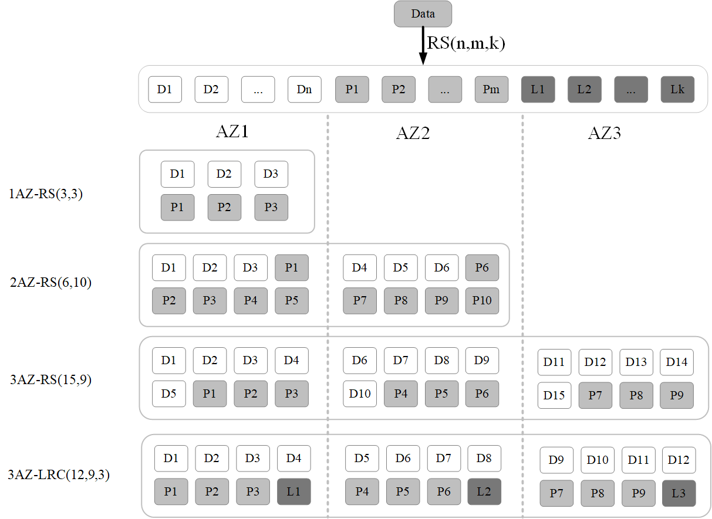
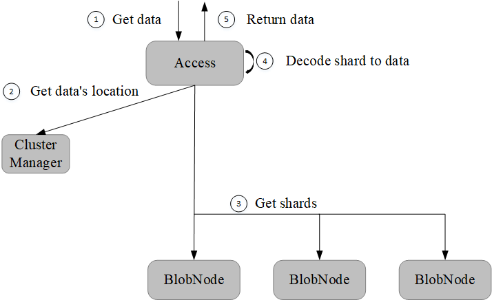

Erasure Code Subsystem
=======================

BlobStore is a highly reliable,highly available,lower cost and  ultra-large scale(EB)  distributed storage system. The system adopts Reed-Solomon code, which provides higher data durability with less storage cost than use three copies  backup technology, and supports multiple erasure code modes multiple availability zones, and optimizes for small file to meet the storage needs of different scenarios.

.. image:: pic/blobstore.png
   :align: center
   :alt: Blobstore Architecture

.. csv-table::
   :header: "Module",  "Description"

   "Access",  "Access module, providing external data read, write and delete interfaces"
   "ClusterManager",  "Metadata management module, responsible for cluster management and generate volume"
   "Proxy",  "ClusterManager and Asynchronous Message Agent Module, providing allocation of data write space, deletion and patch message forwarding"
   "BlobNode",  "Data storage module, manage the disk data of the whole machine, be responsible for persistent storage of data, perform volume repair, migration and recycling tasks, etc."
   "Scheduler",  "Asynchronous task scheduling center, responsible for disk repair, disk drop, balance, data inspection, data repair and data deletion tasks generation and scheduling"

System Features
--------------------------

- Ultra-large Scale

BlobStore can be composed of multiple clusters, a single cluster can store more than hundreds of petabytes of data, within the cluster and between the clusters to support horizontal elastic expansion, the entire correction code subsystem can provide EB-level ultra-large-scale storage needs solutions.

- High Reliability

BlobStore chooses erasure code technology as the data redundancy backup strategy, using Reed-Solomon encoding feature to divide the original data into N data blocks and M check blocks to store to the cluster, which can support the maximum M data corruption premise to ensure data reliability. BlobStore supports partition fault tolerance and disaster recovery, supports automatically  inspect and repair data, which can provide  99.9999999999% data durability guarantee.

- Lower Cost

With the same data reliability, the storage redundancy of the erasure code technology is much lower than that of the three-copy technology. The erasure code subsystem is more cost effective in meeting high data reliability and has significant benefits in large scale storage scenarios.

- Flexible Deployment

BlobStore supports a variety of erasure code modes and can freely configure the number of data blocks and checksum blocks in erasure code to meet the needs of different business scenarios. Flexible deployment from single to multiple availability zones is supported.

Put Data
---------------------

.. image:: pic/put-data.png
   :align: center
   :alt: Put Data Step

Get Data
---------------------

External Interface
---------------------

.. csv-table::
   :header: "Method", "Parameters", "Description"

   "Put", "size,body,MD5【optional】", "Return the location information of the data store "
   "Get", "location,offset,readsize", "Get data based on location information, offsets and readsize "
   "Delete", "location", "Delete data by location "

