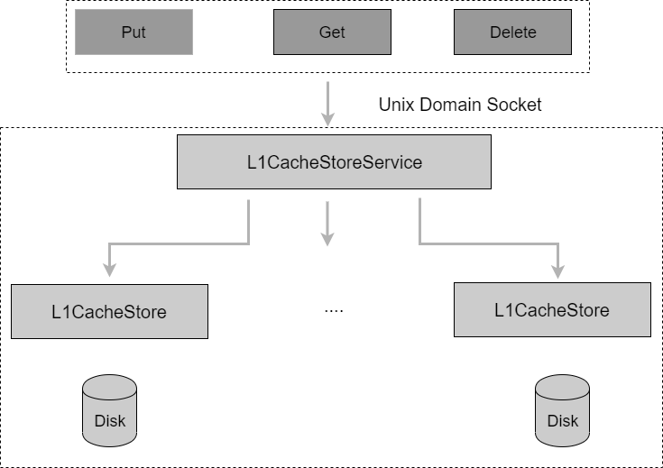

Client
=========

The client runs on each container executing application code and exposes a file system interface to applications and can access a mounted volume via a user-space file system interface such as FUSE.

Client Caching
-----------------------
The client process runs entirely in the user space with its own cache, which has been used in the following cases.

To reduce the communication with the resource manager,  the client caches the addresses of the available meta and data partitions assigned to the mounted volume, which can be  obtained at the startup, and periodically synchronizes this available partitions with the resource manager.

To reduce the communication with the meta nodes, the client also  caches the returned inodes and dentries  when creating new files, as well as the data partition id, the extent id and the offset, after the file has been written to the data node successfully.  When a file is opened for read/write, the client will force  the cache metadata to be synchronous with the meta node.

To reduce the communication with the data nodes,  the client caches the most recently identified leader. Our observation is that, when reading a file, the client may not know which data node is the current leader because the leader could change after a failure recovery. As a result, the client may try to send the read request to each replica one by one until a leader is identified.  However, since the leader does not change  frequently, by caching the last identified leader, the client can have minimized  number of retries in most cases.

Integration with FUSE
-----------------------

The CubeFS client has been integrated with FUSE to provide a file system interface in the user space. In the past, low performance is considered the main disadvantage of such user-space file systems. But over the years, FUSE has made several improvement on its performance such as  multithreading and write-back cache. In the future, we plan to develop our own POSIX-compliant file system interface in the kernel space  to completely eliminate the overhead from FUSE.

Currently the write-back cache feature does not work well in CubeFS due to the following reason. The default write behavior of FUSE is called directIO, which bypasses the kernel's  page cache. This results in performance problems on writing small files as each write pushes the file data to the user daemon. The solution FUSE implemented was to make the  page cache support a write-back policy that aggregates small data first, and then make writes asynchronous. With that change, file data can be pushed to the user daemon in larger blobs at a time. However, in real production, we found that  the write-back cache is not very useful,  because a write operation usually invoke another process that tries to balance the dirty pages (pages in the main memory that have been modified during writing data to disk are marked as "dirty" and have to be flushed to disk before they can be freed), which incurs extra overhead. This overhead becomes more obvious when small files are continuously written through FUSE.

Client Preload
-----------------------

In order to improve the reading efficiency of the erasure volume, the client can cache the data of the erasure code subsystem in the replica subsystem through the preload function. The cached content in the replica subsystem will be automatically deleted after the warm-up TTL expires.

L1Cache
-----------------------

L1Cache is a local data cache service independent of the client. It provides Put/Get/Delete interfaces for the client, and performs cache read, write, and elimination operations based on data blocks. Its overall structure is shown in the figure below.

The L1Cache caching service provides caching service for all clients that open the first-level cache configuration on the machine. The local data block corresponds to the remote storage data block one-to-one, and is accessed by block index (BlockKey). The data block index is generated in the following way: ``VolumeName_Inode_hex(FileOffset)``. The block index maps the memory data block structure to the local cache file after two modulo calculations, like this ``LocalPath / hash(BlockKey)%512 / hash(BlockKey)%256 / BlockKey``. L1CacheStoreService maintains all data block indexes and periodically eliminates them according to LRU.

When the L1Cache service restarts, it automatically scans the cached data files on the disk and rebuilds the data block index in memory. The addition and removal of cache directories does not require data migration, lost cache data will be re-cached, and residual cache data will be eliminated by LRU.