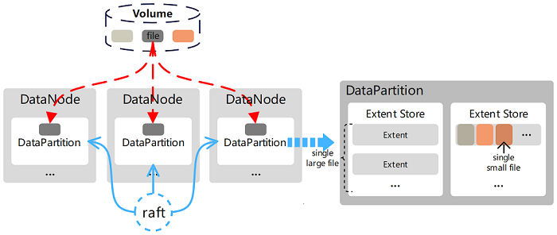
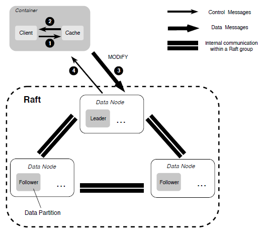

# Replica Subsystem


The design of the Replica subsystem is to meet the multi-tenant requirements of supporting sequential and random access for large and small files. It consists of multiple data nodes (DataNodes), each of which manages a set of data partitions (DataPartitions). The DataPartitions of multiple nodes form a replication group. The data between replicas is mirrored, and strong consistency replication protocols are used to ensure data consistency between replicas. Users can flexibly configure different numbers of replicas according to their application scenarios. As the storage engine of this system, DataNode is used to manage data on a single node, which can be used as persistent storage or as a cache node for erasure coding storage. In addition, for data replication between replicas, the system uses two different replication protocols, which ensure strong consistency between replicas while also considering service performance and IO throughput.

## Storage Topology



In CubeFS, users can directly operate on volumes, which is a logical concept. Its data is stored on the disk managed by DataNode and is organized into DataPartitions. With this layer of logical concept, DataNode can divide and manage replicas based on DataPartitions, and Raft protocol is used to ensure replica consistency between them.

## System Features

### Large File Storage

The content of a large file is stored as one or more extended data blocks (Extents), which can be distributed in different DataPartitions on different DataNodes. When writing a new file to the Extent storage area, the data is always written with a zero offset of the new Extent, so there is no need to perform offset within the Extent. The last range of the file does not need to be padded to its size limit (i.e., the range has no holes), and data from other files is not stored.


### Small File Storage

The memory of multiple small files is aggregated and stored in an Extent, and the physical offset of the content of each file is recorded in the corresponding metadata (stored in the metadata subsystem). Deleting file content (releasing the disk space occupied by this file) is implemented through the file punching interface (`fallocate()`) provided by the underlying file system. The advantage of this design is that there is no need to implement a garbage collection mechanism, so it avoids the mapping from logical offset to physical offset to some extent. Note that this is different from deleting large files, where the corresponding Extent file is directly deleted from the disk.


### Data Replication

For data replication between replica members, CubeFS uses different replication strategies to improve replication efficiency depending on the file write mode.

- When files are written sequentially, the primary-backup replication protocol is used to ensure strong consistency of data and provide efficient IO capabilities.


- When overwriting existing file content with random writes, a replication protocol based on Multi-Raft is used to ensure strong consistency of data.



### Fault Recovery

Since there are two different replication protocols, when a replication replica failure is detected, the data recovery based on the primary-backup replication protocol is started by checking the length of each data block and aligning all data blocks. Once this process is complete, data recovery based on Multi-Raft is used.

### Cached Data

By using cache-type partitions, hot data can be cached to provide cache acceleration for erasure-coded volumes. When the threshold is reached, cold data in the cache is dynamically evicted.

## Sharding Structure

### Data Partition Types

When data is stored on the disk managed by DataNode, it is organized into DataPartitions, each of which has its own directory under the disk mount directory, as shown below:

```text
[amy@node2 data]$ tree -a -L 1
.
|-- .diskStatus
|-- datapartition_1081_128849018880
|-- datapartition_2181_128849018880
|-- expired_datapartition_3620_128849018880
|-- ...
```

Different partition types correspond to different directory names, in the format of `<DP prefix name>_<DP ID>_<DP size>`, as follows:

- `datapartition_<partitionID>_<partitionSize>` - Normal data partition, the data partition of a standard volume.
- `cachepartition_<partitionID>_<partitionSize>` - Cache data partition, used in low-frequency volume scenarios, stores erasure-coded data partitions based on the cache behavior configured for the volume.
- `preloadpartition_<partitionID>_<partitionSize>` - Preload data partition, used to store preload data.
- `expired_datapartition_<partitionID>_<partitionSize>` - Expired data partition, the data partition that has been migrated away from the node.

In addition, DataNode will read and write the `.diskStatus` file under each disk mount directory in the background every 2 minutes to determine whether the current disk status is available.

### Sharding Directory Structure

The specific DataPartition directory structure is as follows:

```text
[amy@node2 datapartition_2181_128849018880]$ tree
.
|-- 1
|-- 10
|-- ...
|-- APPLY
|-- EXTENT_CRC
|-- EXTENT_META
|-- META
|-- NORMALEXTENT_DELETE
|-- TINYEXTENT_DELETE
`-- wal_2181
    |-- 0000000000000001-0000000000000001.log
    `-- META
```

The file names consisting of numbers like 1 and 10 are the actual files where the data is stored, called extent files, and their file names are the serial numbers of the extent files, called ExtentID. There are two types of extent files, as follows:

- TinyExtent - Each file has a maximum size of 4 TiB and is mainly responsible for storing small files. The data is aligned to 4 KiB, and the ExtentID ranges from 1 to 64.
- NormalExtent - Composed of blocks of size 128 KiB, with a maximum of no more than 1024 blocks, so the file size is up to 128 MiB. It is mainly responsible for storing large files, and the ExtentID starts from 1024.

Other file descriptions are as follows:

- `APPLY` - Records the ApplyIndex value of the current Raft for the partition.
- `EXTENT_CRC` - Records the CRC value of each extent file, with each record being 4096 bytes and stored in the order of the ExtentID of the file.
- `EXTENT_META` - The first 8 bytes record the maximum ExtentID currently in use, and the next 8 bytes record the maximum value of the allocated ExtentID.
- `META` - Records the relevant metadata information when the partition is created.
- `NORMALEXTENT_DELETE` - Records the deleted NormalExtent files, only recording the ExtentID.
- `TINYEXTENT_DELETE` - Records the deleted TinyExtent file information, with each record being `ExtentID|offset|size` (24 bytes).
- `wal_<PartitionID>` - The directory saves the WAL log of the partition Raft.

## HTTP Interface

| API         | Method | Parameters                     | Description                                                             |
|-------------|--------|--------------------------------|-------------------------------------------------------------------------|
| /disks      | GET    | N/A                            | Get the list and information of disks.                                  |
| /partitions | GET    | N/A                            | Get information of all data partitions.                                 |
| /partition  | GET    | partitionId[int]               | Get detailed information of a specific data partition.                  |
| /extent     | GET    | partitionId[int]&extentId[int] | Get information of a specific extent file in a specific data partition. |
| /stats      | GET    | N/A                            | Get information of the DATA node.                                       |