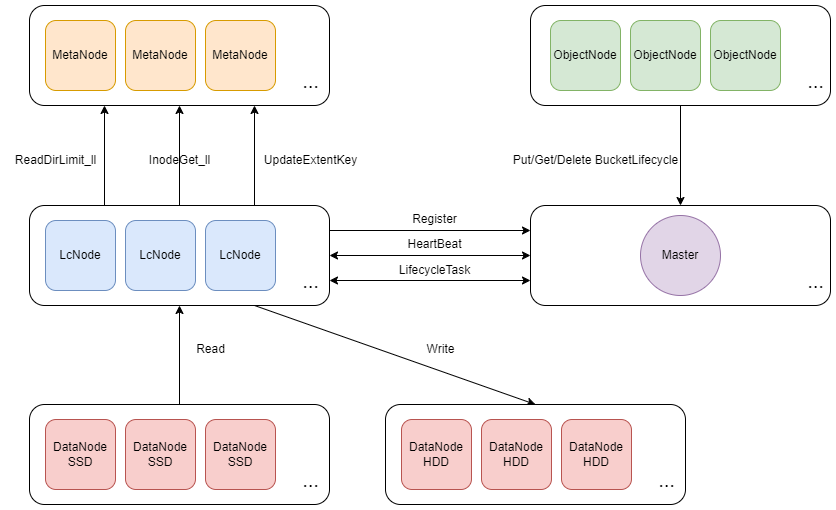

# LcNode

The lifecycle subsystem is designed to meet the needs of users for data lifecycle management. CubeFS implements AWS S3 compliant BucketLifecycle, which allows users to automatically manage the lifecycle of data based on its age, storage type, or other attributes, including storage type conversion or deletion of data.

## System Architecture



**LcNode**

An LcNode is a stateless node that communicates with the Master and performs lifecycle tasks assigned by the Master. You can expand or shrink the capacity of an LcNode based on the cluster scale and lifecycle configuration.

The following is an example of the configuration file required for the LcNode process to start:
```text
{
    "role": "lcnode",
    "listen": "17510",
    "logDir": "./logs",
    "logLevel": "info",
    "masterAddr": [
        "xxx",
        "xxx",
        "xxx"
    ]
}
```

**Master**

The Master stores all lifecycle configurations of the cluster persistently, accepts LcNode registration and heartbeat information, determines the survival status of each LcNode, and periodically generates lifecycle tasks for idle LcNode to execute.

## Lifecycle Rules Introduction

Master provides HTTP interfaces to set lifecycle rules:

```
http://127.0.0.1:17010/s3/setLifecycle
```

```
{
"VolName": "lcvol",
"Rules": [
    {
        "ID": "a1",
        "Status": "Enabled",
        "Filter": {
            "Prefix": "dir1/"
        },
        "Transition": [
            {
                "Days": 180,
                "StorageClass": "HDD"
            }
        ]
    },
    {
        "ID": "a2",
        "Status": "Enabled",
        "Filter": {
            "Prefix": "dir2/"
        },
        "Transition": [
            {
                "Days": 30,
                "StorageClass": "HDD"
            }
        ]
    }
]
}
```

In the preceding example, two lifecycle rules are configured for volume **lcvol** :

1. For files in directory **dir1**, data is migrated to HDD storage after 180 days without access.
2. For files in directory **dir2**, data is migrated to HDD storage after 30 days without access.

## Lifecycle Tasks Description

By default, the Master starts lifecycle tasks at 1:00 a.m. every day. The Master provides the HTTP interface to manually start lifecycle tasks:

```
http://127.0.0.1:17010/admin/lcnode?op=start
```

Master provides HTTP interfaces to query the status of lifecycle tasks:

```
http://127.0.0.1:17010/admin/lcnode?op=info
```

```
{
    "data": {
        "LcConfigurations": {
            "lcvol": {
                "Rules": [
                    {
                        "ID": "a1",
                        "Status": "Enabled",
                        "Filter": {
                            "Prefix": "dir1/"
                        },
                        "Transition": [
                            {
                                "Days": 180,
                                "StorageClass": "HDD"
                            }
                        ]
                    }
                ]
                "VolName": "lcvol"
            }
        },
        "LcNodeStatus": {
            "WorkingCount": {
                "xx.xxx.xxx.xxx:17510": 0
            }
        },
        "LcRuleTaskStatus": {
            "EndTime": "2025-02-13T09:28:38.784025868+08:00",
            "Results": {
                "lcvol:a1": {
                    "Done": true,
                    "EndTime": "2025-02-13T09:22:48.76168554+08:00",
                    "ErrorDeleteNum": 0,
                    "ErrorMToBlobstoreNum": 0,
                    "ErrorMToHddNum": 0,
                    "ErrorReadDirNum": 0,
                    "ExpiredDeleteNum": 0,
                    "ExpiredMToBlobstoreBytes": 0,
                    "ExpiredMToBlobstoreNum": 0,
                    "ExpiredMToHddBytes": 0,
                    "ExpiredMToHddNum": 0,
                    "ExpiredSkipNum": 0,
                    "ID": "lcvol:a1",
                    "LcNode": "xx.xxx.xxx.xxx:17510",
                    "RcvStop": false,
                    "Rule": {
                        "ID": "a1",
                        "Status": "Enabled",
                        "Filter": {
                            "Prefix": "dir1/"
                        },
                        "Transition": [
                            {
                                "Days": 180,
                                "StorageClass": "HDD"
                            }
                        ]
                    },
                    "StartErr": "",
                    "StartTime": "2025-02-13T09:21:48.744979072+08:00",
                    "Status": 1,
                    "TotalDirScannedNum": 1,
                    "TotalFileExpiredNum": 0,
                    "TotalFileScannedNum": 999,
                    "UpdateTime": null,
                    "Volume": "lcvol"
                }
            },
            "StartTime": "2025-02-13T09:21:43.744079892+08:00",
            "ToBeScanned": {}
        }
    }
}
```