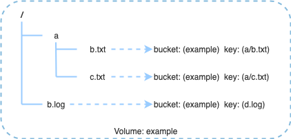

# Object Gateway

The Object Gateway provides a compatible S3 object storage interface, making CubeFS a storage that can integrate two universal types of interfaces (POSIX and S3 compatible interfaces). Users can use the native Amazon S3 SDK to operate files in CubeFS.

## Framework

The ObjectNode is a functional subsystem node. It obtains the volume view (volume topology) from the Resource Manager (Master) as needed. Each ObjectNode communicates directly with the Metadata subsystem (MetaNode) and the Replica subsystem (DataNode).

ObjectNode is a stateless design with high scalability, and can directly operate on all files stored in the CubeFS cluster without any volume loading operations.

::: warning Note
Versions before `v3.2.1` do not support erasure-coded volumes.
:::

## Features

- Supports the object storage interface of native Amazon S3 SDKs
- Supports the fusion storage of two universal interfaces (POSIX and S3 compatible interfaces)
- Stateless and highly reliable

## Semantic Conversion

Based on the original POSIX compatibility design, each file operation request from the object storage interface requires semantic conversion to POSIX.

| POSIX    | Object Storage |
|----------|----------------|
| `Volume` | `Bucket`       |
| `Path`   | `Key`          |

**Example:**

> Put object \'*example/a/b.txt*\' will create and write data to file
> \'*/a/b.txt*\' in volume \'*example*\'.

## Users

Before using the object storage function, users need to create users through the Resource Manager. When creating a user, an *AccessKey* and *SecretKey* are generated for each user, and the *AccessKey* is a unique 16-character string in the entire CubeFS cluster.

CubeFS uses the **Owner** field of a volume as the user ID. There are two ways to create a user:

1. When creating a volume through the Resource Manager API, if there is no user with the same name as the Owner in the cluster, a user with the ID of Owner will be automatically created.
2. Call the user management API of the Resource Manager to create a user. [For details, please refer to](../maintenance/admin-api/master/user.md)

## Authorization and Authentication

The signature verification algorithm in the object storage interface is fully compatible with the Amazon S3 service. Users can obtain user information through the management API, please refer to [Get User Information](../maintenance/admin-api/master/user.md).

After obtaining the *AccessKey* and *SecretKey*, users can use the algorithm to generate a signature to access the object storage function.

Users have all access permissions for volumes under their own name. Users can grant other users specified permissions to access volumes under their own name. Permissions are divided into the following three categories:

- Read-only or read-write permissions;
- Permissions for a single operation, such as GetObject, PutObject, etc.;
- Custom permissions.

When a user uses the object storage function to perform a certain operation, CubeFS will verify whether the user has the permission for the current operation.

## Temporary Hidden Data

Write operations are performed atomically in the object storage interface. Each write operation creates data and writes it to an invisible temporary object. The volume operator in the ObjectNode puts the file data into the temporary file, and the metadata of the temporary file only contains the '**inode**' and no '**dentry**'. When all file data is successfully stored, the volume operator creates or updates the '**dentry**' in the metadata to make it visible to the user.

## Object Name Conflict (Important)

POSIX and object storage are two different types of storage products, and object storage is a key-value storage service. Therefore, in object storage, objects with the names `a/b/c` and `a/b` are two completely non-conflicting objects.

However, CubeFS is designed based on POSIX. According to the semantic conversion rules, the `b` part in the object name `a/b/c` is converted to the folder `b` under the folder `a`, and the `b` part in the object name `a/b` is converted to the file `b` under the folder `a`.

Object names like this are conflicting in CubeFS.