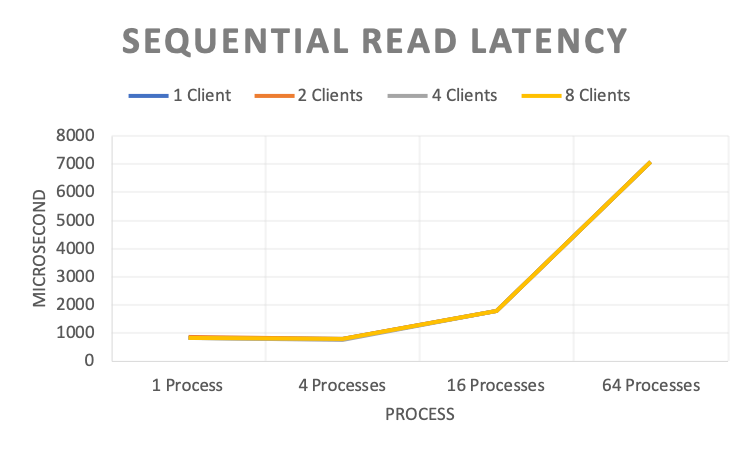
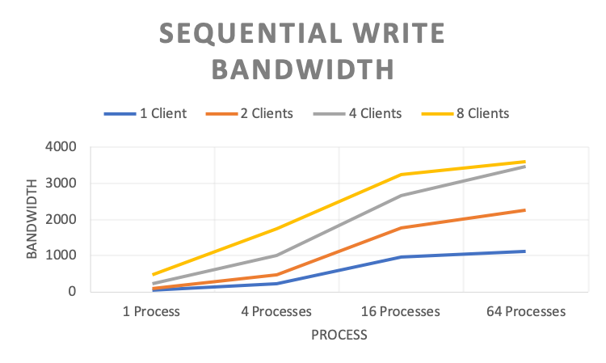
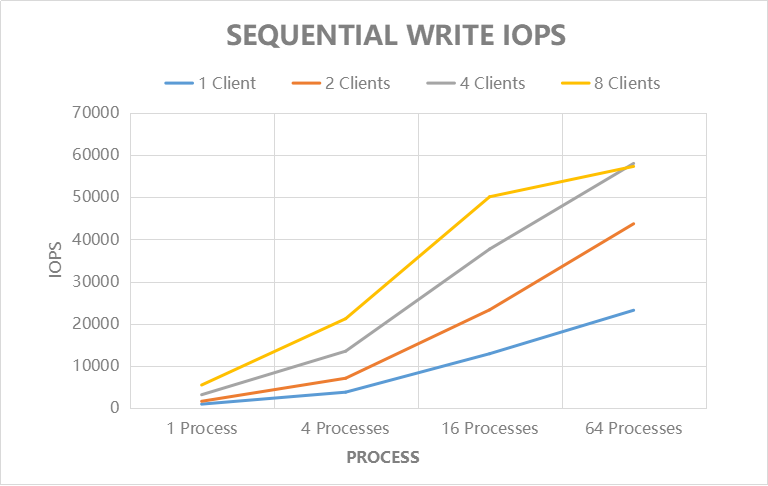
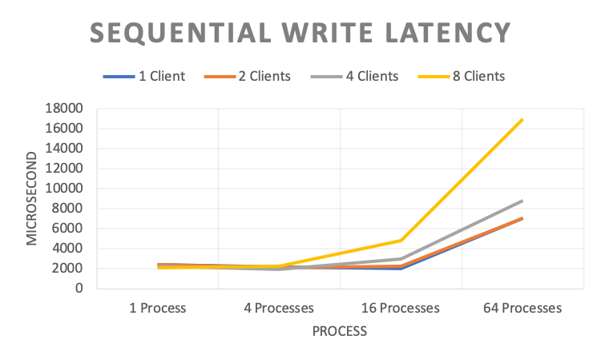
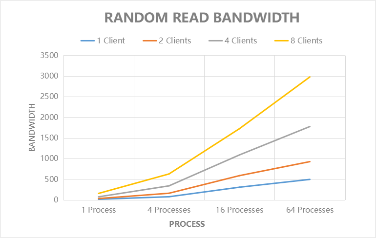
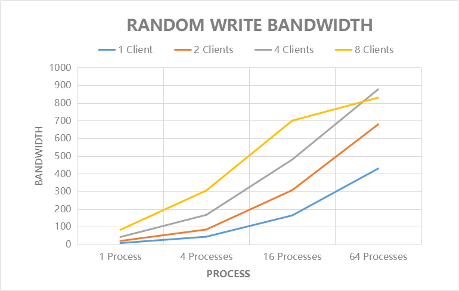
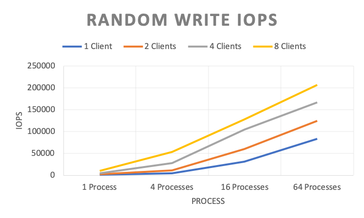
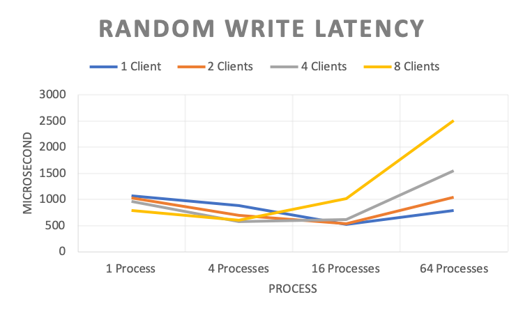

# IO Performance Evaluation

The results of IO performance testing using [fio](https://github.com/axboe/fio) are as follows:

::: tip Note
Multiple clients mount the same volume, and the process refers to the fio process.
:::

## Sequential Read

**Tool Settings**

``` bash
#!/bin/bash
fio -directory={} \
    -ioengine=psync \
    -rw=read \  # sequential read
    -bs=128k \  # block size
    -direct=1 \ # enable direct IO
    -group_reporting=1 \
    -fallocate=none \
    -time_based=1 \
    -runtime=120 \
    -name=test_file_c{} \
    -numjobs={} \
    -nrfiles=1 \
    -size=10G
```

**Bandwidth (MB/s)**


|           | 1 Process | 4 Processes | 16 Processes | 64 Processes |
|-----------|-----------|-------------|--------------|--------------|
| 1 Client  | 148.000   | 626.000     | 1129.000     | 1130.000     |
| 2 Clients | 284.000   | 1241.000    | 2258.000     | 2260.000     |
| 4 Clients | 619.000   | 2640.000    | 4517.000     | 4515.000     |
| 8 Clients | 1193.000  | 4994.000    | 9006.000     | 9034.000     |

**IOPS**


|           | 1 Process | 4 Processes | 16 Processes | 64 Processes |
|-----------|-----------|-------------|--------------|--------------|
| 1 Client  | 1180.000  | 5007.000    | 9031.000     | 9040.000     |
| 2 Clients | 2275.000  | 9924.000    | 18062.000    | 18081.000    |
| 4 Clients | 4954.000  | 21117.000   | 36129.000    | 36112.000    |
| 8 Clients | 9531.000  | 39954.000   | 72048.000    | 72264.000    |

**Latency (Microsecond)**



|           | 1 Process | 4 Processes | 16 Processes | 64 Processes |
|-----------|-----------|-------------|--------------|--------------|
| 1 Client  | 842.200   | 794.340     | 1767.310     | 7074.550     |
| 2 Clients | 874.255   | 801.690     | 1767.370     | 7071.715     |
| 4 Clients | 812.363   | 760.702     | 1767.710     | 7077.065     |
| 8 Clients | 837.707   | 799.851     | 1772.620     | 7076.967     |

## Sequential Write

**Tool Settings**

``` bash
#!/bin/bash
fio -directory={} \
    -ioengine=psync \
    -rw=write \ # sequential write
    -bs=128k \  # block size
    -direct=1 \ # enable direct IO
    -group_reporting=1 \
    -fallocate=none \
    -name=test_file_c{} \
    -numjobs={} \
    -nrfiles=1 \
    -size=10G
```

**Bandwidth (MB/s)**



|           | 1 Process | 4 Processes | 16 Processes | 64 Processes |
|-----------|-----------|-------------|--------------|--------------|
| 1 Client  | 52.200    | 226.000     | 956.000      | 1126.000     |
| 2 Clients | 104.500   | 473.000     | 1763.000     | 2252.000     |
| 4 Clients | 225.300   | 1015.000    | 2652.000     | 3472.000     |
| 8 Clients | 480.600   | 1753.000    | 3235.000     | 3608.000     |

**IOPS**



|           | 1 Process | 4 Processes | 16 Processes | 64 Processes |
|-----------|-----------|-------------|--------------|--------------|
| 1 Client  | 417       | 1805        | 7651         | 9004         |
| 2 Clients | 835       | 3779        | 14103        | 18014        |
| 4 Clients | 1801      | 8127        | 21216        | 27777        |
| 8 Clients | 3841      | 14016       | 25890        | 28860        |

**Latency (Microsecond)**



|           | 1 Process | 4 Processes | 16 Processes | 64 Processes |
|-----------|-----------|-------------|--------------|--------------|
| 1 Client  | 2385.400  | 2190.210    | 2052.360     | 7081.320     |
| 2 Clients | 2383.610  | 2081.850    | 2233.790     | 7079.450     |
| 4 Clients | 2216.305  | 1947.688    | 2946.017     | 8842.903     |
| 8 Clients | 2073.921  | 2256.120    | 4787.496     | 17002.425    |

## Random Read

**Tool Settings**

``` bash
#!/bin/bash
fio -directory={} \
    -ioengine=psync \
    -rw=randread \ # random read
    -bs=4k \       # block size
    -direct=1 \    # enable direct IO
    -group_reporting=1 \
    -fallocate=none \
    -time_based=1 \
    -runtime=120 \
    -name=test_file_c{} \
    -numjobs={} \
    -nrfiles=1 \
    -size=10G
```

**Bandwidth (MB/s)**



|           | 1 Process | 4 Processes | 16 Processes | 64 Processes |
|-----------|-----------|-------------|--------------|--------------|
| 1 Client  | 6.412     | 39.100      | 216.000      | 534.000      |
| 2 Clients | 14.525    | 88.100      | 409.000      | 1002.000     |
| 4 Clients | 33.242    | 200.200     | 705.000      | 1693.000     |
| 8 Clients | 59.480    | 328.300     | 940.000      | 2369.000     |

**IOPS**


|           | 1 Process | 4 Processes | 16 Processes | 64 Processes |
|-----------|-----------|-------------|--------------|--------------|
| 1 Client  | 1641      | 10240       | 56524.800    | 140288       |
| 2 Clients | 3718      | 23142.4     | 107212.8     | 263168       |
| 4 Clients | 8508      | 52428.8     | 184627.2     | 443392       |
| 8 Clients | 15222     | 85072.8     | 246681.6     | 621056       |

**Latency (Microsecond)**


|           | 1 Process | 4 Processes | 16 Processes | 64 Processes |
|-----------|-----------|-------------|--------------|--------------|
| 1 Client  | 603.580   | 395.420     | 287.510      | 466.320      |
| 2 Clients | 532.840   | 351.815     | 303.460      | 497.100      |
| 4 Clients | 469.025   | 317.140     | 355.105      | 588.847      |
| 8 Clients | 524.709   | 382.862     | 530.811      | 841.985      |

## Random Write

**Tool Settings**

``` bash
#!/bin/bash
fio -directory={} \
    -ioengine=psync \
    -rw=randwrite \ # random write
    -bs=4k \        # block size
    -direct=1 \     # enable direct IO
    -group_reporting=1 \
    -fallocate=none \
    -time_based=1 \
    -runtime=120 \
    -name=test_file_c{} \
    -numjobs={} \
    -nrfiles=1 \
    -size=10G
```

**Bandwidth (MB/s)**



|           | 1 Process | 4 Processes | 16 Processes | 64 Processes |
|-----------|-----------|-------------|--------------|--------------|
| 1 Client  | 3.620     | 17.500      | 118.000      | 318.000      |
| 2 Clients | 7.540     | 44.800      | 230.000      | 476.000      |
| 4 Clients | 16.245    | 107.700     | 397.900      | 636.000      |
| 8 Clients | 39.274    | 208.100     | 487.100      | 787.100      |

**IOPS**



|           | 1 Process | 4 Processes | 16 Processes | 64 Processes |
|-----------|-----------|-------------|--------------|--------------|
| 1 Client  | 926.000   | 4476.000    | 31027.200    | 83251.200    |
| 2 Clients | 1929.000  | 11473.000   | 60313.600    | 124620.800   |
| 4 Clients | 4156.000  | 27800.000   | 104243.200   | 167014.400   |
| 8 Clients | 10050.000 | 53250.000   | 127692.800   | 206745.600   |

**Latency (Microsecond)**



|           | 1 Process | 4 Processes | 16 Processes | 64 Processes |
|-----------|-----------|-------------|--------------|--------------|
| 1 Client  | 1073.150  | 887.570     | 523.820      | 784.030      |
| 2 Clients | 1030.010  | 691.530     | 539.525      | 1042.685     |
| 4 Clients | 955.972   | 575.183     | 618.445      | 1552.205     |
| 8 Clients | 789.883   | 598.393     | 1016.185     | 2506.424     |