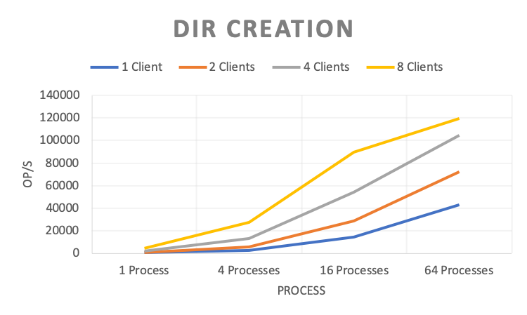
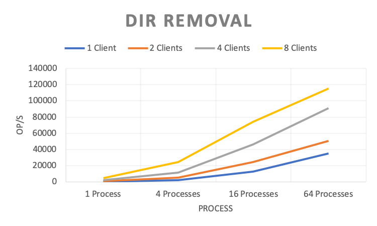
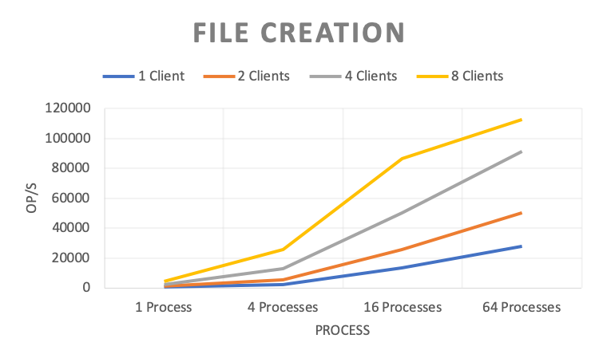
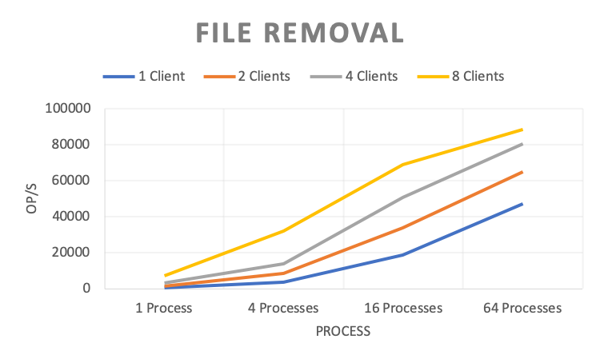
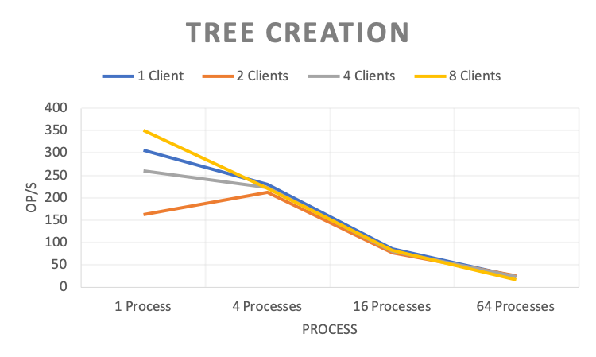
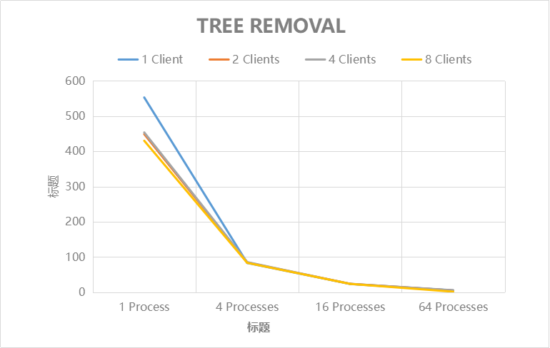

# MetaData performance evaluation

The results of metadata performance testing through [mdtest](https://github.com/LLNL/mdtest) are as follows:

**tool settings**

``` bash
#!/bin/bash
TEST_PATH=/mnt/cfs/mdtest # mount point of CubeFS volume
for CLIENTS in 1 2 4 8 # number of clients
do
mpirun --allow-run-as-root -np $CLIENTS --hostfile hfile01 mdtest -n 5000 -u -z 2 -i 3 -d $TEST_PATH;
done
```

## Directory Creation



|           | 1 Process | 4 Processes | 16 Processes | 64 Processes |
|-----------|-----------|-------------|--------------|--------------|
| 1 Client  | 448.618   | 2421.001    | 14597.97     | 43055.15     |
| 2 Clients | 956.947   | 5917.576    | 28930.431    | 72388.765    |
| 4 Clients | 2027.02   | 13213.403   | 54449.056    | 104771.356   |
| 8 Clients | 4643.755  | 27416.904   | 89641.301    | 119542.62    |

## Directory Removal



|           | 1 Process | 4 Processes | 16 Processes | 64 Processes |
|-----------|-----------|-------------|--------------|--------------|
| 1 Client  | 399.779   | 2118.005    | 12351.635    | 34903.672    |
| 2 Clients | 833.353   | 5176.812    | 24471.674    | 50242.973    |
| 4 Clients | 1853.617  | 11462.927   | 46413.313    | 91128.059    |
| 8 Clients | 4441.435  | 24133.617   | 74401.336    | 115013.557   |

## Directory Status Check


|           | 1 Process   | 4 Processes | 16 Processes | 64 Processes |
|-----------|-------------|-------------|--------------|--------------|
| 1 Client  | 283232.761  | 1215309.524 | 4231088.104  | 12579177.02  |
| 2 Clients | 572834.143  | 2169669.058 | 8362749.217  | 18120970.71  |
| 4 Clients | 1263474.549 | 3333746.786 | 10160929.29  | 31874265.88  |
| 8 Clients | 2258670.069 | 8715752.83  | 22524794.98  | 77533648.04  |

## File Creation



|           | 1 Process | 4 Processes | 16 Processes | 64 Processes |
|-----------|-----------|-------------|--------------|--------------|
| 1 Client  | 448.888   | 2400.803    | 13638.072    | 27785.947    |
| 2 Clients | 925.68    | 5664.166    | 25889.163    | 50434.484    |
| 4 Clients | 2001.137  | 12986.968   | 50330.952    | 91387.825    |
| 8 Clients | 4479.831  | 25933.437   | 86667.966    | 112746.199   |

## File Removal



|           | 1 Process | 4 Processes | 16 Processes | 64 Processes |
|-----------|-----------|-------------|--------------|--------------|
| 1 Client  | 605.143   | 3678.138    | 18631.342    | 47035.912    |
| 2 Clients | 1301.151  | 8365.667    | 34005.25     | 64860.041    |
| 4 Clients | 3032.683  | 14017.426   | 50938.926    | 80692.761    |
| 8 Clients | 7170.386  | 32056.959   | 68761.908    | 88357.563    |

## Tree Creation



|           | 1 Process | 4 Processes | 16 Processes | 64 Processes |
|-----------|-----------|-------------|--------------|--------------|
| 1 Client  | 305.778   | 229.562     | 86.299       | 23.917       |
| 2 Clients | 161.31    | 211.119     | 76.301       | 24.439       |
| 4 Clients | 260.562   | 223.153     | 81.209       | 23.867       |
| 8 Clients | 350.038   | 220.744     | 81.621       | 17.144       |

## Tree Removal



|           | 1 Process | 4 Processes | 16 Processes | 64 Processes |
|-----------|-----------|-------------|--------------|--------------|
| 1 Client  | 137.462   | 70.881      | 31.235       | 7.057        |
| 2 Clients | 217.026   | 113.36      | 23.971       | 7.128        |
| 4 Clients | 231.622   | 113.539     | 30.626       | 7.299        |
| 8 Clients | 185.156   | 83.923      | 20.607       | 5.515        |