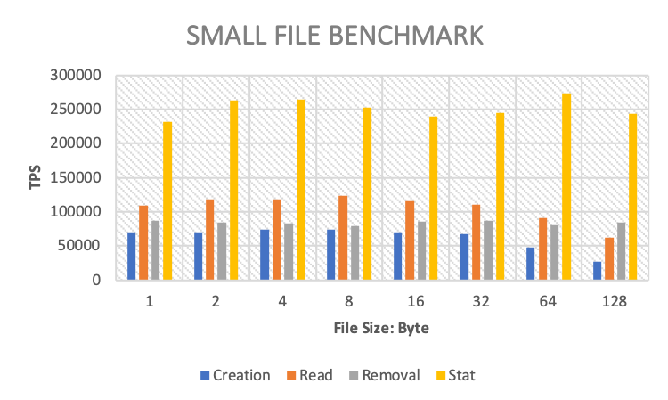

# Small file performance evaluation

The results of the small file performance test by [mdtest](https://github.com/LLNL/mdtest) are as follows:

## Configuration

``` bash
#!/bin/bash
set -e
TARGET_PATH="/mnt/test/mdtest" # mount point of CubeFS volume
for FILE_SIZE in 1024 2048 4096 8192 16384 32768 65536 131072 # file size
do
mpirun --allow-run-as-root -np 512 --hostfile hfile64 mdtest -n 1000 -w $i -e $FILE_SIZE -y -u -i 3 -N 1 -F -R -d $TARGET_PATH;
done
```

## Test Results



| File Size (KB) | 1      | 2      | 4      | 8      | 16     | 32     | 64     | 128    |
|----------------|--------|--------|--------|--------|--------|--------|--------|--------|
| Creation (TPS) | 70383  | 70383  | 73738  | 74617  | 69479  | 67435  | 47540  | 27147  |
| Read (TPS)     | 108600 | 118193 | 118346 | 122975 | 116374 | 110795 | 90462  | 62082  |
| Deletion (TPS) | 87648  | 84651  | 83532  | 79279  | 85498  | 86523  | 80946  | 84441  |
| Stat (TPS)     | 231961 | 263270 | 264207 | 252309 | 240244 | 244906 | 273576 | 242930 |