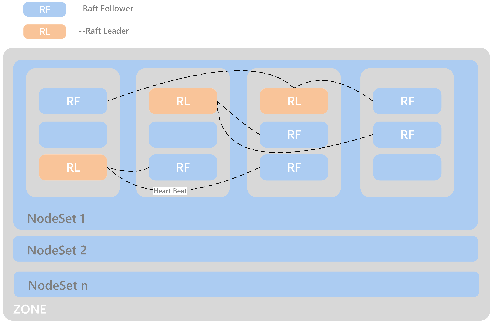

Q&A
==============

- If you are new to CubeFS and want to start quickly, please refer to :doc:`user-guide/docker`
- If you are interested in CubeFS and want to conduct a performance test before applying it in the product environment, please refer to :doc:`evaluation`
- If you have completed the assessment of CubeFS and want to put it into product environment, and want to learn how to carry out capacity planning and environment preparing, please refer to :doc:`env`
- If you want to know about best practices of CubeFS, please refer to :doc:`use-case`
- If you encounter some problems in the product environment, the following content may help to solve your problems.

For the convenience of description, we define the following keyword abbreviations

.. csv-table::
   :header: "Full Name", "Abbreviation"

   "Data Partition", "dp"
   "Meta Partition", "mp"
   "Data Partition Replica", "dpr"
   "Meta Partition Replica", "mpr"
   "NodeSet", "ns"
   "DataNode", "dn"
   "MetaNode", "mn"

Compile
----------

1. Compile CubeFS on one machine, but it cannot be started when deployed to other machines.

First please make sure to use the ``PORTABLE=1 make static_lib`` command to compile RocksDB, then use the ``ldd`` command to check whether the dependent libraries are installed on the machine. After installing the missing libraries, execute the ``ldconfig`` command.

2. A problem similar to undefined reference to 'ZSTD_versionNumber'.

There are two solutions.

- It can be compiled by adding the specified library to CGO_LDFLAGS.

For example: ``CGO_LDFLAGS="-L/usr/local/lib -lrocksdb -lzstd"``. This requires that the ``zstd`` library is also installed on other deployment machines.

- Remove the script that automatically detects whether the 'zstd' library is installed.

Example of file location: rockdb-5.9.2/build_tools/build_detect_platform

The deleted content is as follows.

.. code-block:: bash

    # Test whether zstd library is installed
        $CXX $CFLAGS $COMMON_FLAGS -x c++ - -o /dev/null 2>/dev/null  <<EOF
        #include <zstd.h>
        int main() {}
    EOF
        if [ "$?" = 0 ]; then
            COMMON_FLAGS="$COMMON_FLAGS -DZSTD"
            PLATFORM_LDFLAGS="$PLATFORM_LDFLAGS -lzstd"
            JAVA_LDFLAGS="$JAVA_LDFLAGS -lzstd"
        fi

Node & Disk Failure
---------------------

If a node or disk fails, you can take the failed node or disk offline by `decommission` command.

1. Decommission Datanode/Metanode

    .. code-block:: bash

       $ cfs-cli metanode/datanode decommission 192.168.0.21:17210

    - At what time to decommission mn/dn？

    If a node fails and cannot reboot, it has to be removed from the cluster and the partitions on this machine is automatically migrated to other healthy nodes.

    - The decommission caused an acute increasing on disk io and network io.

    The decommission will trigger automatic partition migration witch consumes a lot of network resources. Therefore, try to execute the decommission during off peak hours and avoid taking multiple nodes decommission at the same time.

    - What is the sign of decommission completion？

        .. code-block:: bash

           $ cfs-cli datapartition check

        If bad partition ids is empty, the decommission is done.

        - Common error1: There is no mn available, all mn memory or disks are full at this time, new mn needs to be added to the cluster
        - Common error2: The port number is wrong, the identifier of each mn should be a combination of `ip+port` , and port is the `listen` port in the mn configuration file, which cannot be wrong

2. Decommission Disk

If a disk fails but the node is healthy, you can partially decommission the disk. Similarly, as with dn/mn decommission, please try to avoid multiple decommission operations during off peak hours.

.. code-block:: bash

   $ cfs-cli disk decommission {disk} 192.168.0.11:17310

If correct, all the dp on the disk is migrated to other disks or nodes.

The common error is similar to decommission dn.

3. Decommission Data Partition/Meta Partition

    .. code-block:: bash

       $ cfs-cli datapartition decommission 192.168.0.11:17310 {Partition ID}

If correct, the dp is migrated to other nodes.

    - At what time to decommission a partition？

        - There is too many partitions on one node, decommission some partitions to reduce the pressure on this node.
        - Take a small step instead of dn/mn decommission to prevent overloading of the cluster.

    - The common error is similar to decommission dn/mn.

4. If the disk is full, will it explode?

It is recommended set `reserved space` in the dn startup json file, it is behind the disk path parameter, `disk: "{disk path}:{reserved space}"`. If the remaining space is less than `reserved space`, the dn turns readonly.

Performance of Data and Metadata
----------------------------------

1. How does CubeFS compare with its alternatives ?

- Ceph

Ceph (https://ceph.com/) is a widely-used free-software storage platform. It can be configured for object storage, block storage, as well as file system. But many nice features provided by
Ceph (e.g., various storage backends) also make it very complicated and difficult to learn and deploy. In addition, in certain scenarios such as metadata operations and small file operations, its performance in a multi-client environment can be hard to optimize.

- GFS and HDFS

GFS and its open source implementation HDFS (https://github.com/apache/hadoop) are designed for storing large files with sequential access.
Both of them adopt the master-slave architecture, where the single master stores all the file metadata. Unlike GFS and HDFS, CubeFS employs  a separate  metadata subsystem  to provide a scalable solution for   the  metadata storage so that the resource manager has less chance to become the bottleneck.

- Hadoop Ozone

Hadoop Ozone is a scalable distributed object storage system designed for Hadoop. It was originally proposed to solve the problem of HDFS namenode expansion. It reconstructs the namenode metadata management part of hdfs and reuses the datanode of hdfs.
CubeFS has many of the same design concepts like ozone such as: supporting for volume isolation, compatible with both raft/master-slave synchronous replication mechanisms, implenting for s3-compatible interfaces. In addition, ChubaoFS's POSIX fuse-client interface supports random file reading and writing, and optimizes reading and writing of small files.

- Haystack

Haystack from Facebook takes after log-structured filesystems to serve long tail of requests seen by sharing photos in a large social network. The key insight is to avoid disk operations when accessing metadata.
CubeFS adopts similar ideas by putting the file metadata into the main memory.

However, different from Haystack,  the actually physical offsets instead of logical indices of the file contents are stored in the memory,
and deleting a  file  is achieved by the punch hole interface provided by the underlying file system instead of relying on the garbage collector to perform merging and compacting regularly for more efficient disk utilization. In addition, Haystack does not guarantee the strong consistency among the replicas when deleting the files, and it needs to perform merging and compacting regularly for more efficient disk utilization, which could be a performance killer.
CubeFS takes a different design principle to separate the storage of file metadata and contents. In this way, we can have more flexible and cost-effective deployments of meta and data nodes.

- Public Cloud

Windows Azure Storage (https://azure.microsoft.com/en-us/) is a cloud storage system that provides strong consistency and multi-tenancy to the clients.
Different from CubeFS, it builds an extra partition layer to handle random writes before streaming data into the lower level.
AWS EFS (https://aws.amazon.com/efs/) is a cloud storage service  that provides scalable and elastic file storage.
Depending on the use cases, there could be a considerable amount of cost associated with using these cloud storage services.

- Others

GlusterFS (https://www.gluster.org/) is a scalable distributed file system that aggregates disk storage resources from multiple servers into a single global namespace.  MooseFS (https://moosefs.com/) is a fault- tolerant, highly available, POSIX-compliant, and scalable distributed file system. However, similar to HDFS, it employs a single master to manage the file metadata.

2. If the scale of metadata is huge, how to improve cluster performance?

The metadata of CubeFS is stored in the memory. Expanding memory of the mn or expanding the amount of mn horizontally will significantly improve the metadata performance and support a large number of small files.

3. If a dn/mn is added to the cluster, will it be automatically rebalanced, for example the dp/mp on the old node are migrated to the new node?

No. Considering that the rebalance may cause overloading and risks data loss, it will not automatically rebalance. If you want the new node to carry more dp/mp to disperse the pressure of the old node, you can create new dp for this volume and the new dp may locate on new nodes, or you can decommission the dp on the old node.

4. There are scenes of batch delete files witch cause cluster overloads

You can set and view the background file deletion rate by following command, the default value is 0, which means unlimited. It is recommended to set markdeleterate=1000, and then dynamically adjust it according to the cpu status of the nodes in the cluster.

.. code-block:: bash

   $ cfs-cli cluster info
   $ cfs-cli cluster delelerate -h
    Set delete parameters

    Usage:
      cfs-cli cluster delelerate [flags]

    Flags:
          --auto-repair-rate string         DataNode auto repair rate
          --delete-batch-count string       MetaNode delete batch count
          --delete-worker-sleep-ms string   MetaNode delete worker sleep time with millisecond. if 0 for no sleep
      -h, --help                            help for delelerate
          --mark-delete-rate string         DataNode batch mark delete limit rate. if 0 for no infinity limit

Capacity Management
-----------------------

1. What if the capacity of Volume is used-out?

.. code-block:: bash

   $ cfs-cli volume expand {volume name} {capacity / GB}

2. How to optimize the read/write performance from the Volume side？

The more dp that can be read and written, the better read and write performance of the Volume. CubeFS adopts a dynamic space allocation mechanism. After creating a Volume, it will pre-allocate a certain data partition dp for the Volume. When the number of dp that can be read and written is less than 10, the dp number will be automatically expanded by a step of 10. If you want to manually increase the number of readable and writable dp, you can use the following command:

.. code-block:: bash

   $ cfs-cli volume create-dp {volume name} {number}

The default size of a dp is 120GB. Please add dp based on the actual cost to avoid overdrawing all dp.

3. How to reclaim the excess space of Volume

.. code-block:: bash

   $ cfs-cli volume shrink {volume name} {capacity / GB}

If the set value is less than %120 of the used amount, the operation fails.

5. What if the cluster space is not enough?

Prepare the new dn and mn, start it by json configuration file with the current master hosts, and the dn/mn will be automatically added to the cluster.

Zone
-------------------

Setting the zone can prevent the failure of a single zone witch causes the entire cluster unavailable. If parameter `zoneName` is set correctly, the node will automatically join the zone(cell).

1. See zones list

.. code-block:: bash

   $ cfs-cli zone list

2. What if accidentally set the volume zone by mistake?

.. code-block:: bash

   $ cfs-cli volume update {volume name}  --zone-name={zone name}

2. What happens if MetaNde and DataNode do not set zone?

Most of the parameters in the cluster have default values, and the default zone name is `default`. Please note that there must be enough dn and mn in a zone at the same time, otherwise, creating a volume in the zone will either fail to initialize data partitions or initialize meta partitions.

3. The meaning of NodeSet？

Each zone will have several NodeSets, and each NodeSet can carry 18 nodes by default. Because CubeFS implements multi-raft, each node starts a raft server process, and each raft server manages m raft instances on the node. If the other replication group members of these raft members are distributed on N nodes, then the raft heartbeat will be transmitted between N nodes. As the cluster scale expands, N will become larger. Through the NodeSet restriction, the heartbeat is relatively independent within the NodeSet, which avoids the heartbeat storm of the cluster dimension. We use the multi raft and nodeset mechanisms together to avoid the problem of the raft heartbeat storm.

4. How to distribute dp/mp of a volume in NodeSet?

dp/mp is evenly distributed in NodeSet. On dp/mp creating, it will locate on the NodeSet behind the NodeSet of last dp/mp overall.

5. How to plan the amount of NodeSet？

For 3-replicas dp/mp, a dp/mp will select the ns only when there are at least 3 available nodes in ns. count (ns) >= 18 * n + 3

Node status is abnormal
-----------------------------

View node status through cli tool

.. code-block:: bash

   $ cfs-cli datanode list
   [Data nodes]
   ID        ADDRESS               WRITABLE    STATUS
   7         192.168.0.31:17310    No          Inactive
   8         192.168.0.32:17310    No          Inactive
   9         192.168.0.33:17310    Yes         Active
   10        192.168.0.35:17310    Yes         Active
   11        192.168.0.34:17310    Yes         Active

   $ cfs-cli metanode list
   [Meta nodes]
   ID        ADDRESS               WRITABLE    STATUS
   2        192.168.0.21:17210    No          Inactive
   3        192.168.0.22:17210    No          Inactive
   4        192.168.0.23:17210    Yes         Active
   5        192.168.0.25:17210    Yes         Active
   6        192.168.0.24:17210    Yes         Active

1.	Reasons for Datanode `WRITABLE=No`

    - The node is waiting for the decommission to complete
    - Node disk is out of use
    - The node has just started and is restoring data locally

2.	Reasons for Metanode `WRITABLE=No`

    - The node is waiting for the decommission to complete
    - The node memory has reached `totalMemory`
    - The node has just started and is restoring data locally

3.	If one of the three masters in the cluster is broken, can the remaining two restarts provide services normally?

Yes. Since the Master uses the RAFT, it can provide services normally when the number of remaining nodes exceeds 50% of the total number of nodes.

4.	Reasons for `STATUS=Inactive`

    - The network connection between the node and the master is interrupted. You need to check the network status and restore the network connection
    - The node process hangs, you need to check whether the server process of the node is abnormally terminated, at this time restart the process to recover

Upgrade
--------------

1.	Steps

    a. Download and unzip the latest binary file compression package from CubeFS official website https://github.com/cubefs/cubefs/releases
    b. Freeze the cluster

    .. code-block:: bash

       $ cfs-cli cluster freeze true

    c. Confirm the startup configuration file, do not change important information such as the data directory and port in the configuration file
    d. Stop the old server process
    e. Start the new server process
    f. Check that the node status recovered healthy after the upgrade, `IsActive: Active`

    .. code-block:: bash

        $ cfs-cli datanode info 192.168.0.33:17310
        [Data node info]
         ID                  : 9
         Address             : 192.168.0.33:17310
         Carry               : 0.06612836801123345
         Used ratio          : 0.0034684352702178426
         Used                : 96 GB
         Available           : 27 TB
         Total               : 27 TB
         Zone                : default
         IsActive            : Active
         Report time         : 2020-07-27 10:23:20
         Partition count     : 16
         Bad disks           : []
         Persist partitions  : [2 3 5 7 8 10 11 12 13 14 15 16 17 18 19 20]

    g. Upgrade the next node (in order to reduce the impact on the client, especially in a relatively large user volume, you need to upgrade the MetaNode nodes one by one), the upgrade sequence is shown bellow

    .. image:: pic/upgrade-en.png
       :align: center
       :alt: upgrade

2. After upgrading a master, it is found that the monitoring system is not displayed in time?

Check whether the configuration of this master node is correct, especially the `id`; check the master error log to find out whether there is a large number of `no leader` errors, and query the keyword leaderChange in the master warn log to check the reason for the leader change, and then check the raft warn log for further analysis.

3. Can I modify the port number of the configuration during the upgrade?

No, `ip+port` constitutes the unique identifier of mn and dn instances, and will be treated as a new node after modification.

Update Configuration Online
------------------------------------

1. Update mn threshold

.. code-block:: bash

    $ cfs-cli cluster set threshold { value }

2. Update cluster configuration

3. Update Volume configuration

.. code-block:: bash

    $ cfs-cli volume set -h
    Set configuration of the volume
    Usage:
      cfs-cli volume set [VOLUME NAME] [flags]
    Flags:
          --authenticate string    Enable authenticate
          --capacity uint          Specify volume capacity [Unit: GB]
          --follower-read string   Enable read form replica follower
      -h, --help                   help for set
          --replicas int           Specify volume replicas number
      -y, --yes                    Answer yes for all questions
          --zonename string        Specify volume zone name

4. Update log level

An interface to update the log level of master, MetaNode, and DataNode online is provided:

.. code-block:: bash

    $ http://127.0.0.1:{profPort}/loglevel/set?level={log-level}

Supported `log-level`: `debug,info,warn,error,critical,read,write,fatal`

Update Configuration Offline
---------------------------------

1. Update master IP

After the ip address of the three-node master is replaced, all mn, dn and other applications that reference the master ip address need to be restarted after modifying the configuration.

2. Update DataNode/MetaNode port number

It is not recommended to modify the dn/mn port. Because dn/mn is registered through ip:port in the master. If the port is modified, the master will consider it as a brand new node, and the old node is in the state of `Inactive`.

3. Update MetaNode totalMemory

`totalMemory` refers to the total memory size of MetaNode. When the memory usage of MetaNode is higher than this value, MetaNode becomes read-only. Usually this value is smaller than the node memory. If MetaNode and DataNode are deployed in a mixed deployment, extra memory needs to be reserved for the DataNode.

4. Update DataNode reservedSpace

In the dn startup configuration json file, the number in the second half of the `disk` parameter is the value of `Reserved Space`, unit(byte).

.. code-block:: bash

    { ...
    "disks": [
       "/cfs/disk:10737418240"
      ],
      ...
      }

5. For more configurations, see  :doc:`user-guide/master` :doc:`user-guide/datanode` :doc:`user-guide/metanode`:doc:`user-guide/client`.

Handle Logs
-------------------
1. What to do if tens of GB of logs are generated every day, which takes up too much disk space?

In a production environment, you can set the log level to warn or error, which will significantly reduce the amount of logs.

.. code-block:: bash

    $ http://127.0.0.1:{profPort}/loglevel/set?level={log-level}

Supported `log-level`: `debug,info,warn,error,critical,read,write,fatal`

2.	Datanode warn log

    .. code-block:: bash

        checkFileCrcTaskErr clusterID[xxx] partitionID:xxx File:xxx badCrc On xxx:

    Analysis: The Master schedules the dn to check the crc data every few hours. This error indicates that the crc check failed and the file data is wrong. At this time, it is necessary to further analyze the error according to the `partitionID` and `File` in the warn message and with the assistance of the info log.

3.	Datanode error log

4.	Master error log

    .. code-block:: bash

        clusterID[xxx] addr[xxx]_op[xx] has no response util time out

    Analysis:The response timed out when the Master sends the [Op] command to mn or dn, check the network between Master and mn/dn; check whether the dn/mn service process is alive.

5.	Master warn log

6.	Metanode error log

    .. code-block:: bash

        Error metaPartition(xx) changeLeader to (xx):

    Analysis:Leader change, a normal action.

    .. code-block:: bash

        inode count is not equal, vol[xxx], mpID[xx]

    Analysis:The number of `inode` is inconsistent. Because as long as two of the three copies are successful, the write is successful, so there will be inconsistencies in the three copies. Check the log for the specific reason.

7.	Metanode warn log

8.	Client warn log

    .. code-block:: bash

        operation.go:189: dcreate: packet(ReqID(151)Op(OpMetaCreateDentry)PartitionID(0)ResultCode(ExistErr)) mp(PartitionID(1) Start(0) End(16777216) Members([192.168.0.23:17210 192.168.0.24:17210 192.168.0.21:17210]) LeaderAddr(192.168.0.23:17210) Status(2)) req({ltptest 1 1 16777218 test.log 420}) result(ExistErr)

    Analysis: `ExistErr` indicates that the file name already exists during the rename operation. It is an upper-level business operation problem. Maintainers can ignore this.

    .. code-block:: bash

        extent_handler.go:498: allocateExtent: failed to create extent, eh(ExtentHandler{ID(xxx)Inode(xxx)FileOffset(xxxx)StoreMode(1)}) err(createExtent: ResultCode NOK, packet(ReqID(xxxxx)Op(OpCreateExtent)Inode(0)FileOffset(0)Size(86)PartitionID(xxxxx)ExtentID(xx)ExtentOffset(0)CRC(0)ResultCode(IntraGroupNetErr)) datapartionHosts(1.1.0.0:17310) ResultCode(IntraGroupNetErr))

    Analysis: The client sends a request to create an extent to an mp and fails, it will soon try to request another mp.

9.	Client error log

    .. code-block:: bash

        appendExtentKey: packet(%v) mp(%v) req(%v) result(NotExistErr)

    Analysis: This error indicates that the file was deleted before written, which is an upper-level business operation problem. Maintainers can ignore this.

    .. code-block:: bash

        conn.go:103:sendToMetaPartition: retry failed req(ReqID(xxxx)Op(OpMetaInodeGet)PartitionID(0)ResultCode(Unknown ResultCode(0)))mp(PartitionID(xxxx) Start(xxx) End(xxx) Members([xxx xxxx xxxx]) LeaderAddr(xxxx) Status(2)) mc(partitionID(xxxx) addr(xxx)) err([conn.go 129] Failed to read from conn, req(ReqID(xxxx)Op(OpMetaInodeGet)PartitionID(0)ResultCode(Unknown ResultCode(0))) :: read tcp 10.196.0.10:42852->11.196.1.11:9021: i/o timeout) resp(<nil>)

    Analysis 1:The network connection between the client and the MetaNode is abnormal. According to the error message "10.196.0.10:42852->11.196.1.11:9021", check whether the network between the two addresses is normal

    Analysis 2:Check if the MetaNode process hangs on "11.196.1.11:9021"

10.	Raft warn log

11.	Raft error log

    .. code-block:: bash

        raft.go:446: [ERROR] raft partitionID[1105] replicaID[6] not active peer["nodeID":"6","peerID":"0","priority":"0","type":"PeerNormal"]

    Analysis: This is caused by excessive network pressure and increased delay. After the raft election interval is exceeded, the raft replication group loses the leader. After the network is restored, re-elect the leader, the error will disappear by itself.

Data Loss and Consistence
--------------------------------

1.	All data of a single dn/mn is lost

This situation can be equivalent to a dn/mn failure. You can log off the node through decommission, and then restart the node to re-register the node to the Master, and the Master will treat it as a new member.

2.	Accidentally deleted file data in a dp directory in dn

dn has the function of automatically repairing data. If the data has not been repaired for a long time, you can manually restart the current dn process, which will trigger the data repair process.

Fuse Client
--------------------

1.	Memory and performance optimization issues

    - The Fuse client occupies too much memory, which has a large impact on other services

        Offline: Set the readRate and writeRate parameters in the configuration file and restart the client.

        Online: http://{clientIP}:{profPort} /rate/set?write=800&read=800

    - For more, see(https://chubaofs.readthedocs.io/zh_CN/latest/user-guide/fuse.html)

2.	Mount issues

    - Does it support subdirectory mounting?

    Yes. Set `subdir` in the configuration file

    - What are the reasons for the mount failure

        - If you see the following output,

        .. code-block:: bash

            $ ... err(readFromProcess: sub-process: fusermount: exec: "fusermount": executable file not found in $PATH)

        Check if fuse is installed, if not, install it

        .. code-block:: bash

            $ rpm –qa|grep fuse
              yum install fuse

        - Check if the mount directory exists
        - Check whether the mount point directory is empty
        - Check whether the mount point has been umount
        - Check whether the mount point status is normal. If the following message appears on the mount point `mnt`, you need to umount first, and then start the client

        .. code-block:: bash

            $ ls -lih
            ls: cannot access 'mnt': Transport endpoint is not connected
            total 0
            6443448706 drwxr-xr-x 2 root root 73 Jul 29 06:19 bin
             811671493 drwxr-xr-x 2 root root 43 Jul 29 06:19 conf
            6444590114 drwxr-xr-x 3 root root 28 Jul 29 06:20 log
                     ? d????????? ? ?    ?     ?            ? mnt
             540443904 drwxr-xr-x 2 root root 45 Jul 29 06:19 script

        - Check whether the configuration file is correct, master address, volume name and other information
        - If none of the above problems exist, locate the error through the client error log to see if it is the mount failure caused by the MetaNode or master service

3.	IO issues

    - IOPS is too high and the client's memory usage exceeds 3GB or even higher. Is there any way to limit IOPS?

    Limit the frequency of client response to io requests by modifying the client rate limit.

    .. code-block:: bash

       #see current iops:
       $ http://[ClientIP]:[profPort]/rate/get
       #set iops, default:-1(no limits)
       $ http://[ClientIP]:[profPort]/rate/set?write=800&read=800

    - io delay too high for `ls` or other operations

        - Because the client reads and writes files through the http protocol, please check whether the network status is healthy
        - Check whether there is an overloaded mn, whether the mn process is hanging, you can restart mn, or expand a new mn to the cluster and take the mp on the overloaded mn decommission to relieve the pressure of mn

4.	Does CubeFS provide strong consistence guarantees?

No.CubeFS has relaxed POSIX consistency semantics, i.e., instead of providing strong consistency guarantees, it only ensures sequential consistency for file/directory operations, and does not have any leasing mechanism to prevent multiple clients writing to the same file/directory. It depends on the upperlevel application to maintain a more restrict consistency level if necessary.

5.	Is it feasible to kill the client to directly stop the client service

No. It is recommended to umount first. After umount, the client process will automatically stop.
