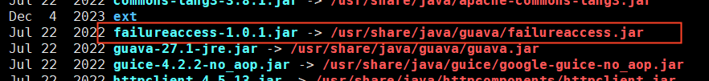

# Compilation Issues

## Local compilation, unable to start on other machines

- First, please confirm that you use the command `PORTABLE=1 make static_lib` to compile rocksdb.
- Then use the `ldd` command to check if the dependent libraries are installed on the machine. After installing the missing libraries, execute the `ldconfig` command.

## ZSTD_versionNumber undefined

There are two ways to solve this problem:
- Add the specified library to `CGO_LDFLAGS` to compile, for example: `CGO_LDFLAGS="-L/usr/local/lib -lrocksdb -lzstd"`. This method requires that the zstd library is also installed on other deployment machines.
- Delete the script that automatically detects whether the zstd library is installed. The file location is an example: `rockdb-5.9.2/build_tools/build_detect_platform`. Delete the following content:
  ```bash
  # Test whether zstd library is installed
      $CXX $CFLAGS $COMMON_FLAGS -x c++ - -o /dev/null 2>/dev/null  <<EOF
        #include <zstd.h>
        int main() {}
  EOF
      if [ "$?" = 0 ]; then
          COMMON_FLAGS="$COMMON_FLAGS -DZSTD"
          PLATFORM_LDFLAGS="$PLATFORM_LDFLAGS -lzstd"
          JAVA_LDFLAGS="$JAVA_LDFLAGS -lzstd"
      fi
  ```


## Rocksdb compilation issue

When compiling the erasure coding subsystem, an error message is displayed: `fatal error: rocksdb/c.h: no such file or directory...`
- First, confirm whether the file pointed to by the error message exists in the `.deps/include/rocksdb` directory.
- If it exists, try `source env.sh` and try again. If the file does not exist or the error still occurs, you can delete all the rocksdb-related files in the `.deps` directory and then recompile.

## cannot find -lbz2

To resolve the error message "/usr/bin/ld: cannot find -lbz2" during compilation, you should check if the "bzip2-devel" package is installed with a version of 1.0.6 or higher.

## cannot find -lz

To resolve the error message "/usr/bin/ld: cannot find -lz" during compilation, you should check if the "zlib-devel" package is installed with a version of 1.2.7 or higher.

## `cc1plus: all warnings being treated as errors` on building `rocksdb`

- when building `blobstore`, just enter sub-folder `blobstore` and add following content to the end of `blobstore/env.sh` before executing `source env.sh`:

```bash
export DISABLE_WARNING_AS_ERROR=true
```

- when building `cubefs` itself, just add following content at the end of `env.sh` before executing `source env.sh`:

> **NOTE**: Options might be different according to different gcc versions. Following option has been tested on `gcc (Ubuntu 11.3.0-1ubuntu1~22.04) 11.3.0`

```bash
export CXXFLAGS=-Wno-error=xxx # optional, developers can change accordingly or comment out or delete it safely
```
## arm版本编译
Before building the arm version, modify the environment variables
```bash
export CPUTYPE=arm64_gcc4
```
Make sure that the environment variables are correct, then compile the corresponding module or compile the whole.

To compile libsdk as an example, run the `make libsdk` command in the cubefs directory. If some libraries are missing, install them, such as yum install cmake, yum install g++, yum install go, yum install maven. 

Install the missing dependencies according to the actual situation of the build environment. Compile again, and it should compile successfully.

### Possible errors
If you get an error that java can't find the class definition, such as the following error


In this case, a jar is missing from the lib subdirectory (/usr/share/maven/lib/) of the maven installation directory. Most of the jars in the lib subdirectory of the maven installation are soft links to jars in the java installation directory.

You can solve it in two ways:
#### Solution1
Go to your java installation, look for a similar jar with the name of the error, and create softconnect to the maven lib directory.
For example, the error is FailureAccess, in /usr/share/java/guava/ there is failureAccess.jar, created
/usr/share/Java/guava/failureaccess jar soft connection to/usr/share/maven/lib/.


#### Solution2
Search critical errors from https://mvnrepository.com/

Reference：https://www.cnblogs.com/shanfeng1000/p/14346112.html

You can find the jar that contains the error class. Download and place it in the /usr/share/maven/lib/maven directory.
