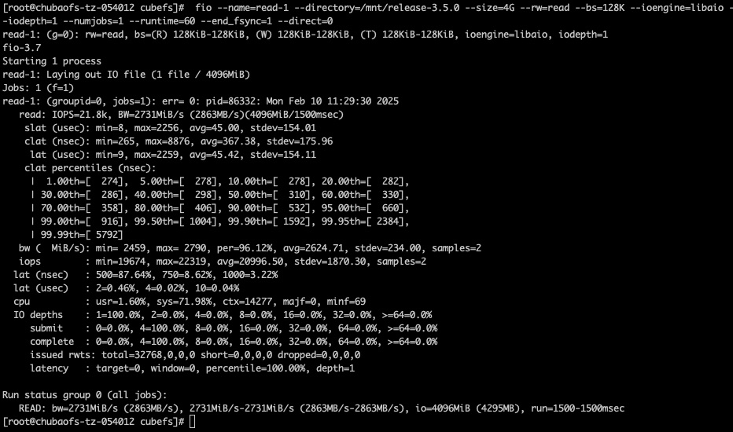

# Ahead Read (Supports Replica Mode, Not Supported in EC)

Modify kernel read-ahead parameters (applicable when kernel is not optimized)
``` bash
vi /etc/udev/rules.d/99-bdi.rules
ACTION=="add", SUBSYSTEM=="bdi", RUN+="/usr/local/bin/bdi_add_script %k"

sudo udevadm control --reload-rules

vi /usr/local/bin/bdi_add_script
#!/bin/bash
device=$1
echo "`date '+%F %T'` FUSE device added: $device" >> /tmp/fuse.log
if [[ "$device" =~ "0:" ]];then
    echo 2048 > /sys/devices/virtual/bdi/$device/read_ahead_kb
fi

chmod +x /usr/local/bin/bdi_add_script
```

The following table describes the meanings of various parameters in the configuration file:

| Parameter           | Type    | Meaning                                  | Required |
|--------------|-------|-------------------------------------|----|
| aheadReadEnable        | bool  | Whether to enable ahead read                              | Yes  |
| aheadReadTotalMemGB      | int64 | Memory occupied by ahead read (default: 10GB), if less than 10GB then occupies 50% of current available memory | No  |
| aheadReadBlockTimeOut      | int64 | Cache block miss recycling time (default: 3s)                   | No  |
|    aheadReadWindowCnt                        | int64 | Size of cache sliding window (default: 8)                     | No  |



::: tip Tips:
1. Enabling ahead read will occupy certain client memory. For scenarios with high client memory restrictions, you can adjust the size of `aheadReadTotalMemGB`, but performance will have some degradation.
2. Ahead read is only effective for files larger than 4MB. If both ahead read and bcache are enabled, ahead read will be executed first.
::: 