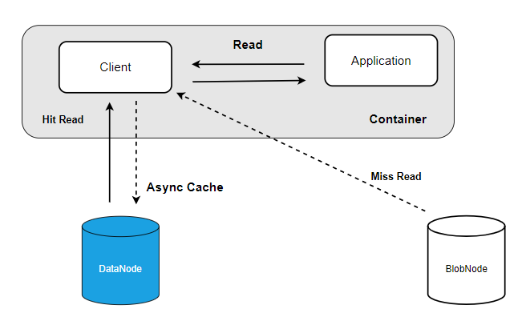
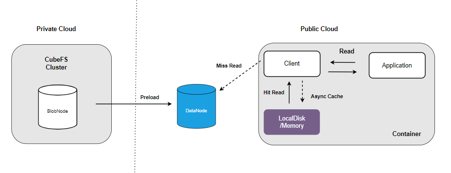

# Cache Acceleration 
If you are developing an application similar to AI model training and need to repeatedly read the same batch of data to iterate the model, it is highly recommended to use the CubeFS cache acceleration mechanism. This mechanism can significantly reduce read and write latency and improve throughput, making model training more efficient.

## Local Cache - Disk
Using the local disk of the computing node as a data block cache can significantly improve the efficiency of data reading.

The read requests from the client will first access the data cache area of the local disk. If the cache is hit, the required data will be obtained directly from the local disk. Otherwise, the data will be read from the backend replicaction subsystem or erasure coding subsystem, and the cached data will be asynchronously written to the local disk to improve the access performance of subsequent requests.


To enable local disk caching, you need to start the local cache service first.

``` bash
./cfs-bcache -c bcache.json
```

Here is a table describing the meanings of various parameters in the configuration file:

| Parameter           | Type           | Meaning                                   | Required  |
|--------------|--------------|--------------------------------------|-----|
| cacheDir         | string       | Local storage path for cached data: allocated space (in bytes)| Yes   |
| logDir       | string       | Path for log files| Yes   |
| logLevel      | string slice | Log levels| Yes   |

Then you just need to add the "bcacheDir" item in the client's configuration file:
``` bash
{
  ...
  "bcacheDir": "path/to/data"  //paths of the directories that you want to cache locally.
}
```

### Cache consistency

CubeFS ensures the eventual consistency of local cache through the following strategies.

+ Disable cache based on file extension: For example, checkpoint files generated during training tasks will be repeatedly updated during task execution, so it is not recommended to do local caching for them. You can disable caching for such files by adding "pt" to "bcacheFilterFiles" in the client's configuration file.
``` bash
{
  ...
   "bcacheFilterFiles": "pt"  //disable caching for files with the ".pt" extension
}
```
+ Periodic check：The client periodically compares the metadata of cached data to detect any changes and removes the local cache data if there are any modifications. 
+ Proactively invalidating. In the scenario of a single mount point, after the user updates the data, the local cache data will be deleted; while in the scenario of multiple mount points, other mount points can only wait for the cache data to expire after the lifecycle expires.

## Local Cache - Memory
If the amount of data is small and you want to further improve the read cache latency, you can use the memory of the compute node as local cache.


/dev/shm is a Linux shared memory filesystem that supports dynamically adjusting its capacity size. Here, we will adjust /dev/shm to 15GB, indicating that up to 15GB of memory can be used to cache data.
``` bash
# sudo mount -o size=15360M -o remount /dev/shm
```
Then you can set the "cacheDir" item in the configuration file of the bache service to a subdirectory of /dev/shm. For reference:
``` bash
{
  ...
  "cacheDir":"/dev/shm/cubefs-cache:16106127360" //Using 15GB of memory as the data cache.
}
```

## Distributed cache
The client-side local cache is exclusively owned by the node where it is located. When a large number of different clients need to repeatedly read the same batch of data sets, caching the data in the replica subsystem (distributed caching) can improve cache efficiency. Assuming that training data is stored in a lower-cost erasure coding subsystem, by enabling pre-loading, the data can be cached in advance into the replica subsystem.



The client will prioritize reading data from the replica subsystem. If the cache is hit, it will be directly returned; if not, the data will be read from the erasure coding subsystem, while asynchronously caching the data to the replica subsystem.
> If both local caching and distributed caching are enabled, data will be read in the order of local cache, replica subsystem, and erasure coding subsystem. When there is a cache miss, data will be read from the backend, and then asynchronously cached to each level of cache to ensure subsequent access performance.

To use distributed caching, you need enable the cache switch and set the cache capacity by setting the `cacheAction` and `cacheCap` properties when creating an erasure-coded volume or through the volume management interface. For example, you can use the following command to configure a 100GB distributed cache for an erasure-coding volume.
``` bash
curl -v "http://127.0.0.1:17010/vol/update?name=test&cacheCap=100&cacheAction=1&authKey=md5(owner)"
```

## Caching on hybrid cloud nodes

In hybrid cloud ML scenarios, to ensure data security and consistency, training data is usually stored in private cloud, and the computing nodes in public cloud access the data on the private cloud through dedicated lines or public networks. Such cross-cloud data reading and writing approach is prone to high latency and large bandwidth overhead, while longer training time can also lead to wasted computational resources. By using CubeFS's local and distributed cache mechanisms, training data can be cached on public cloud nodes, reducing cross-cloud data transmission and improving training iteration efficiency.


If the storage path of the training data set is fixed, the training data can be preloaded into the replicate subsystem through warm-up to improve the training performance.


``` bash
./cfs-preload -c config.json
```
The meanings of each parameter in the configuration file are as shown in the following table:

| Parameter           | Type           | Meaning                                   | Required  |
|--------------|--------------|--------------------------------------|-----|
| volumeName         | string       | Name of the volume where preload data exists| Yes   |
| masterAddr      | string  | Master address of the cluster where preload data resides| Yes   |
| target       | string       | Storage path of the preload data within the volume                              | Yes   |
| logDir     | string       | Directory for storing logs                  | Yes   |
| logLevel   | string  | Log level| Yes   |
| ttl | string       | TTL for preload data in seconds                   | Yes   |
| action         | string       | Preload action: "preload" for preloading operation; "clear" for preload data clearing                          | Yes   |
| action         | string       | Maximum concurrency for traversing the preload data directory                         | No   |
| action         | string       | Maximum file size for preheating, files smaller than this size will not be preloaded                          | No   |
| action         | string       | Maximum concurrency for preloading data files                          | No   |

In addition, computing nodes can enable local caching to further improve data access efficiency by caching the preloaded data from the replica subsystem to local disk/memory.