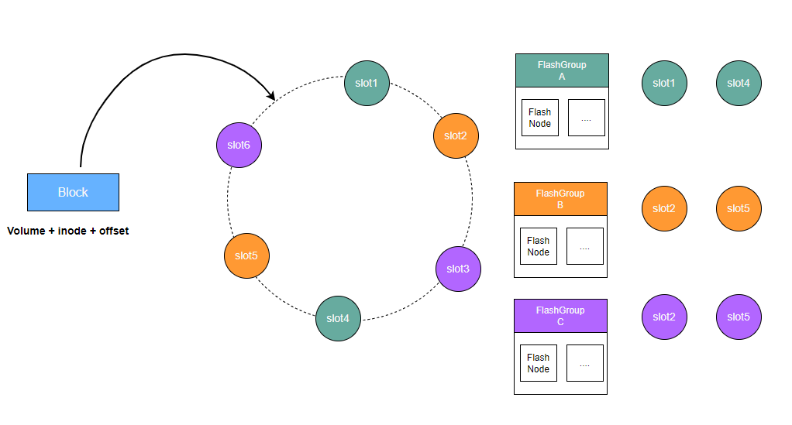

# flash cluster

In the context of modern large AI model training, the scale of datasets and model parameters has increased dramatically. Local disk storage on a single GPU node is no longer capable of accommodating the TB- to PB-level data required for training. As a result, there is a growing need for a distributed caching strategy that offers greater capacity, higher throughput, and support for shared access across multiple GPU nodes, in order to enhance the efficiency of data retrieval during model training.

## flash topology

## Data Access Flow

CubeFS's distributed cache is composed of multiple FlashGroups, each responsible for managing a set of slot values on the consistent hashing ring.

Clients calculate a unique value corresponding to the consistent hashing ring based on the volume ID, inode, and offset information of the data block to be cached. The distributed cache's routing algorithm then finds the first slot value on the ring that is greater than or equal to this calculated value. The FlashGroup owning that slot is responsible for persisting the data block and providing caching and read services for it.

A FlashGroup consists of cache nodes called FlashNodes, which can be deployed across different zones. When a client reads cached data, it performs latency analysis across the available FlashNodes and selects the one with the lowest access latency for the read operation.
