# flash cluster

In the context of modern large AI model training, the scale of datasets and model parameters has increased dramatically. Local disk storage on a single GPU node is no longer capable of accommodating the TB- to PB-level data required for training. As a result, there is a growing need for a distributed caching strategy that offers greater capacity, higher throughput, and support for shared access across multiple GPU nodes, in order to enhance the efficiency of data retrieval during model training.

## 1 flash topology

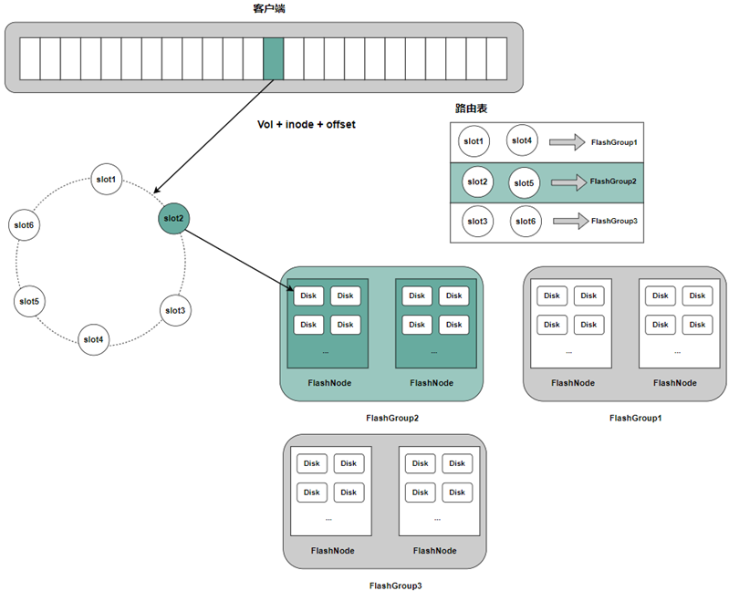

**Master**

The Master manages the global topology of the distributed cache across the cluster, including persistent storage and centralized control. It monitors the status of each FlashNode by receiving registration and heartbeat messages. Furthermore, the Master supports slot assignment to FlashGroups via CLI commands. Clients retrieve the most up-to-date topology information from the Master to enable accurate routing of data read operations.

**Client**

In order to support file cache retrieval, the client evaluates both the per-volume cache configuration and the global caching state of the cluster before deciding to fetch data from the distributed cache.

**FlashNode**

The following shows an example of the configuration file used to launch the FlashNode process:

```text
{
    "role": "flashnode",
    "listen": "18510",
    "prof": "18511",
    "logDir": "./logs",
    "masterAddr": [
        "xxx",
        "xxx",
        "xxx"
    ],
    "memTotal": 0,
    "cachePercent": 0.8,
    "readRps": 100000,
    "disableTmpfs": true,
    "diskDataPath": [
      "/path/data1:0",
      "/path/data2:0"
      ],
    "zoneName":"default"
}
```

## 2 Data Access Flow

CubeFS's distributed cache is composed of multiple FlashGroups, each responsible for managing a set of slot values on the consistent hashing ring.

Clients calculate a unique value corresponding to the consistent hashing ring based on the volume ID, inode, and offset information of the data block to be cached. The distributed cache's routing algorithm then finds the first slot value on the ring that is greater than or equal to this calculated value. The FlashGroup owning that slot is responsible for persisting the data block and providing caching and read services for it.

A FlashGroup consists of cache nodes called FlashNodes, which can be deployed across different zones. When a client reads cached data, it performs latency analysis across the available FlashNodes and selects the one with the lowest access latency for the read operation.

## 3 Distributed caching best practices
### 3.1 Distributed Cache configuration
#### 3.1.1 Create and enable flashGroup
The cache group flashGroup is created through the flashGroup create command of the cli tool and assigned to an ID that uniquely identifies the flashGroup.
```
// The number of slots for fg is set to 32 by default
./cfs-cli flashgroup create
```
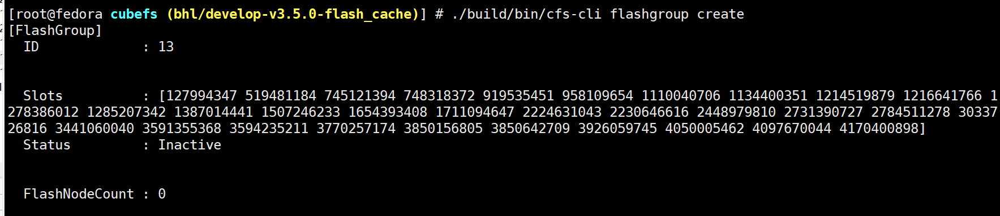

FlashGroup is enabled through the flashGroup set command of the cli tool, and the parameter is the ID assigned in the previous step.
```
// The default state of flashgroup after creation is inactive state, so it needs to be set to active state
./cfs-cli flashgroup set 13 true
```
### 3.1.2 FlashGroup Adds FlashNode
Add the cache node flashNode to the flashGroup created by flashGroup nodeAdd command of cli tool.

```
// flashGroup Adds flashNode, specifying the ID of flashGroup and the flashNode to add
./cfs-cli flashgroup nodeAdd 13 --zone-name=default --addr="*.*.*.*:18510"
```
Use the flashNode list command of the cli tool to see if the flashNode you just added is correct. By default, the newly added flashNode has both active and enable states set to true.
```
./cfs-cli flashnode list
```
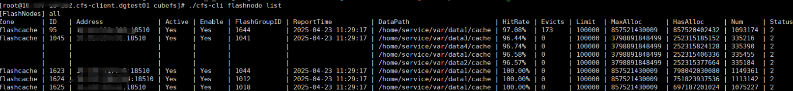

### 3.1.3 Enable volume distributed caching
Enable distributed caching for the target volume using the cli tool's vol update command; this is not enabled by default for new volumes or volumes that already exist before the cluster upgrade.
```
// Open the remoteCacheEnable switch for the target volume test
./cfs-cli vol update test --remoteCacheEnable true
```
Use the cli tool's vol info command to see if the target volume has the distributed cache capability turned on.
```
./cfs-cli vol info test
```
remoteCacheEnable is false if the distributed cache capability is not enabled, and true if it is enabled.

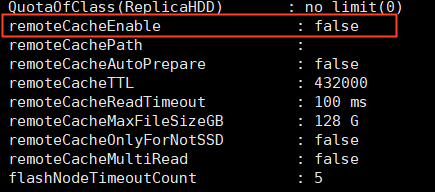

Confirm that distributed caching is working by following these steps:

1. client mounts the volume with distributed caching enabled.

2. Test the files in the root of the volume for read requests. By default, the distributed cache will cache all files under 128GB in the root directory.

3. Check whether there is an entry of flashNode through mem_stat.log of the client, which records the number of times the client reads from flashNode and the average delay. So if there is a corresponding entry, it means that the client tries flashNode to read the corresponding cached data.

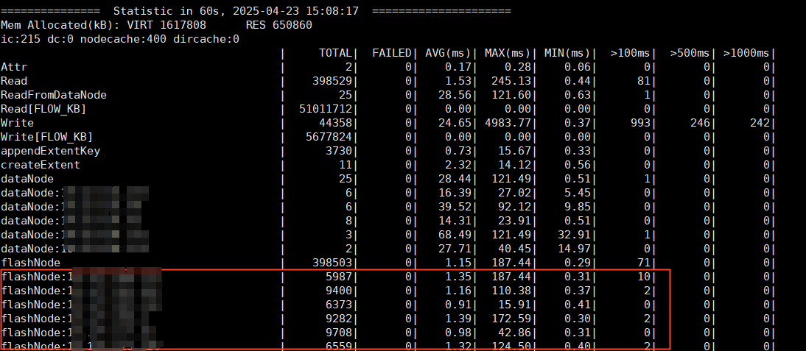

### 3.2 Parameter Configuration
#### 3.2.1 Volume Parameter Configuration
As you can see from the cli's vol update --help command, the following distributed cache configurations are currently supported.

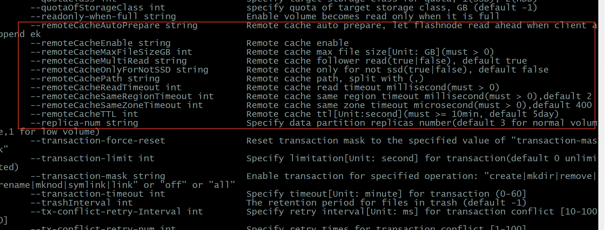

· remoteCachePath: This sets the path of the cache directory (relative to the root directory). It is not specified by default, indicating all cache. The caching process for the distributed cache will only be triggered if files in that directory or any of its subfolders are read.

· remoteCacheAutoPrepare: When this function is turned on, if the client writes new data (append write), the new data will be automatically cached by flashNode. Disabled by default.

· remoteCacheTTL: The expiration time of flashNode cache data. Unit s, default 432,000 (5 days).

· remoteCacheReadTimeout: The maximum timeout for the client to get cached data from flashNode. Unit ms, 100ms by default.

· remoteCacheMaxFileSizeGB: if the file size is more than the value, the data content will not be cached. The default is 128GB.

· remoteCacheOnlyForNotSSD: if is true, only when the file storageClass not for SSD trigger distributed cache processes; If false, the caching process is triggered for files of all storage types. The default is false.

· remoteCacheMultiRead: Usually the client will get the cache data from the flashNode with the minimum network latency in flashGroup. When the function is enabled and the minimum latency flashNode reading fails, the client will try to read the cached data from other FlashNodes in the flashGroup. If it is turned off, the client is broken down and attempts to read from the datanode directly. The default is false.

· flashNodeTimeoutCount: The maximum timeout number of times that flashNode is degraded, the default is 5. Within every minute, if the timeout error received by the client when reading flashNode reaches the maximum value, the flashNode will be removed from the distributed cache route, and all read requests routed to the flashNode will be directly broken down and read from the datanode.

· remoteCacheSameZoneTimeout and remoteCacheSameRegionTimeout: The client divides flashNode into sameZone and sameRegin maximum ping latency, which defaults to 400 microseconds and 2 milliseconds, respectively. The client pair performs network probing on all Flashnodes regularly and divides Flashnodes into different priorities according to the network delay, that is, sameZone>sameRegin>unknow. When the client needs to read data from flashNode, the flashNode with high priority is selected for access.

#### 3.2.2 Cluster Parameter Configuration
· flashNodeHandleReadTimeout

Represents the timeout time for flashNode to process the read request, the default is 1s

· flashNodeReadDataNodeTimeout

flashNode data back to the source, read dataNode timeout time, default 3s

```
# query configuration
./cfs-cli cluster info
```
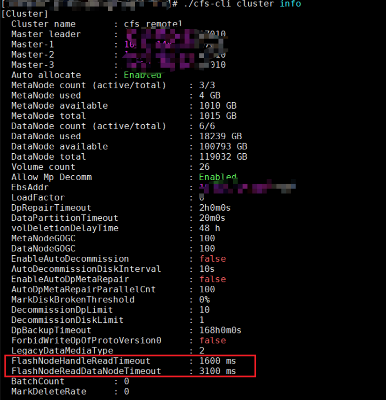

```
# set configuration
./cfs-cli cluster set --flashNodeHandleReadTimeout=1600
```
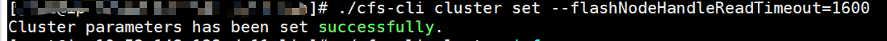


## 4 FAQ
1. The cache node is deployed, but the data read from the cache is not hit, and the datanode is still read.

· Cache invalidates need to check whether flashGroup is enabled in cluster and whether RemoteCacheEnable of vol is enabled.

· Open the client debug log and filter out the following contents to see which criteria are not met by the missed files.

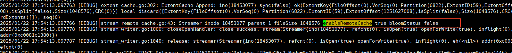

2. Summary of flashNode related error codes in mem_stat log of the client.

In mem_stat, the performance statistics log of the client side, in order to locate the reason why the read request of the client is broken down (read datanode), the breakdown information is attached to the flashNode that is broken down. For example, in the following figure, the request is broken down because of the flow limit.

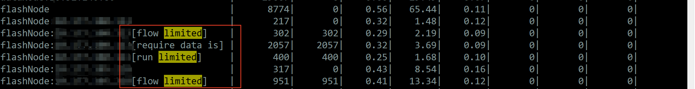

· flow limited,run limited：Flow or read request throttling. You can view the configuration or tweak of flashNode by running the following command.
```
query configuration
# curl -v http://localhost:18511/getDiskQos | jq .
 { "code": 0,
  "msg": "OK",
  "data": {
    "WriteStatus": { // flashNode persistent cache data limits
      "Status": {
        "FlowLimit": 268435456, // Current traffic limit
        "IOConcurrency": 128,   // The number of coroutines in the consume request queue
        "IOQueue": 1024,        // The size of the request queue
        "IORunning": 0,         // How many requests are currently running
        "IOWaiting": 0,        // How many requests are currently waiting
        "Factor": 8            // IOConcurrency * Factor = IOConcurrency
      },
      "DiskNum": 2,        // The number of disks used to cache the data
      "ReadTimeout": 1600  // Maximum waiting time in ms when the request is limited
    },
    "ReadStatus": {       // Read request limits, same as above
      ...
    }
  }
}

Config cache persistence throwaway,flow: the throwaway traffic, iocc: the number of coroutines consuming the request queue, factor: the amplification factor
# curl -v http://localhost:18511/setWriteDiskQos?flow=&iocc=&factor=| jq .

Configure read cache throttling, flow: restricted traffic, iocc: the number of coroutines consumed by the request queue, factor: amplification factor
# curl -v http://localhost:18511/setReadDiskQos?flow=&iocc=&factor=| jq .
```
· require data is caching. · Require data is caching. If flashNode does not have the requested cache data, flashNode uses the asynchronous cache strategy to pull the corresponding data from the datanode and persist it. During this period, a read request was routed to the flashNode again. Since the cache data was not ready, in order to improve the reading efficiency of the client, the request broke down directly.

· read timeout: read flashNode timeout. Because of network fluctuation or heavy pressure on flashNode, the client cannot receive the response from flashNode within the configured remoteCacheReadTimeout, then this error will be triggered.

· no available host: No flashNode available. When the timeout number of flashNode read by the client reaches the threshold within a certain period, the flashNode will be downgraded to inaccessible. Therefore, when the read request is routed to the flashGroup again, if there is no flashNode accessible in the group, this error will be raised. This is done by adjusting the volume's flashNodeTimeoutCount and remoteCacheReadTimeout.

If a flashNode in mem_stat is in the timeout state for a long time, it can be checked that the flashNode is alive by the cfs-cli flashNode list command introduced earlier. If the active of flashNode is false, it means that flashNode did not report the master heartbeat information in time, and you can log in the machine to confirm the reason.

If the flashNode is lost due to the high load, you can reduce the access pressure by restricting the flow configuration command introduced before, or check the cache data popularity information of the node through the flashnode httpSlotStat of the cli tool, as shown in the following figure:

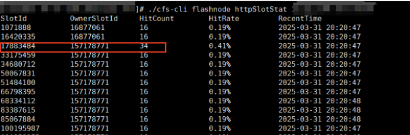

The SlotId with high HitCount and the OwnerSlotID managed by flashNode corresponding to it are transferred to the new cache node by creating flashGroup and flashNode. For example, if 17883484 is too hot in the figure, we can create a new slot that can manage the value between 17883484 and 157178771, and route the original 17883484 cache data to the new cache node.

If the flashNode is lost due to machine failure, the flashGroup nodeRemove of the cli tool can be used to remove the failed node, and then nodeAdd the new cache node to re-cache the data.

3.flashNode's memstat log description.

In order to facilitate the analysis of the cacheability of flashNode, the following information is added to the mem_stat log in the log directory:

· HitCacheRead the time to process a read request on a cache hit.

· HitCacheRead: ReadFromDisk cache hit, cache the data read from disk.

· MissCacheRead The time to process a read request when the cache misses.

When the ReadFromDN cache misses, the flashNode reads back to the source from the datanode. Read back to the source of the maximum timeout time can be adjusted through described above flashNodeReadDataNodeTimeout parameters.

· MissCacheRead: The time at which the cache data is persisted when the WriteAt cache misses.

· CacheBlock: the overall time from the return of the cached data to the persistence when the Init cache misses.
