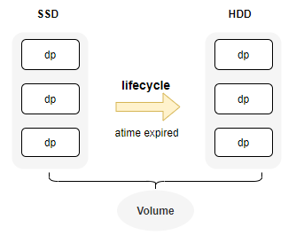

# Intelligent Tiering

::: warning Note
From v3.5.0, CubeFS supports multiple storage media per volume and automatic data migration from SSD to HDD.
:::

CubeFS now includes a lifecycle management feature that intelligently migrates data that is infrequently accessed (based on Atime) from SSD to HDD. This process helps reduce overall storage costs by optimizing the use of different storage media.

## Depoly Different Datanode Zone
First, ensure that the cluster internally deploys datanodes equipped with various storage media types, such as SSD and HDD.

```bash
{
    "zoneName": "az1-hdd",
    "mediaType": 2
}
```
Add the `mediaType` configuration (1 for SSD, 2 for HDD) to the datanode's config file and ensure that datanodes with different media types are placed in separate zones.

```bash
# zones in the cluster
./cfs-cli zone list
ZONE        STATUS    
default     available 
hdd1        available 
hdd3        available
# zone detail
./cfs-cli zone info
Zone Name:        default
Status:           available
DataMediaType:    SSD
```

## Support Tiering For Volume



+ create volume with multiple meida type (SSD and HDD).
  + 1 ssd, 2 hdd
```bash
./cfs-cli vol create test root --allowedStorageClass="1,2" --crossZone=true

./cfs-cli vol info test
...
    VolStorageClass                 : ReplicaSSD
    AllowedStorageClass             : [ReplicaSSD ReplicaHDD]
```
+ Or update existing volumes to support multiple media types.
  + `zone-name`: `default` means default zone name, `hdd1` means hdd zone name.
```bash
# zone name should include hdd and ssd zones.
./cfs-cli vol update test2 --zone-name="default,hdd1" --cross-zone=true
# add HDD(2) storage class for vol
./cfs-cli vol addAllowedStorageClass test2 2
```
+ Subsequently, we can verify that the volume includes two types of data partitions: SSD and HDD.
```bash
  VolStorageClass                 : ReplicaSSD
  AllowedStorageClass             : [ReplicaSSD ReplicaHDD]
  QuotaOfClass(ReplicaSSD)       : no limit(0)

Data partitions:
ID          REPLICAS    STATUS        ISRECOVER      MEDIA          LEADER                MEMBERS           
61          3           ReadWrite     false          SSD            192.168.0.32:17310    192.168.0.32:17310,192.168.0.31:17310,192.168.0.33:17310
62          3           ReadWrite     false          HDD            192.168.0.35:17310    192.168.0.36:17310,192.168.0.34:17310,192.168.0.35:17310
63          3           ReadWrite     false          HDD            192.168.0.34:17310    192.168.0.36:17310,192.168.0.34:17310,192.168.0.35:17310
```

## Configure Migration Rules

CubeFS implements intelligent data migration from `SSD` replicas to `HDD` based on access time (`atime`) using its `lifecycle` component. To utilize this functionality, you must first enable the inode atime persistence feature on the volume. Subsequently, configure the lifecycle rules to carry out the automatic migration task on a daily basis.

### Support Atime Persistence

For performance reasons, the atime of inodes is typically not persisted via Raft under normal circumstances. However, because atime is used to determine whether data should be migrated, it is essential to persist and synchronize the atime in this scenario.
```bash
# enable persist atime
./cfs-cli vol update test --enablePersistAccessTime=true
```

### Configure Lifecycle Rules

+ example:

```json
{
    "VolName": "test",
    "Rules": [
        {
            "ID": "a1",
            "Status": "Enabled",
            "Filter": {
                "Prefix": "dir1",
                "MinSize": 1048576
            },
            "Transition": [
                {
                    "Date": "2024-08-31T00:00:00Z",
                    "StorageClass": "HDD"
                }
            ]
        },
        {
            "ID": "a2",
            "Status": "Disabled",
            "Filter": {
                "Prefix": "dir2",
                "MinSize": 2097152
            },
            "Transition": [
                {
                    "Days": 60,
                    "StorageClass": "HDD"
                }
            ]
        }
    ]
}
```
+ configration rule description

| Key                     | Type   | Description                                                            |
| :---------------------- | :----- | :--------------------------------------------------------------------- |
| VolName                 | string | target vol name                                                        |
| Rules                   | array  | support multi rules for one vol                                        |
| Rules.ID                | string | uniq id for one rule                                                   |
| Rules.Status            | string | `Enabled\|Disabled`, whether start rules                               |
| Rules.Filter.Prefix     | string | valid path for rule, "" means the whole volume                         |
| Rules.Filter.MinSize    | int    | file size threshold in bytes                                           |
| Rules.Transition        | object | config transition rules                                                |
| Transition.Date         | time   | if file atime is before Date, transition will exec                     |
| Transition.Days         | int    | when interval between atime and now is over days, transition will exec |
| Transition.StorageClass | string | transition file to the class, only support `HDD` at now                |

+ add rules to cluster
  + `f1.json` is the file which contains lifecycle rule above. 
```bash
curl http://192.168.0.11:17010/s3/setLifecycle -d@f1.json
```
+ query rules detail info
  + there are lc rules, lcnode info, lc task details here.
```bash
curl http://192.168.0.11:17010/admin/lcnode?op=info
```
```json
{
    "code": 0,
    "data": {
        "LcConfigurations": {
            "ltptest": {
                "Rules": [
                    {
                        "Filter": {

                        },
                        "ID": "a2",
                        "Status": "Enabled",
                        "Transition": [
                            {
                                "Date": "2024-08-31T00:00:00Z",
                                "StorageClass": "HDD"
                            }
                        ]
                    }
                ],
                "VolName": "ltptest"
            }
        },
        "LcNodeStatus": {
            "WorkingCount": {
                "192.168.0.61:17410": 0,
                "192.168.0.62:17410": 0,
                "192.168.0.63:17410": 0
            }
        },
        "LcRuleTaskStatus": {
            "EndTime": "2025-01-23T14:50:48.453526677+08:00",
            "Results": {

            },
            "StartTime": "2025-01-23T14:49:48.453084153+08:00",
            "ToBeScanned": {

            }
        }
    },
    "msg": "success"
}
```
### Lifecycle Rules Operation
```bash
# start rule tasks in the cluster at once.
# everyexecute once at 1 AM by default.
curl "http://192.168.0.11:17010/admin/lcnode?op=start"
# start rule tasks for the vol
curl "http://192.168.0.11:17010/admin/lcnode?op=start&vol=$VolName"
# stop 
curl "http://192.168.0.11:17010/admin/lcnode?op=stop&vol=$VolName&ruleid=$ruleId"
```
You can verify whether the migration was successful by checking the volume details and the distribution of data across the tiers.

```bash
/cfs/bin/cfs-cli vol info ltptest -s
# ...
Usage by storage class:
STORAGE CLASS    INODE COUNT     USED SIZE       QUOTA       
ReplicaSSD      6               84.156MB        no limit(0) 

# verify inode storage class by 
/cfs/bin/cfs-cli volume getInodeById ltptest 8388610
```

## Monitor Label
```bash
cfs_master_vol_stats{media="ReplicaSSD",type="total",volName="xxx"}
```
Information on the usage of different media for the volume
+ `media`: ReplicaSSD, ReplicaHDD, BlobStore
+ `type`: total, used

```bash
cfs_master_dataNodes_stats{media="HDD",type="allocCnt"}
```
+ `media`: HDD, SSD
+ `type`: 
  + `total`: total space of media in cluster
  + `used`: used space of target media
  + `totalCnt`: count of datanodes
  + `notWritable`: count of not writable datanodes
  + `allocCnt`: count of datanodes which can alloc dps

