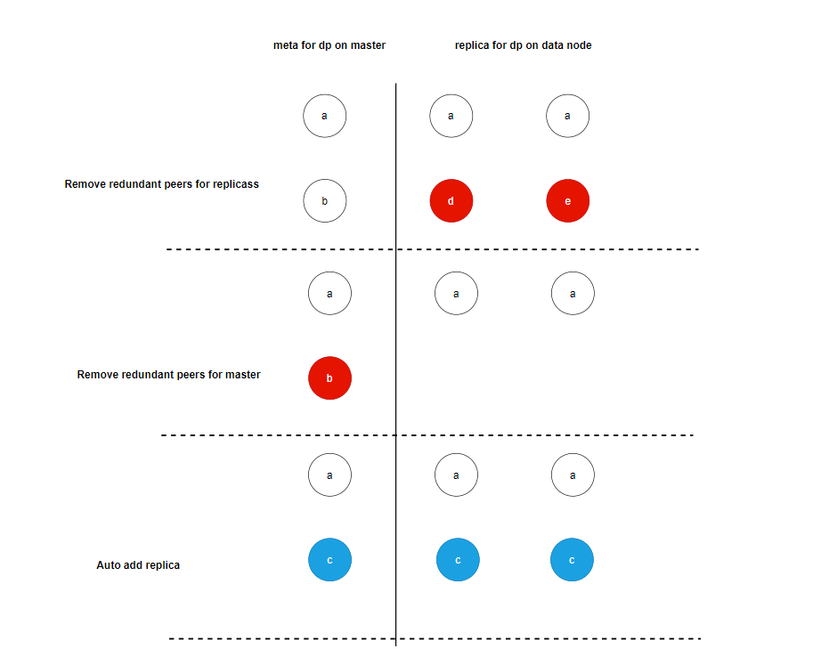
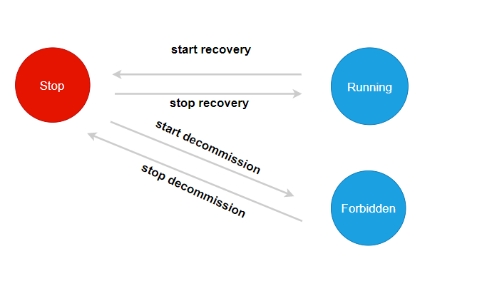
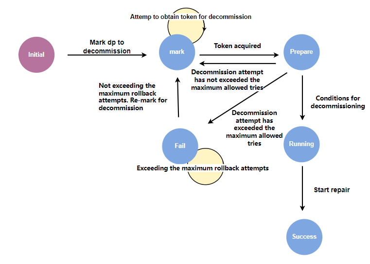
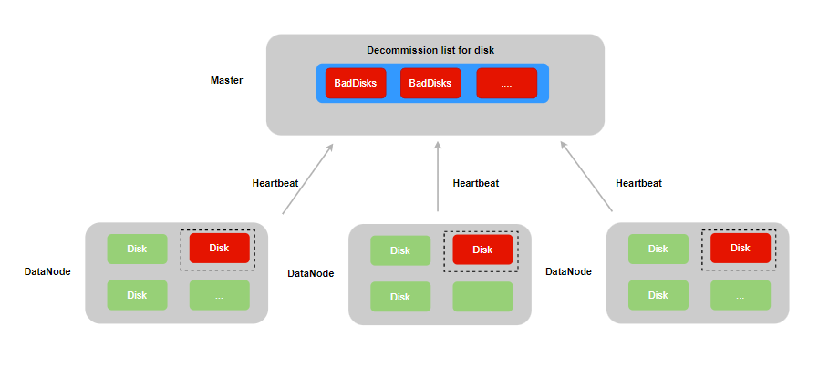

# Automated Operation and Maintenance

CubeFS added the data partition (hereinafter referred to as dp) offline speed limit function in version 3.3.1, that is, the maximum number of dp that can be offline at the same time is controlled in units of nodeSet. However, since there is no atomicity guarantee in the offline process, the replica group may eventually have abnormal scenarios such as lack of leader and insufficient number of replicas due to atoms such as network interruption and insufficient available space of data nodes. These abnormal dp will also require a certain amount of operation and maintenance effort to manually handle.

In addition, for bad disks in the cluster, the operation and maintenance personnel are also required to migrate the dp on the bad disk in time to ensure the reliability of user data. Therefore, in version 3.4.0, we provide abnormal dp self-healing and offline atomicity, and automatic migration of bad disks to reduce the manpower cost of daily cluster operation and maintenance.

## 1. Abnormal dp self-healing

The abnormal DP self-healing function is executed in two places:
- ScheduleToCheckDataReplicaMeta, a regular dp metadata check task on the master, is mainly used to repair abnormal dp in the cluster.
- Before the master marks dp as markDecommission (can be offline). If the dp replica has an exception and can be repaired before the offline operation is performed, the success rate of dp offline can be improved.



The figure above shows the process of dp performing exception repair:
1. Compare the peers reported by the replica with the peers of dp on the master, and delete the peers that exist on the replica but not on the master.
2. Compare the peers reported by the replica with the peers of dp on the master, and delete the peers that exist on the master but not on the replica.
3. If the length of the replica array of dp is less than the number of replicas of dp, ReplicaNum, the missing replicas are automatically added.

Since the offline process of dp involves the modification of peers and hosts, the offline process of dp and the self-healing process need to be mutually exclusive.



The initial state of the self-healing state machine is Stop.

When performing the offline operation, dp attempts to switch the state machine state to Forbidden. If the switch fails, an error is returned, indicating that dp is undergoing self-healing and cannot go offline. If the switch succeeds, it indicates that dp is going offline and cannot perform self-healing operations, and switches back to the Stop state when the offline operation ends.

When performing metadata self-healing, dp attempts to switch the state machine state to Running. If the switch fails, an error is returned, indicating that dp is executing offline and cannot perform self-healing. If the switch is successful, it indicates that dp is in the self-healing process and cannot perform offline operations, and switches back to the Stop state when self-healing is completed.

## 2. Offline atomicity

During the DP offline process, if there are abnormal situations such as the master switching to the master or the disk where the new DP replica is located is full, the offline process may be blocked, or errors such as the replica group losing replicas may occur after the offline process is completed.

In order to ensure the correctness of dp offline, we will persist the offline status to ensure the atomicity of the offline process. Taking dp as an example, the following attributes related to offline that need to be persisted are added.

```golang
type DataPartition struct {
   ...
   DecommissionRetry int //Number of offline retries
   DecommissionStatus uint32 //Offline status
   DecommissionSrcAddr string //Offline source address
   DecommissionDstAddr string //Offline target address
   DecommissionRaftForce bool //Whether to use raftForce for decommissioning
   DecommissionSrcDiskPath string //Source disk for offline
   DecommissionTerm uint64 //Start time of going offline
   DecommissionDstAddrSpecify bool //Is it a fixed-point migration?
   DecommissionNeedRollback bool //Whether rollback is required
   DecommissionNeedRollbackTimes uint32 //Number of rollbacks when offline
   DecommissionErrorMessage string //Error message for offline failure
   RecoverStartTime time.Time //Time to start repairing
   DecommissionType uint32 //Decommission type
   RestoreReplica uint32 //State machine for self-healing repair
}
```
The offline state machine of dp includes the following states:



- initial: initial state.
- mark: Waiting to be offline. When a node/disk is offline, the dp contained in it will be marked as waiting to be offline, waiting for offline resources.
- prepare: prepare to go offline. The master controls the speed of the DP to be offline. After obtaining the token, it changes to the prepare to go offline state. This stage mainly performs some offline condition detection operations, such as whether the number of surviving replicas meets the offline conditions.
- running: Starts to go offline. This stage is the repair process waiting for the new replica.
- Success: Offline success status. Indicates that the newly created replica has been repaired.
- fail: offline failure status. Indicates that an error occurred during the offline process.

In order to improve the success rate of offline operations and reduce the number of manual interventions, the offline process introduces an error retry and rollback mechanism. In the prepare and running states, you may encounter scenarios such as insufficient number of surviving replica groups and lack of leaders due to network jitter. In this case, by retrying and waiting for network recovery or replica group re-election, you can restore to a state that meets the offline conditions and then automatically execute the offline operation again.

In other special cases, such as when the node where the new replica is located has no space or a diskError occurs, and retries are not possible and a new node can only be selected to create a new replica, the offline operation is re-executed through the rollback mechanism.

Both the error retry and rollback mechanisms have a maximum number of attempts. When the maximum number of attempts is reached and the offline process fails, the offline status of the dp will be set to a failed status.

When the state of the state machine changes, it will be persisted immediately. When the master is restarted or switched, the master will restore the previous offline state when loading the dp metadata from rocksdb, thus ensuring the atomicity of the offline process.

## 3. Automatic migration of bad disks



When a DP copy encounters an IO error while reading or writing a disk, it will be registered in the IO error DP list of the disk to which it belongs, and the read/write status of the disk will be set to unavaliable, thereby ensuring that the disk cannot continue to create new DPs and read/write data.

Disk inspection itself may also trigger IO errors, but since the inspection operation does not involve any dp, the special value 0 is registered in the disk's IO error dp list.

Considering that the datanode may encounter restarts before the bad disk is processed, when dp encounters an IO error, the error count will be persisted in the local dp metadata. This ensures that when the datanode restarts and loads the dp on the disk, the disk can be correctly re-marked as unavaliable.

When DataNode builds a heartbeat response message, it reports the unavaliable disk information to the master. The master's scheduled task automatically puts the bad disk into the offline list and performs the disk offline operation, that is, the replica on the bad disk is deleted and a new replica is created on the normal disk of other nodes in the cluster, thereby ensuring the reliability of the DP replica group.

## 4. Best Practices for Automated Operations and Maintenance

In version 3.4.0, a large number of API commands and CLI operations are added to manage cluster offline operations. In this section, some commonly used management commands are introduced.

### 4.1 Query the offline configuration of the cluster

You can use cfs-cli cluster info to view the current configuration information of the cluster, including the following configurations related to offline:

```
[root]# ./cfs-cli cluster info        
[Cluster]
  ...
  DpRepairTimeout : 2h0m0s
  EnableAutoDecommission : true
  AutoDecommissionDiskInterval: 10s
  EnableAutoDpMetaRepair : true
  AutoDpMetaRepairParallelCnt: 100
  DecommissionDpLimit : 50
  DecommissionDiskLimit : 10
  DpBackupTimeout : 168h0m0s
```

- DpRepairTimeout: The timeout for dp replica repair. If the replica progress does not change during this time interval, the rollback mechanism of dp offline will be triggered and the offline operation will be re-executed. It is recommended to set it to 20 minutes for SSD disks and 40 minutes for HDD disks.
- EnableAutoDecommission: Whether the cluster has enabled automatic decommissioning of bad disks. It is recommended to enable this function to save operation and maintenance costs.
- AutoDecommissionDiskInterval: When the automatic offline of a bad disk is enabled, how long does it take for the master to start offline after detecting the bad disk information reported by the dataNode. If you want to have enough time to manually recover the bad disk and reduce unnecessary migration, you can set a longer interval, such as 20 minutes.
- EnableAutoDpMetaRepair: Whether the cluster enables abnormal dp self-healing. The self-healing process involves modifying the replica metadata and adding replicas. Users can decide whether to enable it based on their needs. It is recommended to enable it to save operation and maintenance costs.
- AutoDpMetaRepairParallelCnt: The number of concurrent DP self-healing. It is recommended to set it to 100.
- DecommissionDpLimit: The number of concurrent DPs that can be taken offline by each nodeset. It is recommended to set this value to 100.
- DecommissionDiskLimit: The number of concurrent disks that can be taken offline by each nodeset. It is recommended to set it to 10.
- DpBackupTimeout: The replica deleted by raftForce will be temporarily retained and deleted after DpBackupTimeout expires.

The above parameters can be configured through the cfs-cli cluster set command. Detailed information can be viewed through the cfs-cli cluster set --help command.

### 4.2 Query the copy repair progress

Through the cfs-cli datapartition check command, you can observe the dp status in the cluster:

```
[root]# ./cfs-cli datapartition check
[Inactive Data nodes]:
ID ZONE ADDRESS USED TOTAL STATUS REPORT TIME

[Corrupt data partitions](no leader):
ID VOLUME REPLICAS STATUS MEMBERS           

[Partition lack replicas]:
ID VOLUME REPLICAS STATUS MEMBERS           


[Bad data partitions(decommission not completed)]:
PATH PARTITION ID REPAIR PROGRESS
192.168.66.47:17310:/home/service/var/data1 568 20.22%  
      
[Partition has unavailable replica]:

[Number of Partition with replica file count differ significantly]: 0

[Number of Partition with replica used size differ significantly]: 0

[Partition with excessive replicas]:
ID VOLUME REPLICAS STATUS MEMBERS           

[Partition with disk error replicas]:
DP_ID VOLUME REPLICAS DP_STATUS MEMBERS  
```

- Corrupt data partitions: The replica group lacks the leader's dp. This type of dp requires manual review of the META file of each replica.
- Partition lack replicas: The replica group lacks the dp of the replica. You can manually fill in the missing replicas through cfs-cli datapartition add-replica.
- Bad data partitions: dp being repaired. You can observe the repair progress of the newly created replica.
- Partition has unavailable replica: There is an unavailable replica in the replica group. You need to check the datanode log of the node where the unavailable replica is located to find out why the replica is unavailable.
- Number of Partition with replica file count differ significantly: The number of files in the replica groups is inconsistent. You can wait for the replica repair process to repair itself. If it does not recover for a long time, you can offline the replica with the difference.
- Number of Partition with replica used size differ significantly: The dp sizes of the replica groups are inconsistent. You can wait for the replica repair process to repair itself. If it does not recover for a long time, you can offline the replica with the difference.
- Partition with excessive replicas: A replica group with redundant replicas. You can delete the excessive replicas through cfs-cli datapartition del-replica.
- Partition with disk error replica: The replica group has a bad disk. You can use cfs-cli to delete the replica on the bad disk and add a new replica.

Except for the problem of inconsistent file numbers and DP sizes between replica organizations, other problems can be automatically fixed by enabling automatic offline and DP self-healing.

### 4.3 Query the disk/node offline progress

You can use the curl command "/disk/queryDecommissionProgress" or "/dataNode/queryDecommissionProgress" to query the decommissioning progress of the disk or node. Take querying the decommissioning progress of the disk as an example.

```
[root]# curl "http://master/disk/queryDecommissionProgress?addr=192.188.66.77:17310&disk=/home/service/var/data1" | jq .
  % Total % Received % Xferd Average Speed ​​Time Time Time Current
                                 Dload Upload Total Spent Left Speed
100 238 100 238 0 0 155k 0 --:--:-- --:--:-- --:--:-- 232k
{
  "code": 0,
  "msg": "success",
  "data": {
    "StatusMessage": "Success",
    "Progress": "100.00%",
    "FailedDps": null,
    "IgnoreDps": [],
    "ResidualDps": [],
    "StartTime": "2024-09-19 19:59:08 +0800 CST"
  }
}
```

- StatusMessage: offline status information. Same as the dp state machine status described above, including mark, running, etc.
- Progress: Offline progress information.
- FailedDps: failed dp and corresponding error message. When StatusMessage is running, you can judge whether manual intervention is needed in advance based on the error message to ensure the subsequent retry operation and the successful offline operation of the dp that has not been offline. Since there is a retry mechanism for dp offline, you can also wait until StatusMessage changes to fail before processing the error message uniformly.
- IgnoreDps: dp information that did not participate in the offline operation. Since only a single replica in a replica group can be offlined at the same time, when multiple replicas in a replica group are offlined at the same time, the replica that performs the offline operation later cannot participate in the dp offline operation. You can re-execute the disk/node operation.
- ResidualDps: residual dp information. Since the replicas of dp share a set of metadata on the master side, if replica a fails to be offline first and then replica b succeeds, the failure information of a will be overwritten. Therefore, this array stores the error information of the overwritten replica offline. After manual processing based on the error information, the disk/node operation can be re-executed.
- StartTime: The start time of the offline operation.

### 4.4 Cancel the offline

You can cancel the decommissioning of a disk or node through /disk/cancelDecommission or /dataNode/cancelDecommission.

The DP that is performing a replica repair operation cannot be terminated. Only the DP that is in the offline list but has not obtained the offline token can be terminated.

### 4.5 Cluster offline status

You can view the offline status of the current cluster through admin/queryDecommissionToken:

```
{
    "code": 0,
    "msg": "success",
    "data": [
        {
            "NodesetID": 1,
            "CurTokenNum": 0,
            "MaxTokenNum": 100,
            "RunningDp": [],
            "TotalDP": 0,
            "ManualDecommissionDisk": [],
            "ManualDecommissionDiskTotal": 0,
            "AutoDecommissionDisk": [],
            "AutoDecommissionDiskTotal": 0,
            "MaxDiskTokenNum": 5,
            "RunningDisk": []
        }
    ]
}
```

Each nodeset maintains a dp and disk offline queue, so what is returned here is an array with the nodeset offline status as the unit:

- NodesetID: The ID of the nodeset.
- CurTokenNum: The total number of DPs currently in the running state.
- MaxTokenNum: The maximum number of concurrent dp offlines, which is the DecommissionDpLimit parameter configured through cfs-cli cluster above.
- RunningDp: The dp list currently in the running state. Its length is equal to CurTokenNum.
- TotalDP: The total number of DPs in the offline queue.
- ManualDecommissionDisk/AutoDecommissionDisk: List of manually/automatically decommissioned disks currently in the running state.
- ManualDecommissionDiskTotal/AutoDecommissionDiskTotal: Total number of manually/automatically decommissioned disks in the decommissioning queue
- MaxDiskTokenNum: The maximum number of concurrent disk offlines, which is the DecommissionDiskLimit parameter configured through cfs-cli cluster above.
- RunningDisk: The total number of disks in the offline queue.

It is worth noting that the speed of DP offline is currently further controlled by disk. If the offline of the current disk is not completed and the disk token has been exhausted, even if there are idle DP tokens, it will not trigger the offline operation of DPs on other offline disks.

### 4.6 Check the disk status of the node

You can view the status of the node through cfs-cli datanode info:

```
[root]# ./cfs-cli datanode info 192.168.66.77:17310  
[Data node info]
...
AllDisks            : []
Bad disks           : []
Lost disks          : []
Decommissioned disks: []
DecommissionSuccess disks: []
Persist partitions : []
Backup partitions  : []
```

- AllDisks: List of all disks that are currently loaded on the node.
- Bad disks: List of bad disks on the current node.
- Lost disks: List of disks that have been lost on the current node
- Decommissioned disks: List of disks that have been executed decommission on the current node. These disks can no longer create new dp. 
- DecommissionSuccess disks: List of disks that have been successfully decommissioned on the current node, used as an alarm indicator in operations and maintenance to prompt maintenance personnel to replace the disks. 
- Persist partitions: dp list on the current node.
- Backup partitions: The backup directory of dp deleted by raftForce on the current node. This directory will be deleted regularly, and can also be manually deleted in advance to free up space.


### 4.7 Check dp offline status

You can view the offline status of dp by using the following command:

```
[root~]# curl -v "http://192.168.66.77:17310/dataPartition/queryDecommissionStatus?id=91580" | jq .                                   
{
  "code": 0,
  "msg": "success",
  "data": {
    "PartitionId": 91580, //Partition id
    "ReplicaNum": 2, //Number of replicas
    "Status": "Initial", //Offline status
    "SpecialStep": "SpecialDecommissionInitial", // Single/double copy offline status.
    "Retry": 0, //Number of offline retries
    "RaftForce": false, //Whether to use raftForce
    "Recover": false, //Whether it is being repaired
    "SrcAddress": "", //Offline source node
    "SrcDiskPath": "", //Offline source disk
    "DstAddress": "", //Offline target node
    "Term": 0, //Start time of going offline
    "Replicas": [ //dp replica group members
      "",
      ""
    ],
    "ErrorMessage": "", //Error message for offline failure
    "NeedRollbackTimes": 0, //Whether rollback is needed
    "DecommissionType": "InitialDecommission", //Decommission type
    "RestoreReplicaType": "RestoreReplicaMetaStop", //Self-healing status
    "RecoverStartTime": "0001-01-01 00:00:00" //The last update time of the repair progress
 }
```

For the offline operation of single/double replicas, the order of adding/deleting replicas during the offline process is slightly different from that of three replicas, so it is controlled by an offline sub-state SpecialStep. However, overall, it is the same as three replicas, and the flow of its state machine is controlled by the offline state.

The above variables can be reset to their initial values ​​through the /dataPartition/resetDecommissionStatus interface, which can solve the problem of multiple dp offline failures in some cases.

### 4.8 Faulty disk recovery

- If a bad disk has been manually repaired (not through a migration or decommission operation) and needs to be reused, the recoverBadDisk interface can be used to reset it. This action clears the disk error count, reloads the data partitions (dp) on the disk, and removes the record from the Bad disks list:
```
curl -v "http://192.168.66.77:17010/disk/recoverBadDisk?addr=datanodeAddr:17310&disk=/home/service/var/data1" | jq .  
```

- If a bad disk has been taken offline through a migration process, and after the maintenance personnel replace it with a new disk (assuming the new disk is mounted to the same original path), the new disk may be reported as Lost. In this case, you can restart the data node or execute the reloadDisk command to reload the disk: `curl "http://172.16.1.101:17010/disk/reloadDisk?addr=172.16.1.101:17310&disk=/home/data/data1/disk"`.The reloadDisk interface avoids the impact on other disks that might occur from restarting the node. It also removes the disk path from the DecommissionSuccess and Decommissioned lists.If you choose to reload the disk by restarting the node, you will need to manually execute the recommission command to remove the disk from the DecommissionSuccess and Decommissioned lists, effectively bringing the disk back online: `curl "http://172.16.1.101:17010/disk/recommission?addr=172.16.1.101:17310&disk=/home/data/data1/disk"`.

### 4.9 The replica repair process is stuck

When a dp replica has been repaired multiple times for a long time, you can first view the log of the replica group host[0] by running the following command:

```
[root@ ~]# cat dataNode_info.log| grep ActionNotifyFollowerRepair | grep partition id| tail -n 100
```

In the log, if the logs appear are as follows:

```
[INFO] data_partition_repair.go:452: ActionNotifyFollowerRepair to host(follower address 1) Partition(partition id) type(0) ToBeCreated(0) ToBeRepaired(0) done
[INFO] data_partition_repair.go:452: ActionNotifyFollowerRepair to host(follower address 2) Partition(partition id) type(1) ToBeCreated(0) ToBeRepaired(0) done
```

This means that there is no extent that needs to be repaired. You can call the /reloadDataPartition?id=partitionid interface of host[0] to reload the host[0] partition to restore the replica repair.


### 4.10 The replica leader's raft is stuck

When the abnormal DP self-healing function is enabled, if the replica group has a leader but adding/deleting a replica times out, you can query the log of adding/deleting raft members of the replica group leader to determine whether the failure is caused by raft not returning the result of adding/deleting raft members.

In this case, you can perform a reload operation on the node where the leader of the replica group is located to restore it:

```
curl localhost:17320/reloadDataPartition?id=partition id
```

 ### 4.11 Disk Lost

- During the operation of the cluster or during the startup process of the DataNode, if a disk is lost, it will be marked as a Lost disk and will still be loaded into the cache. You can view the record of Lost disks by checking the DataNode info using the CLI. Remounting the disk will restore it to normal.

- In special cases, such as when a new disk is used after the decommission process is completed and the new disk is reported as Lost, it is necessary to execute the `reloadDisk` interface or restart the DataNode to reload the disk.