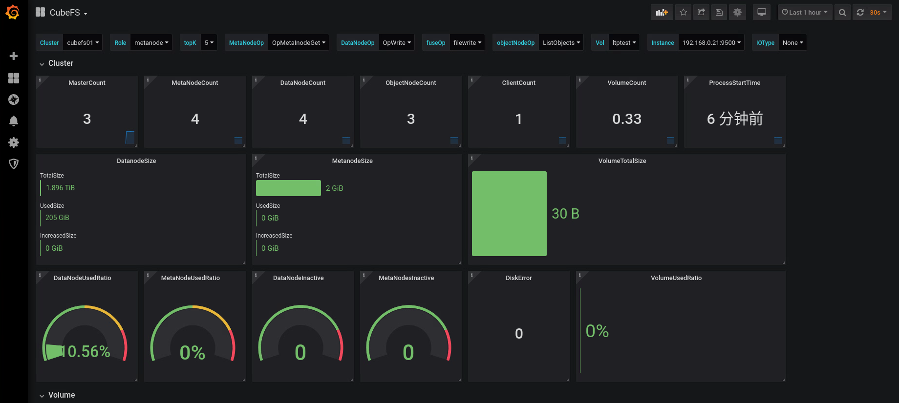

# Standalone Mode

## Get Software
``` bash
# Skip this step if it has been completed
$ git clone https://github.com/cubefs/cubefs.git
```
## Install Software

### Script Installation

#### Install Basic Cluster
CubeFS supports deploying a basic cluster with a single script. The basic cluster includes components such as `Master`, `MetaNode`, and `DataNode`, with the option to additionally start a `client` and `ObjectNode`. The steps are as follows:
```bash
cd ./cubefs
# Compile
make
```

::: tip Note

If you encounter the following error when using C++17 or higher versions during make:
```bash
error: 'uint64_t' does not name a type
```
You can try executing the following command before running the make command:
```bash
export CXXFLAGS="-include cstdint"
```

If you encounter missing `autoreconf` during make, please install autoconf, automake, and libtool:
```bash
sudo apt install autoconf automake libtool
```

:::

# Generate configuration files and start the basic cluster
sh ./shell/deploy.sh /home/data bond0

# Wait a minute for cluster to prepare state, and optionally execute the following command

# Mount the file system (optional, execute this command if you want to experience file storage. By default, it is mounted at /home/data/client/mnt.The default created volume name is ltptest.)
sh ./shell/deploy_client.sh /home/data

# Start object storage (optional, execute this command if you want to experience object storage. The default listening port is 17410)
sh ./shell/deploy_object.sh /home/data
```

+ Machine requirements
  + Need root permission
  + Able to use `ifconfig`
  + Memory of 4G or more
  + Remaining disk space corresponding to `/home/data` is more than 20G
+ The `./shell/deploy.sh` script is used to start a cluster service, including the master, metanode, and datanode. The script first checks whether two parameters (local directory `baseDir` and network card name `bond0`) are passed, and generates the necessary configuration files based on these parameters, and starts each service in turn:
  + Generate subnet IP: Generate four subnet IP addresses through the genIp.sh script.
  + Generate configuration files: Generate configuration files through the genConf.sh script.
  + Start nodes: Start three master node services.
  + Start metadata node services: Start four metadata node services.
  + Start data node services: Start four data node services.
  + Set cluster configuration: Use cfs-cli to set cluster configuration.
Wait for ready state: Wait for a while for the cluster to enter the ready state

::: tip 提示
`bond0`: The name of the local network card, fill in according to the actual situation.
`/home/data`: A local directory used to store cluster running logs, data, and configuration files. The configuration file in the example is located in the `/home/data/conf` . The directory parameter should be the same for all three `sh` commands.
:::

+ Check the cluster status
```bash
./build/bin/cfs-cli cluster info
[Cluster]
  Cluster name       : cfs_dev
  Master leader      : 172.16.1.101:17010
  Master-1           : 172.16.1.101:17010
  Master-2           : 172.16.1.102:17010
  Master-3           : 172.16.1.103:17010
  Auto allocate      : Enabled
  MetaNode count (active/total)    : 4/4
  MetaNode used                    : 0 GB
  MetaNode available               : 21 GB
  MetaNode total                   : 21 GB
  DataNode count (active/total)    : 4/4
  DataNode used                    : 44 GB
  DataNode available               : 191 GB
  DataNode total                   : 235 GB
  Volume count       : 2
...
```

For using the file system, refer to the [File System Usage section](../user-guide/file.md).

For using object storage, refer to the [Object Storage Usage section](../user-guide/objectnode.md).

#### Install Erasure Code Subsystem

::: tip Note
Optional section. If you need to use the erasure-coded volume, you need to deploy it.
:::

``` bash
$> cd cubefs/blobstore
$> ./run.sh --consul
...
start blobstore service successfully, wait minutes for internal state preparation
$>
```

After the erasure code subsystem is deployed successfully, modify the `ebsAddr` configuration item in the Master configuration file ([more configuration reference](../ops/configs/master.md)) to the Consul address registered by the Access node, which is `http://localhost:8500` by default.

#### Stop the Cluster
+ The script will stop the server and the mount point
```bash
sh ./shell/stop.sh
```

### Docker Installation

#### Install Basic Cluster
In the docker directory, the run_docker.sh tool is used to facilitate running the CubeFS docker-compose trial cluster, including the `Master`, `MetaNode`, `DataNode`, and `ObjectNode` components.

::: tip Note
Please make sure that docker and docker-compose are installed, and before executing the docker deployment, make sure that the firewall is turned off to avoid permission issues causing container startup failures.
:::

Execute the following command to create a minimal CubeFS cluster.

::: warning Note
`/data/disk` is the data root directory and requires at least 10GB of free space.
:::

```bash
$ docker/run_docker.sh -r -d /data/disk
```

Solution to the following error: Delete the `/data/disk` directory and re-execute the command. You can specify the data root directory yourself. Please make sure there are no important files.

```bash
/data/disk: avaible size 0 GB < Min Disk avaible size 10 GB
```

If there is a mount point under the directory, the directory cannot be deleted. Please `umount` the mount point first.

```bash
# rm: can't delete '/data/disk/client/mnt'：The device or resource is busy
umount -l /data/disk/client/mnt
```

After the client is started, use the `mount` command in the client docker container to check the directory mounting status:

```bash
$ mount | grep cubefs
cubefs-ltptest on /cfs/mnt type fuse.cubefs (rw,nosuid,nodev.relatime,user_id=0,group_id=0,allow_other)
```

Open `http://127.0.0.1:3000` in a browser, log in with `admin/123456`, and you can view the Grafana monitoring indicator interface of CubeFS.



Or use the following command to run step by step:

```bash
$ docker/run_docker.sh -b
$ docker/run_docker.sh -s -d /data/disk
$ docker/run_docker.sh -c
$ docker/run_docker.sh -m
```

For more commands, please refer to the help:

```bash
$ docker/run_docker.sh -h
```
The Prometheus and Grafana related configurations for monitoring are located in the `docker/monitor` directory.


#### Install Erasure Code Subsystem

::: warning Note
The erasure code docker deployment method has not been unified with other modules (such as Master) for the time being. This section is currently only used to experience the function of the erasure code subsystem itself, and will be improved later.
:::

Support the following docker image deployment methods:

- Remote pull build [`recommended`]

``` bash
$> docker pull cubefs/cubefs:blobstore-v3.3.0 # Pull the image
$> docker run cubefs/cubefs:blobstore-v3.3.0 # Run the image
$> docker container ls # View running containers
   CONTAINER ID        IMAGE                                  COMMAND                  CREATED             STATUS              PORTS               NAMES
   76100321156b        blobstore:v3.3.0                       "/bin/sh -c /apps/..."   4 minutes ago       Up 4 minutes                            thirsty_kare
$> docker exec -it thirsty_kare /bin/bash # Enter the container
```

- Local script compilation and build

``` bash
$> cd blobstore
$> ./run_docker.sh -b # Compile and build
&> Successfully built 0b29fda1cd22
   Successfully tagged blobstore:v3.3.0
$> ./run_docker.sh -r # Run the image
$> ... # The subsequent steps are the same as those for remote pull build
```

# Practice

The article above has already provided two offline deployment methods. Below is another independent deployment method.

This article is an introduction to the basic usage of Cubefs. By setting up a single-node Cubefs storage, users can experience the usage of Cubefs.

The single-node Cubefs we set up uses only the replication mode and does not support the EC mode. Both data and metadata are stored in a single copy.

** Notice: Since a single-node Cubefs has only one replica, it does not guarantee high reliability. Therefore, this environment is suitable only for beginners to learn and verify, not for production use. **

# Changes

Currently, Cubefs cannot be set up as a single-node storage, so we need to make a small modification to the code. (This might be addressed in a future version update.)

By default, the created volume has 3 MP replicas. Since we have only one node, we need to modify the parameter ReplicaNum to 1. This way, an MP replica can run. Add vv.ReplicaNum = 1.

```less
func (c *Cluster) doCreateVol(req *createVolReq) (vol *Vol, err error) {
    vv := volValue{
        ReplicaNum:              defaultReplicaNum,
    }

    vv.ReplicaNum = 1

    if _, err = c.getVol(req.name); err == nil {
```

# Environment

We choose a virtual machine with Ubuntu 20 as the operating system and need to install Go 1.17.13 and the dependencies for CMake.

```less
sudo apt install cmake
sudo apt install -y build-essential libgflags-dev libsnappy-dev zlib1g-dev libbz2-dev liblz4-dev libzstd-dev
sudo apt install git
```
Download the go1.17.13.linux-amd64.tar.gz version and then install it:
```less
sudo rm -rf /usr/local/go && sudo tar -C /usr/local -xzf go1.17.13.linux-amd64.tar.gz
export PATH=$PATH:/usr/local/go/bin
```
Since the Cubefs source code includes a vendor directory with third-party libraries, using a different Go version might lead to compilation failures. This would require significant time and effort to handle the dependencies of these third-party libraries and the relationship with the Go language version upgrade.

In simple terms, the purpose of setting up the environment is to successfully compile the Cubefs source code.

[https://github.com/cubefs/cubefs](https://github.com/cubefs/cubefs) Download the latest master branch code and then compile it:

```less
git config --global http.sslVerify false
git clone https://github.com/cubefs/cubefs.git
cd cubefs/
git checkout release-3.5.0
vi master/cluster.go
# Remember to complete the above modifications, or ensure that the singleNodeMode configuration is already in the code.
# Sure, add the line vv.ReplicaNum = 1 in the doCreateVol function. vv.ReplicaNum = 1
make server client cli
```
If the compilation is successful, you should see the following three files in the build/bin directory:
**cfs-server，cfs-client，cfs-cli**

```less
test@test-VirtualBox:~/cubefs$ ls build/bin
blobstore  cfs-cli  cfs-client  cfs-server
```
**cfs-server is a combined program that includes the master, metanode, datanode, and objectnode component.**
**cfs-client is the client used to mount Cubefs volumes and serves as the entry point for file storage.**
**cfs-cli is the management tool for Cubefs.**。

# Start

Great, with the compiled executables, you can now start the Cubefs services. Below are the steps to configure and start the services using the IP address 192.168.12.60.

```less
cd build/bin
mkdir master metanode datanode objectnode client
```

## master

Configuration file:

```less
cubefs@cubefs-VirtualBox:~/config$ cat master.conf 
{
  "clusterName": "cfs_single_test1",
  "id": "1",
  "role": "master",
  "ip": "192.168.12.60",
  "listen": "17010",
  "prof": "17020",
  "peers": "1:192.168.12.60:17010",
  "retainLogs": "200",
  "logLevel": "warn",
  "logDir": "./master/logs",
  "warnLogDir": "./master/logs",
  "walDir": "./master/wal",
  "storeDir": "./master/store",
  "disableAutoCreate":"true",
  "legacyDataMediaType": 1,
  "metaNodeReservedMem": "102400000",
  "singleNodeMode":"true"
}
```
Run command:
```less
sudo ./cfs-server -f -c ./master.conf &
```
## metanode

Configuration file:

```less
cubefs@cubefs-VirtualBox:~/config$ cat meta.conf 
{
  "role": "metanode",
  "listen": "17210",
  "prof": "17220",
  "raftHeartbeatPort": "17230",
  "raftReplicaPort": "17240",
  "exporterPort": 17250,
  "logLevel": "warn",
  "logDir": "./metanode/logs",
  "warnLogDir": "./metanode/logs",
  "memRatio": "70",
  "totalMem": "1024000000",
  "metadataDir": "./metanode/meta",
  "raftDir": "./metanode/raft",
  "masterAddr": ["192.168.12.60:17010"]
}
```
Run command:
```less
sudo ./cfs-server -f -c ./meta.conf &
```
## datanode

You need to configure the storage directory /data1 with a size of 1G and ensure that the directory is created before starting the services.

Configuration file:

```less
cubefs@cubefs-VirtualBox:~/config$ cat data.conf 
{
  "role": "datanode",
  "listen": "17310",
  "prof": "17320",
  "raftHeartbeat": "17330",
  "raftReplica": "17340",
  "exporterPort": 17350,
  "diskRdonlySpace": 1024000000,
  "raftDir": "./datanode",
  "enableSmuxConnPool": false,
  "cell": "cell-01",
  "logDir": "./datanode/logs",
  "warnLogDir": "./datanode/logs",
  "logLevel": "warn",
  "mediaType": 1,
  "smuxMaxConn": 10,
  "smuxStreamPerConn": 2,
  "disks":["/data1:1024000000"],
  "masterAddr": ["192.168.12.60:17010"]
}
```
Run command:
```less
sudo ./cfs-server -f -c ./data.conf &
```
## objectnode

The endpoint for the object storage is the IP address combined with port 17410, which is 192.168.12.60:17410. 

Configuration file：

```less
cubefs@cubefs-VirtualBox:~/config$ cat object.conf 
{
     "role": "objectnode",
     "listen": "17410",
     "prof": "7420",
     "logDir": "./objectnode/logs",
     "logLevel": "warn",
     "masterAddr": ["192.168.12.60:17010"],
     "exporterPort": "17420"
}
```
Run command:
```less
sudo ./cfs-server -f -c ./object.conf &
```
## cli

You need to configure the cfs-cli tool with a configuration file located in the current user’s home directory.cfs-cli.json

```less
cubefs@cubefs-VirtualBox:~/cubefs/build/bin$ cat ~/.cfs-cli.json
{
  "masterAddr": [
        "192.168.12.60:17010"
  ],
  "timeout": 60
}
```
After configuring the cfs-cli tool with the configuration file in your home directory, you can use the cfs-cli command to manage your Cubefs volumes.
We are deploying on a hybrid cloud, so we need to configure the type:

```less
./cfs-cli cluster set --clusterDataMediaType 1
```
Query the cluster environment as follows:
```less
cubefs@cubefs-VirtualBox:~/cubefs/build/bin$ ./cfs-cli cluster info
[Cluster]
  Cluster name       : cfs_single_test1
  Master leader      : 192.168.12.60:17010
  Master-1           : 192.168.12.60:17010
  Auto allocate      : Enabled
  MetaNode count (active/total)    : 1/1
  MetaNode used                    : 0 GB
  MetaNode available               : 7 GB
  MetaNode total                   : 7 GB
  DataNode count (active/total)    : 1/1
  DataNode used                    : 28 GB
  DataNode available               : 58 GB
  DataNode total                   : 92 GB
  Volume count                     : 1
  Allow Mp Decomm                  : Enabled
  EbsAddr                          : 
  LoadFactor                       : 0
  DpRepairTimeout                  : 2h0m0s
  DataPartitionTimeout             : 20m0s
  volDeletionDelayTime             : 48 h
  EnableAutoDecommission           : false
  AutoDecommissionDiskInterval     : 10s
  EnableAutoDpMetaRepair           : false
  AutoDpMetaRepairParallelCnt      : 100
  MarkDiskBrokenThreshold          : 0%
  DecommissionDpLimit              : 10
  DecommissionDiskLimit            : 1
  DpBackupTimeout                  : 168h0m0s
  ForbidWriteOpOfProtoVersion0     : false
  LegacyDataMediaType              : 0
  BatchCount         : 0
  MarkDeleteRate     : 0
  DeleteWorkerSleepMs: 0
  AutoRepairRate     : 0
  MaxDpCntLimit      : 3000
  MaxMpCntLimit      : 300
```
## Create Volume

After starting the services, you can check their status as follows:

```less
cubefs@cubefs-VirtualBox:~/cubefs/build/bin$ ps -ef | grep "cfs"
root        8109    2818  0 2月25 pts/0   00:00:00 sudo ./cfs-server -f -c ./master.conf
root        8110    8109  0 2月25 pts/0   00:01:48 ./cfs-server -f -c ./master.conf
root        8147    2818  0 2月25 pts/0   00:00:00 sudo ./cfs-server -f -c ./meta.conf
root        8148    8147  0 2月25 pts/0   00:01:35 ./cfs-server -f -c ./meta.conf
root        8164    2818  0 2月25 pts/0   00:00:00 sudo ./cfs-server -f -c ./data.conf
root        8165    8164  0 2月25 pts/0   00:02:30 ./cfs-server -f -c ./data.conf
root        8182    2818  0 2月25 pts/0   00:00:00 sudo ./cfs-server -f -c ./object.conf
root        8183    8182  0 2月25 pts/0   00:00:53 ./cfs-server -f -c ./object.conf
```
Then you can check their status to ensure everything is running correctly
```less
cubefs@cubefs-VirtualBox:~/cubefs/build/bin$ ./cfs-cli metanode list
[Meta nodes]
ID        ADDRESS                                                              WRITABLE    ACTIVE      MEDIA        ForbidWriteOpOfProtoVer0
2         192.168.12.60:17210(cubefs-VirtualBox:17210)                         Yes         Active      N/A          notForbid   
cubefs@cubefs-VirtualBox:~/cubefs/build/bin$ ./cfs-cli datanode list
[Data nodes]
ID        ADDRESS                                                              WRITABLE    ACTIVE      MEDIA        ForbidWriteOpOfProtoVer0
3         192.168.12.60:17310(cubefs-VirtualBox:17310)                         Yes         Active      SSD          notForbid  
```
When creating a volume with only one replica, you need to specify the ReplicaNum parameter: --replica-num 1
```less
./cfs-cli volume create test test --capacity 1 --replica-num 1
```
## client

The mount point is /mnt/cubefs. Both user and volume are test。

Configure file is：

```less
cubefs@cubefs-VirtualBox:~/cubefs/build/bin$ cat client.conf 
{
    "masterAddr": "192.168.12.60:17010",
    "mountPoint": "/mnt/cubefs",
    "volName": "test",
    "owner": "test",
    "logDir": "client/logs",
    "logLevel": "warn"
}
```
Run command:
```less
sudo ./cfs-client -c ./client.conf
```
# Verify

## File Storage

After mounting the Cubefs volume to the /mnt/cubefs directory, you can perform file read and write operations on it.

## Object Storage

Cubefs volumes correspond to S3 buckets, and user information includes the access key (AK) and secret key (SK).

```less
cubefs@cubefs-VirtualBox:~/cubefs/build/bin$ ./cfs-cli user info test
[Summary]
  User ID    : test
  Access Key : lkrfkighKZdJrSEo
  Secret Key : sDDbLl8hBgeh1p0lyhlCNZlML4wtksIi
  Type       : normal
  Create Time: 2025-02-25 15:54:00
[Volumes]
VOLUME                  PERMISSION  
test                    Owner 
```
Install the AWS client tools, and then you can perform verification:
```less
sudo apt-get install awscli
```
After configuring the access key (AK) and secret key (SK), you can use the S3 storage. 
```less
aws configure
```
Object storage interface:
```less
aws s3api --endpoint-url http://192.168.12.60:17410 put-object --bucket test --key cfs-server --body ./cfs-server
aws s3api --endpoint-url http://192.168.12.60:17410 get-object --bucket test --key cfs-server ./tst2
aws s3api --endpoint-url http://192.168.12.60:17410 head-object --bucket test --key cfs-server
```


