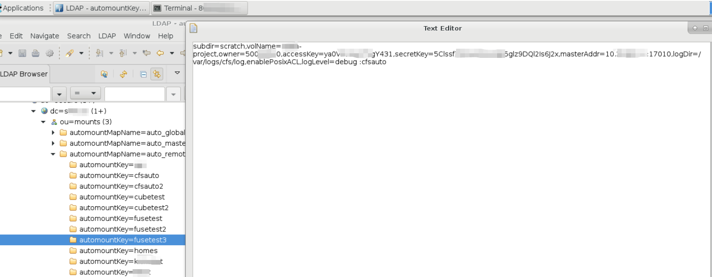

# Cfsauto

Autofs[1] is a program that automatically mounts specified directories as needed. It operates based on a kernel module to achieve efficiency and can manage both local directories and network shares simultaneously. These automatically mounted points are only mounted when accessed and will be unmounted after a certain period of inactivity. This on-demand behavior saves bandwidth and provides higher performance compared to static mounts managed by `/etc/fstab`. While autofs is the control script, it is the automount command (daemon) that actually performs the automatic mounting.

Here we introduce the support of CubeFS for the features of mount and Autofs, as well as the application practices of integrating with peripheral ecosystems such as SSSD[2] and LDAP[3].

The program Cfsauto[4] achieves functionalities such as mounting the CubeFS client-side file system and displaying the Fuse file system mount list by converting mount options into CubeFS parameters.

CubeFS Autofs LDAP Scene Diagram:


## Deployment

### Installation

>Deployment example based on the Master branch
```bash
wget https://github.com/cubefs/cubefs/archive/refs/heads/master.zip -O cubefs.zip
unzip -o cubefs.zip -d cubefs
cd cubefs/autofs
go build -v -ldflags="-X main.buildVersion=1.0.0" -o /usr/local/bin/cfsauto
```

### Environment Variable

* `CFS_CLIENT_PATH`: cfs-client default path `/etc/cfs/cfs-client`.
* `CFSAUTO_LOG_FILE`: cfsauto default log file path `/var/log/cfsauto.log`.
## Mount Example

### CubeFS Mount

Approach 1: Using the `mount`

mount -t fuse :cfsauto {mount point} -o {mount options}

```bash
mount -t fuse :cfsauto  /home/cubetest3 -o subdir=subd,volName=project1,owner=123,accessKey=abc,secretKey=xyz,masterAddr=10.0.0.12:17010,logDir=/var/logs/cfs/log,enablePosixACL,logLevel=debug
```

Approach 2: Using the `cfsauto`

cfsauto {mount point} -o {mount options}

```bash
cfsauto  /home/cubetest3  -o subdir=subd,volName=project1,owner=123,accessKey=abc,secretKey=xyz,masterAddr=10.0.0.12:17010,logDir=/var/logs/cfs/log,enablePosixACL,logLevel=debug
```

### CubeFS Mount List

```bash
# cfsauto 
cubefs-vol3 on /home/cubetest3 type fuse.cubefs (rw,nosuid,nodev,relatime,user_id=0,group_id=0,allow_other)
```

## Autofs Mount Configuration

The configuration file for autofs is `/etc/auto.master`. This file specifies the root directory for automatic mounting and the location of the configuration files. When accessing subdirectories within this root directory, autofs will automatically mount the corresponding file systems based on the configuration file.

`/etc/auto.master` example:

```bash
/- /etc/auto.direct -ro,hard,intr,nolock
# add
/tmp/cfstest /etc/auto.cfs

+auto_master
```

`/etc/auto.cfs` example:

```plain
autodir -fstype=fuse,subdir=subdir,volName=vol3,owner=cfs,masterAddr=10.0.0.1:17010,logDir=/home/service/logauto,enablePosixACL,logLever=debug :cfsauto
```

autofs debug: `automount -f --debug`

Mount Example:


## Integrating SSSD and LDAP for Automatic Mounting

### LDAP Configuration

LDAP Automatic Mount Module Configuration: Mount Points and CubeFS Mount Options

Configure mount point with automountkey, e.g., fusetest

Configure CubeFS mount options with automountInformation as follows:

```plain
-fstype=fuse,subdir=subd,volName=project1,owner=123,accessKey=abc,secretKey=xyz,masterAddr=10.0.0.12:17010,logDir=/var/logs/cfs/log,enablePosixACL,logLevel=debug :cfsauto
```
LDAP automount example:




### SSSD Configuration

The key configuration examples of the autofs module are as follows:

```bash
autofs_provider			= ldap
ldap_autofs_search_base		= ou=mounts,dc=example,dc=com
ldap_autofs_map_master_name	= auto_master
ldap_autofs_map_object_class	= automountMap
ldap_autofs_entry_object_class	= automount
ldap_autofs_map_name		= automountMapName
ldap_autofs_entry_key		= automountKey
ldap_autofs_entry_value		= automountInformation
```

### Mount Example


## References

[1] AutoFS: [https://documentation.suse.com/zh-cn/sles/15-SP3/html/SLES-all/cha-autofs.html](https://documentation.suse.com/zh-cn/sles/15-SP3/html/SLES-all/cha-autofs.html)

[2] SSSD: [https://sssd.io/docs/introduction.html](https://sssd.io/docs/introduction.html)

[3] LDAP: [https://www.ibm.com/docs/en/zos/2.1.0?topic=SSLTBW_2.1.0/com.ibm.zos.v2r1.cbdu100/cbd2ug00152.html](https://www.ibm.com/docs/en/zos/2.1.0?topic=SSLTBW_2.1.0/com.ibm.zos.v2r1.cbdu100/cbd2ug00152.html)

[4] CubeFS AutoFS: [https://github.com/cubefs/cubefs/tree/master/autofs](https://github.com/cubefs/cubefs/tree/master/autofs)

 

